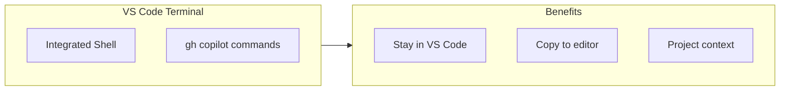

# diagram_19_untitled

```mermaid
flowchart LR
    subgraph Terminal["VS Code Terminal"]
        Shell[Integrated Shell]
        CopilotCLI[gh copilot commands]
    end
    
    subgraph Benefits["Benefits"]
        Stay[Stay in VS Code]
        Copy[Copy to editor]
        Context[Project context]
    end
    
    Terminal --> Benefits
```
