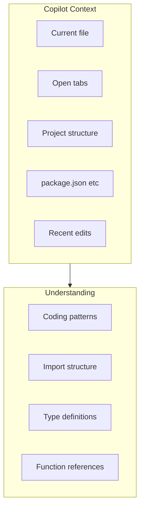

# diagram_20_context-awareness

```mermaid
graph TD
    subgraph Context["Copilot Context"]
        Current[Current file]
        Tabs[Open tabs]
        Project[Project structure]
        Dependencies[package.json etc]
        History[Recent edits]
    end
    
    subgraph Understanding["Understanding"]
        Patterns[Coding patterns]
        Imports[Import structure]
        Types[Type definitions]
        Functions[Function references]
    end
    
    Context --> Understanding
```
