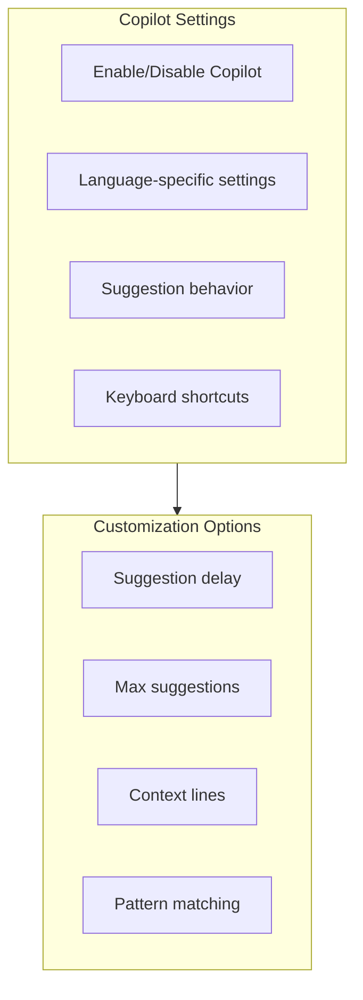

# diagram_21_settings-overview

```mermaid
graph TD
    subgraph Settings["Copilot Settings"]
        Enable[Enable/Disable Copilot]
        Languages[Language-specific settings]
        Suggestions[Suggestion behavior]
        Shortcuts[Keyboard shortcuts]
    end
    
    subgraph Customization["Customization Options"]
        Delay[Suggestion delay]
        Max[Max suggestions]
        Context[Context lines]
        Patterns[Pattern matching]
    end
    
    Settings --> Customization
```
