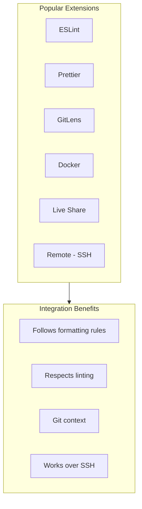

# diagram_22_compatible-extensions

```mermaid
graph TD
    subgraph Extensions["Popular Extensions"]
        ESLint[ESLint]
        Prettier[Prettier]
        GitLens[GitLens]
        Docker[Docker]
        LiveShare[Live Share]
        RemoteSSH[Remote - SSH]
    end
    
    subgraph Integration["Integration Benefits"]
        Style[Follows formatting rules]
        Lint[Respects linting]
        Git[Git context]
        Remote[Works over SSH]
    end
    
    Extensions --> Integration
```
