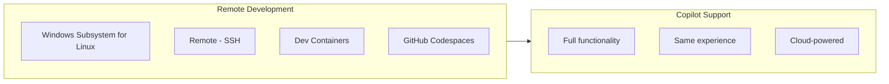

# diagram_23_remote-scenarios

```mermaid
flowchart LR
    subgraph Remote["Remote Development"]
        WSL[Windows Subsystem for Linux]
        SSH[Remote - SSH]
        Containers[Dev Containers]
        Codespaces[GitHub Codespaces]
    end
    
    subgraph Copilot["Copilot Support"]
        Full[Full functionality]
        Same[Same experience]
        Cloud[Cloud-powered]
    end
    
    Remote --> Copilot
```
