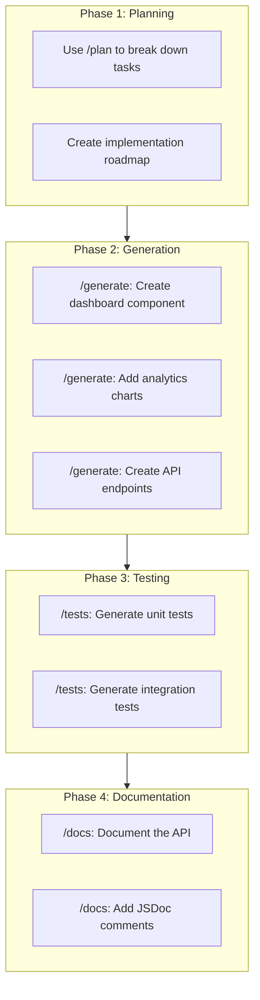

# diagram_24_scenario-create-a-user-dashboard-with-analyti-52f0

```mermaid
flowchart TD
    subgraph Phase1["Phase 1: Planning"]
        P1["Use /plan to break down tasks"]
        P2["Create implementation roadmap"]
    end
    
    subgraph Phase2["Phase 2: Generation"]
        G1["/generate: Create dashboard component"]
        G2["/generate: Add analytics charts"]
        G3["/generate: Create API endpoints"]
    end
    
    subgraph Phase3["Phase 3: Testing"]
        T1["/tests: Generate unit tests"]
        T2["/tests: Generate integration tests"]
    end
    
    subgraph Phase4["Phase 4: Documentation"]
        D1["/docs: Document the API"]
        D2["/docs: Add JSDoc comments"]
    end
    
    Phase1 --> Phase2 --> Phase3 --> Phase4
```
