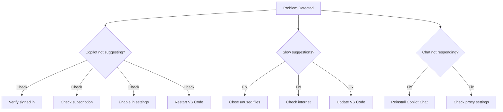

# diagram_26_common-issues-and-solutions

```mermaid
flowchart TD
    Problem[Problem Detected]
    
    Problem --> P1{Copilot not suggesting?}
    P1 -->|Check| S1[Verify signed in]
    P1 -->|Check| S2[Check subscription]
    P1 -->|Check| S3[Enable in settings]
    P1 -->|Check| S4[Restart VS Code]
    
    Problem --> P2{Slow suggestions?}
    P2 -->|Fix| F1[Close unused files]
    P2 -->|Fix| F2[Check internet]
    P2 -->|Fix| F3[Update VS Code]
    
    Problem --> P3{Chat not responding?}
    P3 -->|Fix| F4[Reinstall Copilot Chat]
    P3 -->|Fix| F5[Check proxy settings]
```
