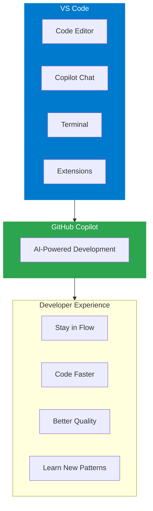

# diagram_29_copilot-in-vs-code-meets-you-where-you-code-makin-2b23

```mermaid
graph TD
    subgraph VSCode["VS Code"]
        Editor[Code Editor]
        Chat[Copilot Chat]
        Terminal[Terminal]
        Extensions[Extensions]
    end
    
    subgraph Copilot["GitHub Copilot"]
        AI[AI-Powered Development]
    end
    
    subgraph Experience["Developer Experience"]
        Flow[Stay in Flow]
        Fast[Code Faster]
        Quality[Better Quality]
        Learn[Learn New Patterns]
    end
    
    VSCode --> Copilot
    Copilot --> Experience
    
    style VSCode fill:#007acc,stroke:#007acc,stroke-width:2px,color:#fff
    style Copilot fill:#2da44e,stroke:#2da44e,stroke-width:2px,color:#fff
```
