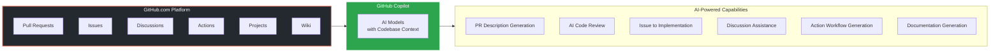

# diagram_02_from-pull-requests-to-issues-from-discussions-to-ddcc

```mermaid
flowchart LR
    subgraph GitHub["GitHub.com Platform"]
        PR[Pull Requests]
        Issues[Issues]
        Discussions[Discussions]
        Actions[Actions]
        Projects[Projects]
        Wiki[Wiki]
    end
    
    subgraph Copilot["GitHub Copilot"]
        AI[AI Models<br/>with Codebase Context]
    end
    
    subgraph Capabilities["AI-Powered Capabilities"]
        PRDesc[PR Description Generation]
        PRReview[AI Code Review]
        IssuePlan[Issue to Implementation]
        DiscussHelp[Discussion Assistance]
        WorkflowGen[Action Workflow Generation]
        DocGen[Documentation Generation]
    end
    
    GitHub --> Copilot
    Copilot --> Capabilities
    
    style GitHub fill:#24292f,stroke:#f78166,stroke-width:2px,color:#fff
    style Copilot fill:#2da44e,stroke:#2da44e,stroke-width:2px,color:#fff
```
