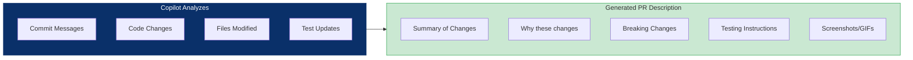

# diagram_04_when-you-open-a-pull-request-copilot-automaticall-8d3a

```mermaid
flowchart LR
    subgraph Input["Copilot Analyzes"]
        Commits[Commit Messages]
        Changes[Code Changes]
        Files[Files Modified]
        Tests[Test Updates]
    end
    
    subgraph Output["Generated PR Description"]
        Summary[Summary of Changes]
        Motivation[Why these changes]
        Breaking[Breaking Changes]
        Testing[Testing Instructions]
        Screenshots[Screenshots/GIFs]
    end
    
    Input --> Output
    
    style Input fill:#0a3069,stroke:#0a3069,stroke-width:1px,color:#fff
    style Output fill:#2da44e40,stroke:#2da44e,stroke-width:1px
```
