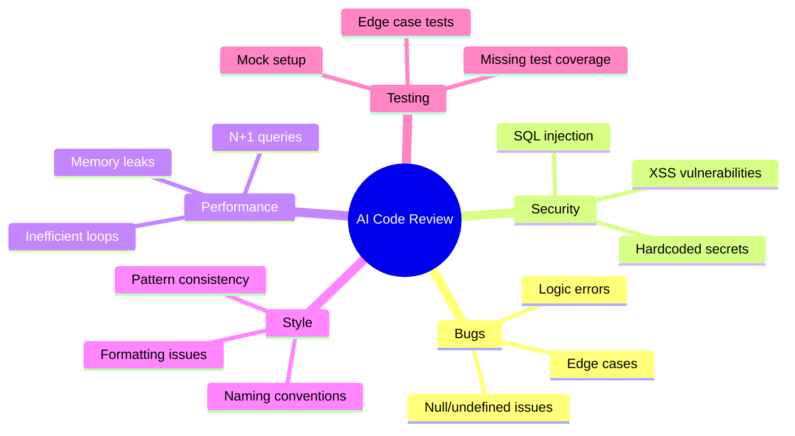

# diagram_05_copilot-can-review-pull-requests-before-human-revi-e717

```mermaid
mindmap
  root((AI Code Review))
    Bugs
      Logic errors
      Edge cases
      Null/undefined issues
    Security
      SQL injection
      XSS vulnerabilities
      Hardcoded secrets
    Performance
      N+1 queries
      Inefficient loops
      Memory leaks
    Style
      Formatting issues
      Naming conventions
      Pattern consistency
    Testing
      Missing test coverage
      Edge case tests
      Mock setup
```
