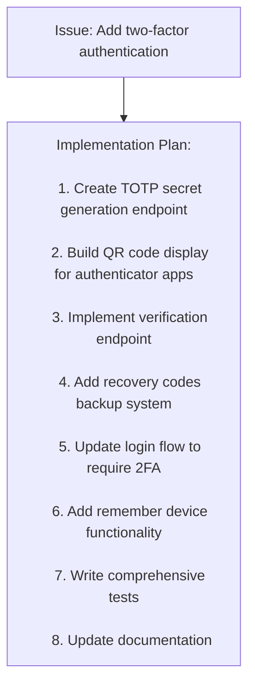

# diagram_08_copilot-can-break-down-an-issue-into-concrete-impl-a225

```mermaid
flowchart TD
    Issue[Issue: Add two-factor authentication]
    
    Plan[Implementation Plan:<br/>
    1. Create TOTP secret generation endpoint<br/>
    2. Build QR code display for authenticator apps<br/>
    3. Implement verification endpoint<br/>
    4. Add recovery codes backup system<br/>
    5. Update login flow to require 2FA<br/>
    6. Add remember device functionality<br/>
    7. Write comprehensive tests<br/>
    8. Update documentation]
    
    Issue --> Plan
```
