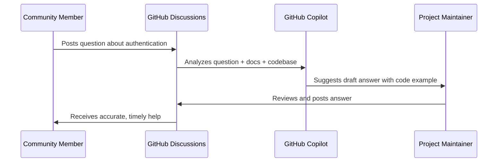

# diagram_10_common-issues

```mermaid
sequenceDiagram
    participant User as Community Member
    participant GitHub as GitHub Discussions
    participant Copilot as GitHub Copilot
    participant Maintainer as Project Maintainer
    
    User->>GitHub: Posts question about authentication
    GitHub->>Copilot: Analyzes question + docs + codebase
    Copilot->>Maintainer: Suggests draft answer with code example
    Maintainer->>GitHub: Reviews and posts answer
    GitHub->>User: Receives accurate, timely help
```
