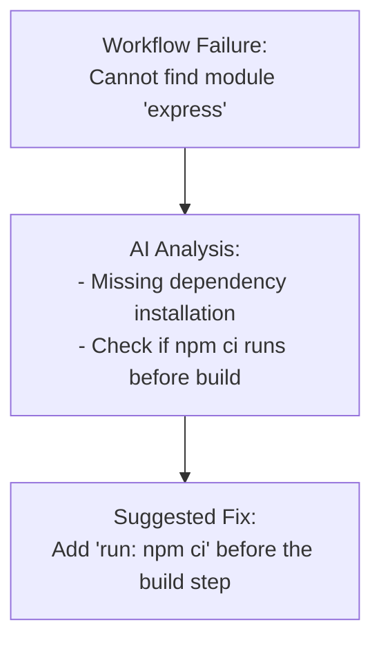

# diagram_12_when-a-workflow-fails-copilot-can-analyze-the-err-835b

```mermaid
flowchart TD
    Failure["Workflow Failure:<br/>Cannot find module 'express'"]
    
    Analysis["AI Analysis:<br/>- Missing dependency installation<br/>- Check if npm ci runs before build"]
    
    Suggestion["Suggested Fix:<br/>Add 'run: npm ci' before the build step"]
    
    Failure --> Analysis --> Suggestion
```
