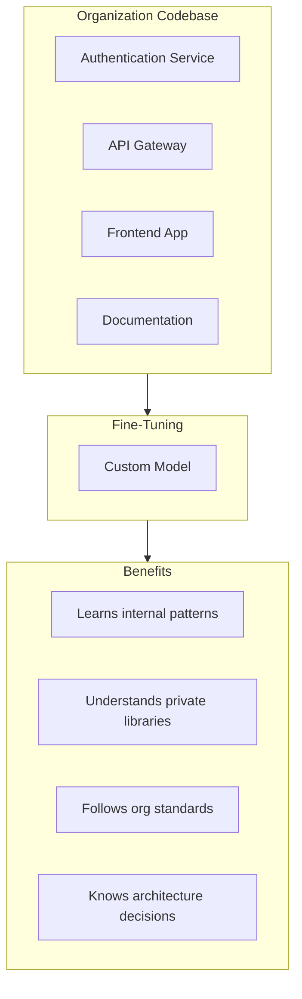

# diagram_13_copilot-enterprise-can-be-fine-tuned-on-your-organ-e867

```mermaid
flowchart TD
    subgraph Codebase["Organization Codebase"]
        Repo1[Authentication Service]
        Repo2[API Gateway]
        Repo3[Frontend App]
        Repo4[Documentation]
    end
    
    subgraph Training["Fine-Tuning"]
        Model[Custom Model]
    end
    
    subgraph Benefits["Benefits"]
        Patterns[Learns internal patterns]
        Libs[Understands private libraries]
        Standards[Follows org standards]
        Architecture[Knows architecture decisions]
    end
    
    Codebase --> Training
    Training --> Benefits
```
