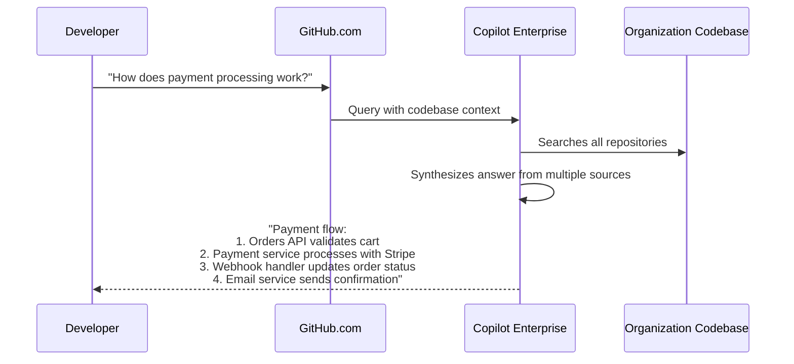

# diagram_14_which-microservices-consume-the-kafka-topic-us-59e8

```mermaid
sequenceDiagram
    participant Dev as Developer
    participant GitHub as GitHub.com
    participant Copilot as Copilot Enterprise
    participant Codebase as Organization Codebase
    
    Dev->>GitHub: "How does payment processing work?"
    GitHub->>Copilot: Query with codebase context
    Copilot->>Codebase: Searches all repositories
    Copilot->>Copilot: Synthesizes answer from multiple sources
    Copilot-->>Dev: "Payment flow:<br/>1. Orders API validates cart<br/>2. Payment service processes with Stripe<br/>3. Webhook handler updates order status<br/>4. Email service sends confirmation"
```
