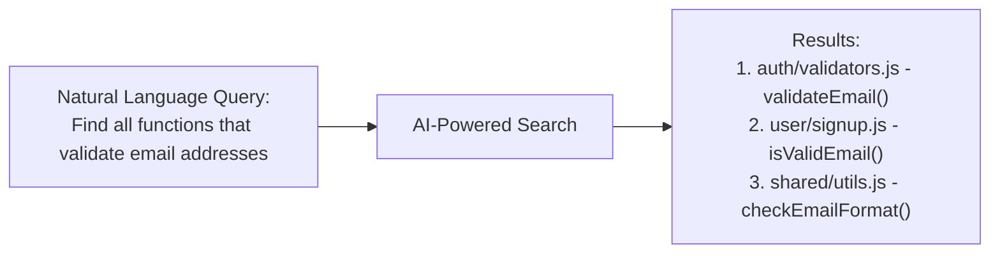

# diagram_15_githubs-code-search-is-now-powered-by-copilot-al-ca7f

```mermaid
flowchart LR
    Query["Natural Language Query:<br/>Find all functions that validate email addresses"]
    
    Search["AI-Powered Search"]
    
    Results["Results:<br/>1. auth/validators.js - validateEmail()<br/>2. user/signup.js - isValidEmail()<br/>3. shared/utils.js - checkEmailFormat()"]
    
    Query --> Search --> Results
```
