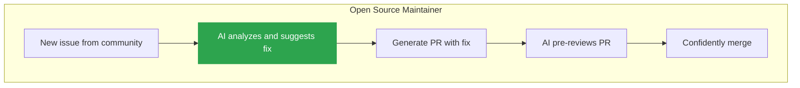

# diagram_18_use-case-1-open-source-maintainer-5924

```mermaid
flowchart TD
    subgraph Maintainer["Open Source Maintainer"]
        Issue[New issue from community]
        Copilot[AI analyzes and suggests fix]
        PR[Generate PR with fix]
        Review[AI pre-reviews PR]
        Merge[Confidently merge]
    end
    
    Issue --> Copilot --> PR --> Review --> Merge
    
    style Copilot fill:#2da44e,stroke:#2da44e,stroke-width:1px,color:#fff
```
