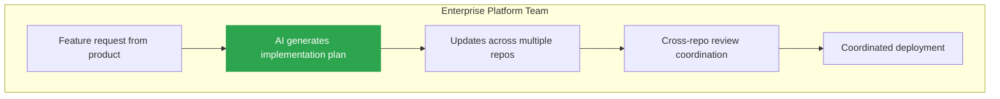

# diagram_19_use-case-2-enterprise-platform-team-85ce

```mermaid
flowchart TD
    subgraph Enterprise["Enterprise Platform Team"]
        Request[Feature request from product]
        Plan[AI generates implementation plan]
        Repos[Updates across multiple repos]
        Review[Cross-repo review coordination]
        Deploy[Coordinated deployment]
    end
    
    Request --> Plan --> Repos --> Review --> Deploy
    
    style Plan fill:#2da44e,stroke:#2da44e,stroke-width:1px,color:#fff
```
