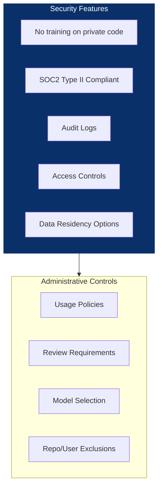

# diagram_24_enterprise-grade-security

```mermaid
graph TD
    subgraph Security["Security Features"]
        NoTrain[No training on private code]
        SOC2[SOC2 Type II Compliant]
        Audit[Audit Logs]
        Access[Access Controls]
        Data[Data Residency Options]
    end
    
    subgraph Controls["Administrative Controls"]
        Policies[Usage Policies]
        Review[Review Requirements]
        Models[Model Selection]
        Exclusions[Repo/User Exclusions]
    end
    
    Security --> Controls
    
    style Security fill:#0a3069,stroke:#0a3069,stroke-width:1px,color:#fff
```
