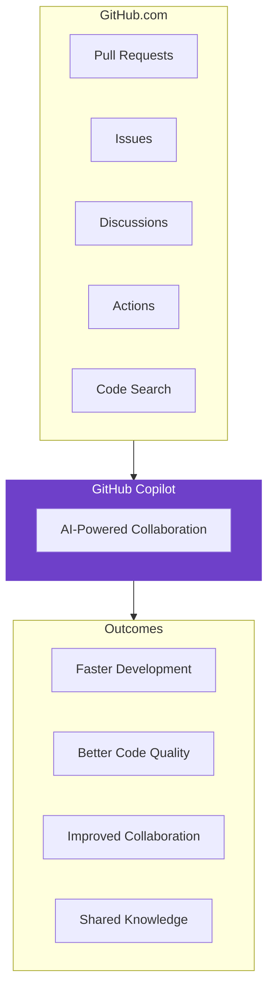

# diagram_25_copilot-on-githubcom-meets-your-team-where-they-a-e42c

```mermaid
graph TD
    subgraph GitHub["GitHub.com"]
        PR[Pull Requests]
        Issues[Issues]
        Discussions[Discussions]
        Actions[Actions]
        Search[Code Search]
    end
    
    subgraph Copilot["GitHub Copilot"]
        AI[AI-Powered Collaboration]
    end
    
    subgraph Outcomes["Outcomes"]
        Speed[Faster Development]
        Quality[Better Code Quality]
        Collaboration[Improved Collaboration]
        Knowledge[Shared Knowledge]
    end
    
    GitHub --> Copilot
    Copilot --> Outcomes
    
    style Copilot fill:#6e40c9,stroke:#6e40c9,stroke-width:2px,color:#fff
```
