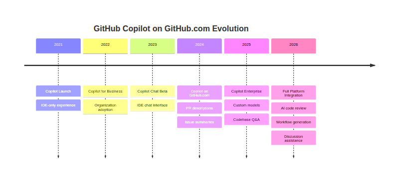
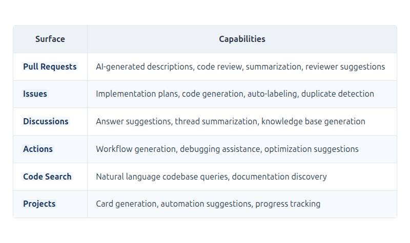
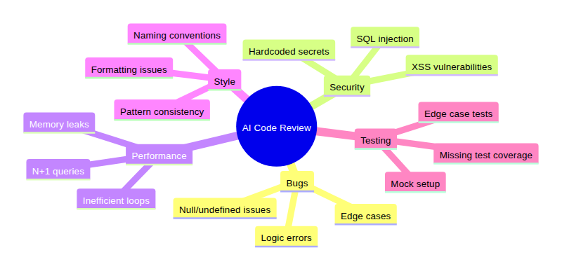
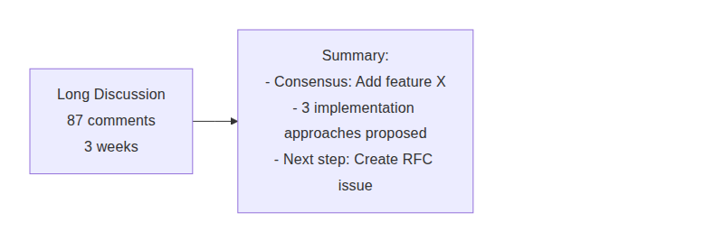
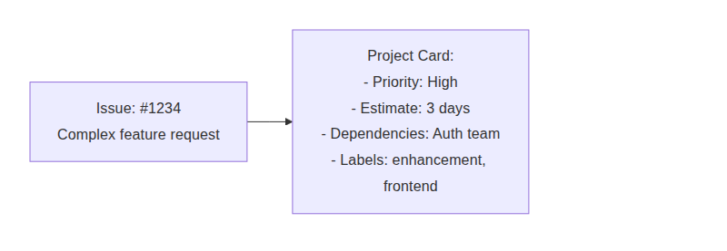
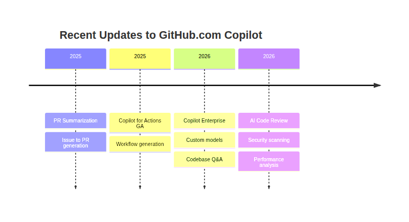
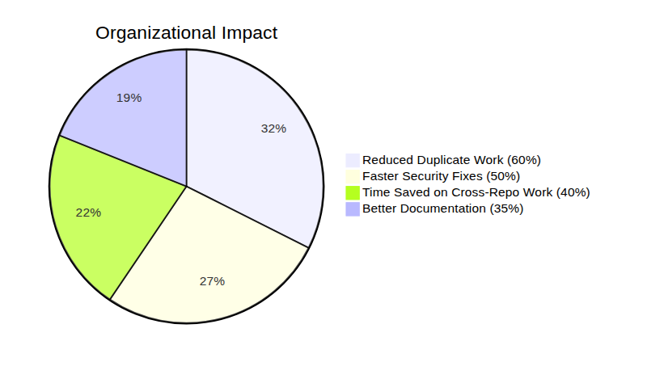
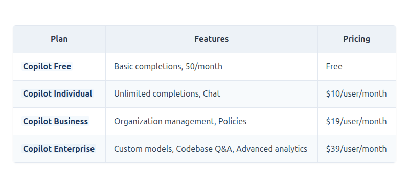

# GitHub Copilot on GitHub.com: AI-Powered Collaboration at Scale
### GitHub Copilot for Pull Requests, AI Code Review, Issue to PR Generation, GitHub Actions AI, Collaborative Development
*Part of the GitHub Copilot Ecosystem Series*


## Introduction

This story is part of our comprehensive exploration of **GitHub Copilot: The AI-Powered Development Ecosystem**. While the parent story introduced the full ecosystem across all development surfaces, this deep dive focuses on how GitHub Copilot transforms the world's largest software development platform—GitHub.com itself.

**Companion stories in this series:** *[Links Below]*
- **📝 In the IDE** – Your AI pair programmer, always by your side
- **🌐 GitHub.com** – AI-powered collaboration at scale
- **💻 In the Terminal** – Your command line AI assistant
- **⚙️ In CI/CD** – AI-powered automation in your pipelines
- **📘 VS Code Integration** – The ultimate AI-powered development experience
- **🎯 Visual Studio Integration** – Enterprise-grade AI for .NET developers


Each story explores how GitHub Copilot transforms that specific surface, while the parent story ties them all together into a unified vision of AI-powered development.

```mermaid
```


[View Source](https://github.com/Vineet-Sharma-Medium-Stories/Medium-Assets/blob/main/github-copilot-on-githubcom-ai-powered-collaboration-at-scale/diagram_01_each-story-explores-how-github-copilot-transforms-9b75.md)


---

## GitHub.com: Where Collaboration Meets AI

For over a decade, GitHub.com has been the home for developers—a place where code lives, teams collaborate, and open source thrives. With over **100 million developers** and **400 million repositories**, it's the largest software development platform in the world.

GitHub Copilot was born in the IDE, but its evolution has brought AI directly into the heart of collaboration: GitHub.com. Today, Copilot isn't just helping you write code locally—it's transforming how teams plan, review, merge, and deploy code together.

From pull requests to issues, from discussions to Actions, GitHub Copilot on GitHub.com acts as an **AI-powered collaborator** that understands your entire project context, your team's history, and your organization's standards.

```mermaid
```


[View Source](https://github.com/Vineet-Sharma-Medium-Stories/Medium-Assets/blob/main/github-copilot-on-githubcom-ai-powered-collaboration-at-scale/diagram_02_from-pull-requests-to-issues-from-discussions-to-ddcc.md)


---

## The Evolution of GitHub Copilot on GitHub.com

```mermaid
```



[View Source](https://github.com/Vineet-Sharma-Medium-Stories/Medium-Assets/blob/main/github-copilot-on-githubcom-ai-powered-collaboration-at-scale/diagram_03_the-evolution-of-github-copilot-on-githubcom-7b23.md)


Today, GitHub Copilot on GitHub.com offers a comprehensive suite of AI-powered features that span the entire development lifecycle:



[View Source](https://github.com/Vineet-Sharma-Medium-Stories/Medium-Assets/blob/main/github-copilot-on-githubcom-ai-powered-collaboration-at-scale/table_01_today-github-copilot-on-githubcom-offers-a-compr-0d25.md)


---

## 1. Copilot for Pull Requests – AI-Powered Code Review

Pull requests are the heartbeat of collaboration on GitHub. Copilot transforms every stage of the PR workflow:

### AI-Generated PR Descriptions

When you open a pull request, Copilot automatically analyzes your changes and generates comprehensive descriptions:

```mermaid
```


[View Source](https://github.com/Vineet-Sharma-Medium-Stories/Medium-Assets/blob/main/github-copilot-on-githubcom-ai-powered-collaboration-at-scale/diagram_04_when-you-open-a-pull-request-copilot-automaticall-8d3a.md)


**Example generated PR description:**
```markdown
## Summary
This PR adds password reset functionality to the authentication system. Users can now request password reset emails and securely update their passwords.

## Changes
- Added `/api/auth/forgot-password` endpoint
- Added `/api/auth/reset-password/:token` endpoint
- Created `PasswordResetToken` model with expiration
- Integrated nodemailer for email delivery
- Added rate limiting to prevent abuse

## Breaking Changes
None. This is additive functionality.

## Testing
- [x] Unit tests for token generation
- [x] Integration tests for endpoints
- [x] Manual email testing

## Screenshots
[Password reset email preview]
```

### AI-Powered Code Review

Copilot can review pull requests before human reviewers, identifying:

```mermaid
```



[View Source](https://github.com/Vineet-Sharma-Medium-Stories/Medium-Assets/blob/main/github-copilot-on-githubcom-ai-powered-collaboration-at-scale/diagram_05_copilot-can-review-pull-requests-before-human-revi-e717.md)


**Review comment example:**
> ⚠️ **Potential Security Issue**
> 
> In `auth.controller.js:42`, you're using string concatenation to build a SQL query with user input:
> ```javascript
> const query = `SELECT * FROM users WHERE email = '${email}'`;
> ```
> 
> This is vulnerable to SQL injection. Consider using parameterized queries:
> ```javascript
> const query = 'SELECT * FROM users WHERE email = ?';
> const user = await db.query(query, [email]);
> ```
> 
> *Suggested by Copilot*

### PR Summarization for Large Changes

When a PR has many commits or touches many files, Copilot provides a high-level summary:

```mermaid
```


[View Source](https://github.com/Vineet-Sharma-Medium-Stories/Medium-Assets/blob/main/github-copilot-on-githubcom-ai-powered-collaboration-at-scale/diagram_06_when-a-pr-has-many-commits-or-touches-many-files-f420.md)


### Reviewer Suggestions

Copilot can suggest the most qualified reviewers based on:
- Code ownership
- Recent contributions to relevant files
- Expertise in specific areas

```mermaid
```


[View Source](https://github.com/Vineet-Sharma-Medium-Stories/Medium-Assets/blob/main/github-copilot-on-githubcom-ai-powered-collaboration-at-scale/diagram_07_expertise-in-specific-areas.md)


---

## 2. Copilot for Issues – From Problem to Pull Request

Issues are where work begins. Copilot transforms issues from problem descriptions into actionable development tasks.

### Issue Summarization

Long, complex issues can be summarized for quick understanding:

**Original Issue:**
> *[Long, rambling description of a bug with multiple comments and edge cases]*

**Copilot Summary:**
> **Issue Summary:** User login fails after password reset
> - **Root Cause:** Reset token not invalidated after use
> - **Impact:** Users cannot log in with new password
> - **Steps to Reproduce:** Request reset, use token, try login
> - **Suggested Fix:** Add token invalidation after password update

### Implementation Plan Generation

Copilot can break down an issue into concrete implementation steps:

```mermaid
```


[View Source](https://github.com/Vineet-Sharma-Medium-Stories/Medium-Assets/blob/main/github-copilot-on-githubcom-ai-powered-collaboration-at-scale/diagram_08_copilot-can-break-down-an-issue-into-concrete-impl-a225.md)


### Code Generation from Issues

For well-defined issues, Copilot can generate initial implementation code:

**Issue:** *Create a utility function to format dates as "time ago" (e.g., "3 days ago")*

**Copilot Response:**
```javascript
/**
 * Returns a human-readable "time ago" string from a date
 * @param {Date|string|number} date - The date to format
 * @returns {string} Formatted time ago string
 */
function timeAgo(date) {
  const now = new Date();
  const past = new Date(date);
  const seconds = Math.floor((now - past) / 1000);
  
  const intervals = {
    year: 31536000,
    month: 2592000,
    week: 604800,
    day: 86400,
    hour: 3600,
    minute: 60,
    second: 1
  };
  
  for (const [unit, secondsInUnit] of Object.entries(intervals)) {
    const count = Math.floor(seconds / secondsInUnit);
    if (count >= 1) {
      return `${count} ${unit}${count !== 1 ? 's' : ''} ago`;
    }
  }
  
  return 'just now';
}
```

### Auto-Labeling and Duplicate Detection

Copilot can automatically:

- **Label issues** – Based on content: `bug`, `enhancement`, `documentation`, `security`
- **Detect duplicates** – Find similar issues across the repository
- **Link related issues** – Identify connections between different issues

```mermaid
```


[View Source](https://github.com/Vineet-Sharma-Medium-Stories/Medium-Assets/blob/main/github-copilot-on-githubcom-ai-powered-collaboration-at-scale/diagram_09_link-related-issues--identify-connections-b-7c4e.md)


---

## 3. Copilot for Discussions – AI-Powered Community Support

GitHub Discussions is where communities ask questions, share ideas, and get help. Copilot assists maintainers and community members alike.

### Answer Suggestions

When a new discussion is opened, Copilot suggests answers based on:

- Documentation in the repository
- Previous discussions
- Codebase content
- Common issues

```mermaid
```


[View Source](https://github.com/Vineet-Sharma-Medium-Stories/Medium-Assets/blob/main/github-copilot-on-githubcom-ai-powered-collaboration-at-scale/diagram_10_common-issues.md)


**Example Discussion Response:**
> Based on your question about implementing JWT authentication with this repository's Express setup, here's a suggested approach:
> 
> ```javascript
> // Check the existing auth middleware in /src/middleware/auth.js
> // You'll need to add JWT verification:
> 
> const jwt = require('jsonwebtoken');
> 
> function verifyToken(req, res, next) {
>   const token = req.headers.authorization?.split(' ')[1];
>   if (!token) return res.status(401).json({ error: 'No token' });
>   
>   try {
>     const decoded = jwt.verify(token, process.env.JWT_SECRET);
>     req.user = decoded;
>     next();
>   } catch (err) {
>     return res.status(401).json({ error: 'Invalid token' });
>   }
> }
> ```
> 
> See also: Discussion #123 on similar topic, and our auth documentation in `/docs/auth.md`.

### Thread Summarization

For long discussion threads, Copilot provides summaries:

```mermaid
```



[View Source](https://github.com/Vineet-Sharma-Medium-Stories/Medium-Assets/blob/main/github-copilot-on-githubcom-ai-powered-collaboration-at-scale/diagram_11_for-long-discussion-threads-copilot-provides-summ-6f59.md)


### Knowledge Base Generation

Copilot can generate knowledge base articles from resolved discussions, turning Q&A into documentation.

---

## 4. Copilot for GitHub Actions – AI-Powered CI/CD

GitHub Actions is the automation platform that powers CI/CD on GitHub. Copilot helps you create, debug, and optimize workflows.

### Workflow Generation from Natural Language

Describe what you want, and Copilot generates the workflow:

**Prompt:**
```
Create a workflow that runs tests on every PR, deploys to staging when merging to main, and deploys to production when tagging a release.
```

**Generated Workflow:**
```yaml
name: CI/CD Pipeline

on:
  pull_request:
    branches: [main, develop]
  push:
    branches: [main]
  push:
    tags: ['v*']

jobs:
  test:
    runs-on: ubuntu-latest
    steps:
      - uses: actions/checkout@v4
      - uses: actions/setup-node@v4
        with:
          node-version: '20'
      - run: npm ci
      - run: npm test
      - name: Upload coverage
        uses: codecov/codecov-action@v3

  staging-deploy:
    needs: test
    runs-on: ubuntu-latest
    if: github.ref == 'refs/heads/main'
    steps:
      - uses: actions/checkout@v4
      - run: npm run deploy:staging

  production-deploy:
    needs: test
    runs-on: ubuntu-latest
    if: startsWith(github.ref, 'refs/tags/v')
    steps:
      - uses: actions/checkout@v4
      - run: npm run deploy:production
```

### Workflow Debugging

When a workflow fails, Copilot can analyze the error and suggest fixes:

```mermaid
```


[View Source](https://github.com/Vineet-Sharma-Medium-Stories/Medium-Assets/blob/main/github-copilot-on-githubcom-ai-powered-collaboration-at-scale/diagram_12_when-a-workflow-fails-copilot-can-analyze-the-err-835b.md)


### Workflow Optimization

Copilot can suggest optimizations for:
- **Caching** – Add dependency caching to speed up runs
- **Parallelization** – Identify jobs that can run in parallel
- **Matrix strategies** – Generate matrix builds for multiple versions

```yaml
# Copilot suggestion: Add caching for faster runs
- name: Cache dependencies
  uses: actions/cache@v3
  with:
    path: ~/.npm
    key: ${{ runner.os }}-node-${{ hashFiles('package-lock.json') }}
    restore-keys: |
      ${{ runner.os }}-node-
```

---

## 5. Copilot Enterprise – Custom AI for Organizations

For organizations using **GitHub Copilot Enterprise**, additional capabilities transform how teams work:

### Custom Models Trained on Your Codebase

Copilot Enterprise can be fine-tuned on your organization's private codebase:

```mermaid
```


[View Source](https://github.com/Vineet-Sharma-Medium-Stories/Medium-Assets/blob/main/github-copilot-on-githubcom-ai-powered-collaboration-at-scale/diagram_13_copilot-enterprise-can-be-fine-tuned-on-your-organ-e867.md)


### Codebase Q&A – Ask Questions About Your Entire Codebase

With Copilot Enterprise, you can ask natural language questions about your entire organization's codebase:

**Examples:**
- "Where is the user authentication logic implemented?"
- "Show me all API endpoints that use the User model"
- "What are the dependencies for the payment service?"
- "How does the caching layer work across services?"
- "Which microservices consume the Kafka topic 'user.events'?"

```mermaid
```


[View Source](https://github.com/Vineet-Sharma-Medium-Stories/Medium-Assets/blob/main/github-copilot-on-githubcom-ai-powered-collaboration-at-scale/diagram_14_which-microservices-consume-the-kafka-topic-us-59e8.md)


### Organization-Wide Refactoring

Plan and execute refactoring campaigns across multiple repositories:

**Prompt:**
```
Plan a migration from axios to fetch across all frontend repositories, including impact analysis and implementation steps.
```

**Copilot Response:**
```markdown
## Migration Plan: Axios → Fetch

### Impact Analysis
- **Repositories affected:** 12 frontend repos
- **Files to update:** ~340 files
- **Estimated effort:** 6 developer days

### Implementation Steps
1. Create utility wrapper for fetch with axios-like API
2. Update authentication interceptor
3. Migrate GET requests (lowest risk)
4. Migrate POST/PUT requests
5. Update error handling
6. Remove axios dependency

### Automated Migration
I can generate a script to automate most of the migration. Run:
/copilot migrate-axios-to-fetch

### Risk Assessment
- Low risk: Simple GET requests
- Medium risk: Request interceptors
- High risk: File uploads and complex request configurations
```

---

## 6. Copilot for Code Search – Natural Language Queries

GitHub's code search is now powered by Copilot, allowing natural language queries:

```mermaid
```


[View Source](https://github.com/Vineet-Sharma-Medium-Stories/Medium-Assets/blob/main/github-copilot-on-githubcom-ai-powered-collaboration-at-scale/diagram_15_githubs-code-search-is-now-powered-by-copilot-al-ca7f.md)


**Example Queries:**
- "Show me all API routes that use the authentication middleware"
- "Find components that call the payment service"
- "Where are environment variables loaded?"
- "List all database migration files from last month"
- "Find examples of error handling in the API layer"

---

## 7. Copilot for Projects – AI-Assisted Project Management

GitHub Projects can be enhanced with Copilot capabilities:

### Card Generation from Issues

Copilot can generate project cards that summarize issues:

```mermaid
```



[View Source](https://github.com/Vineet-Sharma-Medium-Stories/Medium-Assets/blob/main/github-copilot-on-githubcom-ai-powered-collaboration-at-scale/diagram_16_copilot-can-generate-project-cards-that-summarize-22c3.md)


### Automation Suggestions

Copilot suggests automation rules based on team patterns:

**Copilot Suggestion:**
> I notice that when issues are labeled `bug` and assigned to a team member, you often move them to the "In Progress" column. Would you like me to create an automation rule for this?

### Progress Tracking

Copilot can summarize project progress across multiple repositories:

```markdown
## Weekly Project Summary

### Completed (5 tasks)
- ✅ Add password reset flow (auth-service#123)
- ✅ Update API documentation (docs#456)
- ✅ Fix login timeout bug (frontend#789)

### In Progress (3 tasks)
- 🏃 2FA implementation (80% complete)
- 🏃 Performance optimization (40% complete)
- 🏃 Migration to TypeScript (25% complete)

### Blocked (1 task)
- ⚠️ Payment gateway integration - awaiting API key from finance

### On Track
- ✅ Sprint goal: 85% complete
- 🎯 Project milestone: On track for March 31
```

---

## The GitHub Copilot Enterprise Dashboard

Organizations using Copilot Enterprise get access to comprehensive analytics:

```mermaid
```


[View Source](https://github.com/Vineet-Sharma-Medium-Stories/Medium-Assets/blob/main/github-copilot-on-githubcom-ai-powered-collaboration-at-scale/diagram_17_organizations-using-copilot-enterprise-get-access-7d03.md)


**Metrics tracked:**
- **Adoption rate** – Percentage of developers using Copilot
- **Acceptance rate** – How often suggestions are accepted
- **Lines of code generated** – Total AI-assisted code
- **Time to PR** – Reduction in PR creation time
- **Test coverage** – Improvements in test generation
- **Security findings** – Vulnerabilities identified and fixed

---

## Real-World Use Cases

### Use Case 1: Open Source Maintainer

```mermaid
```


[View Source](https://github.com/Vineet-Sharma-Medium-Stories/Medium-Assets/blob/main/github-copilot-on-githubcom-ai-powered-collaboration-at-scale/diagram_18_use-case-1-open-source-maintainer-5924.md)


**Scenario:** An open source maintainer receives 50 issues and 30 PRs per week.

**How Copilot helps:**
- Summarizes issues for quick triage
- Generates initial PR descriptions for accepted contributions
- Flags common issues in PRs before human review
- Suggests responses to common questions in discussions
- Reduces review time by 40-60%

### Use Case 2: Enterprise Platform Team

```mermaid
```


[View Source](https://github.com/Vineet-Sharma-Medium-Stories/Medium-Assets/blob/main/github-copilot-on-githubcom-ai-powered-collaboration-at-scale/diagram_19_use-case-2-enterprise-platform-team-85ce.md)


**Scenario:** A platform team maintains 50+ microservices across multiple repositories.

**How Copilot Enterprise helps:**
- Understands dependencies across repositories
- Plans cross-repo refactoring campaigns
- Generates PRs across multiple repos simultaneously
- Tracks impact across the entire organization
- Reduces cross-repo coordination time by 70%

### Use Case 3: Security Team

```mermaid
```


[View Source](https://github.com/Vineet-Sharma-Medium-Stories/Medium-Assets/blob/main/github-copilot-on-githubcom-ai-powered-collaboration-at-scale/diagram_20_use-case-3-security-team.md)


**Scenario:** A security vulnerability is discovered in a common dependency.

**How Copilot helps:**
- Searches entire codebase for vulnerable patterns
- Identifies all affected files across repositories
- Suggests remediation code for each instance
- Generates security advisory summaries
- Reduces incident response time by 80%

---

## Best Practices for Copilot on GitHub.com

### For Pull Requests

1. **Review AI suggestions** – AI code review is powerful but always review its suggestions
2. **Customize PR templates** – Use GitHub PR templates to guide AI-generated descriptions
3. **Set up review rules** – Configure when AI review should run (e.g., on every PR, only for certain teams)

### For Issues

1. **Use structured issue templates** – Helps AI understand the context better
2. **Link related issues** – AI uses linked issues to provide better context
3. **Add labels consistently** – Helps AI learn your categorization patterns

### For Discussions

1. **Pin resolved discussions** – Helps AI learn from previous answers
2. **Mark helpful answers** – Trains AI on what good responses look like
3. **Link to documentation** – AI learns from your docs to provide better answers

### For Actions

1. **Use descriptive names** – Name workflows clearly for AI to understand
2. **Add comments** – Comment complex steps to help AI debug
3. **Leverage caching** – AI will suggest caching optimizations

### For Enterprise

1. **Define coding standards** – AI learns from your organization's standards
2. **Document architecture** – Well-documented architecture helps AI understand context
3. **Review analytics** – Use Copilot dashboard to track adoption and impact

---

## What's New on GitHub.com (2025-2026)

```mermaid
```



[View Source](https://github.com/Vineet-Sharma-Medium-Stories/Medium-Assets/blob/main/github-copilot-on-githubcom-ai-powered-collaboration-at-scale/diagram_21_whats-new-on-githubcom-2025-2026-0d05.md)


### Latest Features

- **PR Summarization** – AI-generated summaries of complex PRs
- **Issue to PR Generation** – Draft PRs directly from issues
- **Copilot for Actions GA** – Workflow generation and debugging
- **Cross-repo Q&A** – Ask questions across your entire codebase
- **AI Code Review** – Automatic review of PRs with suggestions
- **Security Scanning** – Identify vulnerabilities before merge
- **Knowledge Base Generation** – Create docs from discussions

### Coming Soon

- **Copilot Agents** – Autonomous AI that can manage issues and PRs
- **Team Insights** – AI-powered team performance analytics
- **Automated Refactoring** – Scheduled refactoring campaigns
- **Dependency Updates** – AI-managed dependency updates with testing

---

## Measuring Impact on GitHub.com

### Pull Request Metrics

```mermaid
```


[View Source](https://github.com/Vineet-Sharma-Medium-Stories/Medium-Assets/blob/main/github-copilot-on-githubcom-ai-powered-collaboration-at-scale/diagram_22_pull-request-metrics.md)


[View Source](https://github.com/Vineet-Sharma-Medium-Stories/Medium-Assets/blob/main/github-copilot-on-githubcom-ai-powered-collaboration-at-scale/table_02_untitled.md)


### Organizational Impact (Copilot Enterprise)

- **40% reduction** in time spent on cross-repo coordination
- **50% faster** security vulnerability remediation
- **60% reduction** in duplicate issues and PRs
- **35% increase** in documentation coverage
- **45% improvement** in PR review quality scores

```mermaid
```



[View Source](https://github.com/Vineet-Sharma-Medium-Stories/Medium-Assets/blob/main/github-copilot-on-githubcom-ai-powered-collaboration-at-scale/diagram_23_45-improvement-in-pr-review-quality-scores-77db.md)


---

## Security and Privacy on GitHub.com

### Enterprise-Grade Security

```mermaid
```


[View Source](https://github.com/Vineet-Sharma-Medium-Stories/Medium-Assets/blob/main/github-copilot-on-githubcom-ai-powered-collaboration-at-scale/diagram_24_enterprise-grade-security.md)


- **No training on private code** – Your code never trains public models
- **SOC2 Type II compliant** – Enterprise-grade security certification
- **Audit logs** – Full visibility into AI usage across organization
- **Access controls** – Granular permissions for Copilot features
- **Data residency** – Choose where your data is processed
- **Policy enforcement** – Ensure AI follows organizational standards

---

## GitHub Copilot Enterprise Pricing



[View Source](https://github.com/Vineet-Sharma-Medium-Stories/Medium-Assets/blob/main/github-copilot-on-githubcom-ai-powered-collaboration-at-scale/table_03_github-copilot-enterprise-pricing-aded.md)


---

## Conclusion

GitHub Copilot on GitHub.com transforms the platform from a code hosting service into an **AI-powered collaboration hub**. Whether you're:

- **Opening pull requests** – Copilot writes descriptions, reviews code, suggests reviewers
- **Triaging issues** – Copilot summarizes, labels, and suggests implementations
- **Managing discussions** – Copilot helps answer questions and generates knowledge bases
- **Building workflows** – Copilot creates and debugs GitHub Actions
- **Running an organization** – Copilot Enterprise understands your entire codebase

Copilot on GitHub.com meets your team where they already collaborate, amplifying collective intelligence and accelerating development from idea to deployment.

```mermaid
```


[View Source](https://github.com/Vineet-Sharma-Medium-Stories/Medium-Assets/blob/main/github-copilot-on-githubcom-ai-powered-collaboration-at-scale/diagram_25_copilot-on-githubcom-meets-your-team-where-they-a-e42c.md)


## Complete Story Links

- [📖 **GitHub Copilot** – The AI-Powered Development Ecosystem](#)   
- 📝 **In the IDE** – Your AI pair programmer, always by your side - Comming soon 
- 🌐 **GitHub.com** – AI-powered collaboration at scale -  - Comming soon 
- 💻 **In the Terminal** – Your command line AI assistant - - Comming soon  
- ⚙️ **In CI/CD** – AI-powered automation in your pipelines - - Comming soon  
- 📘 **VS Code Integration** – The ultimate AI-powered development experience - Comming soon  
- 🎯 **Visual Studio Integration** – Enterprise-grade AI for .NET developers - - Comming soon  

---

**Get Started with GitHub Copilot on GitHub.com**
- Enable Copilot in your repository settings
- Try Copilot for Pull Requests on your next PR
- Explore Copilot for Issues in your project board
- Upgrade to Copilot Enterprise for organization-wide AI

Start your AI-powered collaboration journey at [github.com/features/copilot](https://github.com/features/copilot)

---

*This story is part of the GitHub Copilot Ecosystem Series. Last updated March 2026.*

_Questions? Feedback? Comment? leave a response below. If you're implementing something similar and want to discuss architectural tradeoffs, I'm always happy to connect with fellow engineers tackling these challenges._