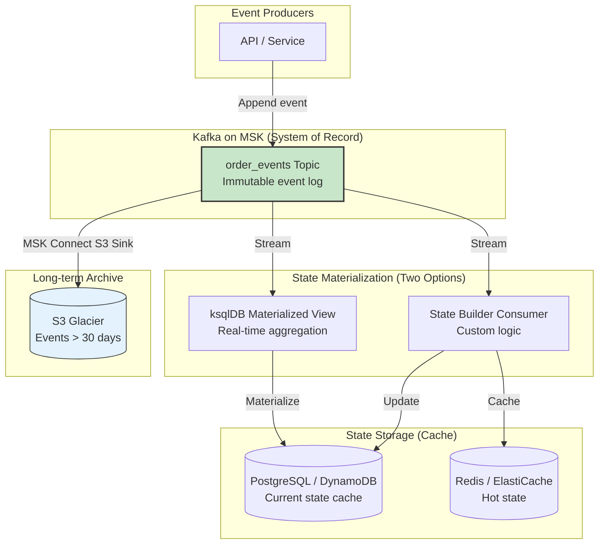
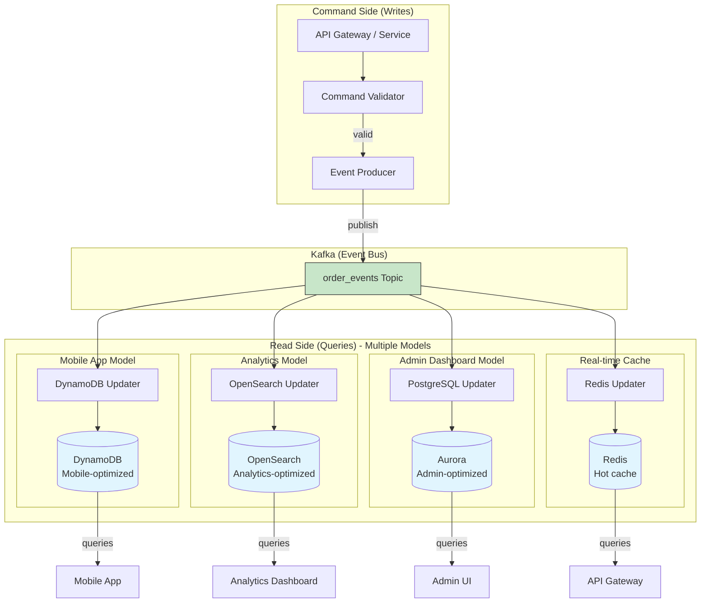
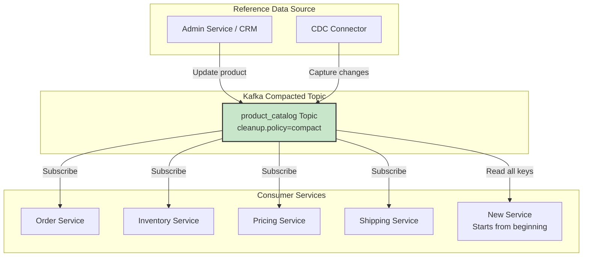

# 📖 11 Kafka Design Patterns — Data & State Deep Dive

## Introduction

Welcome back to our Kafka Design Patterns series. In Part 1, we introduced all 11 patterns with diagrams and code snippets. In Part 2, we dove deep into **Reliability & Ordering Patterns** — Outbox, Idempotent Consumer, Partition Key, DLQ, and Retry with Backoff. You learned how to build systems that survive failures, handle duplicates, and preserve ordering.

Now it's time to shift focus from **how messages move** to **what messages mean**.

In Part 3, we explore four patterns that treat Kafka not just as a message bus, but as the **source of truth** for your domain. These patterns transform Kafka from a transport layer into the backbone of your data architecture:

- **Event Sourcing** — Store every state change as an immutable event. Your database becomes a cache; Kafka becomes the system of record. Need to know what your order looked like yesterday? Replay the events. Need to debug a production issue? The entire history is right there.

- **CQRS (Command Query Responsibility Segregation)** — Separate your writes (commands that change state) from your reads (queries that retrieve data). Use Kafka to asynchronously update read-optimized models. Your writes go fast because they just append to a log. Your reads go fast because they query purpose-built tables. No more complex JOINs killing your performance.

- **Compacted Topic** — Turn a Kafka topic into a distributed, replicated, fault-tolerant key-value store. Need to distribute configuration to 100 microservices? Send it once to a compacted topic; every service gets the latest version automatically. Need to rebuild a consumer's state from scratch? Read the compacted topic from the end — you'll get only the latest value for each key.

- **Event Carried State Transfer** — Design events that carry all the data consumers need. No more fetching from the source service. No more cascading failures when that source service is down. Your consumers become decoupled, autonomous, and faster.

These patterns answer fundamental questions:

- How do I make my system auditable and replayable?
- How do I scale reads and writes independently?
- How do I distribute reference data without building a custom API?
- How do I evolve event schemas without breaking consumers?

By the end of this part, you'll be able to use Kafka as a **durable source of truth** — not just a pipe between services. You'll build systems where the event log is the center of your universe, and databases are just materialized views.

Let's dive in.

---

*This is Part 3 of the "Kafka Design Patterns for Every Backend Engineer" series.*

📌 **If you haven't read the master story / Part 1, start there for an overview of all 11 patterns with diagrams and code snippets.**

📌 **If you haven't read Part 2, you can still follow this part, but Part 2 covers the reliability patterns that are prerequisites for production-ready implementations.**

---

## 📚 Story List (with Pattern Coverage)

1. **Kafka Design Patterns — Overview (All 11 Patterns)** — Brief intro, detailed explainer for each pattern, Mermaid diagrams, small code snippets.  
   *Patterns covered: All 11 patterns introduced at high level.*  
   📎 *Read the full story: Part 1*

2. **Reliability & Ordering Patterns** — Deep dive on patterns that ensure message durability, exactly-once processing, failure handling, and strict ordering.  
   *Patterns covered: Transactional Outbox, Idempotent Consumer, Partition Key, Dead Letter Queue (DLQ), Retry with Backoff.*  
   📎 *Read the full story: Part 2*

3. **Data & State Patterns** — Deep dive on patterns that treat Kafka as a source of truth for state management, event replay, and materialized views.  
   *Patterns covered: Event Sourcing, CQRS, Compacted Topic, Event Carried State Transfer.*  
   📎 *Read the full story: Part 3 — below*

4. **Performance & Integration Patterns** — Deep dive on patterns that handle large messages, real-time joins, and distributed transactions across services.  
   *Patterns covered: Claim Check, Stream-Table Duality, Saga (Choreography).*  
   📎 *Coming soon*

---

## Takeaway from Part 2

In Part 2, we learned how to make Kafka reliable:

- **Transactional Outbox** ensures you never lose events or create inconsistencies between your database and Kafka.
- **Idempotent Consumer** makes duplicates harmless — your business logic runs exactly once even if Kafka delivers messages multiple times.
- **Partition Key** preserves order per entity, enabling stateful processing.
- **Dead Letter Queue** quarantines poison messages so they don't block your pipeline.
- **Retry with Backoff** handles transient failures gracefully, giving your system time to recover.

These patterns are the foundation. Now, with reliability in place, we can trust Kafka as a durable store. That trust enables the Data & State patterns we cover in this part.

---

## In This Part (Part 3)

We deep-dive into **4 data and state patterns** that treat Kafka as the source of truth. These patterns transform Kafka from a message bus into the backbone of your data architecture.

Each pattern includes:
- Full production code (Python & Java)
- AWS-specific implementation (MSK, ksqlDB, DynamoDB, S3, Glue Schema Registry)
- Mermaid architecture diagrams
- Common pitfalls and their mitigations
- Monitoring and alerting strategies

---

# 1. Event Sourcing Pattern (Deep Dive)

## The Problem: Lost History and Auditability

Traditional applications store only the **current state** of an entity. When a user updates their profile, you overwrite the old values. When an order status changes, you update a single column. This approach is simple and efficient — but it throws away history.

What happens when you need to answer these questions?

- "What did this customer's profile look like last Tuesday before they reported the bug?"
- "How many times has this order changed status in the last 30 days?"
- "Can you prove that the compliance officer approved this transaction on March 15th at 2:34 PM?"
- "We found a bug in our payment calculation. Can you recalculate all orders from last week with the fix?"

With traditional stateful storage, these questions are difficult or impossible to answer. You would need:

- **Audit logs** — Separate tables that record every change, doubling your write operations.
- **Temporal tables** — Database features that keep history, but are database-specific and complex.
- **Manual reconciliation** — Trying to reconstruct what happened from partial data.

Even with audit logs, you face challenges: How long do you keep history? How do you query it efficiently? How do you replay history to rebuild state?

## The Solution: Event Sourcing

**Event Sourcing** flips the traditional model on its head. Instead of storing the current state, you store every state-changing event as an immutable, append-only sequence. The current state is derived by replaying all events from the beginning. Your database becomes a **cache**; Kafka becomes the **system of record**.

Think of it like a bank account statement. Your bank doesn't just store your current balance — they store every deposit, withdrawal, and transfer. Your current balance is calculated by adding up all those transactions. If there's a dispute, you can replay the entire history. If the bank discovers an error, they can adjust the history and recalculate.

Event Sourcing on Kafka works exactly the same way:

- **Events are immutable** — Once written to Kafka, an event cannot be changed or deleted.
- **Events are ordered** — Within a partition, events for a single entity are strictly ordered.
- **Events are durable** — Kafka replicates events across multiple brokers, so no data loss.
- **State is derived** — The current state of an entity is computed by applying all events in order.

### Why This Works

Event Sourcing gives you capabilities that traditional stateful storage cannot match:

**Complete audit trail** — Every change to every entity is recorded forever. You can prove what happened, when it happened, and who caused it.

**Temporal queries** — What did the system look like at any point in time? Just replay events up to that timestamp.

**Debugging and forensics** — When a bug corrupts state, you can replay the event log to see exactly when and how the corruption occurred.

**Replayability** — Need to change your business logic? Reprocess the entire event log with the new logic to generate new state.

**Event-driven architecture** — Events are first-class citizens. Other services can react to events as they happen.

The trade-off is complexity. You can't just update a row in a database anymore. You need to think in events. You need to manage event schemas. You need to handle event versioning. And you need efficient ways to rebuild state without replaying years of events.

### Architecture on AWS



### Complete Implementation

**Step 1: Define your events (Python with Pydantic)**

```python
from pydantic import BaseModel, Field
from datetime import datetime
from typing import Optional, List
import uuid
import json

# Base event class with common fields
class Event(BaseModel):
    event_id: str = Field(default_factory=lambda: str(uuid.uuid4()))
    aggregate_id: str
    aggregate_type: str
    event_type: str
    event_version: int = 1
    timestamp: datetime = Field(default_factory=datetime.utcnow)
    user_id: Optional[str] = None
    metadata: dict = Field(default_factory=dict)

# Order events
class OrderCreated(Event):
    aggregate_type: str = "order"
    event_type: str = "OrderCreated"
    customer_id: str
    amount: float
    items: List[dict]
    shipping_address: dict

class OrderStatusChanged(Event):
    aggregate_type: str = "order"
    event_type: str = "OrderStatusChanged"
    old_status: str
    new_status: str
    reason: Optional[str] = None

class PaymentProcessed(Event):
    aggregate_type: str = "order"
    event_type: str = "PaymentProcessed"
    payment_id: str
    amount: float
    status: str  # succeeded, failed, refunded

class OrderItemAdded(Event):
    aggregate_type: str = "order"
    event_type: str = "OrderItemAdded"
    item_id: str
    product_id: str
    quantity: int
    unit_price: float

class OrderItemRemoved(Event):
    aggregate_type: str = "order"
    event_type: str = "OrderItemRemoved"
    item_id: str
    reason: Optional[str] = None
```

**Step 2: Event producer (append-only to Kafka)**

```python
from kafka import KafkaProducer
import json
from typing import Type, TypeVar

T = TypeVar('T', bound=Event)

class EventPublisher:
    def __init__(self, bootstrap_servers: list, topic_prefix: str = "events"):
        self.producer = KafkaProducer(
            bootstrap_servers=bootstrap_servers,
            value_serializer=lambda v: json.dumps(v, default=str).encode('utf-8'),
            key_serializer=lambda k: k.encode('utf-8') if k else None,
            acks='all',  # Wait for all replicas to acknowledge
            retries=5
        )
        self.topic_prefix = topic_prefix
    
    def publish(self, event: Event):
        """Publish an event to the appropriate topic"""
        topic = f"{self.topic_prefix}.{event.aggregate_type}"
        key = event.aggregate_id
        
        # Convert event to dict for serialization
        event_dict = event.dict()
        
        # Send to Kafka
        future = self.producer.send(topic, key=key, value=event_dict)
        
        # Wait for acknowledgment (optional - can be async)
        record_metadata = future.get(timeout=10)
        
        print(f"Published {event.event_type} for {event.aggregate_id} "
              f"to partition {record_metadata.partition} at offset {record_metadata.offset}")
        
        return record_metadata

# Usage
publisher = EventPublisher(bootstrap_servers=['msk-broker-1:9092'])

# Create an order
order_created = OrderCreated(
    aggregate_id="order_123",
    customer_id="cust_456",
    amount=299.99,
    items=[
        {"product_id": "prod_1", "name": "Wireless Headphones", "quantity": 1, "price": 199.99},
        {"product_id": "prod_2", "name": "Phone Case", "quantity": 2, "price": 50.00}
    ],
    shipping_address={"street": "123 Main St", "city": "Boston", "zip": "02101"}
)
publisher.publish(order_created)

# Later, add an item
item_added = OrderItemAdded(
    aggregate_id="order_123",
    item_id=str(uuid.uuid4()),
    product_id="prod_3",
    quantity=1,
    unit_price=29.99
)
publisher.publish(item_added)

# Process payment
payment = PaymentProcessed(
    aggregate_id="order_123",
    payment_id="pay_789",
    amount=329.98,  # Original + new item
    status="succeeded"
)
publisher.publish(payment)

# Change status
status_changed = OrderStatusChanged(
    aggregate_id="order_123",
    old_status="pending",
    new_status="paid",
    reason="payment_succeeded"
)
publisher.publish(status_changed)
```

**Step 3: Event consumer with state rebuilding (Python)**

```python
from kafka import KafkaConsumer
from typing import Dict, Any, Callable, Optional
import json
from datetime import datetime

class EventSourcingConsumer:
    """
    Consumer that rebuilds entity state by replaying events.
    
    This consumer can:
    1. Process events in real-time as they arrive (live mode)
    2. Rebuild state from the beginning (replay mode)
    3. Rebuild state up to a specific timestamp (temporal query)
    """
    
    def __init__(self, bootstrap_servers: list, topic: str, group_id: str):
        self.topic = topic
        self.consumer = KafkaConsumer(
            topic,
            bootstrap_servers=bootstrap_servers,
            group_id=group_id,
            enable_auto_commit=True,
            auto_offset_reset='earliest',
            value_deserializer=lambda m: json.loads(m.decode('utf-8')),
            key_deserializer=lambda k: k.decode('utf-8') if k else None
        )
        self.states: Dict[str, Any] = {}  # In-memory state cache
    
    def apply_event(self, state: Optional[Dict], event: Dict) -> Dict:
        """
        Apply an event to a state.
        This is the core of event sourcing - state = fold(events, apply_event).
        """
        if state is None:
            state = {
                "aggregate_id": event['aggregate_id'],
                "created_at": event['timestamp'],
                "status": "unknown",
                "items": [],
                "total_amount": 0,
                "events_applied": 0
            }
        
        event_type = event['event_type']
        
        if event_type == 'OrderCreated':
            state['customer_id'] = event['customer_id']
            state['items'] = event['items']
            state['total_amount'] = event['amount']
            state['status'] = 'created'
            state['shipping_address'] = event['shipping_address']
            
        elif event_type == 'OrderItemAdded':
            state['items'].append({
                "item_id": event['item_id'],
                "product_id": event['product_id'],
                "quantity": event['quantity'],
                "unit_price": event['unit_price']
            })
            state['total_amount'] += event['quantity'] * event['unit_price']
            state['status'] = 'updated'
            
        elif event_type == 'OrderItemRemoved':
            item = next((i for i in state['items'] if i['item_id'] == event['item_id']), None)
            if item:
                state['items'].remove(item)
                state['total_amount'] -= item['quantity'] * item['unit_price']
            
        elif event_type == 'PaymentProcessed':
            state['payment_id'] = event['payment_id']
            state['payment_status'] = event['status']
            if event['status'] == 'succeeded':
                state['status'] = 'paid'
            elif event['status'] == 'failed':
                state['status'] = 'payment_failed'
                
        elif event_type == 'OrderStatusChanged':
            state['status'] = event['new_status']
            if event.get('reason'):
                state['last_status_reason'] = event['reason']
        
        state['events_applied'] += 1
        state['last_event_id'] = event['event_id']
        state['last_event_timestamp'] = event['timestamp']
        state['last_updated'] = datetime.utcnow().isoformat()
        
        return state
    
    def rebuild_state(self, aggregate_id: str, up_to_timestamp: Optional[datetime] = None) -> Dict:
        """
        Rebuild the state for a single aggregate by replaying all events.
        
        This is a key capability of event sourcing - you can rebuild state
        from scratch at any time, or even reconstruct past states.
        """
        # Seek to the beginning of the partition for this aggregate
        # Note: In production, you'd track which partition contains this aggregate
        # For simplicity, we're scanning all partitions
        
        state = None
        
        for msg in self.consumer:
            if msg.key != aggregate_id:
                continue
            
            event = msg.value
            
            # If timestamp filter provided, stop when we pass it
            if up_to_timestamp:
                event_time = datetime.fromisoformat(event['timestamp'])
                if event_time > up_to_timestamp:
                    break
            
            state = self.apply_event(state, event)
        
        return state or {"error": f"No events found for {aggregate_id}"}
    
    def get_current_state(self, aggregate_id: str) -> Dict:
        """Get current state (from cache or rebuild)"""
        if aggregate_id in self.states:
            return self.states[aggregate_id]
        
        state = self.rebuild_state(aggregate_id)
        self.states[aggregate_id] = state
        return state
    
    def live_processor(self, state_store: Optional[Callable] = None):
        """
        Process events in real-time, maintaining current state.
        This is the live mode - events are processed as they arrive.
        """
        for msg in self.consumer:
            aggregate_id = msg.key
            event = msg.value
            
            # Get current state (from cache or rebuild)
            current_state = self.states.get(aggregate_id)
            
            # Apply event
            new_state = self.apply_event(current_state, event)
            
            # Update cache
            self.states[aggregate_id] = new_state
            
            # Optionally persist to a state store (PostgreSQL, DynamoDB)
            if state_store:
                state_store.save(aggregate_id, new_state)
            
            print(f"Processed {event['event_type']} for {aggregate_id}. "
                  f"New status: {new_state['status']}, "
                  f"Events applied: {new_state['events_applied']}")

# Usage - Rebuild state for an order
consumer = EventSourcingConsumer(
    bootstrap_servers=['msk-broker-1:9092'],
    topic="events.order",
    group_id="order-state-builder"
)

# Get current state
current_state = consumer.get_current_state("order_123")
print(json.dumps(current_state, indent=2))

# Temporal query: what did the order look like yesterday at 3 PM?
yesterday_3pm = datetime.now().replace(hour=15, minute=0, second=0) - timedelta(days=1)
past_state = consumer.rebuild_state("order_123", up_to_timestamp=yesterday_3pm)
print(f"State at {yesterday_3pm}: {past_state}")

# Live processing
consumer.live_processor()
```

**Step 4: State persistence with DynamoDB (snapshots)**

For large event streams, rebuilding state by replaying all events becomes expensive. The solution is **snapshots** — periodically save the current state so you only need to replay events since the last snapshot.

```python
import boto3
from datetime import datetime, timedelta
from typing import Dict, Optional

class SnapshotStore:
    """
    DynamoDB-backed snapshot store for event-sourced aggregates.
    
    Snapshots allow you to rebuild state without replaying the entire
    event history. You replay only events that occurred after the snapshot.
    """
    
    def __init__(self, table_name: str = "event_sourcing_snapshots"):
        self.dynamodb = boto3.resource('dynamodb')
        self.table = self.dynamodb.Table(table_name)
        self._create_table_if_not_exists()
    
    def _create_table_if_not_exists(self):
        """Create the DynamoDB table if it doesn't exist"""
        try:
            self.table.load()
        except:
            self.dynamodb.create_table(
                TableName=self.table.name,
                KeySchema=[{'AttributeName': 'aggregate_id', 'KeyType': 'HASH'}],
                AttributeDefinitions=[{'AttributeName': 'aggregate_id', 'AttributeType': 'S'}],
                BillingMode='PAY_PER_REQUEST'
            )
    
    def save_snapshot(self, aggregate_id: str, state: Dict, last_event_id: str, last_event_timestamp: str):
        """Save a snapshot of the current state"""
        self.table.put_item(Item={
            'aggregate_id': aggregate_id,
            'state': state,
            'last_event_id': last_event_id,
            'last_event_timestamp': last_event_timestamp,
            'snapshot_timestamp': datetime.utcnow().isoformat(),
            'ttl': int((datetime.utcnow() + timedelta(days=30)).timestamp())  # 30 day TTL
        })
    
    def get_latest_snapshot(self, aggregate_id: str) -> Optional[Dict]:
        """Get the latest snapshot for an aggregate"""
        response = self.table.get_item(Key={'aggregate_id': aggregate_id})
        return response.get('Item')
    
    def rebuild_from_snapshot(self, aggregate_id: str, event_consumer) -> Dict:
        """
        Rebuild state by starting from the latest snapshot and replaying
        only events that occurred after the snapshot.
        """
        snapshot = self.get_latest_snapshot(aggregate_id)
        
        if not snapshot:
            # No snapshot - rebuild from beginning
            return event_consumer.rebuild_state(aggregate_id)
        
        # Start from snapshot
        state = snapshot['state']
        last_event_id = snapshot['last_event_id']
        
        # Replay events that occurred after the snapshot
        for msg in event_consumer.consumer:
            if msg.key != aggregate_id:
                continue
            
            event = msg.value
            
            # Stop when we've caught up
            if event['event_id'] == last_event_id:
                continue  # Skip the snapshot's last event
            
            # Apply event
            state = event_consumer.apply_event(state, event)
        
        return state

# Usage with snapshots
snapshot_store = SnapshotStore()

# Every 100 events or every hour, save a snapshot
def maybe_save_snapshot(aggregate_id: str, state: Dict, events_processed: int):
    if events_processed % 100 == 0:
        snapshot_store.save_snapshot(
            aggregate_id=aggregate_id,
            state=state,
            last_event_id=state['last_event_id'],
            last_event_timestamp=state['last_event_timestamp']
        )
        print(f"Snapshot saved for {aggregate_id} at event {state['last_event_id']}")
```

**Step 5: Java implementation with Spring and Kafka Streams**

```java
// OrderEvent.java - Base event class
@Getter
@Setter
public abstract class OrderEvent {
    private String eventId;
    private String aggregateId;
    private String aggregateType = "order";
    private String eventType;
    private Integer eventVersion = 1;
    private Instant timestamp;
    private String userId;
    private Map<String, Object> metadata;
}

// OrderCreatedEvent.java
public class OrderCreatedEvent extends OrderEvent {
    private String customerId;
    private BigDecimal amount;
    private List<OrderItem> items;
    private Address shippingAddress;
}

// OrderState.java - The materialized state
@Getter
@Setter
public class OrderState {
    private String orderId;
    private String customerId;
    private String status;
    private BigDecimal totalAmount;
    private List<OrderItem> items;
    private Address shippingAddress;
    private String paymentId;
    private String paymentStatus;
    private Instant lastUpdated;
    private int eventsApplied;
    
    // Apply event to state - core of event sourcing
    public OrderState applyEvent(OrderEvent event) {
        if (event instanceof OrderCreatedEvent) {
            OrderCreatedEvent created = (OrderCreatedEvent) event;
            this.orderId = created.getAggregateId();
            this.customerId = created.getCustomerId();
            this.totalAmount = created.getAmount();
            this.items = created.getItems();
            this.shippingAddress = created.getShippingAddress();
            this.status = "CREATED";
        } else if (event instanceof PaymentProcessedEvent) {
            PaymentProcessedEvent payment = (PaymentProcessedEvent) event;
            this.paymentId = payment.getPaymentId();
            this.paymentStatus = payment.getStatus();
            if ("SUCCEEDED".equals(payment.getStatus())) {
                this.status = "PAID";
            }
        } else if (event instanceof OrderStatusChangedEvent) {
            OrderStatusChangedEvent statusChange = (OrderStatusChangedEvent) event;
            this.status = statusChange.getNewStatus();
        }
        
        this.eventsApplied++;
        this.lastUpdated = Instant.now();
        return this;
    }
}

// Kafka Streams processor for event sourcing
@Configuration
@EnableKafkaStreams
public class EventSourcingProcessor {
    
    @Bean
    public KStream<String, OrderEvent> eventSourcingStream(StreamsBuilder builder) {
        // Read events from topic
        KStream<String, OrderEvent> events = builder.stream(
            "events.order",
            Consumed.with(Serdes.String(), orderEventSerde)
        );
        
        // Group by aggregate ID
        KGroupedStream<String, OrderEvent> grouped = events.groupByKey();
        
        // Aggregate to maintain state
        KTable<String, OrderState> orderStates = grouped.aggregate(
            () -> new OrderState(),
            (key, event, state) -> state.applyEvent(event),
            Materialized.<String, OrderState>as("order-state-store")
                .withKeySerde(Serdes.String())
                .withValueSerde(orderStateSerde)
        );
        
        // Materialize to a topic for other services
        orderStates.toStream().to("order_state", Produced.with(Serdes.String(), orderStateSerde));
        
        return events;
    }
}
```

### Long-term Archiving with S3

Events in Kafka have retention limits (typically 7-30 days). For event sourcing, you need to keep events forever. The solution is to archive events to S3:

```python
# MSK Connect S3 Sink Connector configuration
s3_sink_config = {
    "name": "s3-sink-connector",
    "connector.class": "io.confluent.connect.s3.S3SinkConnector",
    "s3.bucket.name": "my-event-archive",
    "s3.region": "us-east-1",
    "flush.size": "1000",
    "rotate.interval.ms": "3600000",  # 1 hour
    "topics": "events.order,events.payment,events.inventory",
    "partitioner.class": "io.confluent.connect.storage.partitioner.TimeBasedPartitioner",
    "path.format": "'year'=YYYY/'month'=MM/'day'=dd/'hour'=HH",
    "locale": "en-US",
    "timezone": "UTC"
}
```

### Common Pitfalls and Their Mitigations

**Pitfall 1: Event schema evolution breaks consumers**

When you change an event schema (e.g., adding a field), old consumers that haven't been updated may fail.

*Mitigation:* Use AWS Glue Schema Registry with compatibility modes. Set `compatibility=BACKWARD` so new schemas can read old events, or `FORWARD` so old consumers can read new events (if you add optional fields).

**Pitfall 2: Rebuilding state takes too long**

If an aggregate has millions of events, rebuilding state from scratch can take minutes or hours.

*Mitigation:* Implement snapshots as shown above. Save state every N events (e.g., 1000) or every M minutes (e.g., 5). During rebuild, start from the latest snapshot and replay only events after it.

**Pitfall 3: Event ordering across aggregates**

If you have events that span multiple aggregates (e.g., a transfer between two accounts), you need a way to ensure consistency.

*Mitigation:* Use a saga pattern (covered in Part 4) or use a single partition for the transaction by using a transaction ID as the key.

**Pitfall 4: Event size grows too large**

Events with large payloads (e.g., full order details with many items) increase storage costs and reduce performance.

*Mitigation:* Store large payloads in S3 and use the Claim Check pattern (covered in Part 4). Keep only references in Kafka.

**Pitfall 5: No way to delete events (GDPR compliance)**

Event sourcing's immutability conflicts with "right to be forgotten" regulations like GDPR.

*Mitigation:* Use cryptographic erasure — encrypt events with a per-user key. When a user requests deletion, delete the key. The events become unreadable but the log remains append-only. Or use a separate PII store with deletion capabilities.

---

# 2. CQRS Pattern (Deep Dive)

## The Problem: One Model Doesn't Fit All

In traditional CRUD applications, you use the same data model for both reads and writes. This seems efficient — one model, one set of code, one database. But as your system grows, this single model becomes a bottleneck for several reasons:

**Different access patterns** — Writes need validation, consistency, and business logic. Reads need filtering, sorting, joining, and aggregation. A model optimized for writes (normalized, with foreign keys) is slow for reads (requires JOINs). A model optimized for reads (denormalized, with pre-joined data) is complex for writes (must update multiple places).

**Different scaling requirements** — Your write workload might be 100 orders per second. Your read workload might be 10,000 order lookups per second. With a single model, read traffic affects write performance, and vice versa.

**Different consistency requirements** — Writes need strong consistency (read your own writes). Reads often need only eventual consistency (it's okay if the dashboard is a few seconds behind).

**Different teams, different priorities** — The team handling order writes cares about correctness and validation. The team building the analytics dashboard cares about query performance and data freshness. With a shared model, they step on each other's toes.

## The Solution: CQRS (Command Query Responsibility Segregation)

**CQRS** separates your system into two distinct models:

- **Command model (write side)** — Handles commands that change state. Commands are validated, business rules are enforced, and events are published to Kafka. The command model is optimized for consistency and correctness.

- **Query model (read side)** — Handles queries that read state. Queries are served from purpose-built read models that are optimized for specific query patterns. The read model is updated asynchronously via Kafka events.

The key insight is that Kafka acts as the bridge between the two models. When the command model publishes an event, one or more read model updaters consume that event and update their respective read stores. The read stores can be anything — DynamoDB, Elasticsearch, a materialized view in PostgreSQL, or even a cache like Redis.

### Why This Works

CQRS gives you:

**Independent scaling** — Your command service can scale based on write load. Your query service can scale based on read load. They don't compete for resources.

**Optimized data models** — Your command model can be normalized and consistent. Each query model can be denormalized and optimized for its specific access pattern.

**Polyglot persistence** — Your command model can use PostgreSQL for ACID transactions. Your mobile app query model can use DynamoDB for low latency. Your analytics query model can use Elasticsearch for full-text search. Each read model uses the best database for its job.

**Better performance** — Reads never block writes, and writes never block reads. The read model is updated asynchronously, so read latency is predictable and low.

**Event-driven architecture** — The same events that update read models can also trigger other business processes. Your events become the backbone of your entire system.

The trade-off is complexity. You now have multiple models to maintain. There is eventual consistency between writes and reads (a user might not see their own write immediately). And you need to handle duplicate or out-of-order events in your read model updaters.

### Architecture on AWS



### Complete Implementation

**Step 1: Command side (write model) with validation and event publishing**

```python
from pydantic import BaseModel, validator
from typing import List, Optional
import uuid
from datetime import datetime
from kafka import KafkaProducer
import json

# Command models (what the API receives)
class CreateOrderCommand(BaseModel):
    customer_id: str
    items: List[dict]
    shipping_address: dict
    payment_method: str
    
    @validator('items')
    def items_not_empty(cls, v):
        if not v:
            raise ValueError('Order must have at least one item')
        return v
    
    @validator('customer_id')
    def customer_exists(cls, v):
        # In production, check against customer service
        if not v.startswith('cust_'):
            raise ValueError('Invalid customer ID format')
        return v

class UpdateOrderCommand(BaseModel):
    order_id: str
    status: str
    reason: Optional[str] = None

# Command handler
class OrderCommandHandler:
    def __init__(self, bootstrap_servers: list):
        self.producer = KafkaProducer(
            bootstrap_servers=bootstrap_servers,
            value_serializer=lambda v: json.dumps(v, default=str).encode('utf-8'),
            key_serializer=lambda k: k.encode('utf-8')
        )
    
    def handle_create_order(self, command: CreateOrderCommand) -> str:
        """Handle create order command - validate and publish event"""
        order_id = f"order_{uuid.uuid4().hex[:8]}"
        
        # Business validation
        total_amount = sum(item['price'] * item['quantity'] for item in command.items)
        
        if total_amount <= 0:
            raise ValueError("Order total must be positive")
        
        if total_amount > 10000:
            # Fraud detection - could trigger a different flow
            pass
        
        # Create event
        event = {
            "event_id": str(uuid.uuid4()),
            "aggregate_id": order_id,
            "aggregate_type": "order",
            "event_type": "OrderCreated",
            "event_version": 1,
            "timestamp": datetime.utcnow().isoformat(),
            "customer_id": command.customer_id,
            "amount": total_amount,
            "items": command.items,
            "shipping_address": command.shipping_address,
            "payment_method": command.payment_method
        }
        
        # Publish to Kafka
        future = self.producer.send("order_events", key=order_id, value=event)
        future.get(timeout=10)
        
        return order_id
    
    def handle_update_order(self, command: UpdateOrderCommand):
        """Handle update order command"""
        event = {
            "event_id": str(uuid.uuid4()),
            "aggregate_id": command.order_id,
            "aggregate_type": "order",
            "event_type": "OrderStatusChanged",
            "event_version": 1,
            "timestamp": datetime.utcnow().isoformat(),
            "old_status": None,  # Would need to get current status
            "new_status": command.status,
            "reason": command.reason
        }
        
        self.producer.send("order_events", key=command.order_id, value=event)
        self.producer.flush()

# FastAPI endpoint
from fastapi import FastAPI, HTTPException

app = FastAPI()
command_handler = OrderCommandHandler(bootstrap_servers=['msk-broker-1:9092'])

@app.post("/orders")
async def create_order(command: CreateOrderCommand):
    try:
        order_id = command_handler.handle_create_order(command)
        return {"order_id": order_id, "status": "created"}
    except ValueError as e:
        raise HTTPException(status_code=400, detail=str(e))

@app.put("/orders/{order_id}/status")
async def update_order_status(order_id: str, command: UpdateOrderCommand):
    command.order_id = order_id
    command_handler.handle_update_order(command)
    return {"status": "updated"}
```

**Step 2: Read model updater for DynamoDB (mobile app view)**

```python
import boto3
from kafka import KafkaConsumer
import json
from typing import Dict

class DynamoDBReadModelUpdater:
    """
    Consumes events and updates a DynamoDB table optimized for mobile app queries.
    
    The mobile app needs:
    - Fast lookup by order_id
    - List of orders for a customer (with pagination)
    - Order status and basic info (not full details)
    """
    
    def __init__(self, bootstrap_servers: list, topic: str, table_name: str):
        self.consumer = KafkaConsumer(
            topic,
            bootstrap_servers=bootstrap_servers,
            group_id="dynamodb-read-model-updater",
            enable_auto_commit=True,
            value_deserializer=lambda m: json.loads(m.decode('utf-8')),
            key_deserializer=lambda k: k.decode('utf-8')
        )
        self.dynamodb = boto3.resource('dynamodb')
        self.table = self.dynamodb.Table(table_name)
    
    def update_from_event(self, event: Dict):
        """Update the DynamoDB read model based on the event"""
        event_type = event['event_type']
        order_id = event['aggregate_id']
        
        if event_type == 'OrderCreated':
            # Create a record optimized for mobile app queries
            self.table.put_item(Item={
                'order_id': order_id,
                'customer_id': event['customer_id'],
                'status': 'created',
                'amount': event['amount'],
                'created_at': event['timestamp'],
                'items_count': len(event['items']),
                # GSI for customer orders
                'customer_id_status': f"{event['customer_id']}#created",
                'ttl': int(datetime.utcnow().timestamp()) + 90 * 86400  # 90 days
            })
            
        elif event_type == 'OrderStatusChanged':
            # Update the status
            self.table.update_item(
                Key={'order_id': order_id},
                UpdateExpression="SET #status = :status, updated_at = :updated_at",
                ExpressionAttributeNames={'#status': 'status'},
                ExpressionAttributeValues={
                    ':status': event['new_status'],
                    ':updated_at': event['timestamp']
                }
            )
            
        elif event_type == 'PaymentProcessed':
            # Update payment status
            self.table.update_item(
                Key={'order_id': order_id},
                UpdateExpression="SET payment_status = :payment_status",
                ExpressionAttributeValues={':payment_status': event['status']}
            )
    
    def run(self):
        """Main loop - consume events and update read model"""
        for msg in self.consumer:
            try:
                self.update_from_event(msg.value)
                print(f"Updated DynamoDB read model for {msg.key}")
            except Exception as e:
                print(f"Error updating read model: {e}")
                # In production, send to DLQ

# DynamoDB table schema (CloudFormation)
dynamodb_schema = {
    "TableName": "mobile_order_read_model",
    "KeySchema": [{"AttributeName": "order_id", "KeyType": "HASH"}],
    "AttributeDefinitions": [
        {"AttributeName": "order_id", "AttributeType": "S"},
        {"AttributeName": "customer_id", "AttributeType": "S"},
        {"AttributeName": "customer_id_status", "AttributeType": "S"}
    ],
    "GlobalSecondaryIndexes": [
        {
            "IndexName": "customer_orders_index",
            "KeySchema": [{"AttributeName": "customer_id", "KeyType": "HASH"}],
            "Projection": {"ProjectionType": "ALL"}
        },
        {
            "IndexName": "customer_status_index",
            "KeySchema": [{"AttributeName": "customer_id_status", "KeyType": "HASH"}],
            "Projection": {"ProjectionType": "KEYS_ONLY"}
        }
    ],
    "BillingMode": "PAY_PER_REQUEST"
}
```

**Step 3: Read model updater for OpenSearch (analytics view)**

```python
from opensearchpy import OpenSearch, RequestsHttpConnection
from requests_aws4auth import AWS4Auth
import boto3

class OpenSearchReadModelUpdater:
    """
    Consumes events and indexes them in OpenSearch for analytics.
    
    Analytics queries need:
    - Full-text search on customer names, product names
    - Aggregations (total sales by day, by product, by region)
    - Time-series analysis
    """
    
    def __init__(self, bootstrap_servers: list, topic: str, opensearch_host: str):
        self.consumer = KafkaConsumer(
            topic,
            bootstrap_servers=bootstrap_servers,
            group_id="opensearch-read-model-updater",
            value_deserializer=lambda m: json.loads(m.decode('utf-8'))
        )
        
        # Set up OpenSearch client with AWS IAM auth
        credentials = boto3.Session().get_credentials()
        awsauth = AWS4Auth(credentials.access_key, credentials.secret_key,
                          'us-east-1', 'es', session_token=credentials.token)
        
        self.os_client = OpenSearch(
            hosts=[{'host': opensearch_host, 'port': 443}],
            http_auth=awsauth,
            use_ssl=True,
            verify_certs=True,
            connection_class=RequestsHttpConnection
        )
        
        self.index_name = "order_analytics"
        self._create_index_if_not_exists()
    
    def _create_index_if_not_exists(self):
        """Create OpenSearch index with analytics-friendly mapping"""
        mapping = {
            "mappings": {
                "properties": {
                    "order_id": {"type": "keyword"},
                    "customer_id": {"type": "keyword"},
                    "status": {"type": "keyword"},
                    "amount": {"type": "float"},
                    "created_at": {"type": "date"},
                    "paid_at": {"type": "date"},
                    "shipped_at": {"type": "date"},
                    "items": {
                        "type": "nested",
                        "properties": {
                            "product_id": {"type": "keyword"},
                            "product_name": {"type": "text"},
                            "category": {"type": "keyword"},
                            "quantity": {"type": "integer"},
                            "price": {"type": "float"}
                        }
                    },
                    "region": {"type": "keyword"},
                    "payment_method": {"type": "keyword"}
                }
            }
        }
        
        if not self.os_client.indices.exists(index=self.index_name):
            self.os_client.indices.create(index=self.index_name, body=mapping)
    
    def update_from_event(self, event: Dict):
        """Index or update document in OpenSearch"""
        event_type = event['event_type']
        order_id = event['aggregate_id']
        
        if event_type == 'OrderCreated':
            # Create new document
            doc = {
                "order_id": order_id,
                "customer_id": event['customer_id'],
                "status": "created",
                "amount": event['amount'],
                "created_at": event['timestamp'],
                "items": event['items'],
                "shipping_address": event['shipping_address'],
                "payment_method": event['payment_method']
            }
            self.os_client.index(index=self.index_name, id=order_id, body=doc)
            
        elif event_type == 'OrderStatusChanged':
            # Update status
            self.os_client.update(
                index=self.index_name,
                id=order_id,
                body={"doc": {"status": event['new_status'], f"{event['new_status']}_at": event['timestamp']}}
            )
            
        elif event_type == 'PaymentProcessed':
            self.os_client.update(
                index=self.index_name,
                id=order_id,
                body={"doc": {"payment_status": event['status'], "paid_at": event['timestamp']}}
            )
    
    def run(self):
        for msg in self.consumer:
            try:
                self.update_from_event(msg.value)
                print(f"Indexed order {msg.key} in OpenSearch")
            except Exception as e:
                print(f"Error indexing in OpenSearch: {e}")
```

**Step 4: Query side (read models) API**

```python
from fastapi import FastAPI, Query
from typing import List, Optional

query_app = FastAPI()

# DynamoDB query for mobile app
@query_app.get("/mobile/orders/{order_id}")
async def get_mobile_order(order_id: str):
    """Get order details for mobile app (fast, simple)"""
    table = dynamodb.Table('mobile_order_read_model')
    response = table.get_item(Key={'order_id': order_id})
    return response.get('Item', {})

@query_app.get("/mobile/customers/{customer_id}/orders")
async def get_customer_orders(customer_id: str, status: Optional[str] = None, limit: int = 20):
    """Get list of orders for a customer (with pagination)"""
    table = dynamodb.Table('mobile_order_read_model')
    
    if status:
        # Use GSI for filtered queries
        response = table.query(
            IndexName='customer_status_index',
            KeyConditionExpression='customer_id_status = :cs',
            ExpressionAttributeValues={':cs': f"{customer_id}#{status}"},
            Limit=limit
        )
    else:
        # Use GSI for all orders
        response = table.query(
            IndexName='customer_orders_index',
            KeyConditionExpression='customer_id = :cid',
            ExpressionAttributeValues={':cid': customer_id},
            Limit=limit,
            ScanIndexForward=False  # Newest first
        )
    
    return response.get('Items', [])

# OpenSearch query for analytics dashboard
@query_app.get("/analytics/sales/by-day")
async def sales_by_day(start_date: str, end_date: str):
    """Aggregate sales by day for analytics dashboard"""
    query = {
        "size": 0,
        "query": {
            "range": {
                "created_at": {"gte": start_date, "lte": end_date}
            }
        },
        "aggs": {
            "sales_by_day": {
                "date_histogram": {
                    "field": "created_at",
                    "calendar_interval": "day"
                },
                "aggs": {
                    "total_sales": {"sum": {"field": "amount"}},
                    "order_count": {"value_count": {"field": "order_id"}}
                }
            }
        }
    }
    
    response = os_client.search(index="order_analytics", body=query)
    return response['aggregations']['sales_by_day']['buckets']

@query_app.get("/analytics/search")
async def search_orders(q: str, size: int = 20):
    """Full-text search across orders"""
    query = {
        "query": {
            "multi_match": {
                "query": q,
                "fields": ["customer_id", "items.product_name", "shipping_address.city"]
            }
        },
        "size": size
    }
    
    response = os_client.search(index="order_analytics", body=query)
    return response['hits']['hits']
```

### Handling Eventual Consistency

One challenge with CQRS is that reads may be stale — a user might create an order and then immediately query for it, but the read model hasn't been updated yet.

```python
class CQRSClient:
    """
    Client that handles eventual consistency gracefully.
    """
    
    def create_order_and_wait(self, command: CreateOrderCommand, timeout_seconds: int = 5):
        """Create order and wait for it to appear in read model"""
        order_id = command_handler.handle_create_order(command)
        
        # Poll the read model until the order appears or timeout
        start_time = time.time()
        while time.time() - start_time < timeout_seconds:
            response = requests.get(f"http://query-api/mobile/orders/{order_id}")
            if response.status_code == 200 and response.json():
                return order_id
            time.sleep(0.1)
        
        # Fallback: return order_id anyway, client can retry
        return order_id
    
    def create_order_fire_and_forget(self, command: CreateOrderCommand):
        """Create order and don't wait for read model"""
        return command_handler.handle_create_order(command)

# For read-after-write scenarios, use the first approach
# For background processing, use the second approach
```

### Common Pitfalls and Their Mitigations

**Pitfall 1: Read model updater falls behind**

If your read model updater can't keep up with event volume, read models become increasingly stale.

*Mitigation:* Monitor lag on the consumer group. Scale the updater by increasing partition count and consumer instances. Use a faster database for high-volume read models.

**Pitfall 2: Duplicate events cause duplicate updates**

If your consumer receives the same event twice (due to rebalance), you might duplicate data in the read model.

*Mitigation:* Make read model updates idempotent (see Part 2). Use `put_item` instead of `update_item` where possible, or use conditional writes.

**Pitfall 3: Out-of-order events break read model logic**

If a `OrderStatusChanged` event arrives before the `OrderCreated` event, your updater won't have the base document to update.

*Mitigation:* Use upsert logic — if the document doesn't exist, create it with partial data. Or use Kafka's partition key to ensure order per aggregate (see Part 2).

**Pitfall 4: Read model drift (different models get out of sync)**

Over time, different read models may diverge if event processing fails for one but not others.

*Mitigation:* Use the same event processing logic across all read models. Monitor all consumer groups. Implement a reconciliation process that periodically compares read models and replays missing events.

---

# 3. Compacted Topic Pattern (Deep Dive)

## The Problem: Distributing Reference Data

In a microservices architecture, many services need access to the same reference data: product catalogs, user profiles, configuration settings, feature flags, pricing rules, and so on.

Traditional approaches to distributing reference data have significant drawbacks:

- **Shared database** — Creates tight coupling between services. A schema change in one service breaks others.
- **API calls** — Each service calls a central service to fetch data. This creates network latency, cascading failures, and load on the central service.
- **Caching** — Reduces load but introduces staleness and cache invalidation complexity.
- **Message broadcasting** — Each service maintains its own copy, but how do new services get the current state? How do services recover after a restart?

## The Solution: Compacted Topic

A **compacted topic** is a Kafka topic with `cleanup.policy=compact`. Instead of deleting old messages by time or size, Kafka retains only the latest message for each key. All previous values for that key are eventually removed during log compaction.

This turns a Kafka topic into a **distributed, replicated, fault-tolerant key-value store**. When you publish a key-value pair to a compacted topic, Kafka guarantees that any consumer that reads from the end of the topic will see the latest value for each key.

### How Compaction Works

When you send messages with the same key, Kafka keeps them all initially:

```
Key: product_123 -> Value: {price: 19.99, in_stock: true}
Key: product_123 -> Value: {price: 24.99, in_stock: true}   # Price increase
Key: product_123 -> Value: {price: 24.99, in_stock: false}  # Out of stock
```

Then, during log compaction, Kafka removes all but the latest message for each key:

```
After compaction:
Key: product_123 -> Value: {price: 24.99, in_stock: false}  # Only latest remains
```

New consumers that start from the end of the topic will receive only the latest value for each key. They don't need to process the entire history.

### Why This Works

Compacted topics are perfect for reference data because:

- **Every service gets the same data** — All consumers see the same latest values.
- **New services catch up automatically** — A new service reads the compacted topic from the beginning and gets all current keys.
- **Updates are propagated in real-time** — When you publish a new value for a key, all consumers receive it (after the next poll).
- **Fault-tolerant** — Kafka replicates the topic, so no single point of failure.
- **No central service to overload** — Each service reads directly from Kafka.

### Architecture on AWS



### Complete Implementation

**Step 1: Create a compacted topic**

```bash
# Using kafka-topics on MSK
kafka-topics --bootstrap-server msk-broker-1:9092 \
  --create \
  --topic product_catalog \
  --partitions 10 \
  --replication-factor 3 \
  --config cleanup.policy=compact \
  --config min.cleanable.dirty.ratio=0.5 \
  --config segment.ms=86400000 \
  --config delete.retention.ms=86400000
```

**Step 2: Producer for reference data updates**

```python
from kafka import KafkaProducer
import json
from datetime import datetime

class ReferenceDataProducer:
    """
    Producer for compacted topic reference data.
    
    Each update for a key completely replaces the previous value.
    """
    
    def __init__(self, bootstrap_servers: list):
        self.producer = KafkaProducer(
            bootstrap_servers=bootstrap_servers,
            value_serializer=lambda v: json.dumps(v, default=str).encode('utf-8'),
            key_serializer=lambda k: k.encode('utf-8'),
            acks='all'  # Wait for all replicas for durability
        )
    
    def publish_product(self, product_id: str, product_data: dict):
        """
        Publish product data to the compacted topic.
        
        The key is the product ID. Only the latest version per product
        will be retained after compaction.
        """
        # Add metadata for debugging
        product_data['_version'] = product_data.get('_version', 0) + 1
        product_data['_updated_at'] = datetime.utcnow().isoformat()
        
        future = self.producer.send('product_catalog', key=product_id, value=product_data)
        future.get(timeout=5)
        print(f"Published product {product_id} version {product_data['_version']}")
    
    def publish_batch(self, products: dict):
        """Publish multiple products efficiently"""
        for product_id, product_data in products.items():
            self.producer.send('product_catalog', key=product_id, value=product_data)
        self.producer.flush()
    
    def delete_product(self, product_id: str):
        """
        Delete a product by publishing a tombstone (null value).
        
        After compaction, the key will be removed entirely.
        """
        self.producer.send('product_catalog', key=product_id, value=None)
        self.producer.flush()
        print(f"Deleted product {product_id} (tombstone sent)")

# Usage
producer = ReferenceDataProducer(bootstrap_servers=['msk-broker-1:9092'])

# Initial product catalog load
producer.publish_batch({
    "prod_001": {"name": "Wireless Mouse", "price": 29.99, "category": "electronics", "in_stock": 150},
    "prod_002": {"name": "Mechanical Keyboard", "price": 89.99, "category": "electronics", "in_stock": 75},
    "prod_003": {"name": "USB-C Cable", "price": 12.99, "category": "accessories", "in_stock": 500}
})

# Later, update a product
producer.publish_product("prod_001", {"name": "Wireless Mouse", "price": 24.99, "category": "electronics", "in_stock": 120})

# Delete a product
producer.delete_product("prod_003")
```

**Step 3: Consumer that maintains a local cache**

```python
from kafka import KafkaConsumer
from threading import Lock
from typing import Dict, Optional
import json

class CompactedTopicConsumer:
    """
    Consumer for a compacted topic that maintains a local cache.
    
    On startup, it reads from the beginning to populate the cache.
    Then it listens for updates in real-time.
    """
    
    def __init__(self, bootstrap_servers: list, topic: str, group_id: str):
        self.topic = topic
        self.cache: Dict[str, dict] = {}
        self.lock = Lock()
        
        # Consumer that starts from earliest to get all keys
        self.consumer = KafkaConsumer(
            topic,
            bootstrap_servers=bootstrap_servers,
            group_id=group_id,
            auto_offset_reset='earliest',  # Read all messages from beginning
            enable_auto_commit=True,
            value_deserializer=lambda m: json.loads(m.decode('utf-8')) if m else None,
            key_deserializer=lambda k: k.decode('utf-8') if k else None
        )
    
    def initialize_cache(self):
        """
        Initialize the local cache by reading all messages from the topic.
        
        Because the topic is compacted, we only get the latest value for each key.
        This is the key advantage of compacted topics - fast initialization.
        """
        print(f"Initializing cache from compacted topic {self.topic}...")
        
        # Seek to beginning
        self.consumer.seek_to_beginning()
        
        for msg in self.consumer:
            if msg.key is None:
                continue
            
            if msg.value is None:
                # Tombstone - remove from cache
                with self.lock:
                    self.cache.pop(msg.key, None)
                print(f"Removed {msg.key} from cache (tombstone)")
            else:
                # Update cache
                with self.lock:
                    self.cache[msg.key] = msg.value
                print(f"Cached {msg.key}: version {msg.value.get('_version', 'unknown')}")
        
        print(f"Cache initialized with {len(self.cache)} keys")
    
    def get(self, key: str) -> Optional[dict]:
        """Get a value from the cache"""
        with self.lock:
            return self.cache.get(key)
    
    def get_all(self) -> Dict[str, dict]:
        """Get all cached values"""
        with self.lock:
            return self.cache.copy()
    
    def search(self, predicate) -> list:
        """Search cache by predicate"""
        with self.lock:
            return [v for v in self.cache.values() if predicate(v)]
    
    def listen_for_updates(self):
        """
        Listen for real-time updates after initialization.
        
        This runs in a separate thread and updates the cache as new
        messages arrive.
        """
        print("Listening for real-time updates...")
        
        # After initialization, continue from where we left off
        for msg in self.consumer:
            if msg.key is None:
                continue
            
            if msg.value is None:
                with self.lock:
                    self.cache.pop(msg.key, None)
                print(f"Real-time: removed {msg.key}")
            else:
                with self.lock:
                    self.cache[msg.key] = msg.value
                print(f"Real-time: updated {msg.key} to version {msg.value.get('_version', 'unknown')}")

# Usage - Order service that needs product catalog
import threading

class OrderService:
    def __init__(self):
        self.catalog = CompactedTopicConsumer(
            bootstrap_servers=['msk-broker-1:9092'],
            topic='product_catalog',
            group_id='order-service'
        )
        # Initialize cache on startup
        self.catalog.initialize_cache()
        # Start update listener in background
        threading.Thread(target=self.catalog.listen_for_updates, daemon=True).start()
    
    def create_order(self, items: list):
        """Create an order, validating product prices from local cache"""
        total = 0
        for item in items:
            product = self.catalog.get(item['product_id'])
            if not product:
                raise ValueError(f"Product {item['product_id']} not found")
            
            # Use cached price - no API call needed!
            item_price = product['price']
            total += item_price * item['quantity']
        
        # Create order logic...
        return {"order_id": "123", "total": total}
    
    def get_product_info(self, product_id: str):
        """Fast lookup from local cache"""
        return self.catalog.get(product_id)

# Usage
order_service = OrderService()

# Create an order - uses cached product data, no network calls to product service
order = order_service.create_order([
    {"product_id": "prod_001", "quantity": 2},
    {"product_id": "prod_002", "quantity": 1}
])
print(f"Order total: ${order['total']}")

# Get product info - instant from cache
product = order_service.get_product_info("prod_001")
print(f"Product: {product['name']}, ${product['price']}")
```

**Step 4: Using ksqlDB for compacted topics**

```sql
-- Create a table from a compacted topic using ksqlDB on AWS
CREATE TABLE product_catalog (
    product_id VARCHAR PRIMARY KEY,
    name VARCHAR,
    price DOUBLE,
    category VARCHAR,
    in_stock INT
) WITH (
    KAFKA_TOPIC = 'product_catalog',
    VALUE_FORMAT = 'JSON',
    KEY = 'product_id'
);

-- Query the table (always returns latest values)
SELECT * FROM product_catalog WHERE category = 'electronics';

-- Join with an order stream
CREATE STREAM orders_enriched AS
SELECT 
    o.order_id,
    o.customer_id,
    p.name AS product_name,
    p.price,
    o.quantity,
    (p.price * o.quantity) AS line_total
FROM orders_stream o
JOIN product_catalog p ON o.product_id = p.product_id;
```

### Monitoring Compacted Topics

```python
import subprocess
import json

def monitor_compaction(topic: str, bootstrap_servers: str):
    """
    Monitor compaction health for a topic.
    """
    # Get log end offset
    end_offset_cmd = f"kafka-run-class kafka.tools.GetOffsetShell --bootstrap-server {bootstrap_servers} --topic {topic} --time -1"
    end_offsets = subprocess.check_output(end_offset_cmd.split()).decode().strip()
    
    # Get log start offset (earliest available)
    start_offset_cmd = f"kafka-run-class kafka.tools.GetOffsetShell --bootstrap-server {bootstrap_servers} --topic {topic} --time -2"
    start_offsets = subprocess.check_output(start_offset_cmd.split()).decode().strip()
    
    # Calculate compaction ratio (lower is better)
    # Ratio = (end_offset - start_offset) / total_messages
    # A high ratio means many old messages haven't been compacted yet
    
    # Check for tombstones that haven't been cleaned
    # Tombstones are retained for delete.retention.ms
    
    print(f"Compaction status for {topic}:")
    print(f"  End offsets: {end_offsets}")
    print(f"  Start offsets: {start_offsets}")
```

### Common Pitfalls and Their Mitigations

**Pitfall 1: Tombstones not cleaning up**

When you publish a tombstone (null value), Kafka retains it for `delete.retention.ms` (default 24 hours). During this time, consumers still see the tombstone.

*Mitigation:* Set `delete.retention.ms` appropriately for your use case. For most reference data, 1 hour is sufficient.

**Pitfall 2: Compaction never finishes on high-traffic topics**

If you're publishing updates faster than compaction can clean them, the topic grows indefinitely.

*Mitigation:* Monitor the `log-lag` metric. Increase `min.cleanable.dirty.ratio` (default 0.5) to trigger compaction more aggressively. Or use a separate topic for high-frequency updates.

**Pitfall 3: New consumer takes too long to initialize**

If your compacted topic has millions of keys, reading from the beginning can take minutes.

*Mitigation:* Partition the topic to allow parallel initialization. Use multiple consumers, each reading a subset of partitions. Or use a snapshot + delta approach.

**Pitfall 4: Using compacted topic for high-frequency updates**

Compacted topics are not designed for high-frequency updates to the same key. Each update creates a new message, and compaction must clean up the old ones.

*Mitigation:* Use a database for high-frequency updates (e.g., stock tickers). Use compacted topics for relatively stable reference data (product catalogs, user profiles, configuration).

---

# 4. Event Carried State Transfer Pattern (Deep Dive)

## The Problem: The Fetcher Pattern (and Its Problems)

In many event-driven architectures, services follow the **Fetcher Pattern**: events contain only identifiers, and consumers must fetch the rest of the data from the source service.

```python
# Event with only an ID (The Fetcher Pattern)
event = {
    "event_type": "UserUpdated",
    "user_id": "123"  # Consumer must fetch the rest
}

# Consumer code
def handle_user_update(event):
    user_id = event['user_id']
    # Fetch from user service (network call!)
    user = user_service.get_user(user_id)
    # Now we can process
    send_email(user['email'], "Your profile was updated")
```

This pattern creates several problems:

**Temporal coupling** — The consumer cannot process the event if the user service is down. A failure in the user service cascades to the consumer.

**Network latency** — Every event requires an extra network round-trip. For high-volume events, this adds significant latency.

**Load amplification** — If one user update triggers 10 consumers, the user service receives 10 additional requests. If those consumers each have 10 instances, that's 100 requests for one update.

**Data inconsistency** — What if the user changes their email between the event being published and the consumer fetching it? The consumer sees the new email, but the event was about the old change.

**Chatty architecture** — The event bus is supposed to decouple services, but the Fetcher Pattern reintroduces coupling through the back door.

## The Solution: Event Carried State Transfer

**Event Carried State Transfer** (also called "Fat Events" or "Self-Contained Events") flips the Fetcher Pattern on its head: events contain **all the data** that consumers might need. No fetching required.

```python
# Event with all data (Event Carried State Transfer)
event = {
    "event_type": "UserUpdated",
    "user_id": "123",
    "name": "Alice Chen",
    "email": "alice@example.com",  # Carried state
    "preferences": {
        "notifications": True,
        "timezone": "America/New_York"
    },
    "last_login": "2024-01-15T10:30:00Z"
}

# Consumer code - no network call needed!
def handle_user_update(event):
    # All data is right here
    send_email(event['email'], "Your profile was updated")
    if event['preferences']['notifications']:
        send_push_notification(event['user_id'])
```

### Why This Works

Event Carried State Transfer gives you:

**Decoupling** — Consumers don't depend on the source service being available. If the user service is down, consumers can still process events.

**Lower latency** — No extra network calls. Events are processed immediately.

**Load reduction** — The source service isn't hammered by consumers fetching data. The only load is publishing events.

**Consistency** — The consumer sees the exact state at the time the event was published, not a later, possibly changed state.

**Self-contained processing** — Each event contains everything needed for processing. This makes consumers easier to test, deploy, and scale.

The trade-off is **event size**. Events become larger, which increases storage costs and network bandwidth. You must be thoughtful about what data to include. Not every consumer needs every field.

### Architecture on AWS

```mermaid
graph TB
    subgraph "Producer Service"
        UserSvc[User Service]
        Enricher[Event Enricher]
    end
    
    subgraph "Kafka Topic"
        Topic[user_events Topic<br/>Events carry full state]
    end
    
    subgraph "Consumers (No fetching!)"
        EmailSvc[Email Service]
        NotifSvc[Notification Service]
        AnalyticsSvc[Analytics Service]
        CacheSvc[Cache Service]
    end
    
    UserSvc -->|User changes| Enricher
    Enricher -->|Full user profile| Topic
    
    Topic --> EmailSvc
    Topic --> NotifSvc
    Topic --> AnalyticsSvc
    Topic --> CacheSvc
    
    Note over EmailSvc,NotifSvc: No calls back to User Service!
    
    style Topic fill:#c8e6c9,stroke:#333
```

### Complete Implementation

**Step 1: Design self-contained events**

```python
from pydantic import BaseModel, Field
from typing import Optional, Dict, List
from datetime import datetime
import uuid

class UserUpdatedEvent(BaseModel):
    """Self-contained user update event - carries full state"""
    
    # Metadata
    event_id: str = Field(default_factory=lambda: str(uuid.uuid4()))
    event_type: str = "UserUpdated"
    event_version: int = 2
    timestamp: datetime = Field(default_factory=datetime.utcnow)
    
    # Identifier
    user_id: str
    
    # Carried state - all fields consumers might need
    # This is the key difference from the Fetcher Pattern
    name: str
    email: str
    phone: Optional[str] = None
    preferences: Dict[str, bool] = Field(default_factory=dict)
    metadata: Dict[str, str] = Field(default_factory=dict)
    
    # Change tracking - what actually changed
    changed_fields: List[str] = Field(default_factory=list)
    
    # Version for optimistic concurrency
    user_version: int = 1

class OrderCreatedEvent(BaseModel):
    """Self-contained order event"""
    
    event_id: str = Field(default_factory=lambda: str(uuid.uuid4()))
    event_type: str = "OrderCreated"
    timestamp: datetime = Field(default_factory=datetime.utcnow)
    
    # Order data
    order_id: str
    customer_id: str
    amount: float
    status: str = "created"
    
    # Carried state - customer data included!
    # So email service doesn't need to fetch customer data
    customer_email: str
    customer_name: str
    customer_phone: Optional[str] = None
    
    # Carried state - item details included!
    items: List[Dict]  # Each item has product_id, name, price, quantity
    
    # Carried state - shipping address
    shipping_address: Dict
    
    # For fraud detection
    risk_score: Optional[float] = None

class InventoryAdjustedEvent(BaseModel):
    """Self-contained inventory event"""
    
    event_id: str = Field(default_factory=lambda: str(uuid.uuid4()))
    event_type: str = "InventoryAdjusted"
    timestamp: datetime = Field(default_factory=datetime.utcnow)
    
    # Inventory data
    product_id: str
    warehouse_id: str
    old_quantity: int
    new_quantity: int
    adjustment_reason: str
    
    # Carried state - product details
    product_name: str
    product_sku: str
    reorder_point: int
    
    # For supply chain alerts
    needs_reorder: bool
    days_until_out_of_stock: Optional[float] = None
```

**Step 2: Producer enriches events before publishing**

```python
class EnrichedEventProducer:
    """
    Producer that enriches events with carried state before publishing.
    
    The enrichment happens at production time, not consumption time.
    """
    
    def __init__(self, bootstrap_servers: list):
        self.producer = KafkaProducer(
            bootstrap_servers=bootstrap_servers,
            value_serializer=lambda v: json.dumps(v, default=str).encode('utf-8'),
            key_serializer=lambda k: k.encode('utf-8')
        )
        # In production, these would be service clients or database connections
        self.customer_cache = {}
        self.product_cache = {}
    
    def publish_user_updated(self, user_id: str, changes: dict):
        """
        Publish a user updated event with full user state.
        
        Instead of just publishing user_id, we fetch the complete user
        profile and include it in the event.
        """
        # Fetch full user state (this happens at publish time, once)
        user = self.get_user(user_id)  # From database or cache
        
        event = UserUpdatedEvent(
            user_id=user_id,
            name=user['name'],
            email=user['email'],
            phone=user.get('phone'),
            preferences=user.get('preferences', {}),
            metadata=user.get('metadata', {}),
            changed_fields=list(changes.keys()),
            user_version=user['version']
        )
        
        # Publish the enriched event
        self.producer.send('user_events', key=user_id, value=event.dict())
        print(f"Published enriched UserUpdated event for {user_id} with {len(event.changed_fields)} changes")
    
    def publish_order_created(self, order: dict):
        """
        Publish an order created event with carried state.
        
        We include customer data and product data so consumers don't need to fetch.
        """
        # Fetch customer data once at publish time
        customer = self.get_customer(order['customer_id'])
        
        # Fetch product details for each item
        enriched_items = []
        for item in order['items']:
            product = self.get_product(item['product_id'])
            enriched_items.append({
                'product_id': item['product_id'],
                'name': product['name'],
                'price': product['price'],
                'quantity': item['quantity'],
                'subtotal': product['price'] * item['quantity']
            })
        
        event = OrderCreatedEvent(
            order_id=order['order_id'],
            customer_id=order['customer_id'],
            amount=sum(item['subtotal'] for item in enriched_items),
            customer_email=customer['email'],
            customer_name=customer['name'],
            customer_phone=customer.get('phone'),
            items=enriched_items,
            shipping_address=order['shipping_address'],
            risk_score=self.calculate_risk_score(order, customer)
        )
        
        self.producer.send('order_events', key=order['order_id'], value=event.dict())
        print(f"Published enriched OrderCreated event for {order['order_id']} with {len(enriched_items)} items")
    
    def get_user(self, user_id: str) -> dict:
        """Fetch user data from database or cache"""
        # In production, this would be a database query or API call
        return {
            'name': 'Alice Chen',
            'email': 'alice@example.com',
            'phone': '+1-555-123-4567',
            'preferences': {'newsletter': True, 'sms': False},
            'version': 5
        }
    
    def get_customer(self, customer_id: str) -> dict:
        """Fetch customer data"""
        return {
            'name': 'Bob Smith',
            'email': 'bob@example.com',
            'phone': '+1-555-987-6543'
        }
    
    def get_product(self, product_id: str) -> dict:
        """Fetch product data"""
        products = {
            'prod_001': {'name': 'Wireless Mouse', 'price': 29.99},
            'prod_002': {'name': 'Mechanical Keyboard', 'price': 89.99}
        }
        return products.get(product_id, {'name': 'Unknown', 'price': 0})
    
    def calculate_risk_score(self, order: dict, customer: dict) -> float:
        """Calculate fraud risk score"""
        # Simple example - in production, this would be a model
        if order['amount'] > 10000:
            return 0.8
        return 0.1
```

**Step 3: Consumers with no external fetches**

```python
class EmailNotificationConsumer:
    """
    Email service consumer - processes events without fetching from other services.
    All needed data is in the event.
    """
    
    def __init__(self, bootstrap_servers: list):
        self.consumer = KafkaConsumer(
            'order_events,user_events',
            bootstrap_servers=bootstrap_servers,
            group_id='email-service',
            value_deserializer=lambda m: json.loads(m.decode('utf-8'))
        )
    
    def handle_order_created(self, event: dict):
        """
        Send order confirmation email.
        
        Notice: We don't call customer service to get email!
        The email is already in the event (carried state).
        """
        # All data is right here in the event
        customer_email = event['customer_email']
        customer_name = event['customer_name']
        order_id = event['order_id']
        amount = event['amount']
        items = event['items']
        
        # Build email content
        email_body = f"""
        Hi {customer_name},
        
        Thank you for your order #{order_id}!
        
        Items:
        {self.format_items(items)}
        
        Total: ${amount:.2f}
        
        Shipping to: {event['shipping_address']['street']}
        """
        
        # Send email (no fetches needed!)
        self.send_email(customer_email, f"Order Confirmation #{order_id}", email_body)
        print(f"Sent order confirmation to {customer_email}")
    
    def handle_user_updated(self, event: dict):
        """
        Send notification when user updates profile.
        
        Notice: We don't call user service to get email!
        The email is in the event.
        """
        # Only send if email changed and user wants notifications
        if 'email' in event['changed_fields'] and event['preferences'].get('notifications', True):
            self.send_email(
                event['email'],
                "Your email was updated",
                f"Hi {event['name']}, your email has been changed to {event['email']}."
            )
            print(f"Sent email change notification to {event['email']}")
    
    def format_items(self, items: list) -> str:
        return '\n'.join(f"  - {item['quantity']}x {item['name']} @ ${item['price']:.2f}" 
                        for item in items)
    
    def send_email(self, to: str, subject: str, body: str):
        """Mock email sending"""
        print(f"EMAIL to {to}: {subject}")

class InventoryAnalyticsConsumer:
    """
    Analytics consumer - no fetches needed because all data is in events.
    """
    
    def __init__(self, bootstrap_servers: list):
        self.consumer = KafkaConsumer(
            'order_events,inventory_events',
            bootstrap_servers=bootstrap_servers,
            group_id='analytics-service',
            value_deserializer=lambda m: json.loads(m.decode('utf-8'))
        )
    
    def handle_order_created(self, event: dict):
        """
        Update sales analytics.
        
        Notice: We don't need to fetch product names or prices!
        They're in the event.
        """
        for item in event['items']:
            # All product data is right here
            self.record_sale(
                product_id=item['product_id'],
                product_name=item['name'],
                quantity=item['quantity'],
                revenue=item['subtotal'],
                customer_id=event['customer_id'],
                region=self.extract_region(event['shipping_address'])
            )
    
    def handle_inventory_adjusted(self, event: dict):
        """
        Track inventory changes for supply chain analytics.
        
        Notice: We don't need to fetch product names or SKUs!
        They're in the event.
        """
        self.record_inventory_event(
            product_id=event['product_id'],
            product_name=event['product_name'],
            product_sku=event['product_sku'],
            old_quantity=event['old_quantity'],
            new_quantity=event['new_quantity'],
            reason=event['adjustment_reason'],
            needs_reorder=event['needs_reorder']
        )
        
        # Alert if reorder needed
        if event['needs_reorder']:
            self.trigger_reorder_alert(event['product_name'], event['product_sku'])
    
    def extract_region(self, address: dict) -> str:
        """Extract region from address"""
        state = address.get('state', address.get('region', ''))
        region_map = {'CA': 'West', 'NY': 'East', 'TX': 'South'}
        return region_map.get(state, 'Other')
    
    def record_sale(self, **kwargs):
        print(f"Recording sale: {kwargs}")
    
    def record_inventory_event(self, **kwargs):
        print(f"Recording inventory: {kwargs}")
    
    def trigger_reorder_alert(self, product_name: str, sku: str):
        print(f"ALERT: Need to reorder {product_name} (SKU: {sku})")
```

### When to Use Event Carried State Transfer vs. Fetcher Pattern

| Scenario | Recommended Pattern | Reason |
|----------|-------------------|--------|
| **High-volume events** (clickstream, telemetry) | Event Carried State Transfer | Extra fetches would kill performance |
| **Many consumers** (10+ services) | Event Carried State Transfer | Avoids load amplification |
| **Critical real-time processing** (fraud detection) | Event Carried State Transfer | Lowest latency |
| **Source service is unreliable** | Event Carried State Transfer | Decouples consumers from source outages |
| **Event size is a concern** (limited bandwidth) | Fetcher Pattern | Smaller events |
| **Data changes frequently** (stock price) | Fetcher Pattern | Carried state would be stale quickly |
| **Large payloads** (images, videos) | Claim Check (Part 4) | Neither pattern fits |
| **GDPR/PII concerns** | Fetcher Pattern + minimal data | Less data in transit |

### Common Pitfalls and Their Mitigations

**Pitfall 1: Event size grows too large**

If you include everything, events become huge, increasing storage and network costs.

*Mitigation:* Include only the fields that consumers actually need. Use schema registry to version events. For truly large payloads, use Claim Check pattern (Part 4).

**Pitfall 2: Data freshness vs. consistency**

The carried state represents the state at event publication time. If data changes rapidly, carried state may be stale by the time a consumer processes it.

*Mitigation:* For rapidly changing data, include a timestamp and version. Consumers can decide whether to use carried state or fetch fresh data. For critical data, use Fetcher Pattern.

**Pitfall 3: Duplicate data across events**

If the same data is carried in many events, you're storing redundant copies.

*Mitigation:* Accept the redundancy — storage is cheap, and the benefits of decoupling outweigh the storage cost. Use compression on the topic.

**Pitfall 4: Schema evolution complexity**

When you change the structure of carried state, all consumers must be updated.

*Mitigation:* Use AWS Glue Schema Registry with backward compatibility. Add new fields as optional. Never remove fields without versioning.

---

## Summary: Part 3 Data & State Patterns

We've covered four patterns that treat Kafka as a source of truth:

| Pattern | Problem Solved | Key AWS Services |
|---------|----------------|------------------|
| **Event Sourcing** | Audit trail, replayability, temporal queries | MSK + S3 archive + DynamoDB snapshots |
| **CQRS** | Different read/write models, independent scaling | MSK + DynamoDB + OpenSearch + Aurora |
| **Compacted Topic** | Reference data distribution, service decoupling | MSK (compacted topics) + local caches |
| **Event Carried State Transfer** | Eliminate fetcher pattern, reduce coupling | MSK + Glue Schema Registry |

## What's Coming in Part 4

📎 **Kafka Design Patterns 4 — Performance & Integration Deep Dive** — Coming soon

**Patterns covered:** Claim Check, Stream-Table Duality, Saga (Choreography)

✨ **What you learn:** By the end of Part 4, you'll be able to handle large messages efficiently, build real-time materialized views with Kafka Streams, and coordinate distributed transactions across microservices without two-phase commit.

**Real AWS examples:**
- Claim Check with S3 for large file processing (images, videos, logs)
- Stream-Table Duality with ksqlDB and Kafka Streams on ECS
- Saga Choreography with MSK and AWS Step Functions for compensation

---

*📌 This was Part 3 of the "Kafka Design Patterns for Every Backend Engineer" series.*  
*📎 [Back to Master Story / Part 1](#) | [Back to Part 2](#) | Part 4 — Coming Soon*