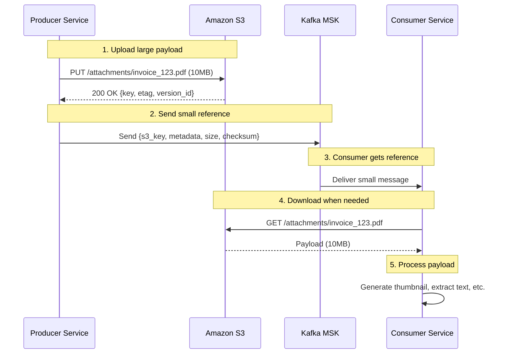
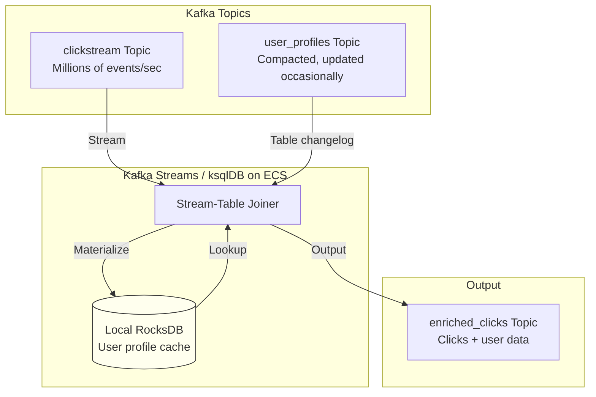
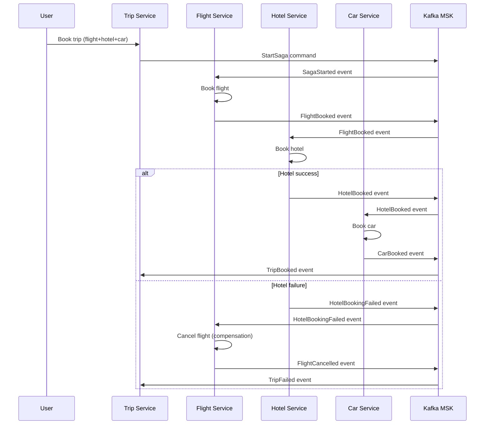

# 11 Kafka Design Patterns — Performance & Integration Deep Dive

## Story Intro

Welcome to the final part of our Kafka Design Patterns series. In Part 1, we introduced all 11 patterns. In Part 2, we mastered **Reliability & Ordering** — building systems that survive failures, handle duplicates, and preserve ordering. In Part 3, we explored **Data & State** — treating Kafka as the source of truth for event sourcing, CQRS, and reference data distribution.

Now, in Part 4, we tackle the patterns that make Kafka systems **fast, scalable, and connected** to the rest of your ecosystem.

We cover three powerful patterns that solve real-world performance and integration challenges:

- **Claim Check** — What do you do when your messages are too big for Kafka? The default 1MB limit exists for good reason — large messages degrade broker performance, increase latency, and consume memory. But your system still needs to process images, videos, large JSON blobs, and binary files. The Claim Check pattern stores large payloads in S3 and sends only a reference through Kafka. Your brokers stay lean, your consumers stay fast, and your large files live safely in S3 with lifecycle policies and versioning.

- **Stream-Table Duality** — How do you join a real-time stream of events with slowly changing reference data? This is one of the most common and powerful operations in stream processing. The Stream-Table Duality pattern recognizes that a stream is a table in motion, and a table is a stream at rest. With Kafka Streams and ksqlDB on AWS, you can join a clickstream (millions of events per second) with a user profile table (updated occasionally) — in real time, with毫秒级延迟, without ever hitting a database.

- **Saga (Choreography)** — How do you maintain data consistency across microservices without distributed transactions? Two-phase commit (2PC) doesn't work in modern microservice architectures — it's slow, fragile, and couples services tightly. The Saga pattern breaks a distributed transaction into a sequence of local transactions, each publishing events that trigger the next step. If a step fails, compensating transactions undo the previous work. Kafka acts as the choreography backbone — services react to events, not commands, creating loosely coupled, resilient workflows.

These patterns answer fundamental questions:

- How do I send a 100MB video file through Kafka without breaking everything?
- How do I join a live clickstream with a user database without killing performance?
- How do I book a flight, reserve a hotel, and rent a car across three different services, with automatic rollback if anything fails?

By the end of this part, you'll have a complete toolkit for building production-grade Kafka systems on AWS — from reliability to state management to performance optimization to distributed coordination.

Let's finish strong.

---

*This is Part 4 of the "Kafka Design Patterns for Every Backend Engineer" series.*

📌 **If you haven't read the master story / Part 1, start there for an overview of all 11 patterns with diagrams and code snippets.**

📌 **Parts 2 and 3 are recommended prerequisites, as they cover reliability and state patterns that are used in the implementations below.**

---

## 📚 Story List (with Pattern Coverage)

1. **Kafka Design Patterns — Overview (All 11 Patterns)** — Brief intro, detailed explainer for each pattern, Mermaid diagrams, small code snippets.  
   *Patterns covered: All 11 patterns introduced at high level.*  
   📎 *Read the full story: Part 1*

2. **Reliability & Ordering Patterns** — Deep dive on patterns that ensure message durability, exactly-once processing, failure handling, and strict ordering.  
   *Patterns covered: Transactional Outbox, Idempotent Consumer, Partition Key, Dead Letter Queue (DLQ), Retry with Backoff.*  
   📎 *Read the full story: Part 2*

3. **Data & State Patterns** — Deep dive on patterns that treat Kafka as a source of truth for state management, event replay, and materialized views.  
   *Patterns covered: Event Sourcing, CQRS, Compacted Topic, Event Carried State Transfer.*  
   📎 *Read the full story: Part 3*

4. **Performance & Integration Patterns** — Deep dive on patterns that handle large messages, real-time joins, and distributed transactions across services.  
   *Patterns covered: Claim Check, Stream-Table Duality, Saga (Choreography).*  
   📎 *Read the full story: Part 4 — below*

---

## Takeaway from Part 3

In Part 3, we learned how to treat Kafka as a source of truth:

- **Event Sourcing** stores every state change as an immutable event, enabling complete audit trails and temporal queries.
- **CQRS** separates write and read models, allowing independent scaling and optimized data stores for each access pattern.
- **Compacted Topics** distribute reference data to all services, eliminating API calls and central databases.
- **Event Carried State Transfer** embeds all needed data in events, decoupling consumers from source services.

These patterns established Kafka as the backbone of your data architecture. Now, in Part 4, we optimize performance and connect Kafka to the broader ecosystem.

---

## In This Part (Part 4)

We deep-dive into **3 performance and integration patterns** that handle large messages, real-time stream-table joins, and distributed transactions.

Each pattern includes:
- Full production code (Python, Java, ksqlDB)
- AWS-specific implementation (MSK, S3, ECS, Step Functions, DynamoDB)
- Mermaid architecture diagrams
- Common pitfalls and their mitigations
- Monitoring and alerting strategies

---

# 1. Claim Check Pattern (Deep Dive)

## The Problem: Messages That Are Too Big

Kafka has a default maximum message size of **1MB**. This limit exists for good reasons:

- **Broker performance** — Large messages consume more memory during replication and storage. A single 100MB message uses as much broker resources as 100 normal messages.
- **Network latency** — Large messages take longer to transmit, increasing latency for all messages on the same connection.
- **Garbage collection** — In Java-based brokers (like MSK), large messages create large objects that stress the garbage collector.
- **Compression efficiency** — Very large messages compress poorly and can cause out-of-memory errors during compression/decompression.

You can increase `max.message.bytes` to 10MB, 50MB, or even 100MB. But this is a global setting that affects all topics on the cluster. A few large messages can degrade performance for all tenants.

But your system still needs to process large payloads:

- **Images** — User uploads a profile picture (2-10MB)
- **Documents** — PDF invoices, contracts, receipts (1-50MB)
- **Videos** — Short clips for review (10-100MB)
- **Log files** — Batch logs from edge devices (5-50MB)
- **Machine learning data** — Model weights, training data (50-500MB)

What do you do?

## The Solution: Claim Check Pattern

The **Claim Check pattern** (named after the ticket you get when checking a coat) stores large payloads in an external storage system and sends only a **reference** through Kafka. The reference acts like a claim check ticket — small enough to pass through Kafka, but containing all the information needed to retrieve the actual payload.

Here's how it works:

1. **Producer** uploads the large payload to S3 (or another external store)
2. **Producer** receives a unique identifier (S3 key, ETag, URL)
3. **Producer** sends a small Kafka message containing only the reference and metadata
4. **Consumer** receives the small message
5. **Consumer** uses the reference to download the payload from S3
6. **Consumer** processes the payload

The Kafka message stays small (typically < 1KB). The large payload lives in S3, where it belongs — with lifecycle policies, versioning, and cost-effective storage.

### Why This Works

The Claim Check pattern gives you:

- **Small Kafka messages** — Your brokers stay lean and fast
- **Cost-effective storage** — S3 costs ~$0.023/GB vs MSK storage at ~$0.10/GB
- **Lifecycle management** — S3 lifecycle policies can archive to Glacier or delete old data
- **Versioning** — S3 versioning keeps history of large payloads
- **Pre-signed URLs** — Secure, time-limited access without IAM credentials
- **Separation of concerns** — Kafka handles routing and ordering; S3 handles storage

The trade-off is **complexity** — you now have two systems to manage. You need to handle the case where the S3 upload succeeds but Kafka send fails (orphaned payloads). You need to consider latency — an extra S3 round-trip. And you need to secure access to S3.

### Architecture on AWS



### Complete Implementation

**Step 1: Producer with S3 upload and Kafka reference**

```python
import boto3
from kafka import KafkaProducer
import json
import hashlib
import uuid
from datetime import datetime, timedelta
from typing import BinaryIO, Optional
import logging

logger = logging.getLogger(__name__)

class ClaimCheckProducer:
    """
    Producer that implements the Claim Check pattern.
    
    Large payloads are uploaded to S3. Only metadata and S3 references
    are sent to Kafka.
    """
    
    def __init__(self, bootstrap_servers: list, s3_bucket: str, s3_prefix: str = "attachments"):
        self.s3 = boto3.client('s3')
        self.s3_bucket = s3_bucket
        self.s3_prefix = s3_prefix
        
        self.producer = KafkaProducer(
            bootstrap_servers=bootstrap_servers,
            value_serializer=lambda v: json.dumps(v, default=str).encode('utf-8'),
            key_serializer=lambda k: k.encode('utf-8') if k else None,
            acks='all',
            retries=3
        )
    
    def _generate_s3_key(self, aggregate_id: str, filename: str, content_type: str) -> str:
        """Generate a unique S3 key for the payload"""
        # Generate unique ID to prevent collisions
        unique_id = uuid.uuid4().hex
        timestamp = datetime.utcnow().strftime('%Y/%m/%d/%H')
        return f"{self.s3_prefix}/{timestamp}/{aggregate_id}/{unique_id}/{filename}"
    
    def _compute_checksum(self, data: bytes) -> str:
        """Compute SHA-256 checksum for integrity verification"""
        return hashlib.sha256(data).hexdigest()
    
    def publish_with_claim_check(
        self,
        topic: str,
        payload: bytes,
        aggregate_id: str,
        filename: str,
        content_type: str,
        metadata: Optional[dict] = None,
        key: Optional[str] = None,
        expiration_days: int = 7
    ) -> dict:
        """
        Publish a large payload using the Claim Check pattern.
        
        Args:
            topic: Kafka topic
            payload: The large payload (bytes)
            aggregate_id: ID of the aggregate this payload belongs to
            filename: Original filename
            content_type: MIME type
            metadata: Additional metadata to include in Kafka message
            key: Kafka message key (for partitioning)
            expiration_days: Days until S3 object is deleted
        
        Returns:
            Dictionary with S3 location and Kafka response
        """
        
        # Step 1: Upload to S3
        s3_key = self._generate_s3_key(aggregate_id, filename, content_type)
        checksum = self._compute_checksum(payload)
        
        try:
            self.s3.put_object(
                Bucket=self.s3_bucket,
                Key=s3_key,
                Body=payload,
                ContentType=content_type,
                Metadata={
                    'aggregate_id': aggregate_id,
                    'filename': filename,
                    'checksum': checksum,
                    'original_size': str(len(payload)),
                    'uploaded_by': 'claim_check_producer',
                    'uploaded_at': datetime.utcnow().isoformat()
                }
            )
            logger.info(f"Uploaded {len(payload)} bytes to s3://{self.s3_bucket}/{s3_key}")
            
            # Set lifecycle policy for automatic expiration
            # (Configured at bucket level, but we can tag for custom policies)
            self.s3.put_object_tagging(
                Bucket=self.s3_bucket,
                Key=s3_key,
                Tagging={
                    'TagSet': [
                        {'Key': 'expiration_days', 'Value': str(expiration_days)},
                        {'Key': 'aggregate_id', 'Value': aggregate_id}
                    ]
                }
            )
            
        except Exception as e:
            logger.error(f"Failed to upload to S3: {e}")
            raise
        
        # Step 2: Create claim check message (small!)
        claim_check_message = {
            "claim_check": {
                "version": "1.0",
                "s3_bucket": self.s3_bucket,
                "s3_key": s3_key,
                "s3_region": self.s3.meta.region_name,
                "checksum": checksum,
                "size_bytes": len(payload),
                "content_type": content_type,
                "filename": filename,
                "uploaded_at": datetime.utcnow().isoformat(),
                "expires_at": (datetime.utcnow() + timedelta(days=expiration_days)).isoformat()
            },
            "metadata": metadata or {},
            "aggregate_id": aggregate_id
        }
        
        # Step 3: Send small message to Kafka
        try:
            future = self.producer.send(
                topic,
                key=key or aggregate_id,
                value=claim_check_message
            )
            record_metadata = future.get(timeout=10)
            
            logger.info(f"Published claim check to {topic}: partition={record_metadata.partition}, offset={record_metadata.offset}")
            
            return {
                "kafka_offset": record_metadata.offset,
                "kafka_partition": record_metadata.partition,
                "s3_location": f"s3://{self.s3_bucket}/{s3_key}",
                "s3_key": s3_key
            }
            
        except Exception as e:
            # Kafka send failed - we have an orphaned S3 object
            # Clean up or log for manual reconciliation
            logger.error(f"Failed to send to Kafka after S3 upload. Orphaned S3 object: {s3_key}")
            # In production, send to a dead letter queue or cleanup queue
            self._record_orphaned_object(s3_key, aggregate_id)
            raise
    
    def _record_orphaned_object(self, s3_key: str, aggregate_id: str):
        """Record orphaned S3 objects for cleanup"""
        # Could write to a separate "orphaned_uploads" topic or DynamoDB table
        orphan_record = {
            "s3_key": s3_key,
            "aggregate_id": aggregate_id,
            "orphaned_at": datetime.utcnow().isoformat(),
            "reason": "kafka_send_failed"
        }
        # In production, write to a dead letter queue or cleanup queue
        logger.warning(f"Orphaned object recorded: {orphan_record}")
    
    def publish_multiple_with_claim_check(
        self,
        topic: str,
        payloads: list,
        aggregate_id: str,
        **kwargs
    ) -> list:
        """Publish multiple payloads efficiently"""
        results = []
        for payload_info in payloads:
            result = self.publish_with_claim_check(
                topic=topic,
                payload=payload_info['data'],
                aggregate_id=aggregate_id,
                filename=payload_info['filename'],
                content_type=payload_info['content_type'],
                metadata=payload_info.get('metadata'),
                key=kwargs.get('key', aggregate_id)
            )
            results.append(result)
        return results

# Usage example
producer = ClaimCheckProducer(
    bootstrap_servers=['msk-broker-1:9092'],
    s3_bucket='my-app-attachments',
    s3_prefix='order_attachments'
)

# Upload a large PDF invoice
with open('invoice.pdf', 'rb') as f:
    pdf_data = f.read()

result = producer.publish_with_claim_check(
    topic='order_attachments',
    payload=pdf_data,
    aggregate_id='order_123',
    filename='invoice.pdf',
    content_type='application/pdf',
    metadata={
        'order_id': 'order_123',
        'customer_id': 'cust_456',
        'invoice_number': 'INV-2024-001'
    },
    key='order_123',
    expiration_days=90  # Keep for 90 days
)

print(f"Published: {result}")
```

**Step 2: Consumer with S3 download**

```python
from kafka import KafkaConsumer
import boto3
import json
import hashlib
from typing import Optional, BinaryIO
import tempfile
import os

class ClaimCheckConsumer:
    """
    Consumer that retrieves large payloads from S3 using claim check references.
    
    Features:
    - Lazy loading (download only when needed)
    - Caching (keep frequently accessed payloads)
    - Integrity verification (checksum validation)
    - Automatic cleanup of temporary files
    """
    
    def __init__(self, bootstrap_servers: list, topic: str, group_id: str, 
                 cache_dir: Optional[str] = None, cache_ttl_seconds: int = 3600):
        self.consumer = KafkaConsumer(
            topic,
            bootstrap_servers=bootstrap_servers,
            group_id=group_id,
            enable_auto_commit=True,
            value_deserializer=lambda m: json.loads(m.decode('utf-8')),
            key_deserializer=lambda k: k.decode('utf-8') if k else None
        )
        
        self.s3 = boto3.client('s3')
        self.cache_dir = cache_dir or tempfile.mkdtemp(prefix='kafka_claim_check_')
        self.cache_ttl = cache_ttl_seconds
        self.cache_metadata = {}  # In-memory cache tracking
        
        # Ensure cache directory exists
        os.makedirs(self.cache_dir, exist_ok=True)
    
    def _get_cache_path(self, s3_key: str) -> str:
        """Get local cache path for an S3 key"""
        # Sanitize S3 key for filesystem
        safe_key = s3_key.replace('/', '_').replace('\\', '_')
        return os.path.join(self.cache_dir, safe_key)
    
    def _is_cached(self, s3_key: str) -> bool:
        """Check if payload is in cache and not expired"""
        cache_path = self._get_cache_path(s3_key)
        if not os.path.exists(cache_path):
            return False
        
        # Check TTL
        if s3_key in self.cache_metadata:
            cached_at = self.cache_metadata[s3_key]['cached_at']
            if (datetime.utcnow() - cached_at).total_seconds() > self.cache_ttl:
                # Expired, remove from cache
                os.remove(cache_path)
                del self.cache_metadata[s3_key]
                return False
        
        return True
    
    def download_payload(self, claim_check: dict) -> bytes:
        """
        Download payload from S3 using claim check reference.
        
        Uses local cache to avoid repeated downloads.
        """
        s3_bucket = claim_check['s3_bucket']
        s3_key = claim_check['s3_key']
        
        # Check cache
        if self._is_cached(s3_key):
            cache_path = self._get_cache_path(s3_key)
            with open(cache_path, 'rb') as f:
                data = f.read()
            logger.info(f"Retrieved {len(data)} bytes from cache: {s3_key}")
            return data
        
        # Download from S3
        try:
            response = self.s3.get_object(Bucket=s3_bucket, Key=s3_key)
            data = response['Body'].read()
            
            # Verify integrity
            if 'checksum' in claim_check:
                computed = hashlib.sha256(data).hexdigest()
                if computed != claim_check['checksum']:
                    raise ValueError(f"Checksum mismatch for {s3_key}. Expected {claim_check['checksum']}, got {computed}")
            
            # Cache locally
            cache_path = self._get_cache_path(s3_key)
            with open(cache_path, 'wb') as f:
                f.write(data)
            
            self.cache_metadata[s3_key] = {
                'cached_at': datetime.utcnow(),
                'size': len(data),
                'checksum': claim_check.get('checksum')
            }
            
            logger.info(f"Downloaded {len(data)} bytes from S3: {s3_key}")
            return data
            
        except Exception as e:
            logger.error(f"Failed to download from S3: {e}")
            raise
    
    def get_presigned_url(self, claim_check: dict, expiration_seconds: int = 3600) -> str:
        """
        Generate a presigned URL for direct S3 access.
        
        Useful when consumers want to stream large files directly
        without downloading through the consumer.
        """
        s3_bucket = claim_check['s3_bucket']
        s3_key = claim_check['s3_key']
        
        url = self.s3.generate_presigned_url(
            'get_object',
            Params={'Bucket': s3_bucket, 'Key': s3_key},
            ExpiresIn=expiration_seconds
        )
        return url
    
    def process_messages(self, handler):
        """
        Main consumer loop. Each message contains a claim check.
        The handler receives the deserialized message and the payload (if downloaded).
        """
        for msg in self.consumer:
            try:
                claim_check_msg = msg.value
                
                # Extract claim check and metadata
                claim_check = claim_check_msg.get('claim_check')
                metadata = claim_check_msg.get('metadata', {})
                aggregate_id = claim_check_msg.get('aggregate_id')
                
                if not claim_check:
                    # This is a normal message, not a claim check
                    handler(msg.value, None)
                    continue
                
                # Option 1: Download payload (for small to medium files)
                if claim_check.get('size_bytes', 0) < 50 * 1024 * 1024:  # < 50MB
                    payload = self.download_payload(claim_check)
                    handler(metadata, payload, claim_check)
                else:
                    # Option 2: Provide presigned URL for large files
                    url = self.get_presigned_url(claim_check)
                    handler(metadata, None, claim_check, presigned_url=url)
                
            except Exception as e:
                logger.error(f"Error processing message: {e}")
                # In production, send to DLQ
                continue
    
    def cleanup_cache(self, max_age_seconds: int = 86400):
        """Clean up old cache files"""
        now = datetime.utcnow()
        for s3_key, metadata in list(self.cache_metadata.items()):
            if (now - metadata['cached_at']).total_seconds() > max_age_seconds:
                cache_path = self._get_cache_path(s3_key)
                if os.path.exists(cache_path):
                    os.remove(cache_path)
                del self.cache_metadata[s3_key]
                logger.info(f"Cleaned up cache for {s3_key}")

# Usage
def handle_order_attachment(metadata: dict, payload: bytes, claim_check: dict, presigned_url: str = None):
    """Business logic for processing order attachments"""
    order_id = metadata.get('order_id')
    
    if payload:
        # Small file - we have the data
        print(f"Processing {len(payload)} byte attachment for order {order_id}")
        # Generate thumbnail, extract text, etc.
        if claim_check['content_type'] == 'application/pdf':
            extract_text_from_pdf(payload)
    else:
        # Large file - use presigned URL
        print(f"Large attachment for order {order_id}: {presigned_url}")
        # Pass URL to frontend or streaming processor

consumer = ClaimCheckConsumer(
    bootstrap_servers=['msk-broker-1:9092'],
    topic='order_attachments',
    group_id='attachment-processor',
    cache_dir='/tmp/claim_check_cache',
    cache_ttl_seconds=3600
)

consumer.process_messages(handle_order_attachment)
```

**Step 3: Orphaned object cleanup (Lambda)**

```python
import boto3
from datetime import datetime, timedelta

def cleanup_orphaned_objects(event, context):
    """
    Lambda function to clean up S3 objects that were uploaded
    but never referenced in Kafka.
    
    Runs daily via CloudWatch Events.
    """
    s3 = boto3.client('s3')
    dynamodb = boto3.resource('dynamodb')
    orphan_table = dynamodb.Table('orphaned_uploads')
    
    bucket = 'my-app-attachments'
    prefix = 'attachments/'
    
    # List objects older than 24 hours
    cutoff = datetime.utcnow() - timedelta(hours=24)
    
    paginator = s3.get_paginator('list_objects_v2')
    for page in paginator.paginate(Bucket=bucket, Prefix=prefix):
        for obj in page.get('Contents', []):
            if obj['LastModified'].replace(tzinfo=None) < cutoff:
                # Check if this object was ever referenced
                key = obj['Key']
                response = orphan_table.get_item(Key={'s3_key': key})
                
                if 'Item' not in response:
                    # Orphaned - delete
                    s3.delete_object(Bucket=bucket, Key=key)
                    print(f"Deleted orphaned object: {key}")
```

### S3 Lifecycle Configuration

```json
{
  "Rules": [
    {
      "Id": "DeleteAfter90Days",
      "Status": "Enabled",
      "Prefix": "attachments/",
      "Expiration": {
        "Days": 90
      }
    },
    {
      "Id": "TransitionToGlacier",
      "Status": "Enabled",
      "Prefix": "attachments/",
      "Transitions": [
        {
          "Days": 30,
          "StorageClass": "GLACIER"
        }
      ]
    },
    {
      "Id": "DeleteOrphaned",
      "Status": "Enabled",
      "Prefix": "attachments/temp/",
      "Expiration": {
        "Days": 1
      }
    }
  ]
}
```

### Common Pitfalls and Their Mitigations

| Pitfall | Mitigation |
|---------|------------|
| **Orphaned S3 objects** (upload succeeds, Kafka fails) | Track uploads in DynamoDB; run cleanup Lambda; use idempotent producers |
| **High S3 costs** from many small objects | Batch small files; use S3 lifecycle policies; compress before upload |
| **Latency from S3 download** | Cache frequently accessed payloads; use presigned URLs for streaming; consider EFS for shared cache |
| **Security** (unauthorized access to S3) | Use presigned URLs with short expiration; encrypt at rest with KMS; use bucket policies |
| **Versioning conflicts** | Include checksum in claim check; use S3 version IDs in reference |
| **Consumer crashes mid-download** | Implement idempotent processing; use atomic file writes with temp files |

---

# 2. Stream-Table Duality Pattern (Deep Dive)

## The Problem: Joining Streams with Tables

One of the most common operations in stream processing is joining a **real-time stream of events** with a **slowly changing table of reference data**.

Consider these examples:

- **E-commerce** — Join a clickstream (millions of events per second) with a product catalog (updated occasionally). Enrich each click with product name, price, and category.

- **IoT** — Join sensor readings (thousands per second per device) with device metadata (device location, calibration settings, owner information).

- **User analytics** — Join user actions (login, purchase, page view) with user profiles (updated when users change settings).

- **Fraud detection** — Join transaction events with user risk scores (recalculated periodically).

Traditional approaches struggle:

- **Database lookup per event** — Too slow. Even at 1ms per lookup, 10,000 events/sec = 10 seconds of database time. And you'll overwhelm your database.

- **Cache everything** — Works for small tables, but what about millions of users? Cache invalidation becomes complex.

- **Batch processing** — You lose real-time semantics. Fraud detection needs milliseconds, not hours.

## The Solution: Stream-Table Duality

**Stream-Table Duality** is a fundamental concept in Kafka Streams and ksqlDB. It recognizes that:

- **A stream is a table in motion** — If you take a table's changelog and play it forward, you get a stream.
- **A table is a stream at rest** — If you take a stream of events and aggregate by key, keeping only the latest value, you get a table.

This duality enables **stream-table joins** that are:
- **Real-time** — Joins happen as events arrive
- **Scalable** — State is stored locally in RocksDB, not queried from a remote database
- **Exactly-once** — Kafka Streams provides exactly-once processing semantics
- **Fault-tolerant** — State is backed by Kafka changelog topics

### How Stream-Table Join Works

When you join a stream (KStream) with a table (KTable), Kafka Streams:

1. **Materializes the table locally** — Each instance of the stream processor maintains a local RocksDB store containing a subset of the table (by key partition)
2. **Updates the table in real-time** — As table updates arrive, they update the local RocksDB
3. **Joins each stream event** — When a stream event arrives, the processor looks up the key in local RocksDB — no network calls!
4. **Emits enriched events** — The result is a new stream with joined data

The table is maintained as a **compacted topic** behind the scenes. The local RocksDB is just a cache for fast lookups.

### Architecture on AWS



### Complete Implementation with ksqlDB (Simplest)

ksqlDB on AWS (Confluent Cloud or self-managed) provides SQL syntax for stream-table joins.

**Step 1: Create streams and tables in ksqlDB**

```sql
-- Create a stream from the clickstream topic
CREATE STREAM clickstream (
    user_id VARCHAR KEY,
    page VARCHAR,
    timestamp BIGINT,
    session_id VARCHAR,
    referrer VARCHAR
) WITH (
    KAFKA_TOPIC = 'clickstream',
    VALUE_FORMAT = 'JSON',
    PARTITIONS = 12
);

-- Create a table from the user profiles compacted topic
CREATE TABLE user_profiles (
    user_id VARCHAR PRIMARY KEY,
    name VARCHAR,
    email VARCHAR,
    country VARCHAR,
    membership_tier VARCHAR,
    preferences MAP<VARCHAR, VARCHAR>,
    last_login BIGINT
) WITH (
    KAFKA_TOPIC = 'user_profiles',
    VALUE_FORMAT = 'JSON',
    KEY = 'user_id'
);

-- Stream-table join: enrich clicks with user profile
CREATE STREAM enriched_clicks AS
SELECT 
    c.user_id,
    c.page,
    c.timestamp,
    c.session_id,
    c.referrer,
    u.name AS user_name,
    u.country AS user_country,
    u.membership_tier,
    u.preferences['theme'] AS user_theme
FROM clickstream c
LEFT JOIN user_profiles u ON c.user_id = u.user_id
EMIT CHANGES;

-- Create a materialized view: clicks by country and page
CREATE TABLE clicks_by_country_page AS
SELECT 
    user_country,
    page,
    COUNT(*) AS click_count,
    COUNT(DISTINCT user_id) AS unique_users
FROM enriched_clicks
WINDOW TUMBLING (SIZE 1 MINUTE)
GROUP BY user_country, page
EMIT CHANGES;
```

**Step 2: Produce data to the stream and table**

```python
# Producer for clickstream (high volume)
def produce_clicks():
    producer = KafkaProducer(
        bootstrap_servers=['msk-broker-1:9092'],
        key_serializer=lambda k: k.encode('utf-8'),
        value_serializer=lambda v: json.dumps(v).encode('utf-8')
    )
    
    for i in range(1000000):
        click = {
            'page': random.choice(['/home', '/product', '/cart', '/checkout']),
            'timestamp': int(time.time() * 1000),
            'session_id': f"sess_{random.randint(1, 10000)}",
            'referrer': random.choice(['google', 'facebook', 'direct', 'email'])
        }
        user_id = f"user_{random.randint(1, 100000)}"
        producer.send('clickstream', key=user_id, value=click)

# Producer for user profiles (low volume, updates occasionally)
def produce_user_profile(user_id: str):
    producer = KafkaProducer(
        bootstrap_servers=['msk-broker-1:9092'],
        key_serializer=lambda k: k.encode('utf-8'),
        value_serializer=lambda v: json.dumps(v).encode('utf-8')
    )
    
    profile = {
        'name': f"User {user_id}",
        'email': f"{user_id}@example.com",
        'country': random.choice(['US', 'CA', 'UK', 'DE', 'FR', 'JP']),
        'membership_tier': random.choice(['bronze', 'silver', 'gold', 'platinum']),
        'preferences': {
            'theme': random.choice(['light', 'dark']),
            'notifications': str(random.choice([True, False])).lower()
        },
        'last_login': int(time.time() * 1000)
    }
    
    producer.send('user_profiles', key=user_id, value=profile)
    producer.flush()

# Update profile when user changes settings
def update_user_preferences(user_id: str, new_preferences: dict):
    # In production, you'd read current profile, update, and republish
    produce_user_profile(user_id)  # Re-publish entire profile
```

**Step 3: Query the enriched stream**

```sql
-- Query enriched clicks in real-time
SELECT * FROM enriched_clicks EMIT CHANGES LIMIT 10;

-- Result:
-- +---------+----------+-------------+------------+----------+------------+--------------+------------------+------------+
-- | user_id | page     | timestamp   | session_id | referrer | user_name  | user_country | membership_tier  | user_theme |
-- +---------+----------+-------------+------------+----------+------------+--------------+------------------+------------+
-- | user_42 | /product | 1700000000  | sess_123   | google   | User 42    | US           | gold             | dark       |
-- +---------+----------+-------------+------------+----------+------------+--------------+------------------+------------+

-- Query aggregated table
SELECT * FROM clicks_by_country_page EMIT CHANGES;

-- Result (updates every minute):
-- +--------------+----------+-------------+--------------+
-- | WINDOWSTART  | country  | page        | click_count  | unique_users |
-- +--------------+----------+-------------+--------------+--------------+
-- | 1700000000   | US       | /product    | 15234        | 2341         |
-- +--------------+----------+-------------+--------------+--------------+
```

### Complete Implementation with Kafka Streams (Java)

For more control, use Kafka Streams directly.

```java
import org.apache.kafka.streams.KafkaStreams;
import org.apache.kafka.streams.StreamsBuilder;
import org.apache.kafka.streams.kstream.*;
import org.apache.kafka.common.serialization.Serdes;
import java.time.Duration;

public class StreamTableJoinExample {
    
    public static void main(String[] args) {
        StreamsBuilder builder = new StreamsBuilder();
        
        // 1. Stream from clickstream topic
        KStream<String, ClickEvent> clicks = builder.stream(
            "clickstream",
            Consumed.with(Serdes.String(), clickEventSerde)
        );
        
        // 2. Table from user profiles compacted topic
        KTable<String, UserProfile> users = builder.table(
            "user_profiles",
            Consumed.with(Serdes.String(), userProfileSerde),
            Materialized.<String, UserProfile, KeyValueStore<Bytes, byte[]>>as("user-profile-store")
                .withKeySerde(Serdes.String())
                .withValueSerde(userProfileSerde)
        );
        
        // 3. Stream-table join (left join)
        KStream<String, EnrichedClick> enriched = clicks.leftJoin(
            users,
            (click, profile) -> {
                EnrichedClick enriched = new EnrichedClick(click);
                if (profile != null) {
                    enriched.setUserName(profile.getName());
                    enriched.setUserCountry(profile.getCountry());
                    enriched.setMembershipTier(profile.getMembershipTier());
                }
                return enriched;
            },
            Joined.with(Serdes.String(), clickEventSerde, userProfileSerde)
        );
        
        // 4. Output to topic
        enriched.to("enriched_clicks", Produced.with(Serdes.String(), enrichedClickSerde));
        
        // 5. Additional aggregation: count by country and page (tumbling window)
        KTable<Windowed<String>, AggregatedStats> stats = enriched
            .groupBy(
                (key, value) -> value.getUserCountry() + "|" + value.getPage(),
                Grouped.with(Serdes.String(), enrichedClickSerde)
            )
            .windowedBy(TimeWindows.ofSizeWithNoGrace(Duration.ofMinutes(1)))
            .aggregate(
                () -> new AggregatedStats(),
                (key, value, agg) -> agg.addClick(value),
                Materialized.<String, AggregatedStats, WindowStore<Bytes, byte[]>>as("stats-store")
                    .withKeySerde(Serdes.String())
                    .withValueSerde(aggregatedStatsSerde)
            );
        
        // 6. Start the stream processor
        KafkaStreams streams = new KafkaStreams(builder.build(), streamsConfig);
        streams.start();
        
        // Add shutdown hook
        Runtime.getRuntime().addShutdownHook(new Thread(streams::close));
    }
}

// Data classes
class ClickEvent {
    private String userId;
    private String page;
    private long timestamp;
    private String sessionId;
    private String referrer;
    // getters, setters, constructor
}

class UserProfile {
    private String userId;
    private String name;
    private String email;
    private String country;
    private String membershipTier;
    private Map<String, String> preferences;
    // getters, setters, constructor
}

class EnrichedClick {
    private String userId;
    private String page;
    private long timestamp;
    private String sessionId;
    private String referrer;
    private String userName;
    private String userCountry;
    private String membershipTier;
    // getters, setters, constructor
    
    public EnrichedClick(ClickEvent click) {
        this.userId = click.getUserId();
        this.page = click.getPage();
        this.timestamp = click.getTimestamp();
        this.sessionId = click.getSessionId();
        this.referrer = click.getReferrer();
    }
}

class AggregatedStats {
    private long clickCount = 0;
    private Set<String> uniqueUsers = new HashSet<>();
    
    public AggregatedStats addClick(EnrichedClick click) {
        this.clickCount++;
        this.uniqueUsers.add(click.getUserId());
        return this;
    }
    
    public long getClickCount() { return clickCount; }
    public int getUniqueUsers() { return uniqueUsers.size(); }
}
```

### Running Kafka Streams on AWS ECS

```yaml
# docker-compose.yml for Kafka Streams app
version: '3.8'
services:
  stream-joiner:
    build: .
    environment:
      - BOOTSTRAP_SERVERS=msk-broker-1:9092,msk-broker-2:9092
      - APPLICATION_ID=stream-table-joiner
      - STATE_DIR=/state
      - ROCKSDB_CONFIG=/config/rocksdb.conf
    volumes:
      - state-data:/state
    deploy:
      replicas: 3  # Matches partition count for parallelism
      resources:
        limits:
          memory: 2G
          cpus: '1'

volumes:
  state-data:
    driver: efs  # Use EFS for state store (or use EBS with careful rebalancing)
```

### Handling Late Arriving Data

```java
// Configure windowed aggregation to handle late data
KStream<String, EnrichedClick> enriched = ...;

enriched
    .groupByKey()
    .windowedBy(
        TimeWindows.of(Duration.ofMinutes(1))
            .grace(Duration.ofSeconds(10))  // Allow 10 seconds of lateness
    )
    .aggregate(...);
```

### Common Pitfalls and Their Mitigations

| Pitfall | Mitigation |
|---------|------------|
| **State store grows too large** | Use RocksDB with tiered compaction; monitor state size; scale instances |
| **Rebalancing takes too long** | Use cooperative rebalancing; keep partition count reasonable (< 1000) |
| **Table updates lag behind stream** | Monitor consumer lag for table topic; use separate consumer group |
| **RocksDB on ephemeral storage** | Use EBS volumes for state stores; enable changelog topics for recovery |
| **Join misses for new keys** | Acceptable for left joins; use foreign-key joins for required data |
| **Version conflicts in table updates** | Use upsert semantics; table always has latest value per key |

---

# 3. Saga Pattern (Choreography) Deep Dive

## The Problem: Distributed Transactions

In a monolithic application, maintaining data consistency is easy — you use a database transaction:

```sql
BEGIN;
  INSERT INTO orders ...
  UPDATE inventory SET quantity = quantity - 5 WHERE product_id = ...
  INSERT INTO payments ...
  INSERT INTO shipping ...
COMMIT;
```

Either everything succeeds, or nothing changes. ACID transactions guarantee consistency.

In a microservices architecture, each service has its own database. The order, inventory, payment, and shipping data live in different databases, possibly different types (PostgreSQL, DynamoDB, etc.). You cannot use a single database transaction across services.

Traditional solutions like **Two-Phase Commit (2PC)** don't work well in microservices:

- **Performance** — 2PC requires locks and multiple round-trips, killing throughput
- **Availability** — If any participant fails, the entire transaction blocks
- **Coupling** — Services become tightly coupled to the transaction coordinator
- **Scalability** — 2PC doesn't scale horizontally

## The Solution: Saga Pattern

The **Saga pattern** breaks a distributed transaction into a sequence of **local transactions**, each in a single service. Each local transaction publishes an event that triggers the next local transaction. If a local transaction fails, the saga runs **compensating transactions** to undo the previous steps.

There are two ways to implement sagas:

1. **Choreography** — Each service listens for events and decides what to do next. No central coordinator. This is the Kafka-native approach.

2. **Orchestration** — A central coordinator (e.g., AWS Step Functions) tells each service what to do.

We focus on **Choreography** because it's more decoupled and fits Kafka's event-driven model.

### How a Saga Works (Travel Booking Example)

Imagine booking a trip: flight, hotel, and car rental across three different services.

**Success path:**

1. **Flight Service** — Books flight → publishes `FlightBooked` event
2. **Hotel Service** — Listens, books hotel → publishes `HotelBooked` event
3. **Car Service** — Listens, books car → publishes `CarBooked` event
4. **Trip Service** — Listens, confirms trip

**Failure path (hotel booking fails):**

1. **Flight Service** — Books flight → publishes `FlightBooked`
2. **Hotel Service** — Tries to book hotel → fails (no rooms)
3. **Hotel Service** — Publishes `HotelBookingFailed` event
4. **Flight Service** — Listens, cancels flight (compensation) → publishes `FlightCancelled`
5. **Car Service** — Listens (if car was booked), cancels car
6. **Trip Service** — Notifies user of failure

### Architecture on AWS



### Complete Implementation

**Step 1: Define saga events**

```python
from pydantic import BaseModel
from datetime import datetime
from typing import Optional, List
import uuid

class SagaEvent(BaseModel):
    event_id: str
    saga_id: str
    event_type: str
    timestamp: datetime
    step: int
    data: dict

class StartSagaEvent(SagaEvent):
    event_type: str = "StartSaga"

class FlightBookedEvent(SagaEvent):
    event_type: str = "FlightBooked"
    flight_id: str
    booking_reference: str
    amount: float

class FlightBookingFailedEvent(SagaEvent):
    event_type: str = "FlightBookingFailed"
    reason: str

class FlightCancelledEvent(SagaEvent):
    event_type: str = "FlightCancelled"

class HotelBookedEvent(SagaEvent):
    event_type: str = "HotelBooked"
    hotel_id: str
    room_number: str
    amount: float

class HotelBookingFailedEvent(SagaEvent):
    event_type: str = "HotelBookingFailed"
    reason: str

class CarBookedEvent(SagaEvent):
    event_type: str = "CarBooked"
    car_id: str
    amount: float

class CarBookingFailedEvent(SagaEvent):
    event_type: str = "CarBookingFailed"
    reason: str

class TripBookedEvent(SagaEvent):
    event_type: str = "TripBooked"
    booking_reference: str
    total_amount: float

class TripFailedEvent(SagaEvent):
    event_type: str = "TripFailed"
    reason: str
    failed_step: str
```

**Step 2: Flight Service (with compensation)**

```python
class FlightService:
    """
    Flight service that participates in sagas.
    
    It can:
    1. Book a flight (forward operation)
    2. Cancel a flight (compensation)
    """
    
    def __init__(self, bootstrap_servers: list):
        self.producer = KafkaProducer(
            bootstrap_servers=bootstrap_servers,
            value_serializer=lambda v: json.dumps(v, default=str).encode('utf-8'),
            key_serializer=lambda k: k.encode('utf-8')
        )
        
        self.consumer = KafkaConsumer(
            'saga_events',
            bootstrap_servers=bootstrap_servers,
            group_id='flight-service',
            value_deserializer=lambda m: json.loads(m.decode('utf-8')),
            auto_offset_reset='earliest'
        )
        
        # In-memory booking store (use database in production)
        self.bookings = {}
    
    def book_flight(self, saga_id: str, request: dict) -> dict:
        """
        Book a flight. This is the forward operation.
        Returns booking details or raises exception.
        """
        # Business logic: check availability, charge payment, etc.
        flight_id = request.get('flight_id')
        passenger = request.get('passenger')
        date = request.get('date')
        
        # Simulate availability check
        if not self.is_available(flight_id, date):
            raise Exception(f"Flight {flight_id} not available on {date}")
        
        # Create booking
        booking = {
            'booking_reference': f"FL-{saga_id[:8]}",
            'flight_id': flight_id,
            'passenger': passenger,
            'date': date,
            'amount': request.get('amount', 299.99),
            'status': 'confirmed'
        }
        
        self.bookings[saga_id] = booking
        return booking
    
    def cancel_flight(self, saga_id: str) -> dict:
        """
        Cancel a flight. This is the compensation operation.
        Called when later steps in the saga fail.
        """
        booking = self.bookings.get(saga_id)
        if not booking:
            return {'status': 'not_found'}
        
        # Process refund
        booking['status'] = 'cancelled'
        
        # In production, call payment service for refund
        return {'status': 'cancelled', 'booking_reference': booking['booking_reference']}
    
    def is_available(self, flight_id: str, date: str) -> bool:
        """Check flight availability"""
        # In production, check database
        return True
    
    def handle_events(self):
        """
        Main event loop. Listens for saga events and responds.
        """
        for msg in self.consumer:
            event = msg.value
            saga_id = event.get('saga_id')
            event_type = event.get('event_type')
            
            if event_type == 'StartSaga':
                # Begin the saga - book flight
                try:
                    booking = self.book_flight(saga_id, event.get('data', {}))
                    
                    # Publish success event
                    success_event = FlightBookedEvent(
                        event_id=str(uuid.uuid4()),
                        saga_id=saga_id,
                        event_type="FlightBooked",
                        timestamp=datetime.utcnow(),
                        step=1,
                        data={
                            'flight_id': booking['flight_id'],
                            'booking_reference': booking['booking_reference'],
                            'amount': booking['amount']
                        }
                    )
                    self.producer.send('saga_events', key=saga_id, value=success_event.dict())
                    print(f"Flight booked for saga {saga_id}")
                    
                except Exception as e:
                    # Publish failure event
                    failure_event = FlightBookingFailedEvent(
                        event_id=str(uuid.uuid4()),
                        saga_id=saga_id,
                        event_type="FlightBookingFailed",
                        timestamp=datetime.utcnow(),
                        step=1,
                        data={'reason': str(e)}
                    )
                    self.producer.send('saga_events', key=saga_id, value=failure_event.dict())
                    print(f"Flight booking failed for saga {saga_id}: {e}")
            
            elif event_type == 'HotelBookingFailed':
                # Compensation: cancel the flight we booked
                print(f"Compensating: cancelling flight for saga {saga_id}")
                self.cancel_flight(saga_id)
                
                # Publish cancellation event
                cancelled_event = FlightCancelledEvent(
                    event_id=str(uuid.uuid4()),
                    saga_id=saga_id,
                    event_type="FlightCancelled",
                    timestamp=datetime.utcnow(),
                    step=1,
                    data={}
                )
                self.producer.send('saga_events', key=saga_id, value=cancelled_event.dict())
            
            elif event_type == 'CarBookingFailed':
                # Also need to compensate flight
                print(f"Compensating: cancelling flight for saga {saga_id} due to car failure")
                self.cancel_flight(saga_id)
                
                cancelled_event = FlightCancelledEvent(
                    event_id=str(uuid.uuid4()),
                    saga_id=saga_id,
                    event_type="FlightCancelled",
                    timestamp=datetime.utcnow(),
                    step=1,
                    data={}
                )
                self.producer.send('saga_events', key=saga_id, value=cancelled_event.dict())
```

**Step 3: Hotel Service (with compensation)**

```python
class HotelService:
    """
    Hotel service that participates in sagas.
    """
    
    def __init__(self, bootstrap_servers: list):
        self.producer = KafkaProducer(
            bootstrap_servers=bootstrap_servers,
            value_serializer=lambda v: json.dumps(v, default=str).encode('utf-8'),
            key_serializer=lambda k: k.encode('utf-8')
        )
        
        self.consumer = KafkaConsumer(
            'saga_events',
            bootstrap_servers=bootstrap_servers,
            group_id='hotel-service',
            value_deserializer=lambda m: json.loads(m.decode('utf-8')),
            auto_offset_reset='earliest'
        )
        
        self.bookings = {}
    
    def book_hotel(self, saga_id: str, request: dict) -> dict:
        """Book a hotel room"""
        hotel_id = request.get('hotel_id')
        check_in = request.get('check_in')
        check_out = request.get('check_out')
        guests = request.get('guests', 1)
        
        # Simulate occasional failure (for demonstration)
        if hotel_id == 'HOTEL_FULL':
            raise Exception("Hotel is fully booked")
        
        booking = {
            'booking_reference': f"HT-{saga_id[:8]}",
            'hotel_id': hotel_id,
            'check_in': check_in,
            'check_out': check_out,
            'guests': guests,
            'amount': request.get('amount', 199.99),
            'status': 'confirmed'
        }
        
        self.bookings[saga_id] = booking
        return booking
    
    def cancel_hotel(self, saga_id: str) -> dict:
        """Cancel hotel booking (compensation)"""
        booking = self.bookings.get(saga_id)
        if booking:
            booking['status'] = 'cancelled'
            return {'status': 'cancelled', 'booking_reference': booking['booking_reference']}
        return {'status': 'not_found'}
    
    def handle_events(self):
        for msg in self.consumer:
            event = msg.value
            saga_id = event.get('saga_id')
            event_type = event.get('event_type')
            
            if event_type == 'FlightBooked':
                # Flight booked successfully, now book hotel
                try:
                    booking = self.book_hotel(saga_id, event.get('data', {}))
                    
                    success_event = HotelBookedEvent(
                        event_id=str(uuid.uuid4()),
                        saga_id=saga_id,
                        event_type="HotelBooked",
                        timestamp=datetime.utcnow(),
                        step=2,
                        data={
                            'hotel_id': booking['hotel_id'],
                            'booking_reference': booking['booking_reference'],
                            'amount': booking['amount']
                        }
                    )
                    self.producer.send('saga_events', key=saga_id, value=success_event.dict())
                    print(f"Hotel booked for saga {saga_id}")
                    
                except Exception as e:
                    failure_event = HotelBookingFailedEvent(
                        event_id=str(uuid.uuid4()),
                        saga_id=saga_id,
                        event_type="HotelBookingFailed",
                        timestamp=datetime.utcnow(),
                        step=2,
                        data={'reason': str(e)}
                    )
                    self.producer.send('saga_events', key=saga_id, value=failure_event.dict())
                    print(f"Hotel booking failed for saga {saga_id}: {e}")
            
            elif event_type in ['CarBookingFailed', 'FlightCancelled']:
                # Compensation needed
                print(f"Compensating: cancelling hotel for saga {saga_id}")
                self.cancel_hotel(saga_id)
```

**Step 4: Trip Service (Saga orchestrator from consumer perspective)**

```python
class TripService:
    """
    Trip service initiates sagas and reports final outcomes.
    """
    
    def __init__(self, bootstrap_servers: list):
        self.producer = KafkaProducer(
            bootstrap_servers=bootstrap_servers,
            value_serializer=lambda v: json.dumps(v, default=str).encode('utf-8'),
            key_serializer=lambda k: k.encode('utf-8')
        )
        
        self.consumer = KafkaConsumer(
            'saga_events',
            bootstrap_servers=bootstrap_servers,
            group_id='trip-service',
            value_deserializer=lambda m: json.loads(m.decode('utf-8')),
            auto_offset_reset='earliest'
        )
        
        self.saga_states = {}  # Track saga progress
    
    def start_trip_booking(self, trip_request: dict) -> str:
        """Start a new trip booking saga"""
        saga_id = str(uuid.uuid4())
        
        start_event = StartSagaEvent(
            event_id=str(uuid.uuid4()),
            saga_id=saga_id,
            event_type="StartSaga",
            timestamp=datetime.utcnow(),
            step=0,
            data=trip_request
        )
        
        self.producer.send('saga_events', key=saga_id, value=start_event.dict())
        self.producer.flush()
        
        self.saga_states[saga_id] = {
            'status': 'STARTED',
            'started_at': datetime.utcnow(),
            'bookings': {}
        }
        
        print(f"Started saga {saga_id} for trip booking")
        return saga_id
    
    def handle_events(self):
        for msg in self.consumer:
            event = msg.value
            saga_id = event.get('saga_id')
            event_type = event.get('event_type')
            
            if saga_id not in self.saga_states:
                self.saga_states[saga_id] = {'bookings': {}}
            
            state = self.saga_states[saga_id]
            
            if event_type == 'FlightBooked':
                state['status'] = 'FLIGHT_BOOKED'
                state['bookings']['flight'] = event.get('data')
                print(f"Saga {saga_id}: Flight booked")
            
            elif event_type == 'HotelBooked':
                state['status'] = 'HOTEL_BOOKED'
                state['bookings']['hotel'] = event.get('data')
                print(f"Saga {saga_id}: Hotel booked")
            
            elif event_type == 'CarBooked':
                state['status'] = 'CAR_BOOKED'
                state['bookings']['car'] = event.get('data')
                print(f"Saga {saga_id}: Car booked")
                
                # All steps completed successfully!
                total = sum([
                    state['bookings'].get('flight', {}).get('amount', 0),
                    state['bookings'].get('hotel', {}).get('amount', 0),
                    state['bookings'].get('car', {}).get('amount', 0)
                ])
                
                trip_booked = TripBookedEvent(
                    event_id=str(uuid.uuid4()),
                    saga_id=saga_id,
                    event_type="TripBooked",
                    timestamp=datetime.utcnow(),
                    step=3,
                    data={
                        'booking_reference': f"TRIP-{saga_id[:8]}",
                        'total_amount': total,
                        'bookings': state['bookings']
                    }
                )
                self.producer.send('saga_events', key=saga_id, value=trip_booked.dict())
                state['status'] = 'COMPLETED'
                print(f"Saga {saga_id}: Trip completed successfully! Total: ${total}")
            
            elif event_type == 'FlightBookingFailed':
                state['status'] = 'FAILED'
                state['failure_reason'] = event.get('data', {}).get('reason')
                
                trip_failed = TripFailedEvent(
                    event_id=str(uuid.uuid4()),
                    saga_id=saga_id,
                    event_type="TripFailed",
                    timestamp=datetime.utcnow(),
                    step=0,
                    data={
                        'reason': state['failure_reason'],
                        'failed_step': 'flight'
                    }
                )
                self.producer.send('saga_events', key=saga_id, value=trip_failed.dict())
                print(f"Saga {saga_id}: Trip failed - {state['failure_reason']}")
            
            elif event_type in ['HotelBookingFailed', 'CarBookingFailed']:
                state['status'] = 'COMPENSATING'
                print(f"Saga {saga_id}: {event_type} - compensating...")
            
            elif event_type == 'FlightCancelled':
                state['status'] = 'FAILED'
                print(f"Saga {saga_id}: Flight cancelled, trip failed")
```

### Saga Orchestration with AWS Step Functions (Alternative)

For complex sagas with many steps and branches, AWS Step Functions provides a managed orchestrator:

```json
{
  "Comment": "Trip booking saga with Step Functions",
  "StartAt": "BookFlight",
  "States": {
    "BookFlight": {
      "Type": "Task",
      "Resource": "arn:aws:lambda:us-east-1:123:function:book-flight",
      "Next": "BookHotel",
      "Catch": [
        {
          "ErrorEquals": ["FlightUnavailable"],
          "Next": "TripFailed"
        }
      ]
    },
    "BookHotel": {
      "Type": "Task",
      "Resource": "arn:aws:lambda:us-east-1:123:function:book-hotel",
      "Next": "BookCar",
      "Catch": [
        {
          "ErrorEquals": ["HotelUnavailable"],
          "Next": "CompensateFlight"
        }
      ]
    },
    "BookCar": {
      "Type": "Task",
      "Resource": "arn:aws:lambda:us-east-1:123:function:book-car",
      "Next": "TripSuccess",
      "Catch": [
        {
          "ErrorEquals": ["CarUnavailable"],
          "Next": "CompensateHotel"
        }
      ]
    },
    "CompensateFlight": {
      "Type": "Task",
      "Resource": "arn:aws:lambda:us-east-1:123:function:cancel-flight",
      "Next": "TripFailed"
    },
    "CompensateHotel": {
      "Type": "Task",
      "Resource": "arn:aws:lambda:us-east-1:123:function:cancel-hotel",
      "Next": "CompensateFlight"
    },
    "TripSuccess": {
      "Type": "Succeed"
    },
    "TripFailed": {
      "Type": "Fail"
    }
  }
}
```

### Monitoring Sagas

```python
def monitor_sagas():
    """Monitor saga health and completion rates"""
    dynamodb = boto3.resource('dynamodb')
    table = dynamodb.Table('saga_metrics')
    
    # Track saga completion rate
    completed = count_sagas_by_status('COMPLETED', time_window_hours=24)
    failed = count_sagas_by_status('FAILED', time_window_hours=24)
    total = completed + failed
    
    if total > 0:
        success_rate = completed / total
        if success_rate < 0.95:
            alert(f"Saga success rate dropped to {success_rate:.1%}")
    
    # Track compensation frequency
    compensations = count_compensations(time_window_hours=24)
    if compensations > 100:
        alert(f"High compensation rate: {compensations} in 24 hours")
```

### Common Pitfalls and Their Mitigations

| Pitfall | Mitigation |
|---------|------------|
| **Infinite compensation loops** | Track compensation attempts; send to DLQ after max retries |
| **Partial compensation failure** | Use idempotent compensation; retry until success; manual intervention |
| **Saga state loss on restart** | Persist saga state to DynamoDB; replay events from Kafka |
| **Orphaned sagas** | Implement timeout; publish timeout event after N minutes |
| **Event ordering issues** | Use partition key per saga_id; all events for a saga in one partition |
| **Idempotency in compensations** | Store compensation status; don't compensate twice |

---

## Summary: Part 4 Performance & Integration Patterns

We've covered three patterns that optimize performance and enable integration:

| Pattern | Problem Solved | Key AWS Services |
|---------|----------------|------------------|
| **Claim Check** | Large messages (>1MB) | S3 + MSK + Lambda cleanup |
| **Stream-Table Duality** | Real-time enrichment | ksqlDB + Kafka Streams + RocksDB |
| **Saga (Choreography)** | Distributed transactions | MSK + DynamoDB (state) + Lambda |

---

## Complete Series Wrap-Up

Congratulations! You've completed all four parts of the **Kafka Design Patterns for Every Backend Engineer** series.

**What you've learned:**

- **Part 1** — Overview of all 11 patterns with diagrams and code snippets
- **Part 2** — Reliability & Ordering: Outbox, Idempotent Consumer, Partition Key, DLQ, Retry with Backoff
- **Part 3** — Data & State: Event Sourcing, CQRS, Compacted Topic, Event Carried State Transfer
- **Part 4** — Performance & Integration: Claim Check, Stream-Table Duality, Saga Choreography

**Your toolkit now includes:**

- Production-ready code for all patterns
- AWS-specific implementations (MSK, S3, DynamoDB, ksqlDB, Step Functions)
- Monitoring and alerting strategies
- Common pitfalls and mitigations
- Architecture diagrams for each pattern

---

*📌 This was Part 4 — the final part — of the "Kafka Design Patterns for Every Backend Engineer" series.*  
*📎 [Back to Master Story / Part 1](#) | [Back to Part 2](#) | [Back to Part 3](#)*

*Thank you for reading!*