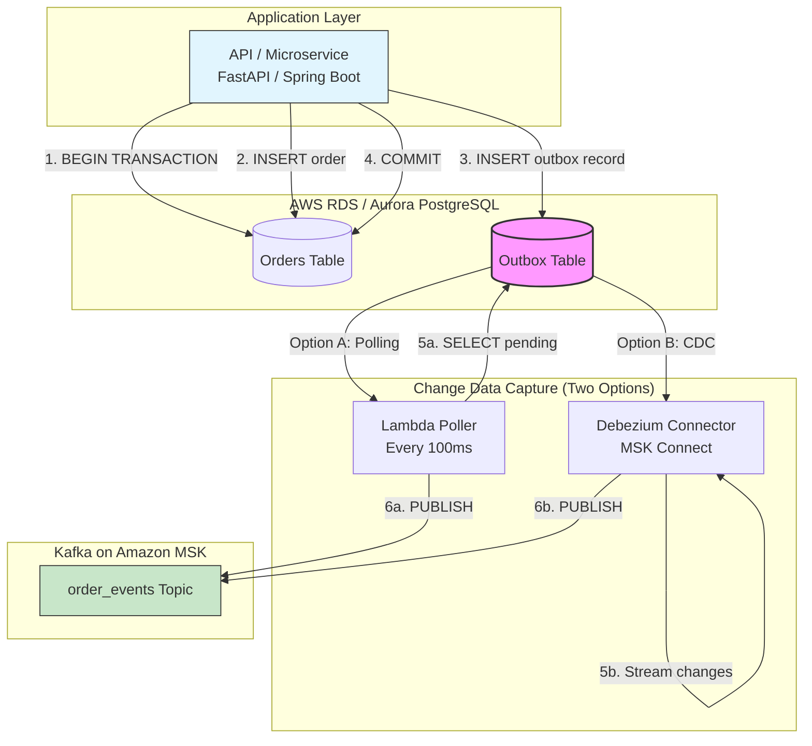
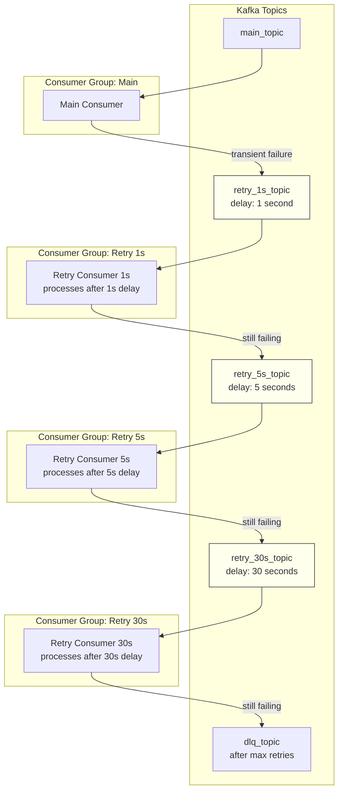

# 11 Kafka Design Patterns — Reliability & Ordering Deep Dive

## Introduction

Welcome back to our Kafka Design Patterns series. In Part 1, we introduced all 11 patterns with diagrams and code snippets — a bird's-eye view of what's possible when you combine Kafka with AWS services like MSK, DynamoDB, RDS, and Lambda.

Now it's time to get serious.

**Reliability** is the foundation of any event-driven system. Without it, your messages get lost, processed twice, or arrive out of order. Your downstream services act on stale data. Your customers get double-charged or never receive their order confirmations. Your operations team spends nights debugging "impossible" inconsistencies between your database and Kafka.

But here's the truth: Kafka itself is reliable. The problem is how we use it. Kafka gives you at-least-once delivery by default — which means duplicates are guaranteed unless you explicitly handle them. Kafka preserves order only within a partition — which means your partition key design directly determines whether your events arrive in the right sequence. Kafka can lose messages if your producer doesn't wait for acknowledgments — but waiting too long kills your latency.

The five patterns in this part solve these specific, painful problems:

- **Transactional Outbox** — How do you write to both your database and Kafka without risking inconsistency? (Spoiler: you don't write to Kafka at all — at least not directly.)
- **Idempotent Consumer** — How do you process the same message twice without sending two emails or charging two credit cards?
- **Partition Key / Ordering** — How do you guarantee that events for the same order arrive in the right sequence, even across service restarts and rebalances?
- **Dead Letter Queue (DLQ)** — What happens when a message is so broken that no amount of retries can fix it?
- **Retry with Backoff** — How do you handle temporary failures (database deadlocks, rate limits, network blips) without overwhelming your system or losing data?

Each pattern includes production-ready code, AWS-specific architecture, and the hard-won lessons from engineers who've debugged these failures at 3 AM.

By the end of this part, you'll be able to build event-driven systems on AWS that survive network failures, consumer crashes, duplicate messages, poison pills, and database outages — without losing a single event.

Let's dive in.

---

*This is Part 2 of the "Kafka Design Patterns for Every Backend Engineer" series.*

📌 **If you haven't read the master story / Part 1, start there for an overview of all 11 patterns with diagrams and code snippets.**

---

## 📚 Story List (with Pattern Coverage)

1. **Kafka Design Patterns — Overview (All 11 Patterns)** — Brief intro, detailed explainer for each pattern, Mermaid diagrams, small code snippets.  
   *Patterns covered: All 11 patterns introduced at high level.*  
   📎 *Read the full story: Part 1*

2. **Reliability & Ordering Patterns** — Deep dive on patterns that ensure message durability, exactly-once processing, failure handling, and strict ordering.  
   *Patterns covered: Transactional Outbox, Idempotent Consumer, Partition Key, Dead Letter Queue (DLQ), Retry with Backoff.*  
   📎 *Read the full story: Part 2 — below*

3. **Data & State Patterns** — Deep dive on patterns that treat Kafka as a source of truth for state management, event replay, and materialized views.  
   *Patterns covered: Event Sourcing, CQRS, Compacted Topic, Event Carried State Transfer.*  
   📎 *Coming soon*

4. **Performance & Integration Patterns** — Deep dive on patterns that handle large messages, real-time joins, and distributed transactions across services.  
   *Patterns covered: Claim Check, Stream-Table Duality, Saga (Choreography).*  
   📎 *Coming soon*

---

## Takeaway from Part 1

In Part 1, we introduced all 11 patterns and learned that:

- **Reliability** in Kafka isn't automatic — you need explicit patterns to handle failures, duplicates, and ordering.
- **At-least-once delivery** is Kafka's default, which means idempotent consumers are a requirement, not an option.
- **The dual-write problem** (DB + Kafka) is one of the most common sources of data loss — the Outbox pattern solves it.
- **Ordering is guaranteed only within a partition** — partition key design directly impacts correctness and scalability.
- **Failures are inevitable** — DLQ and retry patterns separate transient issues from poison pills.

---

## In This Part (Part 2)

We deep-dive into **5 reliability and ordering patterns** that form the backbone of production-ready Kafka systems on AWS. These patterns address the most common causes of data loss, duplicate processing, and system instability in event-driven architectures.

Each pattern includes:
- Full production code (Python & Java)
- AWS-specific implementation (MSK, DynamoDB, RDS, Lambda, SQS)
- Mermaid architecture diagrams
- Common pitfalls and their mitigations
- Monitoring and alerting strategies

---

# 1. Transactional Outbox Pattern (Deep Dive)

## The Problem: Dual-Write Inconsistency

When your application writes to both a database and Kafka in separate steps, you risk inconsistency that can break your entire event-driven architecture. This is known as the **dual-write problem** — one of the most common and dangerous mistakes in event-driven systems.

Consider a typical e-commerce flow: when a customer places an order, you need to both store the order in your PostgreSQL database and publish an `OrderCreated` event to Kafka so that downstream services (payment, inventory, shipping) can react. This seems straightforward — you write to the database, then you write to Kafka. But what happens when these two operations are not atomic?

**Scenario A: Database first, then Kafka**

```python
# DANGEROUS - Database first
db.insert(order)           # Step 1 - succeeds
kafka.send(order_event)    # Step 2 - fails (network timeout, broker down)
# Result: Order in DB, no event -> downstream services never process the order
```

Your database has the order, but the event never reaches Kafka. The payment service never charges the customer. The inventory service never reserves the items. The shipping service never prepares the package. The order becomes a **ghost** — visible in your system but invisible to the rest of your architecture. Your customer sees "Order Confirmed" on your website, but nothing happens. Days later, they call support wondering where their order is.

**Scenario B: Kafka first, then database**

```python
# DANGEROUS - Kafka first
kafka.send(order_event)    # Step 1 - succeeds
db.insert(order)           # Step 2 - fails (constraint violation, deadlock)
# Result: Event in Kafka, no order -> downstream services process phantom order
```

You've published an event for an order that doesn't actually exist. Downstream services might charge the customer's credit card, reserve inventory, and trigger shipping — all for a phantom order. When the database insert fails, you have no order record, but the payment is already processed. Your customer is charged for nothing. Your inventory is reserved for nothing. You now need a reconciliation process to detect and reverse these phantom transactions.

**Scenario C: Retry logic makes it worse**

You might think, "I'll just add retry logic!" But retries introduce new problems:

```python
# Even with retries, still dangerous
for attempt in range(3):
    try:
        db.insert(order)
        kafka.send(order_event)
        break
    except:
        continue
```

If the database insert succeeds but Kafka send fails and then succeeds on retry, you might send the event twice. If the database insert fails on the first attempt but succeeds on the second, your retry counter is wrong. You cannot atomically coordinate two independent systems without a distributed transaction.

**Why this matters in production**

The dual-write problem is not theoretical. It causes real incidents:

- **A major ride-sharing company** once had a bug where driver location updates were written to Kafka before the database. When the database was slow, events were published for drivers whose location hadn't actually been saved. ETA calculations were wrong for millions of rides.

- **A financial services company** lost thousands of transactions because their application wrote to the database, then to Kafka. During a Kafka broker failure, the application threw an exception and didn't commit the database transaction — but the database connection had auto-commit enabled, so the data was already written. The result: customer deposits in the database with no corresponding events, breaking their audit trail.

- **An e-commerce platform** double-charged customers during a network partition because their retry logic caused the same event to be published twice while the database insert succeeded once.

## The Solution: Transactional Outbox

The **Transactional Outbox pattern** solves the dual-write problem by eliminating the second write entirely — at least from the application's critical path. Instead of writing directly to Kafka, your application writes to an **outbox table** in the same database transaction as your business data. A separate, asynchronous process then reads from this outbox table and publishes the events to Kafka.

This approach guarantees that either both the business data and the outbox record are saved, or neither is — because they share a single database transaction. Once the outbox record is committed to the database, you can be confident that the event will eventually be published to Kafka, even if the publisher process crashes or the network fails. The publisher can simply resume from where it left off.

### Why This Works

The key insight is that your database is a reliable, durable store with ACID guarantees. By writing events to the outbox table within the same transaction as your business data, you gain the database's atomicity, consistency, isolation, and durability. The outbox table acts as a **buffer** or **queue** that survives application crashes and network failures.

Think of it this way: Instead of trying to coordinate two systems (database and Kafka), you coordinate only with your database — which you already trust. The database guarantees that either both the order and the outbox record exist, or neither does. The outbox publisher is a separate concern that can be restarted, scaled, or fixed without affecting your main application logic.

The outbox publisher can be as simple as a polling loop or as sophisticated as a Change Data Capture (CDC) connector — but in all cases, it can retry indefinitely until each event is successfully delivered to Kafka. Because the outbox record persists in the database, the publisher never loses track of undelivered events.

### Architecture on AWS



### Detailed Walkthrough of the Flow

Let me walk through what happens when a customer places an order, step by step:

**Step 1: Application begins a database transaction**

Your application opens a transaction on your RDS or Aurora database. This transaction will either commit completely or roll back completely — there is no partial state.

**Step 2: Application inserts business data**

Inside the transaction, you insert the order record into the `orders` table. This is your core business data — the order ID, customer ID, amount, items, shipping address, etc.

**Step 3: Application inserts an outbox record**

Still inside the same transaction, you insert a record into the `outbox` table. This record contains everything needed to publish the Kafka event: the event type (`OrderCreated`), the aggregate ID (the order ID), the payload (the full event data as JSON), and metadata like creation timestamp.

**Step 4: Application commits the transaction**

You commit the transaction. At this moment, both the order and the outbox record become visible in the database. Because they were in the same transaction, they are guaranteed to be consistent — you never have an order without an outbox record, and you never have an outbox record without an order.

**Step 5: Outbox publisher detects new records**

Now the asynchronous part begins. Your outbox publisher — whether a polling Lambda, a Debezium connector, or a custom service — detects the new outbox record. With polling, it runs a `SELECT` query every 100 milliseconds. With Debezium, it receives a CDC event as soon as the record is committed.

**Step 6: Outbox publisher sends to Kafka**

The publisher takes the outbox record, formats it as a Kafka message (using the event type to determine the topic, the aggregate ID as the key, and the payload as the value), and sends it to your MSK cluster. If the send fails, the publisher retries — because the outbox record is still in the database marked as unpublished.

**Step 7: Outbox publisher marks as published**

Once Kafka acknowledges the message (with `acks=all` for durability), the publisher updates the outbox record to mark it as published. With polling, this is an `UPDATE` query. With Debezium, this happens automatically through the outbox router transformation.

**Step 8: Downstream consumers process the event**

Finally, your downstream services — payment, inventory, shipping — consume the event from the `order_events` topic and do their work. They never know that the event came through an outbox; they just see a normal Kafka message.

### Implementation Options on AWS

You have three main implementation options for the outbox publisher, each with different trade-offs in complexity, latency, and operational overhead.

**Option 1: Polling with AWS Lambda (Simplest, Best for Low to Medium Volume)**

A Lambda function runs on a schedule (e.g., every 100 milliseconds) or continuously via a loop. It queries the outbox table for unpublished records, publishes them to Kafka, and marks them as published.

*Pros:* Simple to implement, easy to debug, no extra infrastructure, works with any database.

*Cons:* Polling introduces latency (up to your polling interval), database load from repeated queries, and you need to handle concurrency if multiple pollers run simultaneously.

*Best for:* Systems with less than 1,000 events per second where sub-second latency isn't critical.

**Option 2: Debezium with MSK Connect (Best for High Volume, Production Grade)**

Debezium is a CDC platform that captures row-level changes from your database and streams them to Kafka. When configured with the outbox event router, it automatically detects inserts into the outbox table and publishes them to the appropriate Kafka topic.

*Pros:* Near-zero latency (milliseconds), minimal database impact (reads from replication log, not the table), exactly-once semantics, handles schema evolution, scales horizontally.

*Cons:* More complex to configure, requires Debezium knowledge, adds operational overhead, only works with databases that have CDC support (PostgreSQL, MySQL, Oracle, SQL Server).

*Best for:* Production systems with high throughput (thousands of events per second) where low latency is critical.

**Option 3: PostgreSQL LISTEN/NOTIFY (Medium Volume, PostgreSQL Only)**

PostgreSQL's `LISTEN` and `NOTIFY` feature allows your application to receive asynchronous notifications when new rows are inserted. A long-running service can listen for outbox insert notifications and publish immediately.

*Pros:* No polling, low latency (milliseconds), simple implementation, no extra infrastructure beyond PostgreSQL.

*Cons:* PostgreSQL-specific, notifications are not persisted (if your consumer crashes, you miss notifications), you still need a fallback poller for missed notifications.

*Best for:* PostgreSQL-based systems with medium volume (up to 500 events per second) where you want low latency without Debezium complexity.

### Complete Implementation: Debezium + MSK Connect (Production Grade)

Let me show you a complete, production-ready implementation using Debezium on MSK Connect. This is the approach I recommend for most serious production systems.

**Step 1: Create the outbox table in PostgreSQL**

```sql
-- Run this on your RDS or Aurora PostgreSQL instance
CREATE TABLE outbox (
    id UUID PRIMARY KEY DEFAULT gen_random_uuid(),
    aggregate_id VARCHAR(255) NOT NULL,
    aggregate_type VARCHAR(100) NOT NULL,
    event_type VARCHAR(100) NOT NULL,
    payload JSONB NOT NULL,
    created_at TIMESTAMP WITH TIME ZONE DEFAULT NOW(),
    published_at TIMESTAMP WITH TIME ZONE NULL,
    published BOOLEAN DEFAULT FALSE
);

-- Create an index for efficient polling (if you fall back to polling)
CREATE INDEX idx_outbox_unpublished ON outbox(published, created_at) 
WHERE published = FALSE;

-- Create an index for Debezium's ordering requirements
CREATE INDEX idx_outbox_id ON outbox(id ASC);
```

The `payload` column uses `JSONB` (binary JSON) for efficient storage and querying. The `published` flag allows you to track which records have been sent to Kafka. The `aggregate_id` and `aggregate_type` fields help Debezium route messages to the correct topics.

**Step 2: Application writes to outbox (Python FastAPI example)**

Now, let's implement the application side. Notice that the application never calls `kafka.send()` directly. It only writes to the database.

```python
from sqlalchemy import create_engine, Column, String, Boolean, DateTime, JSON
from sqlalchemy.ext.declarative import declarative_base
from sqlalchemy.orm import Session
import uuid
from datetime import datetime
import json

Base = declarative_base()

class OutboxRecord(Base):
    __tablename__ = "outbox"
    id = Column(String, primary_key=True, default=lambda: str(uuid.uuid4()))
    aggregate_id = Column(String, nullable=False)
    aggregate_type = Column(String, nullable=False)
    event_type = Column(String, nullable=False)
    payload = Column(JSON, nullable=False)
    created_at = Column(DateTime, default=datetime.utcnow)
    published = Column(Boolean, default=False)

class Order(Base):
    __tablename__ = "orders"
    id = Column(String, primary_key=True)
    customer_id = Column(String, nullable=False)
    amount = Column(Integer, nullable=False)
    status = Column(String, default="pending")
    created_at = Column(DateTime, default=datetime.utcnow)

# In your FastAPI endpoint or business logic
def create_order(order_data: dict):
    """
    Create an order and write to outbox in the same transaction.
    This function guarantees that either both succeed or both fail.
    """
    with Session(engine) as session:
        # Begin transaction automatically
        
        # 1. Insert business data
        order_id = str(uuid.uuid4())
        order = Order(
            id=order_id,
            customer_id=order_data['customer_id'],
            amount=order_data['amount']
        )
        session.add(order)
        
        # 2. Insert outbox record
        outbox = OutboxRecord(
            aggregate_id=order_id,
            aggregate_type="order",
            event_type="OrderCreated",
            payload={
                "order_id": order_id,
                "customer_id": order_data['customer_id'],
                "amount": order_data['amount'],
                "items": order_data.get('items', []),
                "shipping_address": order_data.get('shipping_address'),
                "created_at": datetime.utcnow().isoformat()
            }
        )
        session.add(outbox)
        
        # 3. Commit transaction - both records saved atomically
        session.commit()
        
    return {"order_id": order_id, "status": "created"}
```

Notice that the application never calls `producer.send()`. It only writes to the database. This means the application's critical path is fast and reliable — no network calls to Kafka, no retry logic, no handling of broker failures. The database transaction either succeeds or fails, and you know exactly what happened.

**Step 3: Deploy Debezium connector on MSK Connect**

Now, let's configure Debezium to capture changes from the outbox table and publish them to Kafka. This configuration uses the outbox event router transformation, which is specifically designed for this pattern.

```json
{
  "name": "postgres-outbox-connector",
  "config": {
    "connector.class": "io.debezium.connector.postgresql.PostgresConnector",
    "database.hostname": "my-rds-instance.aws.com",
    "database.port": "5432",
    "database.user": "debezium",
    "database.password": "${secret:debezium-password}",
    "database.dbname": "ordersdb",
    "database.server.id": "184054",
    "database.server.name": "ordersdb",
    "topic.prefix": "dbserver1",
    
    "table.include.list": "public.outbox",
    "plugin.name": "pgoutput",
    
    "transforms": "outbox",
    "transforms.outbox.type": "io.debezium.transforms.outbox.EventRouter",
    "transforms.outbox.table.fields.additional.placement": "aggregate_id:header,event_type:header",
    "transforms.outbox.route.by.field": "aggregate_type",
    "transforms.outbox.route.topic.replacement": "${routedByValue}_events",
    "transforms.outbox.table.field.event.id": "id",
    "transforms.outbox.table.field.event.key": "aggregate_id",
    "transforms.outbox.table.field.event.payload": "payload",
    "transforms.outbox.table.field.event.timestamp": "created_at"
  }
}
```

Let me explain what each part does:

- `table.include.list: "public.outbox"` tells Debezium to only capture changes to the outbox table.
- The `transforms.outbox` section enables the outbox event router, which takes each outbox record and converts it into a Kafka message.
- `route.by.field: "aggregate_type"` tells Debezium to use the `aggregate_type` column (e.g., "order") to determine the topic name.
- `route.topic.replacement: "${routedByValue}_events"` means an `aggregate_type` of "order" becomes the topic `order_events`.
- The `table.field.event.*` mappings tell Debezium which columns contain the event ID, key, payload, and timestamp.

**Step 4: Consumer reads from Kafka normally**

The consumer doesn't need to know about the outbox pattern. It just reads from the `order_events` topic as usual.

```python
@KafkaListener(topics="order_events")
def handle_order_created(event):
    """
    This consumer doesn't know or care that the event came from an outbox.
    It just processes the event as normal.
    """
    order_id = event['order_id']
    customer_id = event['customer_id']
    amount = event['amount']
    
    # Process the order - charge payment, reserve inventory, etc.
    payment_service.charge(customer_id, amount)
    inventory_service.reserve(order_id, event['items'])
    notification_service.send_confirmation(customer_id, order_id)
```

### Fallback: Polling with Lambda (Simpler Alternative)

If you don't want to use Debezium, here's a polling-based implementation using Lambda:

```python
import boto3
from kafka import KafkaProducer
import json
import os

def lambda_handler(event, context):
    """
    Lambda function that runs every 100ms to poll the outbox table
    and publish events to Kafka.
    """
    rds_client = boto3.client('rds-data')
    kafka_producer = KafkaProducer(
        bootstrap_servers=os.environ['MSK_BROKERS'],
        value_serializer=lambda v: json.dumps(v).encode('utf-8')
    )
    
    # Fetch unpublished records
    response = rds_client.execute_statement(
        resourceArn=os.environ['RDS_ARN'],
        secretArn=os.environ['SECRET_ARN'],
        database='ordersdb',
        sql="""
            SELECT id, aggregate_type, event_type, payload 
            FROM outbox 
            WHERE published = FALSE 
            ORDER BY created_at ASC 
            LIMIT 100
        """
    )
    
    for record in response['records']:
        record_id = record[0]['stringValue']
        aggregate_type = record[1]['stringValue']
        event_type = record[2]['stringValue']
        payload = json.loads(record[3]['stringValue'])
        
        # Determine topic name
        topic = f"{aggregate_type}_events"
        
        # Send to Kafka
        future = kafka_producer.send(topic, key=payload['id'].encode(), value=payload)
        future.get(timeout=10)  # Wait for acknowledgment
        
        # Mark as published
        rds_client.execute_statement(
            resourceArn=os.environ['RDS_ARN'],
            secretArn=os.environ['SECRET_ARN'],
            database='ordersdb',
            sql="UPDATE outbox SET published = TRUE, published_at = NOW() WHERE id = :id",
            parameters=[{'name': 'id', 'value': {'stringValue': record_id}}]
        )
    
    return {"processed": len(response['records'])}
```

### Common Pitfalls and Their Mitigations

**Pitfall 1: Outbox table grows forever**

If you never clean up published records, your outbox table will grow indefinitely, slowing down queries and increasing storage costs.

*Mitigation:* Set up a scheduled job (another Lambda) to delete records older than, say, 7 days. Or partition the outbox table by date and drop old partitions.

```sql
-- Delete records published more than 7 days ago
DELETE FROM outbox 
WHERE published = TRUE 
AND published_at < NOW() - INTERVAL '7 days';
```

**Pitfall 2: Duplicate publications (at-least-once delivery from Debezium)**

Debezium, like Kafka, provides at-least-once delivery. In rare failure scenarios, the same outbox record might be published twice.

*Mitigation:* Make your consumer idempotent (see the next pattern). The outbox pattern eliminates the dual-write problem but doesn't eliminate the need for idempotent consumers.

**Pitfall 3: Debezium falls behind under high load**

If your database generates outbox records faster than Debezium can process them, the connector will lag, increasing event latency.

*Mitigation:* Monitor Debezium's lag metrics. Scale the connector by increasing `tasks.max` (but note that outbox routing requires a single task). Consider sharding your outbox table across multiple connectors using a modulo on the ID.

**Pitfall 4: Schema changes to outbox payload**

When you change the structure of your event payload, you might break consumers that expect the old schema.

*Mitigation:* Use AWS Glue Schema Registry with compatibility modes. Set compatibility to `BACKWARD` so new schemas can read old data, or `FORWARD` so old consumers can read new data (if you add optional fields).

### Monitoring the Outbox Pattern

You need to monitor three critical metrics to ensure your outbox is healthy:

```python
def emit_outbox_metrics():
    """
    Send metrics to CloudWatch to monitor outbox health.
    """
    # Metric 1: Outbox lag (number of unpublished records)
    lag = db.query("SELECT COUNT(*) FROM outbox WHERE published = FALSE")
    put_metric("OutboxLag", lag, Unit="Count")
    
    # Metric 2: Outbox age (oldest unpublished record)
    oldest = db.query("SELECT MIN(created_at) FROM outbox WHERE published = FALSE")
    age_seconds = (datetime.utcnow() - oldest).total_seconds()
    put_metric("OutboxMaxAgeSeconds", age_seconds, Unit="Seconds")
    
    # Metric 3: Debezium connector lag (if using Debezium)
    if using_debezium:
        lag_millis = get_debezium_lag_ms()
        put_metric("DebeziumLagMs", lag_millis, Unit="Milliseconds")
    
    # Alert if lag > 1000 records or age > 60 seconds
    if lag > 1000:
        send_alert(f"Outbox backlog: {lag} unpublished records")
    if age_seconds > 60:
        send_alert(f"Outbox has records older than {age_seconds}s")
```

**CloudWatch Alarm configuration:**

| Alarm | Condition | Action |
|-------|-----------|--------|
| OutboxLagHigh | > 10,000 records for 5 minutes | Page on-call engineer |
| OutboxAgeHigh | > 300 seconds | Page on-call engineer |
| DebeziumConnectorDown | Connector status = FAILED | Page on-call engineer |

---

# 2. Idempotent Consumer Pattern (Deep Dive)

## The Problem: Duplicate Messages

Kafka guarantees **at-least-once delivery** by default. This is a feature, not a bug — it ensures that no message is lost, even if consumers crash or networks fail. But it comes with a cost: the same message may be delivered multiple times.

Let me explain why duplicates happen. When a consumer reads a message from Kafka, it has two choices:

1. **Process the message, then commit the offset** — If the consumer crashes after processing but before committing, the message will be delivered again when the consumer restarts.
2. **Commit the offset, then process the message** — If the consumer crashes after committing but before processing, the message is lost forever.

Kafka's design chooses the first approach: commit after processing. This means duplicates are possible, but data loss is not. For most systems, duplicates are preferable to data loss — but only if your consumer can handle them.

Here are the most common scenarios that cause duplicates in real systems:

**Scenario 1: Consumer rebalance during processing**

Your consumer group has three consumers. One consumer receives a batch of messages and starts processing. While processing, a network glitch causes the consumer to miss its heartbeat. The group coordinator marks it as dead and reassigns its partitions to other consumers. The original consumer finishes processing and tries to commit — but it no longer owns the partitions. The new consumers start from the last committed offset, which was before the batch. All messages in that batch are processed again.

**Scenario 2: Producer retries**

Your producer sends a message with `retries=3`. The first attempt succeeds, but the acknowledgment is lost due to a network timeout. The producer retries and sends the same message again. Both attempts succeed. Kafka now has two identical messages with different offsets.

**Scenario 3: Consumer crash after processing but before commit**

Your consumer processes a message, updates your database, and then crashes before committing the offset. When it restarts, it reads the same message again and processes it again. Your database now has duplicate records.

**The impact of duplicates**

Without idempotency, duplicates can cause serious problems:

- **Financial systems:** Double-charging a customer's credit card
- **Communication systems:** Sending two welcome emails or two SMS notifications
- **Inventory systems:** Reducing stock twice for a single order
- **Analytics systems:** Double-counting page views or conversions
- **Audit systems:** Creating duplicate log entries that break forensic analysis

## The Solution: Idempotent Consumer

An **idempotent consumer** is a consumer that can safely process the same message multiple times without causing duplicate side effects. The key insight is that idempotency is not about preventing duplicates — it's about making duplicates harmless.

Idempotency has a formal definition: an operation is idempotent if performing it once has the same effect as performing it multiple times. For example, setting a value to `x` is idempotent — setting it to `x` once, twice, or ten times yields the same result. But incrementing a counter is not idempotent — incrementing twice gives a different result than incrementing once.

The pattern works by tracking which messages have already been processed. When a message arrives, the consumer checks a **deduplication store** to see if this message (identified by a unique key) has been processed before. If yes, the consumer skips processing. If no, the consumer processes the message and stores the key in the deduplication store before committing the offset.

### Why This Works

The deduplication store provides the "memory" that Kafka lacks. Kafka remembers which offsets have been committed, but it doesn't remember which messages have been processed — because processing is your application's responsibility. By maintaining an external store of processed message IDs, you create a system that is resilient to duplicates from any source: rebalances, retries, crashes, or even manual replays.

The store needs to be:
- **Atomic:** The check-and-set operation must be atomic to prevent race conditions where two consumers process the same message simultaneously.
- **Durable:** The store must survive consumer crashes.
- **Fast:** The store should have low latency (microseconds to milliseconds) so it doesn't become a bottleneck.
- **Self-cleaning:** Old entries should expire automatically to prevent unlimited growth.

### Architecture on AWS

```mermaid
graph LR
    subgraph "Kafka Consumer"
        M[Message<br/>key=order_123<br/>offset=42<br/>partition=0]
    end
    
    subgraph "Idempotency Store"
        D[(DynamoDB Table<br/>pk: order_123:0:42<br/>ttl: 7 days)]
    end
    
    subgraph "Business Logic"
        B[Process order]
        C[Charge credit card]
        E[Send confirmation]
    end
    
    subgraph "AWS Services"
        CW[CloudWatch Metrics]
        SN[SNS Alert]
    end
    
    M -->|1. Extract key| D
    D -->|2. Conditional PUT| D
    D -->|3a. Success (first time)| B
    D -->|3b. Failure (duplicate)| Skip[Skip processing]
    
    B -->|4. Execute| C
    C -->|5. Commit offset| M
    C -->|6. Emit metrics| CW
    
    Skip -->|6. Emit duplicate metric| CW
    CW -->|7. Alert if high duplicate rate| SN
    
    style D fill:#ffd,stroke:#333,stroke-width:2px
```

### Complete Implementation: DynamoDB-Based Idempotency (Production Grade)

**Why DynamoDB?** DynamoDB is ideal for idempotency stores because:
- It supports conditional writes (`attribute_not_exists`), which provide atomic check-and-set.
- It has built-in TTL (Time To Live) for automatic cleanup of old entries.
- It scales infinitely with on-demand billing — no capacity planning needed.
- It offers single-digit millisecond latency at any scale.

**Step 1: Create the DynamoDB table**

```hcl
# Terraform configuration
resource "aws_dynamodb_table" "kafka_idempotency" {
  name         = "kafka_idempotency"
  billing_mode = "PAY_PER_REQUEST"  # No capacity planning needed
  hash_key     = "pk"
  
  attribute {
    name = "pk"
    type = "S"
  }
  
  ttl {
    attribute_name = "ttl"
    enabled        = true
  }
  
  point_in_time_recovery {
    enabled = true
  }
  
  tags = {
    Name        = "kafka-idempotency-store"
    Environment = "production"
    Purpose     = "Kafka consumer idempotency"
  }
}
```

**Step 2: Complete Python implementation**

```python
import boto3
from botocore.exceptions import ClientError
from time import time
import hashlib
import logging
from typing import Dict, Any, Callable
from dataclasses import dataclass
from datetime import datetime, timedelta

logger = logging.getLogger(__name__)

@dataclass
class MessageContext:
    """Context about a Kafka message used for idempotency"""
    topic: str
    partition: int
    offset: int
    key: str
    timestamp: int

class IdempotentConsumer:
    """
    A Kafka consumer wrapper that provides idempotent processing using DynamoDB.
    
    This class ensures that each message is processed exactly once, even if
    Kafka delivers it multiple times due to rebalances, retries, or crashes.
    """
    
    def __init__(self, dynamodb_table_name: str, ttl_days: int = 7):
        """
        Initialize the idempotent consumer.
        
        Args:
            dynamodb_table_name: Name of the DynamoDB table for deduplication
            ttl_days: Number of days to keep idempotency records (default 7)
        """
        self.dynamodb = boto3.resource('dynamodb')
        self.table = self.dynamodb.Table(dynamodb_table_name)
        self.ttl_seconds = ttl_days * 86400
        self.stats = {
            'processed': 0,
            'duplicates': 0,
            'errors': 0
        }
    
    def _make_key(self, ctx: MessageContext) -> str:
        """
        Create a unique, deterministic key for a message.
        
        The key includes topic, partition, and offset because these three
        values together uniquely identify a message in Kafka. We don't use
        the message content because the same content could appear at
        different offsets legitimately.
        
        We hash the raw key to ensure it fits within DynamoDB's 2048-byte
        limit for partition keys and to avoid any special characters.
        """
        raw = f"{ctx.topic}:{ctx.partition}:{ctx.offset}"
        return hashlib.sha256(raw.encode()).hexdigest()
    
    def _store_idempotency_marker(self, key: str, metadata: Dict[str, Any]) -> bool:
        """
        Attempt to store an idempotency marker.
        
        Returns True if the marker was stored (first time processing),
        False if the marker already existed (duplicate).
        
        The conditional check `attribute_not_exists(pk)` ensures that only
        one consumer can successfully store the marker, even if multiple
        consumers receive the same message simultaneously.
        """
        try:
            self.table.put_item(
                Item={
                    'pk': key,
                    'ttl': int(time() + self.ttl_seconds),
                    'processed_at': time(),
                    'processed_at_iso': datetime.utcnow().isoformat(),
                    **metadata
                },
                ConditionExpression='attribute_not_exists(pk)'
            )
            return True  # First time - marker stored successfully
        except ClientError as e:
            if e.response['Error']['Code'] == 'ConditionalCheckFailedException':
                return False  # Duplicate - marker already exists
            raise  # Unexpected error - re-raise
    
    def process(self, ctx: MessageContext, business_logic: Callable) -> bool:
        """
        Process a message idempotently.
        
        Args:
            ctx: Message context (topic, partition, offset, key, timestamp)
            business_logic: Function that performs the actual processing
        
        Returns:
            True if the message was processed (or was a duplicate), False on error
        """
        key = self._make_key(ctx)
        
        # Store metadata about the message for debugging
        metadata = {
            'topic': ctx.topic,
            'partition': ctx.partition,
            'offset': ctx.offset,
            'message_key': ctx.key,
            'message_timestamp': ctx.timestamp
        }
        
        try:
            # Try to store the idempotency marker
            is_first_time = self._store_idempotency_marker(key, metadata)
            
            if not is_first_time:
                # This is a duplicate - skip processing
                self.stats['duplicates'] += 1
                logger.info(f"Duplicate message detected: {ctx.topic}:{ctx.partition}:{ctx.offset}")
                self._emit_metric('DuplicateMessage', 1)
                return True
            
            # First time - execute business logic
            logger.info(f"Processing message: {ctx.topic}:{ctx.partition}:{ctx.offset}")
            business_logic(ctx)
            
            self.stats['processed'] += 1
            self._emit_metric('MessageProcessed', 1)
            return True
            
        except Exception as e:
            self.stats['errors'] += 1
            logger.error(f"Error processing message {key}: {e}", exc_info=True)
            self._emit_metric('ProcessingError', 1)
            
            # IMPORTANT: We do NOT delete the idempotency marker on error.
            # The message will be retried by Kafka (since we haven't committed
            # the offset), and we'll try again. The marker prevents double
            # processing if the first attempt partially succeeded.
            raise
    
    def _emit_metric(self, metric_name: str, value: int):
        """Emit a metric to CloudWatch"""
        # In production, use boto3.client('cloudwatch').put_metric_data()
        logger.debug(f"Metric: {metric_name}={value}")
    
    def get_stats(self) -> Dict[str, int]:
        """Return current processing statistics"""
        return self.stats.copy()

# Usage example
def process_order(ctx: MessageContext):
    """
    Business logic that must be idempotent.
    
    Even though this function is only called once per message thanks to
    the idempotency wrapper, the business logic should still be designed
    to be idempotent where possible as a second line of defense.
    """
    # ctx contains the message value (you'd deserialize it)
    order = ctx.value  # Assume this is deserialized
    
    # These operations are idempotent because they check existence:
    if not payment_already_charged(order['order_id']):
        charge_credit_card(order['customer_id'], order['amount'])
    
    if not confirmation_sent(order['order_id']):
        send_confirmation_email(order['customer_email'], order['order_id'])
    
    # This is idempotent because it's a SET operation:
    update_order_status(order['order_id'], 'confirmed')

# In your Kafka consumer loop
consumer = IdempotentConsumer(dynamodb_table_name='kafka_idempotency', ttl_days=7)

for msg in kafka_consumer:
    ctx = MessageContext(
        topic=msg.topic,
        partition=msg.partition,
        offset=msg.offset,
        key=msg.key.decode() if msg.key else None,
        timestamp=msg.timestamp,
        value=json.loads(msg.value.decode())
    )
    
    try:
        consumer.process(ctx, process_order)
        kafka_consumer.commit()  # Commit only after successful idempotent processing
    except Exception:
        # Don't commit - Kafka will redeliver
        continue
```

**Step 3: Java implementation (Spring Kafka + DynamoDB)**

For Java developers, here's a Spring-based implementation:

```java
@Component
public class IdempotentKafkaConsumer {
    
    @Autowired
    private DynamoDbAsyncClient dynamoDbClient;
    
    private final String TABLE_NAME = "kafka_idempotency";
    private final int TTL_DAYS = 7;
    
    @KafkaListener(topics = "order_events", concurrency = "3")
    public void consume(ConsumerRecord<String, String> record, Acknowledgment ack) {
        String key = makeKey(record.topic(), record.partition(), record.offset());
        
        // Conditional put - only succeeds if key doesn't exist
        PutItemRequest request = PutItemRequest.builder()
            .tableName(TABLE_NAME)
            .item(Map.of(
                "pk", AttributeValue.builder().s(key).build(),
                "ttl", AttributeValue.builder().n(String.valueOf(Instant.now().getEpochSecond() + TTL_DAYS * 86400)).build(),
                "processed_at", AttributeValue.builder().n(String.valueOf(Instant.now().toEpochMilli())).build()
            ))
            .conditionExpression("attribute_not_exists(pk)")
            .build();
        
        try {
            dynamoDbClient.putItem(request).join();  // Blocking for simplicity
            // First time - process
            processOrder(record.value());
            ack.acknowledge();
            log.info("Processed message: {}", key);
        } catch (ConditionalCheckFailedException e) {
            // Duplicate - skip
            log.info("Duplicate message detected: {}", key);
            ack.acknowledge();  // Still acknowledge to move forward
        }
    }
    
    private String makeKey(String topic, int partition, long offset) {
        String raw = topic + ":" + partition + ":" + offset;
        return DigestUtils.sha256Hex(raw);
    }
}
```

### Alternative: Redis-Based Idempotency (Higher Throughput)

For extremely high throughput (tens of thousands of messages per second), Redis ElastiCache can provide lower latency than DynamoDB:

```python
import redis
import json

class RedisIdempotentConsumer:
    def __init__(self, redis_url: str, ttl_seconds: int = 604800):
        self.redis = redis.Redis.from_url(redis_url)
        self.ttl = ttl_seconds
    
    def process(self, msg, business_logic):
        key = f"idempotent:{msg.topic}:{msg.partition}:{msg.offset}"
        
        # SETNX = SET if Not eXists (atomic)
        if self.redis.setnx(key, json.dumps({
            'processed_at': time(),
            'topic': msg.topic,
            'partition': msg.partition,
            'offset': msg.offset
        })):
            self.redis.expire(key, self.ttl)
            business_logic(msg.value)
            return True
        else:
            # Duplicate
            return False
```

**When to use Redis vs DynamoDB:**

| Characteristic | DynamoDB | Redis |
|----------------|----------|-------|
| **Latency** | Single-digit milliseconds | Sub-millisecond |
| **Throughput** | Unlimited (on-demand) | Limited by instance size |
| **Persistence** | Durable by default | Optional (snapshots/AOF) |
| **TTL** | Native | Native |
| **Operational overhead** | Serverless | Managed ElastiCache |
| **Best for** | Up to 10k msg/sec | 10k-100k+ msg/sec |

### Common Pitfalls and Their Mitigations

**Pitfall 1: Idempotency store grows forever**

If you never clean up old idempotency records, your store will grow indefinitely, increasing costs and reducing performance.

*Mitigation:* Use DynamoDB TTL or Redis TTL to automatically expire records after your replay window. A common TTL is 7 days — long enough to cover any possible replay scenario (e.g., restoring from a 5-day-old backup).

**Pitfall 2: Key collisions across different topics**

If two different topics have the same partition and offset numbers, your key could collide.

*Mitigation:* Include the topic name in the key. The implementation above uses `f"{topic}:{partition}:{offset}"`, which guarantees uniqueness across topics.

**Pitfall 3: Race conditions with multiple consumers**

If two consumer instances receive the same message simultaneously (possible during rebalancing), both could check the store, see no record, and both attempt to process.

*Mitigation:* Use conditional writes. DynamoDB's `attribute_not_exists(pk)` ensures that only one consumer can successfully write the marker. The other consumer's write fails, and it sees that the message is already being processed.

**Pitfall 4: Partial failures**

What if your business logic partially succeeds (e.g., sends an email but crashes before updating the database)? The idempotency marker is already written, so the message won't be retried.

*Mitigation:* Write the idempotency marker **after** successful processing, not before. But this reintroduces the duplicate risk. The better approach is to make your business logic transactional or idempotent at the business level. For example, use database `INSERT IGNORE` or check for existing records before creating them.

**Pitfall 5: High duplicate rate as a symptom**

A high duplicate rate (e.g., >5% of messages) often indicates a problem with your consumer: frequent rebalancing, slow processing causing timeouts, or network issues.

*Mitigation:* Monitor the duplicate rate in CloudWatch. If it exceeds a threshold, investigate the root cause. The idempotency pattern makes duplicates harmless, but they still indicate inefficiency.

### Monitoring Idempotent Consumers

```python
def emit_idempotency_metrics(consumer: IdempotentConsumer):
    """Send metrics to CloudWatch every minute"""
    stats = consumer.get_stats()
    
    total = stats['processed'] + stats['duplicates']
    duplicate_rate = stats['duplicates'] / total if total > 0 else 0
    
    put_metric('MessagesProcessed', stats['processed'])
    put_metric('DuplicateMessages', stats['duplicates'])
    put_metric('DuplicateRate', duplicate_rate)
    put_metric('ProcessingErrors', stats['errors'])
    
    # Alert if duplicate rate exceeds 5%
    if duplicate_rate > 0.05:
        send_alert(f"High duplicate rate: {duplicate_rate:.2%}")
    
    # Alert if error rate exceeds 1%
    error_rate = stats['errors'] / total if total > 0 else 0
    if error_rate > 0.01:
        send_alert(f"High error rate: {error_rate:.2%}")
```

---

# 3. Partition Key / Ordering Pattern (Deep Dive)

## The Problem: Event Ordering

Kafka makes a fundamental guarantee: **within a single partition, messages are stored and delivered in the order they were sent.** But this guarantee comes with a critical limitation: **across different partitions, Kafka provides no ordering guarantees whatsoever.**

This means if related events end up in different partitions, they can be processed out of order. For many business processes, out-of-order events lead to incorrect state and broken business logic.

Consider an e-commerce order with these events:

1. `OrderCreated` — customer places an order
2. `PaymentProcessed` — payment succeeds
3. `OrderShipped` — order is shipped
4. `OrderDelivered` — customer receives order

If `OrderShipped` is processed before `PaymentProcessed`, your system might try to ship an order that hasn't been paid for. If `OrderCreated` arrives after `OrderShipped`, your system doesn't even know the order exists when the shipping request comes in.

**Why does Kafka work this way?** Partitioning is Kafka's primary mechanism for parallelism. By splitting a topic across multiple partitions, Kafka allows multiple consumers to read simultaneously. Each partition can be consumed by one consumer in a consumer group, so with 10 partitions, you can have up to 10 consumers reading in parallel. But parallelism comes at the cost of cross-partition ordering.

## The Solution: Partition Key

The **Partition Key pattern** ensures that all related events go to the same partition, preserving their order. When a producer sends a message with a key, Kafka hashes the key and uses the result to determine which partition the message goes to. Messages with the same key always hash to the same partition (as long as the number of partitions doesn't change).

### How Partitioning Works Under the Hood

When you send a message with a key, Kafka's partitioner does this:

1. Serializes the key into a byte array
2. Computes a hash using the **murmur2** algorithm (Kafka's default)
3. Takes the absolute value of the hash
4. Computes `hash % number_of_partitions`
5. Sends the message to that partition index

This is deterministic: the same key always produces the same partition number, assuming the partition count hasn't changed.

```python
# Pseudocode of Kafka's partitioner
def compute_partition(key_bytes, num_partitions):
    hash_value = murmur2(key_bytes)  # 32-bit integer
    positive_hash = abs(hash_value)
    partition = positive_hash % num_partitions
    return partition
```

### Choosing the Right Partition Key

The art of partition key design is choosing a key that balances two competing goals:

1. **Ordering correctness:** All related events must share the same key
2. **Parallelism:** Keys should be distributed evenly across partitions

**Good partition key choices (high cardinality):**

```python
# ✅ EXCELLENT: Order ID (millions of possible values)
# All events for order_123 go to same partition, preserving order
producer.send("order_events", key="order_123", value=event)

# ✅ EXCELLENT: User ID (millions of possible values)
# All events for user_456 are ordered, enabling per-user state machines
producer.send("user_events", key="user_456", value=event)

# ✅ GOOD: Session ID (millions of possible values)
# All clicks in a session stay together for analysis
producer.send("clickstream", key=session_id, value=click)

# ✅ GOOD: Device ID (millions of possible values)
# All telemetry from a device stays in order
producer.send("telemetry", key=device_id, value=reading)
```

**Poor partition key choices (low cardinality):**

```python
# ❌ BAD: Status (only 3-5 possible values)
# All "active" events go to same partition -> HOT PARTITION
producer.send("events", key="active", value=event)

# ❌ BAD: Country code (~200 possible values)
# US, IN, CN, etc. Uneven distribution if one country dominates
producer.send("analytics", key="US", value=event)

# ❌ BAD: Boolean (only 2 possible values)
# True and False -> only 2 partitions used out of hundreds
producer.send("flags", key="true", value=event)

# ❌ BAD: Null key (all messages go to partition 0)
# All messages to one partition -> NO PARALLELISM
producer.send("events", value=event)  # key omitted = null
```

**The hot partition problem illustrated:**

Imagine a topic with 100 partitions. You're processing user activity events, and you use `country_code` as the partition key. 70% of your traffic comes from the US, 20% from India, and 10% from the rest of the world.

- Partition for `US` gets 70% of all messages
- Partition for `IN` gets 20% of all messages
- The other 98 partitions get the remaining 10% of messages

The US partition becomes a bottleneck — it's processing 70% of your traffic but can only be consumed by a single consumer. Your system is effectively limited to the throughput of one partition, wasting the other 99 partitions.

### How Many Partitions Do You Need?

Choosing the right number of partitions is critical for both performance and correctness. Here's a decision framework:

**Rule 1: Partitions >= maximum expected consumers**

If you have `C` consumers in a group, you can't have more than `C` partitions actively processing — each partition is assigned to exactly one consumer. If you have more consumers than partitions, the extra consumers sit idle. If you have more partitions than consumers, the consumers will each handle multiple partitions, which is fine as long as the per-partition throughput isn't too high.

**Rule 2: Partitions >= target throughput / 100 MB/s (rough estimate)**

A single partition on a modern MSK broker can handle approximately 100-200 MB/s of throughput (depending on message size, compression, and broker instance type). If you expect 500 MB/s, you need at least 5 partitions.

**Rule 3: Partitions <= broker limits**

MSK clusters have maximum partition counts per broker type:

| Broker Type | Max Partitions per Cluster | Recommended Max |
|-------------|---------------------------|-----------------|
| kafka.m5.large | 1,000 | 500 |
| kafka.m5.xlarge | 2,000 | 1,000 |
| kafka.m5.2xlarge | 4,000 | 2,000 |
| kafka.m5.4xlarge | 8,000 | 4,000 |
| kafka.m5.12xlarge | 24,000 | 12,000 |

Exceeding these limits causes longer leader election times, slower rebalancing, and increased memory usage.

**Rule 4: Plan for growth, but don't over-partition**

Adding partitions later is possible but has trade-offs:
- You can increase the number of partitions at any time
- But messages with the same key may go to a different partition after repartitioning
- This breaks ordering for any keys that existed before the repartitioning

**Best practice:** Start with enough partitions for the next 12-24 months of growth, plus 20-30% headroom. For most systems, 50-200 partitions is a sweet spot.

### Complete Implementation

**Producer with partition key (Python):**

```python
from kafka import KafkaProducer
import json
import uuid

producer = KafkaProducer(
    bootstrap_servers=['msk-broker-1:9092', 'msk-broker-2:9092'],
    key_serializer=lambda k: k.encode('utf-8'),
    value_serializer=lambda v: json.dumps(v).encode('utf-8')
)

# Send events for the same order with the same key
order_id = "order_12345"

# Event 1: Order created
producer.send('order_events', key=order_id, value={
    'event_type': 'OrderCreated',
    'order_id': order_id,
    'customer_id': 'cust_789',
    'amount': 299.99,
    'timestamp': 1700000000
})

# Event 2: Payment processed
producer.send('order_events', key=order_id, value={
    'event_type': 'PaymentProcessed',
    'order_id': order_id,
    'payment_id': 'pay_456',
    'amount': 299.99,
    'timestamp': 1700000100
})

# Event 3: Order shipped (same key, same partition, guaranteed order)
producer.send('order_events', key=order_id, value={
    'event_type': 'OrderShipped',
    'order_id': order_id,
    'tracking_number': '1Z999AA10123456784',
    'timestamp': 1700000200
})

producer.flush()
```

**Consumer that respects per-key ordering (Python):**

```python
from kafka import KafkaConsumer
from collections import defaultdict
import json

consumer = KafkaConsumer(
    'order_events',
    bootstrap_servers=['msk-broker-1:9092', 'msk-broker-2:9092'],
    group_id='order-processor',
    key_deserializer=lambda k: k.decode('utf-8'),
    value_deserializer=lambda v: json.loads(v.decode('utf-8')),
    enable_auto_commit=False
)

# Maintain per-order state
order_states = {}

for msg in consumer:
    order_id = msg.key
    event = msg.value
    event_type = event['event_type']
    
    # Get current state for this order
    state = order_states.get(order_id, {})
    
    # Apply event based on type
    if event_type == 'OrderCreated':
        state['status'] = 'created'
        state['amount'] = event['amount']
        state['customer_id'] = event['customer_id']
        
    elif event_type == 'PaymentProcessed':
        state['status'] = 'paid'
        state['payment_id'] = event['payment_id']
        
    elif event_type == 'OrderShipped':
        state['status'] = 'shipped'
        state['tracking_number'] = event['tracking_number']
    
    order_states[order_id] = state
    
    # Commit after processing
    consumer.commit()
    
    print(f"Order {order_id}: {state}")
```

### Handling Hot Partitions with Salting

Sometimes you cannot avoid a hot key. For example, you might need to process all events for a "system-wide configuration" or all events for a "popular product." In these cases, you can use **salting** — adding a random suffix to the key to spread traffic across partitions — but this breaks ordering.

```python
def send_with_salt(key, value, num_salts=10):
    """
    Send a message with a salted key for load distribution.
    WARNING: This breaks ordering for the original key!
    Use only when ordering is not required or when you can
    reorder later (e.g., with a timestamp-based reordering stage).
    """
    if num_salts > 1:
        salt = random.randint(0, num_salts - 1)
        salted_key = f"{key}:{salt}"
    else:
        salted_key = key
    
    producer.send('high_volume_topic', key=salted_key, value=value)

# For cases where you need both parallelism and eventual ordering,
# you can use a two-stage approach:
# 1. First stage: salted keys for parallelism
# 2. Second stage: a reordering stage that buffers and reorders by timestamp
```

### Common Pitfalls and Their Mitigations

**Pitfall 1: Changing the number of partitions**

If you increase the number of partitions on a topic, existing keys will hash to different partitions. This means messages sent before the change and after the change for the same key may go to different partitions, breaking ordering.

*Mitigation:* Design partition count to handle future growth. If you must increase partitions, ensure your system can handle out-of-order events during the transition, or plan a maintenance window where you stop producers, repartition, and replay events.

**Pitfall 2: Key serialization differences across languages**

Different programming languages or Kafka client versions might serialize keys differently (e.g., UTF-8 vs ASCII, trailing null bytes), leading to different hash results and different partition assignments.

*Mitigation:* Use a consistent key serialization across all producers. For cross-language systems, standardize on UTF-8 encoding and avoid language-specific serialization quirks.

**Pitfall 3: Very large keys**

Using huge keys (e.g., serialized protobuf objects) increases message size and partitioner overhead.

*Mitigation:* Use simple, compact keys — a UUID, a database ID, or a hash of a compound key. Never use serialized objects as keys.

**Pitfall 4: Key collisions with different semantic meanings**

Two different entity types might accidentally use the same ID space. For example, `order_id=123` and `customer_id=123` are different entities but would hash to the same partition, causing unrelated events to compete for the same partition.

*Mitigation:* Prefix keys with entity type: `order:123`, `customer:123`. This ensures separation while maintaining ordering per entity.

### Monitoring Partition Distribution

```python
def check_partition_balance(topic, bootstrap_servers):
    """
    Check if messages are evenly distributed across partitions.
    Returns the standard deviation of message counts per partition.
    """
    from kafka import KafkaAdminClient, KafkaConsumer
    
    consumer = KafkaConsumer(topic, bootstrap_servers=bootstrap_servers)
    
    # Get partition count
    partitions = consumer.partitions_for_topic(topic)
    num_partitions = len(partitions)
    
    # Get end offsets for each partition
    end_offsets = consumer.end_offsets(partitions)
    
    # Calculate messages per partition (offset difference)
    # For simplicity, assume start at 0
    messages_per_partition = [end_offsets[p] for p in sorted(partitions)]
    
    # Calculate statistics
    mean = sum(messages_per_partition) / num_partitions
    variance = sum((x - mean) ** 2 for x in messages_per_partition) / num_partitions
    std_dev = variance ** 0.5
    cv = std_dev / mean if mean > 0 else 0  # Coefficient of variation
    
    # Alert if coefficient of variation > 1.0 (highly skewed)
    if cv > 1.0:
        alert(f"Highly skewed partition distribution: CV={cv:.2f}")
    
    return {
        'messages_per_partition': messages_per_partition,
        'mean': mean,
        'std_dev': std_dev,
        'coefficient_of_variation': cv
    }
```

---

# 4. Dead Letter Queue (DLQ) Pattern (Deep Dive)

## The Problem: Poison Messages

In any production Kafka system, you will eventually encounter a message that cannot be processed successfully, no matter how many times you try. These are called **poison messages** — and they can bring your entire consumer to a halt.

What does a poison message look like? Here are real examples I've seen in production:

- **Schema mismatch:** A producer upgraded to a new event schema, but a consumer hasn't been updated yet. The consumer fails to deserialize the message and throws an exception on every attempt.

- **Data validation failure:** A message arrives with a negative quantity in an order. The business logic rejects it with a validation error. No amount of retries will make `quantity=-5` valid.

- **Missing dependency:** A message references a customer ID that was deleted from the database. The consumer tries to look up the customer, fails, and retries endlessly.

- **Malformed data:** A bug in a producer creates JSON with a missing closing brace or an invalid date format. Every consumer that tries to parse it crashes.

- **Business rule violation:** A "cancel order" event arrives for an order that was already shipped. The business logic throws a "cannot cancel shipped order" exception.

The problem with poison messages is that Kafka's default retry behavior makes them worse. A typical consumer will:

1. Read the poison message
2. Attempt to process it (fail)
3. Not commit the offset (because processing failed)
4. Read the same poison message again on the next poll
5. Repeat forever

The consumer is **blocked** on that partition. Any good messages after the poison message will never be processed because the consumer can't move past the poison message. The partition is effectively dead.

## The Solution: Dead Letter Queue

The **Dead Letter Queue (DLQ) pattern** provides an escape hatch for poison messages. When a consumer fails to process a message after exhausting all retry attempts, it sends the message to a separate **DLQ topic** and then **commits the offset** of the original message, moving past it. The poison message is quarantined, and normal processing continues.

The DLQ acts as a holding area for failed messages. From there, you can:
- **Inspect** the message to understand why it failed
- **Repair** the issue (fix the consumer, fix the data, or manually correct the message)
- **Replay** the message back into the main topic for reprocessing
- **Discard** the message if it's truly invalid and can be safely ignored

### Architecture on AWS

```mermaid
graph TB
    subgraph "Kafka MSK Cluster"
        Main[main_topic: order_events<br/>Messages: 0-999]
        DLQ[DLQ Topic: order_events.dlq<br/>Poison messages only]
    end
    
    subgraph "Consumer Application"
        C[Consumer Service<br/>process_order()]
        R[Retry Tracker<br/>max_retries=3]
    end
    
    subgraph "Alerting & Monitoring"
        CW[CloudWatch Alarm<br/>DLQ message count > 0]
        SNS[SNS Topic]
        Ops[On-call Engineer]
        Replay[DLQ Replay Tool<br/>Manual or automated]
    end
    
    Main -->|read| C
    C -->|success| Commit[Commit offset]
    C -->|failure| R
    
    R -->|retry count < 3| Retry[Retry later<br/>don't commit]
    R -->|retry count = 3| SendDLQ[Send to DLQ]
    
    SendDLQ --> DLQ
    SendDLQ --> Commit
    
    DLQ -->|CloudWatch metric| CW
    CW --> SNS --> Ops
    
    DLQ -->|inspect & replay| Replay
    Replay -->|republished| Main
    
    style DLQ fill:#f99,stroke:#333,stroke-width:2px
    style Ops fill:#ffcc00,stroke:#333
```

### Complete Implementation

**Production-ready DLQ consumer with retry tracking:**

```python
import json
import logging
from datetime import datetime
from typing import Dict, Any, Callable, Optional
from kafka import KafkaConsumer, KafkaProducer
from kafka.errors import KafkaError
import backoff  # pip install backoff
import boto3

logger = logging.getLogger(__name__)

class DLQAwareConsumer:
    """
    A Kafka consumer that sends failed messages to a Dead Letter Queue
    after exhausting retry attempts.
    
    Features:
    - Configurable max retries
    - Exponential backoff between retries
    - Persisted retry counts (survives consumer restarts)
    - DLQ with full error context
    - CloudWatch metrics
    """
    
    def __init__(
        self,
        main_topic: str,
        bootstrap_servers: list,
        group_id: str,
        max_retries: int = 3,
        retry_backoff_seconds: list = None,
        use_persistent_retry_store: bool = False
    ):
        self.main_topic = main_topic
        self.dlq_topic = f"{main_topic}.dlq"
        self.max_retries = max_retries
        self.retry_backoff = retry_backoff_seconds or [1, 5, 30]  # 1s, 5s, 30s
        
        # Consumer configuration
        self.consumer = KafkaConsumer(
            main_topic,
            bootstrap_servers=bootstrap_servers,
            group_id=group_id,
            enable_auto_commit=False,
            auto_offset_reset='earliest',
            value_deserializer=lambda m: json.loads(m.decode('utf-8')),
            key_deserializer=lambda k: k.decode('utf-8') if k else None,
            max_poll_records=10,
            max_poll_interval_ms=300000  # 5 minutes
        )
        
        # DLQ Producer
        self.dlq_producer = KafkaProducer(
            bootstrap_servers=bootstrap_servers,
            value_serializer=lambda v: json.dumps(v).encode('utf-8'),
            key_serializer=lambda k: k.encode('utf-8') if k else None,
            retries=5
        )
        
        # Optional: Persistent retry store (DynamoDB)
        self.use_persistent_store = use_persistent_retry_store
        if use_persistent_retry_store:
            self.dynamodb = boto3.resource('dynamodb')
            self.retry_table = self.dynamodb.Table('kafka_consumer_retries')
        
        # In-memory retry tracker
        self.retry_counts = {}
        
        # Metrics
        self.metrics = {
            'processed': 0,
            'dlq_sent': 0,
            'retries': 0,
            'errors': 0
        }
    
    def _get_retry_count(self, topic: str, partition: int, offset: int) -> int:
        """Get the current retry count for a message"""
        key = f"{topic}:{partition}:{offset}"
        
        if self.use_persistent_store:
            # Check DynamoDB
            try:
                response = self.retry_table.get_item(Key={'pk': key})
                return response.get('Item', {}).get('retry_count', 0)
            except Exception as e:
                logger.warning(f"Failed to read retry count from DynamoDB: {e}")
                return self.retry_counts.get(key, 0)
        else:
            return self.retry_counts.get(key, 0)
    
    def _increment_retry_count(self, topic: str, partition: int, offset: int) -> int:
        """Increment retry count for a message"""
        key = f"{topic}:{partition}:{offset}"
        new_count = self._get_retry_count(topic, partition, offset) + 1
        
        if self.use_persistent_store:
            # Store in DynamoDB with TTL
            try:
                self.retry_table.put_item(
                    Item={
                        'pk': key,
                        'retry_count': new_count,
                        'ttl': int(datetime.utcnow().timestamp()) + 86400,  # 24h TTL
                        'last_retry_at': datetime.utcnow().isoformat()
                    }
                )
            except Exception as e:
                logger.warning(f"Failed to write retry count to DynamoDB: {e}")
                self.retry_counts[key] = new_count
        else:
            self.retry_counts[key] = new_count
        
        return new_count
    
    def _clear_retry_count(self, topic: str, partition: int, offset: int):
        """Clear retry count after successful processing"""
        key = f"{topic}:{partition}:{offset}"
        
        if self.use_persistent_store:
            try:
                self.retry_table.delete_item(Key={'pk': key})
            except Exception as e:
                logger.warning(f"Failed to delete retry count from DynamoDB: {e}")
        self.retry_counts.pop(key, None)
    
    def _send_to_dlq(self, record, error: Exception, retry_count: int):
        """Send a failed message to the Dead Letter Queue"""
        dlq_message = {
            "original": {
                "topic": record.topic,
                "partition": record.partition,
                "offset": record.offset,
                "key": record.key,
                "value": record.value,
                "timestamp": record.timestamp
            },
            "failure": {
                "error_type": type(error).__name__,
                "error_message": str(error),
                "retry_count": retry_count,
                "failed_at": datetime.utcnow().isoformat(),
                "consumer_group": self.consumer.config['group_id']
            },
            "metadata": {
                "dlq_topic": self.dlq_topic,
                "original_topic": self.main_topic
            }
        }
        
        # Send to DLQ
        future = self.dlq_producer.send(
            self.dlq_topic,
            key=record.key,
            value=dlq_message
        )
        
        # Wait for acknowledgment
        try:
            future.get(timeout=10)
            self.metrics['dlq_sent'] += 1
            logger.warning(f"Sent message to DLQ: {record.topic}:{record.partition}:{record.offset} - {error}")
        except Exception as e:
            logger.error(f"Failed to send to DLQ: {e}")
            # If DLQ send fails, we have a problem. The original message is still
            # in the main topic, and we haven't committed. We'll retry on next poll.
            raise
    
    @backoff.on_exception(
        backoff.expo,
        Exception,
        max_tries=3,
        logger=logger
    )
    def _process_with_retry(self, record, business_logic: Callable):
        """Process a message with exponential backoff retries"""
        retry_count = self._get_retry_count(record.topic, record.partition, record.offset)
        
        try:
            # Attempt to process
            business_logic(record.value)
            
            # Success!
            self._clear_retry_count(record.topic, record.partition, record.offset)
            self.metrics['processed'] += 1
            return True
            
        except Exception as e:
            self.metrics['errors'] += 1
            
            # Check if we should retry or send to DLQ
            if retry_count >= self.max_retries:
                # Max retries exceeded - send to DLQ
                self._send_to_dlq(record, e, retry_count)
                self._clear_retry_count(record.topic, record.partition, record.offset)
                return False  # Not processed, but we're moving past it
            
            # Increment retry count
            new_count = self._increment_retry_count(record.topic, record.partition, record.offset)
            self.metrics['retries'] += 1
            
            # Calculate backoff delay
            backoff_seconds = self.retry_backoff[min(new_count - 1, len(self.retry_backoff) - 1)]
            logger.warning(f"Retry {new_count}/{self.max_retries} for {record.topic}:{record.partition}:{record.offset} "
                          f"after {backoff_seconds}s: {e}")
            
            # Sleep before retry (in production, you might seek to a different offset
            # or use a separate retry topic instead of sleeping)
            import time
            time.sleep(backoff_seconds)
            
            # Don't commit - we'll reprocess on next poll
            raise  # Re-raise to indicate failure
    
    def run(self, business_logic: Callable):
        """Main consumer loop"""
        logger.info(f"Starting DLQ-aware consumer for topic {self.main_topic}")
        
        for record in self.consumer:
            try:
                # Attempt to process with retries
                self._process_with_retry(record, business_logic)
                
                # Commit offset (either after success or after DLQ)
                self.consumer.commit()
                
                # Emit metrics periodically
                if self.metrics['processed'] % 100 == 0:
                    self._emit_metrics()
                    
            except KeyboardInterrupt:
                logger.info("Consumer stopped by user")
                break
            except Exception as e:
                logger.error(f"Unexpected error in consumer loop: {e}", exc_info=True)
                # Don't commit - we'll retry on next poll
                continue
    
    def _emit_metrics(self):
        """Send metrics to CloudWatch"""
        # In production, use boto3.client('cloudwatch').put_metric_data()
        logger.info(f"Metrics: {self.metrics}")

# Usage example
def process_order(order: Dict[str, Any]):
    """
    Business logic that may fail for various reasons.
    """
    # Validate required fields
    if order.get('quantity', 0) <= 0:
        raise ValueError(f"Invalid quantity: {order.get('quantity')}")
    
    if order.get('amount', 0) <= 0:
        raise ValueError(f"Invalid amount: {order.get('amount')}")
    
    # Simulate a transient failure (e.g., database deadlock)
    import random
    if random.random() < 0.1:  # 10% chance of transient failure
        raise Exception("Database deadlock detected - transient error")
    
    # Simulate a permanent failure (e.g., customer not found)
    if order.get('customer_id') == 'invalid':
        raise Exception("Customer not found - permanent error")
    
    # Actual business logic
    print(f"Processing order {order.get('order_id')}: ${order.get('amount')}")
    # ... charge payment, update inventory, etc.

# Run the consumer
if __name__ == "__main__":
    consumer = DLQAwareConsumer(
        main_topic="order_events",
        bootstrap_servers=['msk-broker-1:9092', 'msk-broker-2:9092'],
        group_id="order-processor",
        max_retries=3,
        retry_backoff_seconds=[1, 5, 30]
    )
    
    consumer.run(process_order)
```

**DLQ Replay Tool (Python):**

```python
class DLQReplayer:
    """
    Tool to replay messages from a Dead Letter Queue back to the main topic
    after the underlying issue has been fixed.
    """
    
    def __init__(self, bootstrap_servers: list):
        self.consumer = KafkaConsumer(
            'order_events.dlq',
            bootstrap_servers=bootstrap_servers,
            group_id='dlq-replayer',
            auto_offset_reset='earliest',
            enable_auto_commit=True,
            value_deserializer=lambda m: json.loads(m.decode('utf-8'))
        )
        
        self.producer = KafkaProducer(
            bootstrap_servers=bootstrap_servers,
            value_serializer=lambda v: json.dumps(v).encode('utf-8'),
            key_serializer=lambda k: k.encode('utf-8') if k else None
        )
    
    def replay(self, max_messages: int = 100, dry_run: bool = True):
        """
        Replay messages from DLQ to main topic.
        
        Args:
            max_messages: Maximum number of messages to replay
            dry_run: If True, only print what would be replayed without actually sending
        """
        replayed = 0
        
        for msg in self.consumer:
            if replayed >= max_messages:
                break
            
            dlq_msg = msg.value
            original = dlq_msg['original']
            failure = dlq_msg['failure']
            
            print(f"Replaying message from {original['topic']}:{original['partition']}:{original['offset']}")
            print(f"  Original failure: {failure['error_type']}: {failure['error_message']}")
            print(f"  Failed at: {failure['failed_at']}")
            
            if not dry_run:
                # Republish to original topic
                self.producer.send(
                    original['topic'],
                    key=original['key'],
                    value=original['value']
                )
                print(f"  ✓ Replayed to {original['topic']}")
            else:
                print(f"  [DRY RUN] Would replay to {original['topic']}")
            
            replayed += 1
        
        if dry_run:
            print(f"\nDry run complete. Would replay {replayed} messages.")
            print("Run with dry_run=False to actually replay.")
        else:
            self.producer.flush()
            print(f"\nReplayed {replayed} messages.")

# Usage
replayer = DLQReplayer(bootstrap_servers=['msk-broker-1:9092'])
replayer.replay(max_messages=50, dry_run=True)  # Preview
replayer.replay(max_messages=50, dry_run=False) # Actually replay
```

### AWS Lambda with DLQ (Managed Alternative)

If you're using AWS Lambda as your Kafka consumer (via MSK trigger), DLQ is built in:

```yaml
# SAM template.yaml
MyKafkaConsumer:
  Type: AWS::Serverless::Function
  Properties:
    CodeUri: consumer/
    Handler: app.lambda_handler
    Runtime: python3.11
    Events:
      MSKEvent:
        Type: MSK
        Properties:
          ARN: arn:aws:kafka:us-east-1:123456789012:cluster/msk-cluster
          Topic: order_events
          StartingPosition: LATEST
          MaximumBatchingWindowInSeconds: 5
          # Lambda automatically retries failed messages twice
          # After that, they go to this SQS DLQ
          DestinationConfig:
            OnFailure:
              DestinationArn: arn:aws:sqs:us-east-1:123456789012:dlq-queue
```

### Common Pitfalls and Their Mitigations

**Pitfall 1: DLQ grows indefinitely**

If you never clean up or replay DLQ messages, the DLQ topic will grow forever, consuming storage and making it harder to find relevant failures.

*Mitigation:* Set a retention period on the DLQ topic (e.g., 7 or 30 days). Archive DLQ messages to S3 for long-term storage. Set up alerts when DLQ size exceeds a threshold.

**Pitfall 2: No alerts on DLQ messages**

The worst thing you can do is send messages to a DLQ and never look at them. This defeats the purpose of having a DLQ.

*Mitigation:* Configure CloudWatch alarms on DLQ partition offset growth. Send alerts to PagerDuty, Slack, or email. Review DLQ messages daily as part of operational hygiene.

**Pitfall 3: Retry tracking lost on consumer restart**

If your consumer restarts, in-memory retry counts are lost. The same message may be retried again from zero, potentially exceeding your intended retry limit.

*Mitigation:* Use a persistent retry store (DynamoDB) as shown in the implementation above. This ensures retry counts survive consumer restarts.

**Pitfall 4: DLQ send failure**

What happens if your consumer fails to send the message to the DLQ? You're stuck with the poison message and no way to move past it.

*Mitigation:* Implement retries for DLQ send. If DLQ send fails repeatedly, consider a fallback: write to a local file, send to CloudWatch Logs, or trigger an SNS alert. The implementation above uses `future.get(timeout=10)` and raises an exception if DLQ send fails.

**Pitfall 5: Replaying DLQ messages breaks ordering**

When you replay a DLQ message back to the main topic, it will be a new message with a new offset. It may be processed after newer messages that were already processed, breaking ordering.

*Mitigation:* Accept that DLQ replay is a manual, exceptional process. Replay during a maintenance window when you can pause normal processing. Or design your system to handle out-of-order messages (e.g., using timestamps and idempotent processing).

---

# 5. Retry with Backoff Pattern (Deep Dive)

## The Problem: Transient Failures

Not all failures are permanent poison messages. Many failures are **transient** — they happen temporarily and resolve on their own if you just wait a bit. Examples include:

- **Database deadlocks:** PostgreSQL detects a deadlock and kills one transaction. Retrying the same transaction a moment later typically succeeds.
- **Network timeouts:** A brief network blip causes a connection timeout. The network recovers milliseconds later.
- **Rate limiting:** You exceed an API rate limit. Waiting a few seconds and retrying respects the limit.
- **Resource contention:** A downstream service is temporarily overwhelmed. Retrying after a backoff gives it time to recover.
- **Leader election:** Kafka broker leader election takes a few seconds. Retrying after the election completes succeeds.

The challenge with retries is that **retrying immediately often fails again** because the condition that caused the failure hasn't had time to resolve. Worse, immediate retries can make the problem worse — if a database is already struggling, hammering it with immediate retries only adds more load.

## The Solution: Retry with Exponential Backoff

The **Retry with Backoff pattern** introduces delays between retry attempts, giving the system time to recover. The most effective approach is **exponential backoff with jitter**:

- **Exponential backoff:** Each retry waits exponentially longer than the previous (1s, 2s, 4s, 8s, 16s...)
- **Jitter:** Adds randomness to prevent all retrying clients from waking up simultaneously (the "thundering herd" problem)

### Why Exponential Backoff Works

Imagine 1,000 consumers all experience a transient failure at the same time (e.g., a database restart). Without jitter, they all retry after exactly 1 second, then all after exactly 2 seconds, creating synchronized waves of load. With jitter, their retry times are spread out, smoothing the load on the recovering system.

### Architecture on AWS



### Complete Implementation

**Option 1: Separate Retry Topics (Most Common in Production)**

This approach uses dedicated topics for each retry delay. Messages "graduate" from one retry topic to the next if they continue to fail.

```python
import json
import logging
import time
import random
from datetime import datetime, timedelta
from kafka import KafkaConsumer, KafkaProducer
from typing import Callable, Dict, Any

logger = logging.getLogger(__name__)

class RetryWithBackoffConsumer:
    """
    A consumer that routes failed messages to retry topics with
    exponential backoff delays.
    
    Retry flow:
    - Main consumer fails -> send to retry_1s topic
    - retry_1s consumer fails -> send to retry_5s topic
    - retry_5s consumer fails -> send to retry_30s topic
    - retry_30s consumer fails -> send to DLQ
    """
    
    def __init__(self, bootstrap_servers: list, main_topic: str):
        self.main_topic = main_topic
        self.bootstrap_servers = bootstrap_servers
        
        # Retry configuration
        self.retry_configs = [
            {"topic": f"{main_topic}.retry_1s", "delay_seconds": 1, "max_retries": 1},
            {"topic": f"{main_topic}.retry_5s", "delay_seconds": 5, "max_retries": 1},
            {"topic": f"{main_topic}.retry_30s", "delay_seconds": 30, "max_retries": 1},
        ]
        self.dlq_topic = f"{main_topic}.dlq"
        
        # Shared producer for routing messages
        self.producer = KafkaProducer(
            bootstrap_servers=bootstrap_servers,
            value_serializer=lambda v: json.dumps(v).encode('utf-8'),
            key_serializer=lambda k: k.encode('utf-8') if k else None,
            retries=5
        )
    
    def _send_with_delay_metadata(self, target_topic: str, original_msg: Dict, 
                                   retry_stage: int, error: Exception):
        """
        Send a message to a retry topic with metadata about the failure.
        """
        wrapped_msg = {
            "original": original_msg,
            "retry_metadata": {
                "stage": retry_stage,
                "error_type": type(error).__name__,
                "error_message": str(error),
                "failed_at": datetime.utcnow().isoformat(),
                "retry_count": retry_stage + 1
            }
        }
        
        # Add a timestamp for the consumer to know when to retry
        scheduled_at = datetime.utcnow() + timedelta(seconds=self.retry_configs[retry_stage]["delay_seconds"])
        wrapped_msg["retry_metadata"]["scheduled_at"] = scheduled_at.isoformat()
        
        self.producer.send(
            target_topic,
            key=original_msg.get("key"),
            value=wrapped_msg
        )
        self.producer.flush()
    
    def run_main_consumer(self, business_logic: Callable):
        """
        Main consumer that sends failed messages to the first retry topic.
        """
        consumer = KafkaConsumer(
            self.main_topic,
            bootstrap_servers=self.bootstrap_servers,
            group_id=f"{self.main_topic}-main-consumer",
            enable_auto_commit=False,
            value_deserializer=lambda m: json.loads(m.decode('utf-8'))
        )
        
        for record in consumer:
            try:
                business_logic(record.value)
                consumer.commit()
                
            except Exception as e:
                logger.warning(f"Main consumer failed for {record.topic}:{record.offset}: {e}")
                
                # Route to first retry topic
                self._send_with_delay_metadata(
                    self.retry_configs[0]["topic"],
                    {"key": record.key, "value": record.value, "topic": record.topic},
                    retry_stage=0,
                    error=e
                )
                consumer.commit()  # Commit to move past this message
                logger.info(f"Sent to retry topic: {self.retry_configs[0]['topic']}")
    
    def run_retry_consumer(self, retry_index: int, business_logic: Callable):
        """
        Run a consumer for a specific retry topic.
        Messages are only processed after their scheduled time.
        """
        config = self.retry_configs[retry_index]
        next_topic = self.retry_configs[retry_index + 1]["topic"] if retry_index + 1 < len(self.retry_configs) else self.dlq_topic
        
        consumer = KafkaConsumer(
            config["topic"],
            bootstrap_servers=self.bootstrap_servers,
            group_id=f"{config['topic']}-consumer",
            enable_auto_commit=False,
            value_deserializer=lambda m: json.loads(m.decode('utf-8'))
        )
        
        for record in consumer:
            wrapped_msg = record.value
            scheduled_at = datetime.fromisoformat(wrapped_msg["retry_metadata"]["scheduled_at"])
            
            # Wait until scheduled time
            now = datetime.utcnow()
            if now < scheduled_at:
                wait_seconds = (scheduled_at - now).total_seconds()
                logger.debug(f"Waiting {wait_seconds:.1f}s for scheduled retry")
                time.sleep(min(wait_seconds, 60))  # Cap at 60 seconds
            
            try:
                # Attempt to process the original message
                business_logic(wrapped_msg["original"]["value"])
                consumer.commit()
                logger.info(f"Retry {retry_index + 1} succeeded for message")
                
            except Exception as e:
                logger.warning(f"Retry {retry_index + 1} failed: {e}")
                
                # Route to next retry topic or DLQ
                self._send_with_delay_metadata(
                    next_topic,
                    wrapped_msg["original"],
                    retry_stage=retry_index + 1,
                    error=e
                )
                consumer.commit()
                logger.info(f"Sent to {next_topic}")

# Usage
def process_order(order: Dict):
    """Business logic with transient failures"""
    import random
    
    # Simulate a transient database deadlock (20% of attempts)
    if random.random() < 0.2:
        raise Exception("Database deadlock detected - retry")
    
    # Simulate a rate limit (10% of attempts)
    if random.random() < 0.1:
        raise Exception("Rate limit exceeded - retry later")
    
    # Normal processing
    print(f"Processing order: {order.get('order_id')}")

# In production, you would run these as separate processes/containers
if __name__ == "__main__":
    retry = RetryWithBackoffConsumer(
        bootstrap_servers=['msk-broker-1:9092'],
        main_topic="order_events"
    )
    
    # Run each consumer in a separate thread/process
    import threading
    
    threading.Thread(target=retry.run_main_consumer, args=(process_order,)).start()
    threading.Thread(target=retry.run_retry_consumer, args=(0, process_order)).start()
    threading.Thread(target=retry.run_retry_consumer, args=(1, process_order)).start()
    threading.Thread(target=retry.run_retry_consumer, args=(2, process_order)).start()
```

**Option 2: In-Memory Retry with Exponential Backoff (Simpler, No Extra Topics)**

For simpler use cases where you don't need separate topics, you can implement backoff directly in the consumer:

```python
import backoff
import random

class ExponentialBackoffRetry:
    """
    Simple in-memory retry with exponential backoff and jitter.
    Uses the 'backoff' library for robust retry logic.
    """
    
    @backoff.on_exception(
        backoff.expo,  # Exponential backoff
        Exception,     # Retry on any exception
        max_tries=5,
        max_time=60,   # Maximum 60 seconds total retry time
        jitter=backoff.full_jitter,  # Add randomness
        logger=logger
    )
    def process_with_retry(self, message):
        """Process a message with automatic retry and backoff"""
        # Your business logic here
        self.process_message(message)
    
    def process_message(self, message):
        """Your actual business logic"""
        # Simulate a transient failure
        if random.random() < 0.3:
            raise Exception("Transient failure")
        print(f"Processed: {message}")
```

**Option 3: AWS SQS as Retry Mechanism (Managed Alternative)**

If you're willing to introduce SQS, it provides built-in retry with backoff through Dead Letter Queues and redrive policies:

```yaml
# CloudFormation template
RetryQueue:
  Type: AWS::SQS::Queue
  Properties:
    QueueName: order-retry-queue
    VisibilityTimeout: 30  # Messages become visible after 30s
    RedrivePolicy:
      deadLetterTargetArn: !GetFinal DLQ.Arn
      maxReceiveCount: 3

MainQueue:
  Type: AWS::SQS::Queue
  Properties:
    QueueName: order-main-queue
    VisibilityTimeout: 5
    RedrivePolicy:
      deadLetterTargetArn: !GetFinal RetryQueue.Arn
      maxReceiveCount: 3
```

Then your Lambda consumer triggers from the main queue, and failed messages automatically go to the retry queue with backoff.

### Exponential Backoff Calculator

Here's a complete implementation of exponential backoff with jitter:

```python
import random
import time
from typing import Optional

class ExponentialBackoffCalculator:
    """
    Calculate exponential backoff delays with jitter.
    
    Formula: delay = min(base * (2 ^ attempt), max_delay) + jitter
    """
    
    def __init__(self, base_delay_seconds: float = 1.0, 
                 max_delay_seconds: float = 60.0,
                 jitter_factor: float = 0.1):
        self.base_delay = base_delay_seconds
        self.max_delay = max_delay_seconds
        self.jitter_factor = jitter_factor
    
    def calculate_delay(self, attempt: int) -> float:
        """
        Calculate the delay for the given attempt number.
        
        Args:
            attempt: 0-based attempt number (0 = first retry)
        
        Returns:
            Delay in seconds
        """
        # Exponential backoff: base * 2^attempt
        exponential = self.base_delay * (2 ** attempt)
        capped = min(exponential, self.max_delay)
        
        # Add jitter: random ± jitter_factor%
        jitter_range = capped * self.jitter_factor
        jitter = random.uniform(-jitter_range, jitter_range)
        
        return max(0, capped + jitter)
    
    def retry_with_backoff(self, func, max_attempts: int = 5):
        """
        Execute a function with exponential backoff retries.
        """
        for attempt in range(max_attempts):
            try:
                return func()
            except Exception as e:
                if attempt == max_attempts - 1:
                    raise  # Last attempt failed
                
                delay = self.calculate_delay(attempt)
                print(f"Attempt {attempt + 1} failed: {e}. Retrying in {delay:.2f}s")
                time.sleep(delay)

# Example usage
calc = ExponentialBackoffCalculator(base_delay_seconds=1, max_delay_seconds=30, jitter_factor=0.2)

for attempt in range(6):
    delay = calc.calculate_delay(attempt)
    print(f"Attempt {attempt}: delay = {delay:.2f}s")
# Output:
# Attempt 0: delay = 1.04s   (1s ± 20%)
# Attempt 1: delay = 1.98s   (2s ± 20%)
# Attempt 2: delay = 3.89s   (4s ± 20%)
# Attempt 3: delay = 7.55s   (8s ± 20%)
# Attempt 4: delay = 14.23s  (16s ± 20%)
# Attempt 5: delay = 25.67s  (30s max, ± 20%)
```

### Common Pitfalls and Their Mitigations

**Pitfall 1: Thundering herd**

When many consumers retry simultaneously after the same delay, they all hit the recovering system at once, potentially causing another failure.

*Mitigation:* Always add jitter to your backoff delays. The `backoff.full_jitter` function in the backoff library is specifically designed for this.

**Pitfall 2: Infinite retry loops**

If you never cap the number of retries, a permanently failing message will retry forever, consuming resources and potentially masking other issues.

*Mitigation:* Always set a `max_tries` limit (e.g., 5 retries) and a `max_time` limit (e.g., 60 seconds total). After that, send to DLQ.

**Pitfall 3: Retry topics with insufficient retention**

If your retry topics have a retention period shorter than the maximum total delay, messages might be deleted before they are processed.

*Mitigation:* Set retention on retry topics to at least twice your maximum expected total delay. For example, if your maximum delay is 60 seconds, set retention to 300 seconds.

**Pitfall 4: No visibility into retry health**

Without monitoring, you won't know if messages are stuck in retry loops or if your retry topics are growing.

*Mitigation:* Monitor retry topic sizes, retry success rates, and average time to success. Alert if retry topics grow beyond a threshold.

---

## Summary: Part 2 Reliability Patterns

We've covered five essential reliability patterns in this part:

| Pattern | Problem Solved | AWS Services |
|---------|----------------|--------------|
| **Transactional Outbox** | Dual-write inconsistency between DB and Kafka | RDS/Aurora + MSK Connect (Debezium) or Lambda |
| **Idempotent Consumer** | Duplicate messages causing duplicate side effects | DynamoDB (conditional writes) or ElastiCache Redis |
| **Partition Key / Ordering** | Out-of-order event processing | MSK with high-cardinality keys |
| **Dead Letter Queue** | Poison messages blocking processing | MSK (DLQ topics) + CloudWatch alarms |
| **Retry with Backoff** | Transient failures causing data loss | MSK (retry topics) or SQS redrive policies |

## What's Coming in Part 3

📎 **Kafka Design Patterns 3 — Data & State Deep Dive** — Coming soon

**Patterns covered:** Event Sourcing, CQRS, Compacted Topic, Event Carried State Transfer

✨ **What you learn:** By the end of Part 3, you'll be able to use Kafka as a source of truth for your domain, build materialized views that update in real time, safely evolve event schemas without breaking consumers, and distribute reference data across your microservices.

**Real AWS examples:**
- Event Sourcing with MSK and S3 snapshots for state recovery
- CQRS with ksqlDB materialized views and DynamoDB read models
- Compacted topics for distributing configuration and reference data
- Event Carried State Transfer with Glue Schema Registry for schema evolution

---

*📌 This was Part 2 of the "Kafka Design Patterns for Every Backend Engineer" series.*  
*📎 [Back to Master Story / Part 1](#) | Part 3 — Coming Soon*