# 11 Kafka Design Patterns for Every Backend Engineer
### Brief intro, detailed explainer for each pattern, Mermaid diagrams, small code snippets.
## Introduction


Apache Kafka on AWS has become the de facto event streaming backbone for modern architectures — from startups to enterprises. But using Kafka effectively requires more than just producing and consuming messages. You need battle-tested design patterns to handle ordering, exactly-once semantics, large payloads, failure recovery, and integration with AWS services like MSK, S3, DynamoDB, and Lambda.

This 4-part series walks you through **11 essential Kafka patterns** — each explained with real-world AWS examples, Mermaid diagrams, and code snippets (Java & Python). You'll learn when to use each pattern, how to implement it on AWS, and common pitfalls to avoid.

Whether you're migrating from on-prem Kafka to Amazon MSK, building event-driven microservices, or designing data pipelines — these patterns will make your systems resilient, scalable, and maintainable.

---

## 📚 Story List

1. **[11 Kafka Design Patterns — Overview (All 11 Patterns)](#)** — Brief intro, detailed explainer for each pattern, Mermaid diagrams, small code snippets.
  *Patterns covered: All 11 patterns introduced at high level.*  
   📎 *Read the full story: Part 1 — below*
2. **[Reliability & Ordering Patterns](#)** — Deep dive on patterns that ensure message durability, exactly-once processing, failure handling, and strict ordering.
  *Patterns covered: Transactional Outbox, Idempotent Consumer, Partition Key, Dead Letter Queue (DLQ), Retry with Backoff.*  
   📎 *Coming soon*
3. **[Data & State Patterns](#)** — Deep dive on patterns that treat Kafka as a source of truth for state management, event replay, and materialized views.
  *Patterns covered: Event Sourcing, CQRS, Compacted Topic, Event Carried State Transfer.*  
   📎 *Coming soon*
4. **[Performance & Integration Patterns](#)** — Deep dive on patterns that handle large messages, real-time joins, and distributed transactions across services.
  *Patterns covered: Claim Check, Stream-Table Duality, Saga (Choreography).*  
   📎 *Coming soon*

---

# 📖 Part 1: 11 Kafka Design Patterns — Overview

Welcome to **Part 1** of our Kafka patterns series. This story gives you a **bird's-eye view** of all 11 patterns — enough to recognize them in the wild and decide which ones to deep-dive later.

Each pattern below includes: **what it is**, **when to use it**, **how it works on AWS**, a **Mermaid diagram**, and a **small code snippet**.

---

## 1. Event Sourcing

**What it is:**  
Instead of storing only the current state of an entity (like a row in a database), you store every state-changing event as an immutable, append-only sequence in Kafka. The current state is derived by replaying all events from the beginning. Kafka's log-based storage makes this natural.

**When to use:**  

- You need a complete audit trail of every change.
- You want the ability to replay history to reconstruct past states or debug issues.
- You need temporal queries ("what did the order look like yesterday at 3 PM?").

**How on AWS:**  
Create an MSK topic with infinite retention (or backup to S3 via MSK Connect S3 Sink Connector). Consumers rebuild state by reading from the earliest offset. Tools like ksqlDB can materialize views from the event log.

**Mermaid diagram:**

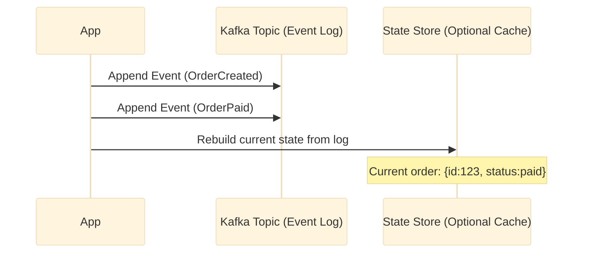

**Small code snippet (Python):**

```python
# Producer - append only
event = {"event_type": "OrderCreated", "order_id": "123", "amount": 100, "status": "pending"}
producer.send("order_events", key="123", value=json.dumps(event))

# Consumer - rebuild state by replaying
state = {}
for msg in consumer:
    event = json.loads(msg.value)
    order_id = event["order_id"]
    if order_id not in state:
        state[order_id] = {}
    # apply event to current state
    if event["event_type"] == "OrderCreated":
        state[order_id] = {"amount": event["amount"], "status": "pending"}
    elif event["event_type"] == "OrderPaid":
        state[order_id]["status"] = "paid"
```

**AWS tip:** Use Glue Schema Registry to evolve event schemas safely. Set `retention.bytes` or `retention.ms` based on compliance needs.

---

## 2. CQRS (Command Query Responsibility Segregation)


**What it is:**  
Separate the write path (commands that change state) from the read path (queries that retrieve data). Commands go to Kafka, which then asynchronously updates one or more read-optimized models. This allows reads and writes to scale independently and use different data structures.

**When to use:**  

- Read and write workloads have different scaling requirements (e.g., 1000 writes/sec but 100,000 reads/sec).
- You need multiple read models for different views (mobile app, dashboard, analytics).
- You want to avoid complex JOINs in the read path by pre-joining data into dedicated tables.

**How on AWS:**  
Write commands to an MSK topic. A consumer (Lambda, Kafka Streams, or ksqlDB) updates read models in DynamoDB, Aurora, or OpenSearch Service. Reads go directly to these optimized stores, never to the source.

**Mermaid diagram:**

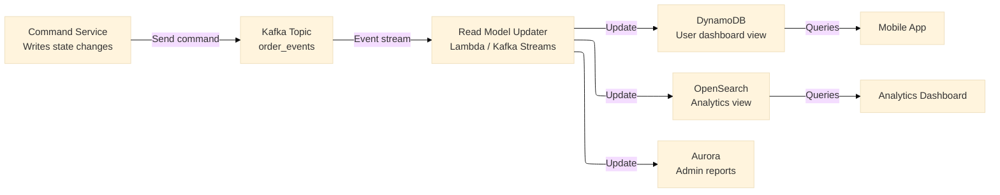

**Small code snippet (Java consumer updating DynamoDB):**

```java
@KafkaListener(topics = "order_events")
public void updateReadModels(OrderEvent event) {
    // Update DynamoDB read-optimized table for user dashboard
    DashboardView view = new DashboardView();
    view.setOrderId(event.getOrderId());
    view.setAmount(event.getAmount());
    view.setStatus(event.getStatus());
    dynamoDbMapper.save(view);
    
    // Also update OpenSearch for analytics
    IndexRequest request = new IndexRequest("orders")
        .id(event.getOrderId())
        .source(Map.of("amount", event.getAmount(), "status", event.getStatus()));
    openSearchClient.index(request);
}
```

**AWS tip:** Use DynamoDB global secondary indexes for different query patterns. Set up Lambda consumers with appropriate batch sizes and concurrency limits to avoid throttling.

---

## 3. Event Carried State Transfer


**What it is:**  
Events contain not just an identifier but the complete state information that downstream consumers need. This eliminates the need for consumers to fetch additional data from the source service, reducing coupling, network calls, and latency.

**When to use:**  

- Consumers frequently need the same contextual data alongside the event.
- You want to decouple services so the producer can change without breaking consumers (as long as the event contract holds).
- You're building low-latency systems where every extra network hop matters.

**How on AWS:**  
Design your event payloads generously. Use Glue Schema Registry for versioning so consumers can handle multiple event versions gracefully. Monitor message size — stay under MSK's default 1MB limit.

**Mermaid diagram:**

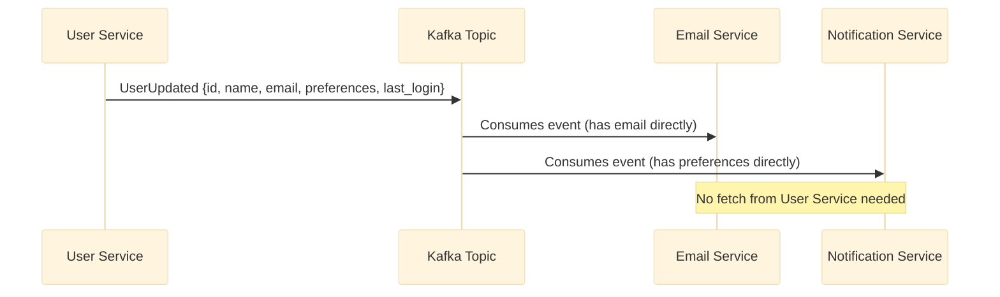

**Small code snippet (Producer — carrying full state):**

```python
# Instead of just user_id
event = {
    "event_type": "UserUpdated",
    "user_id": "123",
    "name": "Alice Chen",
    "email": "alice@example.com",
    "timezone": "America/New_York",
    "preferences": {
        "notifications_enabled": True,
        "email_digest": "daily"
    },
    "last_login_ts": 1700000000
}
producer.send("user_events", key="123", value=json.dumps(event))

# Consumer — no fetch needed
def handle_user_update(event):
    send_email(event["email"], "Your profile was updated")
    if event["preferences"]["notifications_enabled"]:
        send_push_notification(event["user_id"])
```

**AWS tip:** Use Glue Schema Registry with compatibility set to `BACKWARD` or `FORWARD` so you can evolve event schemas without breaking existing consumers. Monitor message size with CloudWatch.

---

## 4. Claim Check


**What it is:**  
Store large message payloads (images, videos, large JSON blobs) in an external storage system like S3. The Kafka message contains only a reference (claim check) to that external data. Consumers retrieve the reference and fetch the actual data from external storage when needed.

**When to use:**  

- Your messages exceed Kafka's default 1MB limit (or your configured `max.message.bytes`).
- You want to reduce broker disk I/O and network traffic.
- Payloads are large but infrequently accessed by consumers.

**How on AWS:**  
Upload large data to S3 with a unique key. Send a Kafka message containing the S3 URI, optional metadata, and perhaps a presigned URL expiration. Consumers download from S3 using the reference. Set S3 lifecycle policies to expire old data.

**Mermaid diagram:**

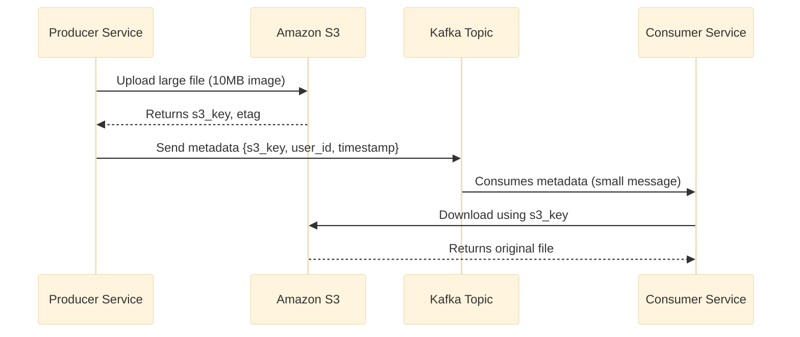

**Small code snippet (Producer with S3 upload):**

```python
import boto3
from uuid import uuid4

s3 = boto3.client('s3')
s3_key = f"order-attachments/{uuid4()}/invoice.pdf"
s3.upload_file("/tmp/invoice.pdf", "my-kafka-bucket", s3_key)

# Generate presigned URL (optional, expires in 1 hour)
presigned_url = s3.generate_presigned_url(
    'get_object', Params={'Bucket': 'my-kafka-bucket', 'Key': s3_key}, ExpiresIn=3600
)

# Send small message with reference
claim_check = {
    "order_id": "123",
    "s3_bucket": "my-kafka-bucket",
    "s3_key": s3_key,
    "presigned_url": presigned_url,
    "size_bytes": 10485760
}
producer.send("order_attachments", key="123", value=json.dumps(claim_check))
```

**AWS tip:** Use S3 lifecycle rules to delete objects after 7 days. Generate presigned URLs only when consumers need direct access without IAM permissions. Consider S3 Intelligent-Tiering for cost optimization.

---

## 5. Dead Letter Queue (DLQ)


**What it is:**  
When a consumer fails to process a message after all retry attempts, that message is sent to a separate "dead letter" topic instead of being lost or blocking the main topic. The DLQ acts as a quarantine area for problematic messages that need manual inspection or delayed replay.

**When to use:**  

- You have poison pills (malformed messages that always cause failures).
- Downstream dependencies fail in ways that retries won't fix (e.g., schema mismatch).
- You need operational visibility into failed messages without stopping the pipeline.

**How on AWS:**  
Create a DLQ topic per main topic (naming convention: `main-topic.dlq`). Configure consumers to catch exceptions, send the failed message to the DLQ, and commit the offset to move forward. Monitor DLQ message count with CloudWatch alarms.

**Mermaid diagram:**

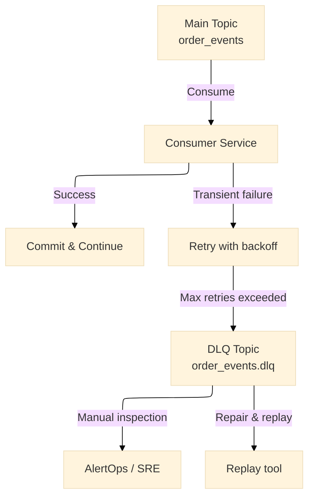

**Small code snippet (Python consumer with DLQ):**

```python
def consume_with_dlq():
    dlq_producer = KafkaProducer(bootstrap_servers='msk-broker:9092')
    
    for msg in consumer:
        try:
            process_message(msg)
            consumer.commit()
        except MalformedDataError as e:
            # Poison pill - send to DLQ and commit
            dlq_producer.send(f"{msg.topic}.dlq", msg.value, key=msg.key)
            consumer.commit()
            logger.error(f"Sent malformed message to DLQ: {e}")
        except TransientError as e:
            # Could retry with backoff, but after max retries -> DLQ
            if retry_count[msg.offset] > MAX_RETRIES:
                dlq_producer.send(f"{msg.topic}.dlq", msg.value)
                consumer.commit()
```

**AWS tip:** If using Lambda as a consumer, enable the DLQ configuration on the Lambda event source mapping. Lambda automatically sends failed messages to an SQS DLQ or SNS topic after retries exhaust. For MSK consumers, implement DLQ at the application level.

---

## 6. Idempotent Consumer


**What it is:**  
A consumer that can safely process the same message multiple times without causing duplicate side effects (double charging a credit card, sending two welcome emails, incrementing a counter twice). This is essential because Kafka guarantees at-least-once delivery by default.

**When to use:**  

- Your consumer performs non-idempotent actions (writes to a database, sends emails, calls payment APIs).
- You cannot use Kafka's exactly-once semantics (which require transactional producers and specific consumer configs).
- You want simple, idempotent business logic without complex distributed transactions.

**How on AWS:**  
Maintain an idempotency store (DynamoDB with TTL, or Redis ElastiCache). For each message key + partition + offset, store a processed marker before committing the offset. Use conditional writes to ensure you only process once.

**Mermaid diagram:**

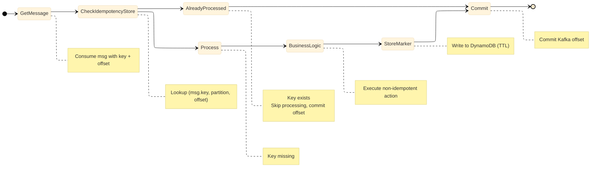

**AWS tip:** Use DynamoDB on-demand mode for variable throughput. Set TTL to auto-clean old idempotency records after your replay window (e.g., 7 days). For higher throughput, use ElastiCache for Redis with SETNX command.

---

## 7. Transactional Outbox


**What it is:**  
A pattern that solves the dual-write problem: ensuring that a database update and a Kafka message are published atomically. Instead of writing to both in one transaction (impossible across systems), you write to the database and to an "outbox" table in the same local transaction. A separate process polls the outbox and publishes to Kafka, marking records as sent.

**When to use:**  

- You need exactly-once semantics between your database and Kafka.
- You cannot use Kafka transactions (e.g., producers are stateless or across databases).
- You want to avoid the race conditions and partial failures of dual writes.

**How on AWS:**  
Use RDS (PostgreSQL, MySQL) or Aurora with an outbox table. A Lambda function (or a lightweight poller on ECS) polls the outbox periodically, publishes to MSK, and updates the outbox status. For higher scale, use Debezium with MSK Connect to stream outbox changes via CDC.

**Mermaid diagram:**

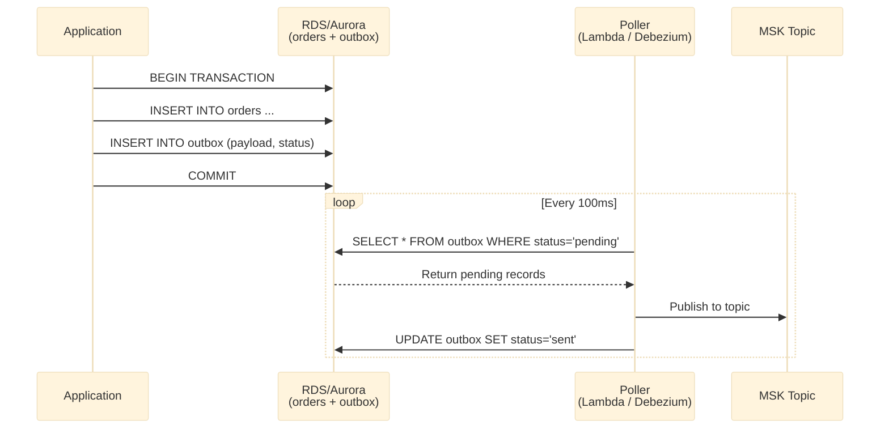

**Small code snippet (Application writing to outbox):**

```python
# Inside your application - same DB transaction
with db.transaction():
    # Business data
    db.execute("INSERT INTO orders (id, amount, status) VALUES (%s, %s, %s)",
               (order_id, 100, 'created'))
    
    # Outbox record
    outbox_payload = json.dumps({
        "event_type": "OrderCreated",
        "order_id": order_id,
        "amount": 100
    })
    db.execute("INSERT INTO outbox (id, payload, status, created_at) VALUES (%s, %s, %s, %s)",
               (uuid4(), outbox_payload, 'pending', datetime.utcnow()))
```

**Small code snippet (Poller — Lambda):**

```python
def lambda_handler(event, context):
    # Poll outbox table
    conn = get_db_connection()
    cursor = conn.cursor()
    cursor.execute("SELECT id, payload FROM outbox WHERE status='pending' ORDER BY created_at LIMIT 100")
    rows = cursor.fetchall()
    
    for row in rows:
        # Publish to MSK
        kafka_producer.send('order_events', value=row['payload'])
        
        # Mark as sent
        cursor.execute("UPDATE outbox SET status='sent', sent_at=NOW() WHERE id=%s", (row['id'],))
    
    conn.commit()
```

**AWS tip:** Use Debezium (available on MSK Connect) to avoid polling — it captures changes from the outbox table using CDC and streams them directly to Kafka. Set up CloudWatch alarms for outbox table growth (indicates publishing issues).

---

## 8. Compacted Topic


**What it is:**  
A Kafka topic with `cleanup.policy=compact`. Instead of deleting old messages by time or size, Kafka retains only the latest message for each key. All previous values for that key are eventually removed during log compaction. This turns the topic into a distributed, replicated, fault-tolerant key-value store.

**When to use:**  

- You need to reconstruct the latest state of each entity (e.g., current user profile, product price, configuration).
- You want new consumers to start with the most recent state without replaying the entire history.
- You're building a changelog for a database table (Debezium CDC uses compacted topics).

**How on AWS:**  
Set `cleanup.policy=compact` on your MSK topic. Optionally also set `min.cleanable.dirty.ratio` to control compaction frequency. Consumers can use the topic as a table: reading from the end gives only the latest per key.

**Mermaid diagram:**

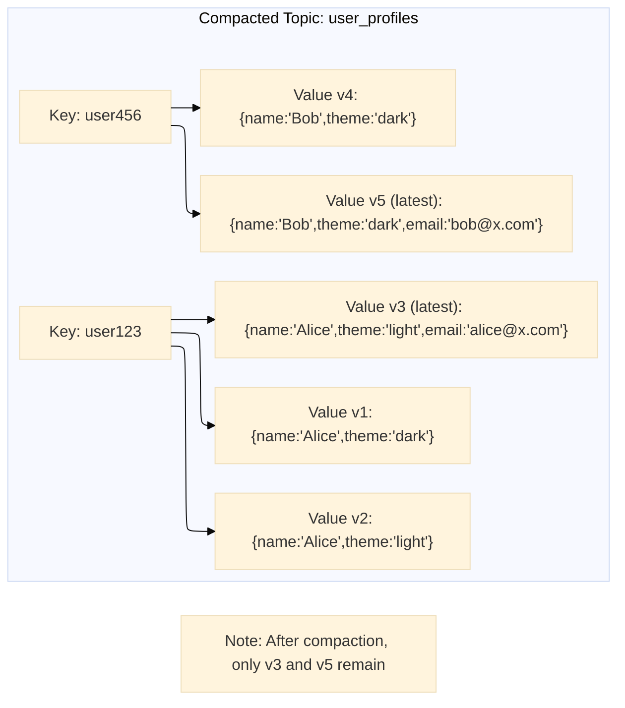

**Small code snippet (Producer):**

```python
# Only the latest per key matters for this topic
producer.send("user_profiles", key="user123", value='{"name":"Alice","theme":"dark"}')
producer.send("user_profiles", key="user123", value='{"name":"Alice","theme":"light"}')
producer.send("user_profiles", key="user123", value='{"name":"Alice","theme":"light","email":"alice@x.com"}')

# Consumer reading from end gets only the latest value
consumer.assign([TopicPartition("user_profiles", 0)])
consumer.seek_to_end()  # go to latest
msg = consumer.poll()
# msg.value = {"name":"Alice","theme":"light","email":"alice@x.com"}
```

**AWS tip:** Monitor compaction lag using Kafka's `log-lag` metrics. Set `delete.retention.ms` to control how long tombstones (messages with null value) are retained. Compacted topics work well with ksqlDB's `CREATE TABLE` statement.

---

## 9. Partition Key / Ordering Pattern


**What it is:**  
Kafka guarantees order only within a single partition. By setting a message key, you ensure all messages with the same key go to the same partition, preserving their order. This is fundamental for event-sourced systems where per-entity order matters (e.g., all events for order #123 must be processed in sequence).

**When to use:**  

- You need strict ordering guarantees per entity (order, user, device, session).
- You want to parallelize processing across different entities while preserving order per entity.
- You're building a stateful application where events for the same key must be processed sequentially.

**How on AWS:**  
Choose a high-cardinality key (e.g., `order_id`, `user_id`, `device_id`). Avoid very low-cardinality keys (e.g., `status=active` with only 2 values) — they'll cause hot partitions. Set the number of partitions high enough to allow parallelism (at least as many as your expected maximum consumers).

**Mermaid diagram:**

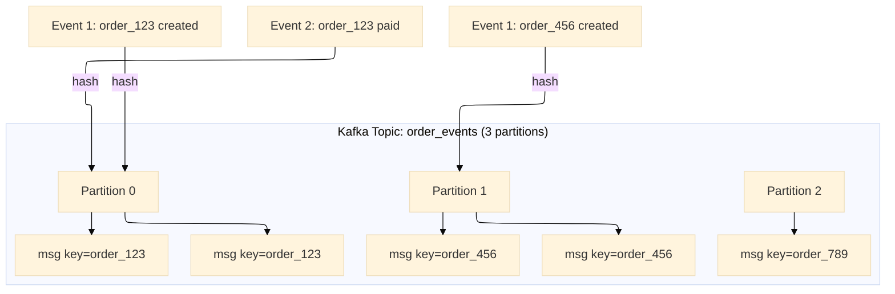

**Small code snippet (Producer with key):**

```python
# All events for the same order_id go to same partition -> order preserved
producer.send("order_events", key="order_123", value=json.dumps({"event": "created", "ts": 100}))
producer.send("order_events", key="order_123", value=json.dumps({"event": "paid", "ts": 200}))
producer.send("order_events", key="order_123", value=json.dumps({"event": "shipped", "ts": 300}))

# Different order_id may go to different partition -> parallel processing
producer.send("order_events", key="order_456", value=json.dumps({"event": "created", "ts": 150}))
```

**Small code snippet (Consumer — automatic rebalancing preserves key ordering):**

```java
// Kafka guarantees that within a partition, messages are consumed in order
// All order_123 events will be processed sequentially by the same consumer
@KafkaListener(topics = "order_events", concurrency = "3")
public void listen(ConsumerRecord<String, String> record) {
    String orderId = record.key();  // "order_123"
    // Process events for this order in strict sequence
}
```

**AWS tip:** Monitor partition skew using CloudWatch metrics (`BytesInPerPartition`). If one partition is overloaded, consider salting your key (e.g., `order_123_part0`, `order_123_part1`) or increasing partition count. MSK supports up to thousands of partitions per cluster.

---

## 10. Stream-Table Duality


**What it is:**  
Kafka can be viewed as both a stream (sequence of individual events) and a table (current state per key). This duality is fundamental to Kafka Streams and ksqlDB: a stream is a table in motion, a table is a stream at rest. You can convert between them: aggregate a stream into a table (e.g., running total per user), or emit a table's changelog as a stream.

**When to use:**  

- You need to join a real-time event stream with slowly changing reference data (e.g., clicks stream + user profiles table).
- You want to maintain materialized views that update as new events arrive.
- You're building real-time dashboards or monitoring systems.

**How on AWS:**  
Use ksqlDB on Confluent Cloud (available on AWS Marketplace) or run Kafka Streams applications on ECS/EKS. Define streams and tables using SQL-like syntax. Kafka Streams uses RocksDB locally for state stores; ksqlDB persists materialized views to compacted topics.

**Mermaid diagram:**

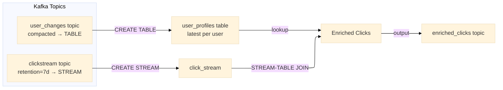

**Small code snippet (ksqlDB on AWS):**

```sql
-- Create a table from a compacted topic (latest per user)
CREATE TABLE user_profiles (
    user_id VARCHAR PRIMARY KEY,
    name VARCHAR,
    email VARCHAR,
    preferences STRUCT<notifications BOOLEAN>
) WITH (
    KAFKA_TOPIC = 'user_changes',
    VALUE_FORMAT = 'JSON'
);

-- Create a stream from a regular topic
CREATE STREAM clickstream (
    user_id VARCHAR,
    page VARCHAR,
    timestamp BIGINT
) WITH (
    KAFKA_TOPIC = 'clicks',
    VALUE_FORMAT = 'JSON'
);

-- Stream-table join: enrich clicks with user profile
CREATE STREAM enriched_clicks AS
SELECT 
    c.user_id, 
    c.page, 
    c.timestamp,
    u.name,
    u.email
FROM clickstream c
JOIN user_profiles u ON c.user_id = u.user_id
EMIT CHANGES;
```

**Small code snippet (Kafka Streams Java):**

```java
KTable<String, UserProfile> userTable = builder.table("user_changes");
KStream<String, ClickEvent> clickStream = builder.stream("clicks");

KStream<String, EnrichedClick> enriched = clickStream.join(
    userTable,
    (click, profile) -> new EnrichedClick(click, profile),
    Joined.with(Serdes.String(), clickSerde, profileSerde)
);
```

**AWS tip:** Use ksqlDB on Confluent Cloud for managed service. For self-managed, run Kafka Streams on ECS Fargate with RocksDB state stores backed by EBS. Monitor state store sizes and changelog topic lag.

---

## 11. Saga (Choreography)

**What it is:**  
A distributed transaction pattern where each local transaction publishes events that trigger the next transaction in other services. No central coordinator. If a step fails, previous services execute compensating transactions (undo actions) by listening to failure events. Kafka acts as the communication backbone.

**When to use:**  

- You need distributed transactions across microservices without two-phase commit (2PC).
- Services are loosely coupled and owned by different teams.
- Transactions are long-running (minutes, hours) and would hold locks with 2PC.

**How on AWS:**  
Each service listens to a Kafka topic, does its local work, and publishes success/failure events. On failure, compensating events are published. For complex sagas, combine with AWS Step Functions for orchestration, but the choreography pattern uses only Kafka.

**Mermaid diagram:**

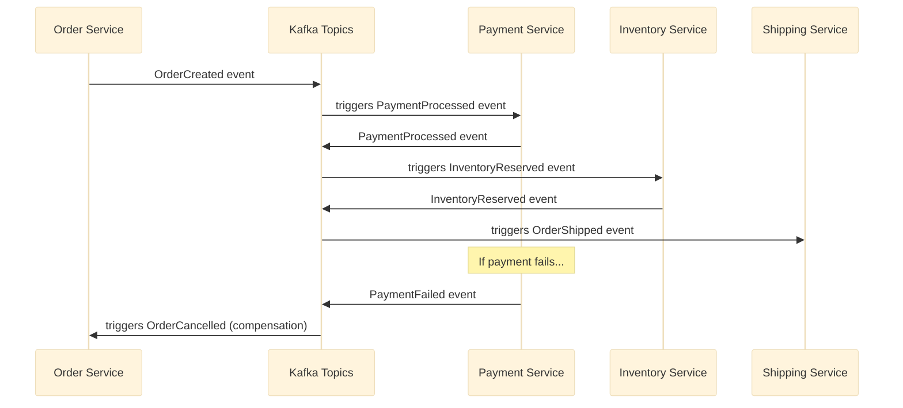

**Small code snippet (Service with compensation):**

```python
# Order Service - starts the saga
def create_order(order):
    db.insert(order, status="PENDING")
    producer.send("order_events", value={"event": "OrderCreated", "order_id": order.id})
    
# Payment Service - listens and compensates if needed
def handle_order_created(event):
    try:
        charge_credit_card(event.order_id)
        producer.send("payment_events", value={"event": "PaymentProcessed", "order_id": event.order_id})
    except InsufficientFunds:
        # Compensate: send failure event
        producer.send("payment_events", value={"event": "PaymentFailed", "order_id": event.order_id})
        producer.send("order_events", value={"event": "OrderCancelled", "order_id": event.order_id})

# Order Service - compensation handler
def handle_order_cancelled(event):
    db.update(event.order_id, status="CANCELLED")
    refund_any_pre_authorizations(event.order_id)
```

**AWS tip:** For choreography, use MSK with topics per service (`order_events`, `payment_events`, `inventory_events`). Monitor dead-letter topics for failed saga steps. For complex sagas with branching/merging, consider AWS Step Functions with MSK integration — orchestration pattern.

---

## What’s Next?

You've now seen **all 11 Kafka patterns** with detailed explanations, diagrams, and code snippets. In the upcoming parts, we'll go **production-deep** on each category:

- **[Part 2 – Reliability & Ordering Patterns](#)** (Outbox, Idempotent Consumer, Partition Key, DLQ, Retry with Backoff)  
→ Full code, AWS IAM policies, CloudWatch alarms, partition sizing strategies.
- **[Part 3 – Data & State Patterns](#)** (Event Sourcing, CQRS, Compacted Topic, Event Carried State Transfer)  
→ Schema evolution with Glue, ksqlDB materialized views, snapshot strategies.
- **[Part 4 – Performance & Integration Patterns](#)** (Claim Check, Stream-Table Duality, Saga Choreography)  
→ S3 lifecycle management, Kafka Streams state stores, Step Functions integration.

---

## Up Next in Part 2

📎 **[Kafka Design Patterns 2](#) — Reliability & Ordering Deep Dive** — Coming soon

**Patterns covered:** Transactional Outbox, Idempotent Consumer, Partition Key, Dead Letter Queue (DLQ), Retry with Backoff.

✨ **What you learn:** By the end of Part 2, you'll be able to build event-driven systems on AWS that survive network failures, duplicate messages, consumer crashes, and poison pills — without losing a single event.

**Real AWS examples:**  

- Outbox with RDS + Debezium + MSK Connect  
- Idempotency with DynamoDB TTL and conditional writes  
- Partition key design to avoid hot partitions  
- DLQ with Lambda redrive to SQS  
- Retry topics with exponential backoff using Kafka timestamps

---

*This is the master story. Parts 2, 3, and 4 will reference this page and follow the same structure, each beginning with:*

> *📌 This is Part 1 of the "11 Kafka Design Patterns for Every Backend Engineer" series. If you haven't read the [master story / Part 1](#), start there for an overview of all 11 patterns.*  
> *Takeaway from Part 1: [key insight]*  
> *In this part, we deep-dive into [pattern category].*

--  
💬 **Questions? Drop a response** — I read and reply to every comment.

📌 **Save this story to your reading list** — it helps other engineers discover it.

🔗 **Follow me** →

**Medium** — mvineetsharma.medium.com  
**LinkedIn** — [www.linkedin.com/in/vineet-sharma-architect](http://www.linkedin.com/in/vineet-sharma-architect)  


> Coming soon! Want it sooner? Let me know with a clap or comment below
> YouTube