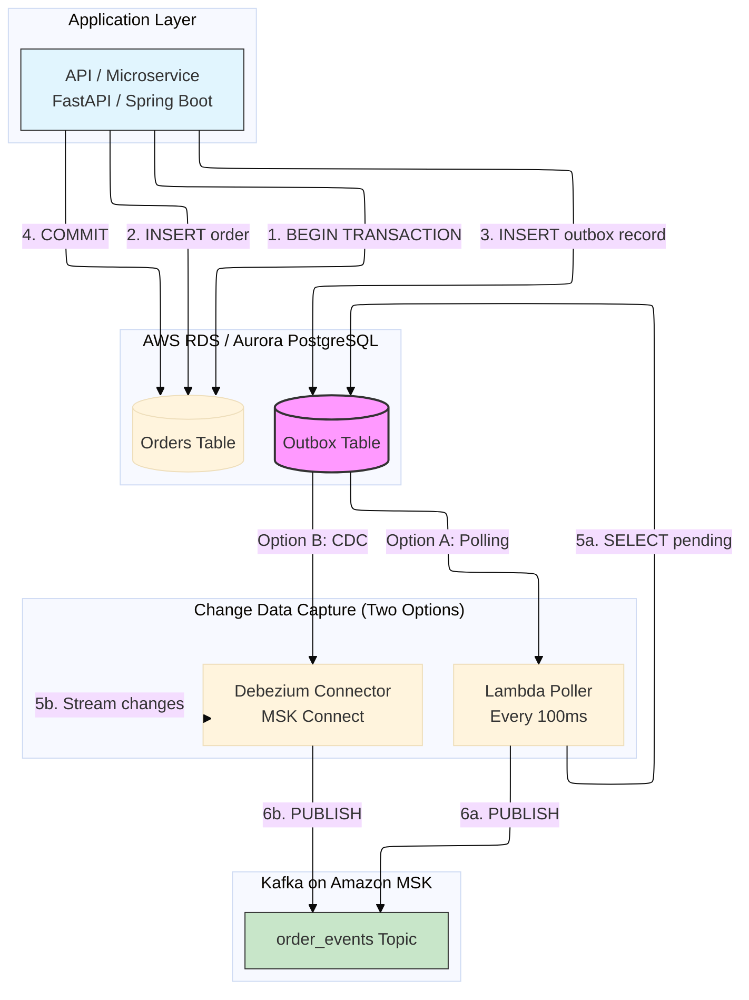

# ### Architecture on AWS

```mermaid
---
config:
  layout: elk
  theme: base
---
graph TB
    subgraph "Application Layer"
        App[API / Microservice<br/>FastAPI / Spring Boot]
    end
    
    subgraph "AWS RDS / Aurora PostgreSQL"
        DB[(Orders Table)]
        Outbox[(Outbox Table)]
    end
    
    subgraph "Change Data Capture (Two Options)"
        Poller[Lambda Poller<br/>Every 100ms]
        Debezium[Debezium Connector<br/>MSK Connect]
    end
    
    subgraph "Kafka on Amazon MSK"
        Topic[order_events Topic]
    end
    
    App -->|1. BEGIN TRANSACTION| DB
    App -->|2. INSERT order| DB
    App -->|3. INSERT outbox record| Outbox
    App -->|4. COMMIT| DB
    
    Outbox -->|Option A: Polling| Poller
    Outbox -->|Option B: CDC| Debezium
    
    Poller -->|5a. SELECT pending| Outbox
    Poller -->|6a. PUBLISH| Topic
    
    Debezium -->|5b. Stream changes| Debezium
    Debezium -->|6b. PUBLISH| Topic
    
    style Outbox fill:#f9f,stroke:#333,stroke-width:2px
    style App fill:#e1f5fe,stroke:#333
    style Topic fill:#c8e6c9,stroke:#333
```
