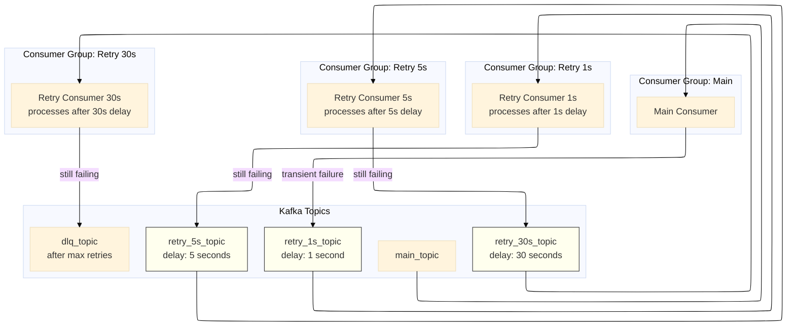

# ### Architecture on AWS

```mermaid
---
config:
  layout: elk
  theme: base
---
graph TB
    subgraph "Kafka Topics"
        Main[main_topic]
        R1[retry_1s_topic<br/>delay: 1 second]
        R2[retry_5s_topic<br/>delay: 5 seconds]
        R3[retry_30s_topic<br/>delay: 30 seconds]
        DLQ[dlq_topic<br/>after max retries]
    end
    
    subgraph "Consumer Group: Main"
        MainC[Main Consumer]
    end
    
    subgraph "Consumer Group: Retry 1s"
        R1C[Retry Consumer 1s<br/>processes after 1s delay]
    end
    
    subgraph "Consumer Group: Retry 5s"
        R2C[Retry Consumer 5s<br/>processes after 5s delay]
    end
    
    subgraph "Consumer Group: Retry 30s"
        R3C[Retry Consumer 30s<br/>processes after 30s delay]
    end
    
    Main --> MainC
    MainC -->|transient failure| R1
    R1 --> R1C
    R1C -->|still failing| R2
    R2 --> R2C
    R2C -->|still failing| R3
    R3 --> R3C
    R3C -->|still failing| DLQ
    
    style R1 fill:#ffe,stroke:#333
    style R2 fill:#ffe,stroke:#333
    style R3 fill:#ffe,stroke:#333
```
