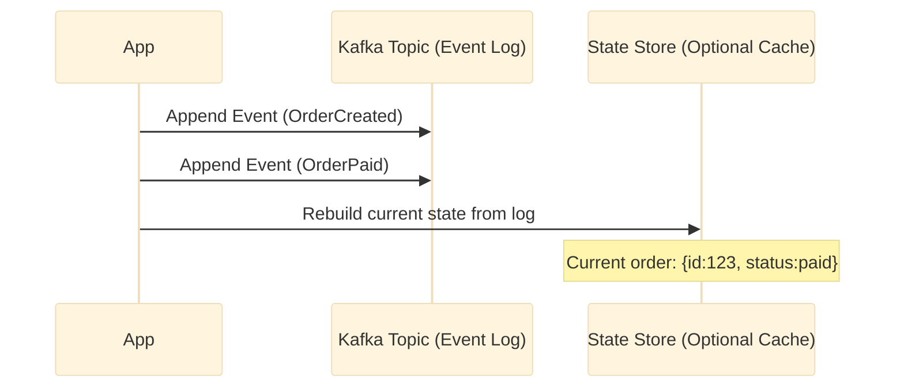

# **Mermaid diagram:**

```mermaid
---
config:
  layout: elk
  theme: base
---
sequenceDiagram
    participant App
    participant Kafka as Kafka Topic (Event Log)
    participant Store as State Store (Optional Cache)
    App->>Kafka: Append Event (OrderCreated)
    App->>Kafka: Append Event (OrderPaid)
    App->>Store: Rebuild current state from log
    Note over Store: Current order: {id:123, status:paid}
```
