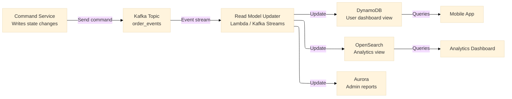

# **Mermaid diagram:**

```mermaid
---
config:
  layout: elk
  theme: base
---
graph LR
    C[Command Service<br/>Writes state changes] -->|Send command| K[Kafka Topic<br/>order_events]
    K -->|Event stream| U[Read Model Updater<br/>Lambda / Kafka Streams]
    U -->|Update| R1[DynamoDB<br/>User dashboard view]
    U -->|Update| R2[OpenSearch<br/>Analytics view]
    U -->|Update| R3[Aurora<br/>Admin reports]
    R1 -->|Queries| UI[Mobile App]
    R2 -->|Queries| Dash[Analytics Dashboard]
```
