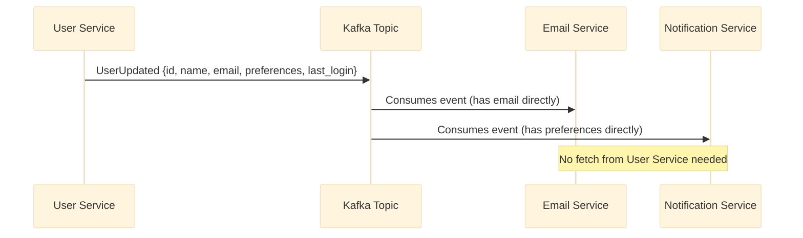

# **Mermaid diagram:**

```mermaid
---
config:
  layout: elk
  theme: base
---
sequenceDiagram
    participant UserSvc as User Service
    participant Kafka as Kafka Topic
    participant EmailSvc as Email Service
    participant NotifSvc as Notification Service
    UserSvc->>Kafka: UserUpdated {id, name, email, preferences, last_login}
    Kafka->>EmailSvc: Consumes event (has email directly)
    Kafka->>NotifSvc: Consumes event (has preferences directly)
    Note over EmailSvc,NotifSvc: No fetch from User Service needed
```
