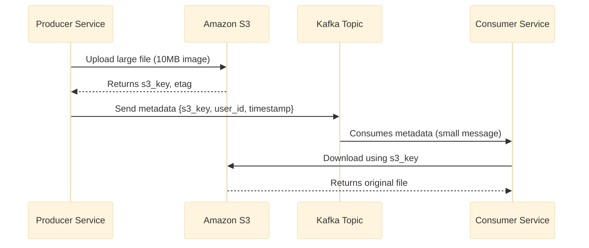

# **Mermaid diagram:**

```mermaid
---
config:
  layout: elk
  theme: base
---
sequenceDiagram
    participant P as Producer Service
    participant S3 as Amazon S3
    participant K as Kafka Topic
    participant C as Consumer Service
    P->>S3: Upload large file (10MB image)
    S3-->>P: Returns s3_key, etag
    P->>K: Send metadata {s3_key, user_id, timestamp}
    K->>C: Consumes metadata (small message)
    C->>S3: Download using s3_key
    S3-->>C: Returns original file
```
