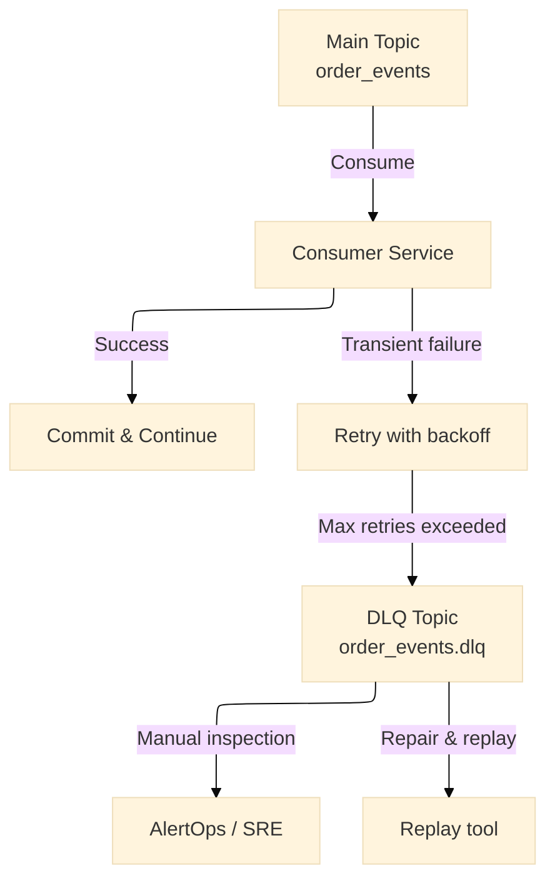

# **Mermaid diagram:**

```mermaid
---
config:
  layout: elk
  theme: base
---
graph TD
    Main[Main Topic<br/>order_events] -->|Consume| Consumer[Consumer Service]
    Consumer -->|Success| Done[Commit & Continue]
    Consumer -->|Transient failure| Retry[Retry with backoff]
    Retry -->|Max retries exceeded| DLQ[DLQ Topic<br/>order_events.dlq]
    DLQ -->|Manual inspection| Alert[AlertOps / SRE]
    DLQ -->|Repair & replay| Replay[Replay tool]
```
