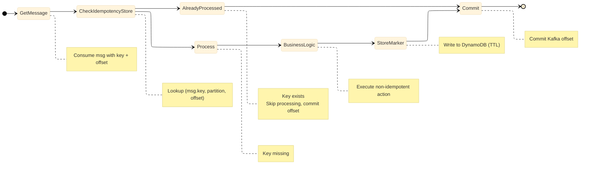

# **Mermaid diagram:**

```mermaid
---
config:
  layout: elk
  theme: base
---
stateDiagram
  direction LR
  [*] --> GetMessage
  GetMessage --> CheckIdempotencyStore
  CheckIdempotencyStore --> AlreadyProcessed
  AlreadyProcessed --> Commit
  CheckIdempotencyStore --> Process
  Process --> BusinessLogic
  BusinessLogic --> StoreMarker
  StoreMarker --> Commit
  Commit --> [*]
  note right of GetMessage : Consume msg with key + offset
  note right of CheckIdempotencyStore : Lookup (msg.key, partition, offset)
  note right of AlreadyProcessed 
  Key exists
        Skip processing, commit offset
  end note
  note right of Process : Key missing
  note right of BusinessLogic : Execute non-idempotent action
  note right of StoreMarker : Write to DynamoDB (TTL)
  note right of Commit : Commit Kafka offset
```
