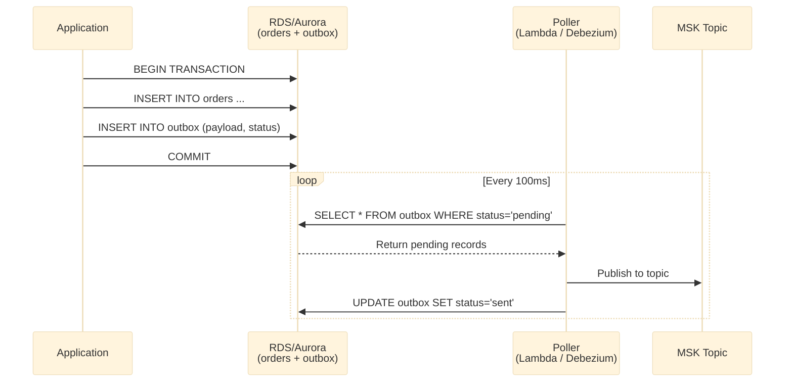

# **Mermaid diagram:**

```mermaid
---
config:
  layout: elk
  theme: base
---
sequenceDiagram
    participant App as Application
    participant DB as RDS/Aurora<br/>(orders + outbox)
    participant Poller as Poller<br/>(Lambda / Debezium)
    participant Kafka as MSK Topic
    App->>DB: BEGIN TRANSACTION
    App->>DB: INSERT INTO orders ...
    App->>DB: INSERT INTO outbox (payload, status)
    App->>DB: COMMIT
    loop Every 100ms
        Poller->>DB: SELECT * FROM outbox WHERE status='pending'
        DB-->>Poller: Return pending records
        Poller->>Kafka: Publish to topic
        Poller->>DB: UPDATE outbox SET status='sent'
    end
```
