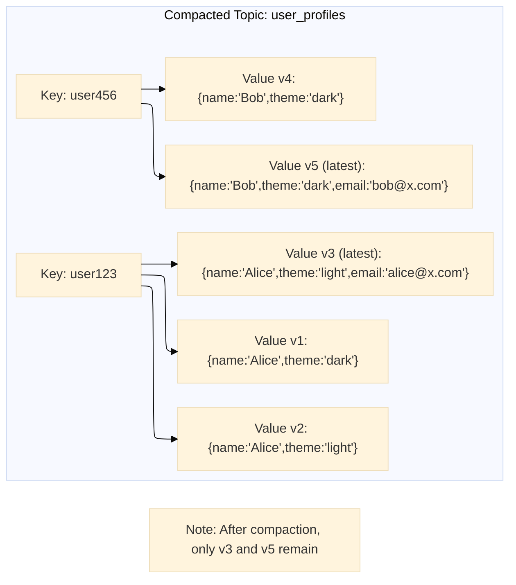

# **Mermaid diagram:**

```mermaid
---
config:
  layout: elk
  theme: base
---
graph LR
    subgraph "Compacted Topic: user_profiles"
        direction LR
        K1["Key: user123"] --> V1["Value v1: {name:'Alice',theme:'dark'}"]
        K1 --> V2["Value v2: {name:'Alice',theme:'light'}"]
        K1 --> V3["Value v3 (latest): {name:'Alice',theme:'light',email:'alice@x.com'}"]
        
        K2["Key: user456"] --> V4["Value v4: {name:'Bob',theme:'dark'}"]
        K2 --> V5["Value v5 (latest): {name:'Bob',theme:'dark',email:'bob@x.com'}"]
    end

    N["Note: After compaction, only v3 and v5 remain"]
```
