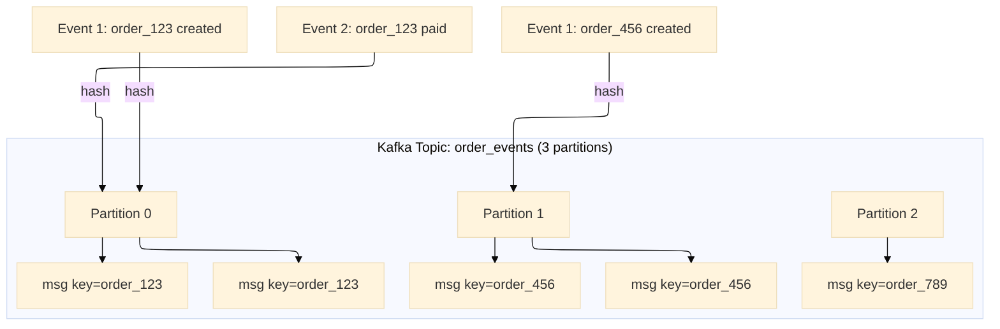

# **Mermaid diagram:**

```mermaid
---
config:
  layout: elk
  theme: base
---
graph TD
    subgraph "Kafka Topic: order_events (3 partitions)"
        P0[Partition 0] --> M1[msg key=order_123]
        P0 --> M2[msg key=order_123]
        P1[Partition 1] --> M3[msg key=order_456]
        P1 --> M4[msg key=order_456]
        P2[Partition 2] --> M5[msg key=order_789]
    end
    E1[Event 1: order_123 created] -->|hash| P0
    E2[Event 2: order_123 paid] -->|hash| P0
    E3[Event 1: order_456 created] -->|hash| P1
```
