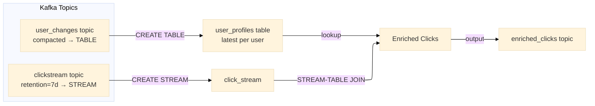

# **Mermaid diagram:**

```mermaid
---
config:
  layout: elk
  theme: base
---
graph LR
    subgraph "Kafka Topics"
        UC[user_changes topic<br/>compacted → TABLE]
        CS[clickstream topic<br/>retention=7d → STREAM]
    end
    
    UC -->|CREATE TABLE| UT[user_profiles table<br/>latest per user]
    CS -->|CREATE STREAM| CT[click_stream]
    
    CT -->|STREAM-TABLE JOIN| JOIN[Enriched Clicks]
    UT -->|lookup| JOIN
    
    JOIN -->|output| EK[enriched_clicks topic]
```
