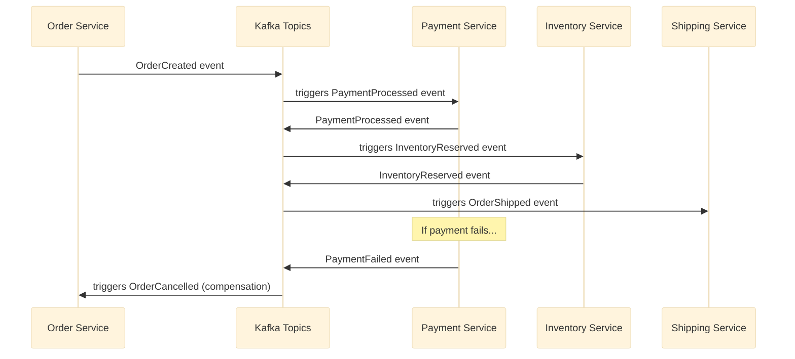

# **Mermaid diagram:**

```mermaid
---
config:
  layout: elk
  theme: base
---
sequenceDiagram
    participant Order as Order Service
    participant Kafka as Kafka Topics
    participant Payment as Payment Service
    participant Inventory as Inventory Service
    participant Shipping as Shipping Service
    
    Order->>Kafka: OrderCreated event
    Kafka->>Payment: triggers PaymentProcessed event
    Payment->>Kafka: PaymentProcessed event
    Kafka->>Inventory: triggers InventoryReserved event
    Inventory->>Kafka: InventoryReserved event
    Kafka->>Shipping: triggers OrderShipped event
    
    Note over Payment: If payment fails...
    Payment->>Kafka: PaymentFailed event
    Kafka->>Order: triggers OrderCancelled (compensation)
```
