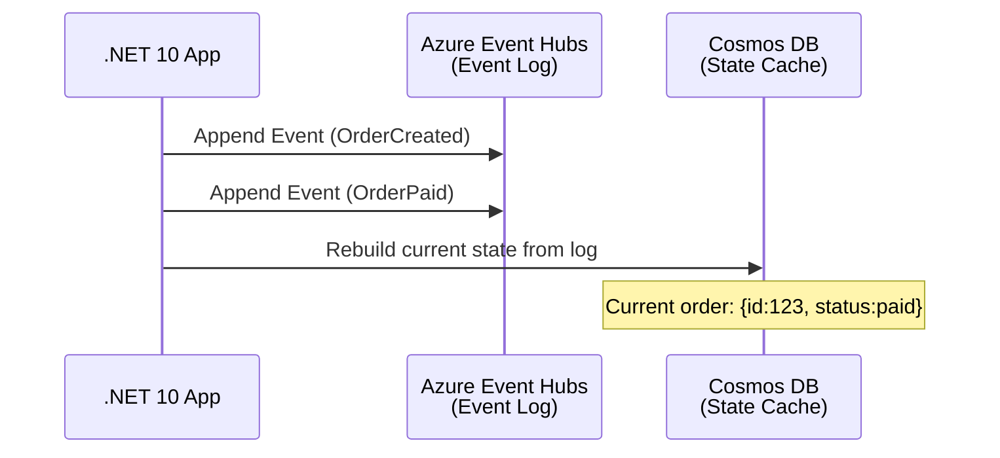
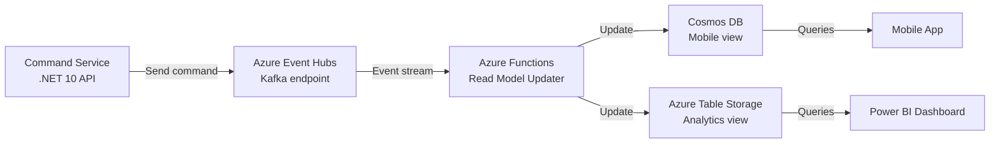
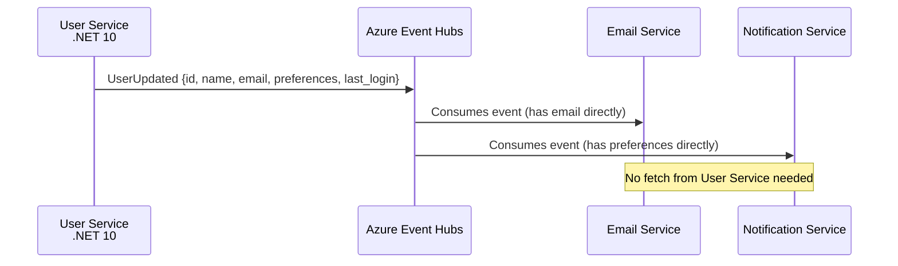
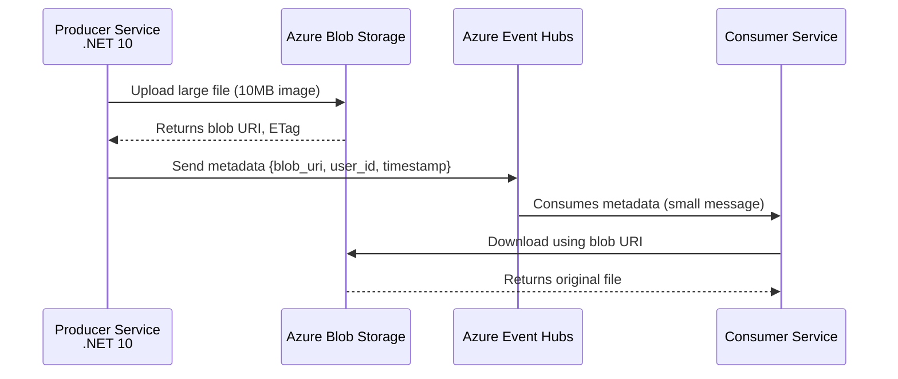
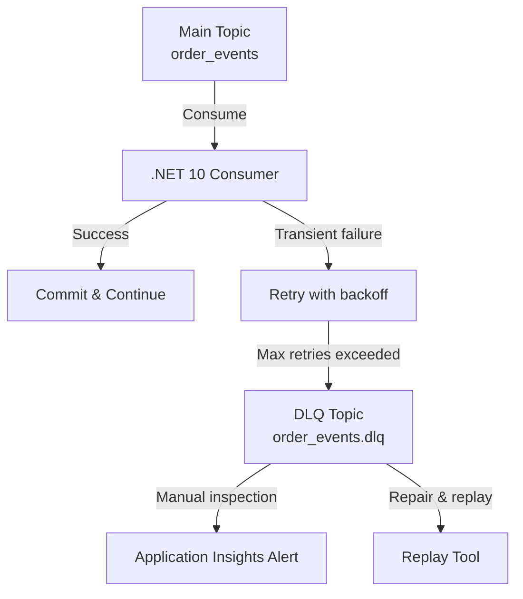
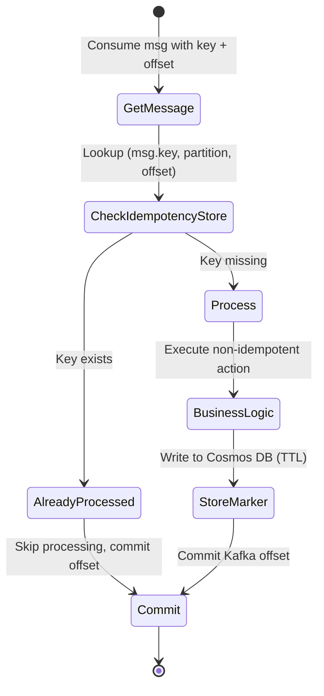
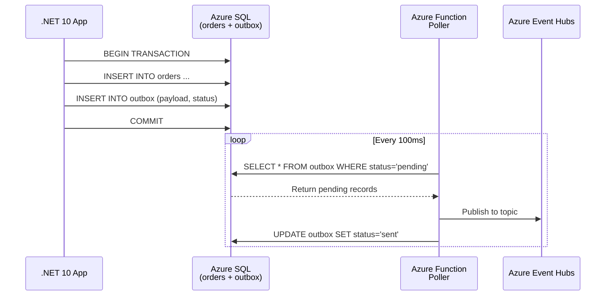
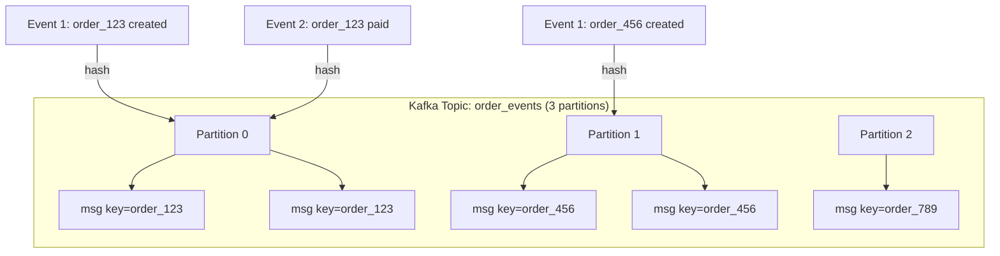
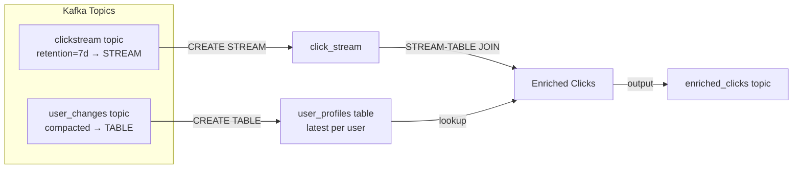
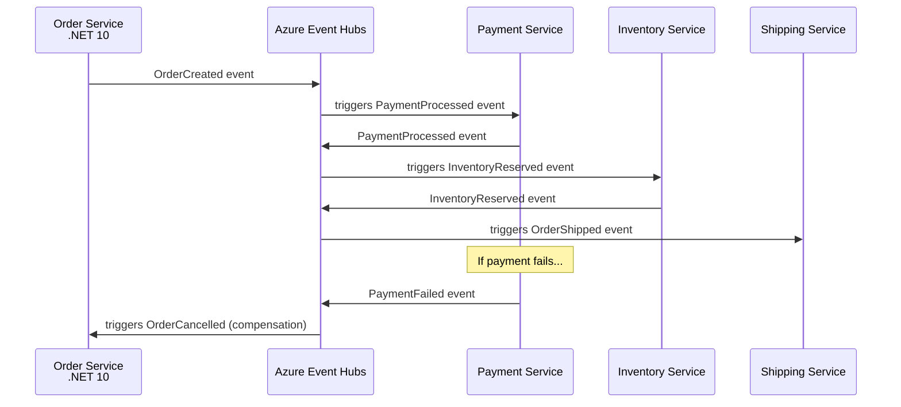

# 📖 11 Kafka Design Patterns — Overview (All 11 Patterns) — Azure + .NET 10 Edition

## Intro s

Welcome to the **Azure + .NET 10** edition of our Kafka Design Patterns series.

Apache Kafka on Azure has become the event streaming backbone for modern architectures — from startups to enterprises. But using Kafka effectively requires more than just producing and consuming messages. You need battle-tested design patterns to handle ordering, exactly-once semantics, large payloads, failure recovery, and integration with Azure services like Event Hubs (Kafka endpoint), Azure Blob Storage, Cosmos DB, Azure Functions, and Service Bus.

This 4-part series walks you through **11 essential Kafka patterns** — each explained with real-world Azure examples, Mermaid diagrams, and **.NET 10 code snippets** with explicit comparisons to previous .NET versions.

**Why .NET 10 makes a difference:**

Throughout this series, you'll see how .NET 10 and the latest Confluent.Kafka library (v2.8+) improve your Kafka development experience:

| .NET 8 and Earlier | .NET 10 Advantage |
|-------------------|-------------------|
| `Task.WhenAll` for parallel processing | `Parallel.ForEachAsync` with native async enumeration |
| Manual cancellation token boilerplate | `CancellationToken` integration with `IAsyncEnumerable` |
| `Newtonsoft.Json` for serialization | `System.Text.Json` with source generation (no reflection) |
| `IHostedService` base class | `BackgroundService` with `ExecuteAsync` simplification |
| `Channel<T>` for buffering | `System.Threading.Channels` with `ChannelReader.ReadAllAsync()` |
| Traditional logging | `LoggerMessageAttribute` source-generated logging |

Whether you're migrating from on-prem Kafka to Azure Event Hubs, building event-driven microservices on AKS, or designing data pipelines with Azure Functions — these patterns will make your systems resilient, scalable, and maintainable.

Let's dive in.

---

*This is Part 1 of the "Kafka Design Patterns for Every Backend Engineer — Azure + .NET 10" series.*

---

## 📚 Story List (with Pattern Coverage)

1. **Kafka Design Patterns — Overview (All 11 Patterns)** — Brief intro, detailed explainer for each pattern, Mermaid diagrams, small .NET 10 code snippets.  
   *Patterns covered: All 11 patterns introduced at high level.*  
   📎 *Read the full story: Part 1 — below*

2. **Reliability & Ordering Patterns** — Deep dive on patterns that ensure message durability, exactly-once processing, failure handling, and strict ordering on Azure.  
   *Patterns covered: Transactional Outbox, Idempotent Consumer, Partition Key, Dead Letter Queue (DLQ), Retry with Backoff.*  
   📎 *Coming soon*

3. **Data & State Patterns** — Deep dive on patterns that treat Kafka as a source of truth for state management, event replay, and materialized views on Azure.  
   *Patterns covered: Event Sourcing, CQRS, Compacted Topic, Event Carried State Transfer.*  
   📎 *Coming soon*

4. **Performance & Integration Patterns** — Deep dive on patterns that handle large messages, real-time joins, and distributed transactions across services on Azure.  
   *Patterns covered: Claim Check, Stream-Table Duality, Saga (Choreography).*  
   📎 *Coming soon*

---

## Takeaway from This Overview

By the end of this Part 1, you'll understand:

- **Reliability** in Kafka isn't automatic — you need explicit patterns to handle failures, duplicates, and ordering.
- **At-least-once delivery** is Kafka's default, which means idempotent consumers are a requirement, not an option.
- **The dual-write problem** (DB + Kafka) is one of the most common sources of data loss — the Outbox pattern solves it.
- **Ordering is guaranteed only within a partition** — partition key design directly impacts correctness and scalability.
- **Failures are inevitable** — DLQ and retry patterns separate transient issues from poison pills.

---

## In This Part (Part 1)

We introduce all **11 patterns** at a high level. Each pattern includes:

- **What it is** and **when to use it**
- **Mermaid diagram** for visual understanding
- **.NET 10 code snippet** with explicit comparison to previous .NET versions
- **Azure service mapping** (Event Hubs, Blob Storage, Cosmos DB, Azure Functions, Service Bus)

---

# 1. Event Sourcing

**What it is:**  
Instead of storing only the current state of an entity (like a row in a database), you store every state-changing event as an immutable, append-only sequence in Kafka. The current state is derived by replaying all events from the beginning. Kafka's log-based storage makes this natural.

**When to use:**  
- You need a complete audit trail of every change.
- You want the ability to replay history to reconstruct past states or debug issues.
- You need temporal queries ("what did the order look like yesterday at 3 PM?").

**Azure services:** Azure Event Hubs (Kafka endpoint) + Azure Blob Storage (archival) + Cosmos DB (snapshots)

**Mermaid diagram:**



**.NET 10 Code Snippet:**

```csharp
// .NET 10 - Using System.Text.Json source generation for zero-reflection serialization
using Confluent.Kafka;
using System.Text.Json;
using System.Text.Json.Serialization;

// ✅ .NET 10 Advantage: Source-generated JSON serialization (no reflection, better performance)
[JsonSourceGenerationOptions(PropertyNamingPolicy = JsonKnownNamingPolicy.CamelCase)]
[JsonSerializable(typeof(OrderCreatedEvent))]
[JsonSerializable(typeof(OrderPaidEvent))]
internal partial class EventJsonContext : JsonSerializerContext { }

public record OrderCreatedEvent(string OrderId, decimal Amount, string CustomerId);
public record OrderPaidEvent(string OrderId, DateTime PaidAt);

public class EventSourcingProducer
{
    private readonly IProducer<string, string> _producer;
    
    public EventSourcingProducer(string bootstrapServers)
    {
        var config = new ProducerConfig { BootstrapServers = bootstrapServers };
        _producer = new ProducerBuilder<string, string>(config).Build();
    }
    
    public async Task AppendEvent<T>(string topic, string aggregateId, T eventData)
    {
        // ✅ .NET 10 Advantage: JsonSerializer.Serialize using source-generated context
        var json = JsonSerializer.Serialize(eventData, EventJsonContext.Default.T);
        var message = new Message<string, string> { Key = aggregateId, Value = json };
        
        var result = await _producer.ProduceAsync(topic, message);
        Console.WriteLine($"Event appended to partition {result.Partition}, offset {result.Offset}");
    }
}

// Consumer rebuilding state
public class OrderStateRebuilder
{
    private readonly IConsumer<string, string> _consumer;
    private readonly Dictionary<string, OrderState> _states = new();
    
    // ✅ .NET 10 Advantage: IAsyncEnumerable for streaming consumption
    public async Task RebuildStateAsync(string topic, CancellationToken cancellationToken)
    {
        _consumer.Subscribe(topic);
        
        // Consume messages as async stream
        await foreach (var consumeResult in _consumer.ConsumeAsync(cancellationToken))
        {
            var eventType = GetEventType(consumeResult.Message.Key);
            var orderId = consumeResult.Message.Key;
            
            if (!_states.ContainsKey(orderId))
                _states[orderId] = new OrderState { OrderId = orderId };
            
            // Apply event to state
            _states[orderId] = ApplyEvent(_states[orderId], consumeResult.Message.Value);
        }
    }
    
    private OrderState ApplyEvent(OrderState state, string json) => /* event application logic */;
}
```

**Compare with .NET 8:**  
In .NET 8, you would need `JsonSerializer.Deserialize<T>(json, new JsonSerializerOptions())` with reflection overhead. .NET 10 source generation eliminates reflection, improves startup time, and reduces memory allocation.

---

# 2. CQRS (Command Query Responsibility Segregation)

**What it is:**  
Separate the write path (commands that change state) from the read path (queries that retrieve data). Commands go to Kafka, which then asynchronously updates one or more read-optimized models. This allows reads and writes to scale independently and use different data structures.

**When to use:**  
- Read and write workloads have different scaling requirements (e.g., 1000 writes/sec but 100,000 reads/sec).
- You need multiple read models for different views (mobile app, dashboard, analytics).
- You want to avoid complex JOINs in the read path by pre-joining data into dedicated tables.

**Azure services:** Azure Event Hubs + Cosmos DB (multiple containers for different read models) + Azure Functions (consumers)

**Mermaid diagram:**



**.NET 10 Code Snippet:**

```csharp
// Command side - publish to Event Hubs
public record CreateOrderCommand(string CustomerId, List<OrderItem> Items);

public class OrderCommandHandler
{
    private readonly IProducer<string, string> _producer;
    
    public async Task<string> HandleCreateOrder(CreateOrderCommand command)
    {
        var orderId = Guid.NewGuid().ToString();
        var orderCreated = new OrderCreatedEvent(orderId, command.CustomerId, command.Items.Sum(i => i.Price * i.Quantity));
        
        // ✅ .NET 10 Advantage: JsonSerializer.Serialize with source generation
        var json = JsonSerializer.Serialize(orderCreated, EventJsonContext.Default.OrderCreatedEvent);
        await _producer.ProduceAsync("order-commands", new Message<string, string> 
        { 
            Key = orderId, 
            Value = json 
        });
        
        return orderId;
    }
}

// Read model updater - Azure Function
public class OrderReadModelUpdater
{
    private readonly CosmosClient _cosmosClient;
    
    // ✅ .NET 10 Advantage: Microsoft.Azure.Functions.Worker with native AOT support
    [Function("UpdateReadModel")]
    public async Task Run([KafkaTrigger("broker:9092", "order-commands", ConsumerGroup = "read-model-updater")] string eventData)
    {
        // ✅ .NET 10 Advantage: Deserialize with source-generated context
        var orderEvent = JsonSerializer.Deserialize(eventData, EventJsonContext.Default.OrderCreatedEvent);
        var container = _cosmosClient.GetContainer("OrderDb", "MobileReadModels");
        
        // Upsert to Cosmos DB
        await container.UpsertItemAsync(new 
        { 
            id = orderEvent.OrderId, 
            customerId = orderEvent.CustomerId,
            amount = orderEvent.Amount,
            status = "created",
            _ttl = 2592000 // 30 days
        });
    }
}
```

**Compare with .NET 8:**  
.NET 8 Azure Functions used `Microsoft.Azure.WebJobs` with Newtonsoft.Json. .NET 10 Functions use `Microsoft.Azure.Functions.Worker` with System.Text.Json and support for native AOT compilation, reducing cold start times significantly.

---

# 3. Event Carried State Transfer

**What it is:**  
Events contain not just an identifier but the complete state information that downstream consumers need. This eliminates the need for consumers to fetch additional data from the source service, reducing coupling, network calls, and latency.

**When to use:**  
- Consumers frequently need the same contextual data alongside the event.
- You want to decouple services so the producer can change without breaking consumers (as long as the event contract holds).
- You're building low-latency systems where every extra network hop matters.

**Azure services:** Azure Event Hubs + Azure Schema Registry (for schema evolution)

**Mermaid diagram:**



**.NET 10 Code Snippet:**

```csharp
// ✅ .NET 10 Advantage: Records with primary constructors (C# 12/13)
public record UserUpdatedEvent(
    string UserId,
    string Name,
    string Email,
    UserPreferences Preferences,
    DateTime LastLoginUtc
) : IEvent;

public record UserPreferences(bool NotificationsEnabled, string TimeZone, string Theme);

// Producer - carries full state
public class UserEventProducer
{
    private readonly IProducer<string, string> _producer;
    
    public async Task PublishUserUpdate(User user)
    {
        // Instead of just UserId, carry full state
        var userEvent = new UserUpdatedEvent(
            UserId: user.Id,
            Name: user.Name,
            Email: user.Email,
            Preferences: new UserPreferences(user.NotificationsEnabled, user.TimeZone, user.Theme),
            LastLoginUtc: user.LastLoginUtc
        );
        
        // ✅ .NET 10 Advantage: Serialize with source-generated context
        var json = JsonSerializer.Serialize(userEvent, EventJsonContext.Default.UserUpdatedEvent);
        await _producer.ProduceAsync("user-events", new Message<string, string> 
        { 
            Key = user.Id, 
            Value = json 
        });
    }
}

// Consumer - no fetch needed!
public class EmailNotificationConsumer
{
    // ✅ .NET 10 Advantage: Primary constructor for dependency injection
    public EmailNotificationConsumer(IEmailService emailService)
    {
        _emailService = emailService;
    }
    
    private readonly IEmailService _emailService;
    
    public async Task HandleUserUpdate(string eventJson)
    {
        // All data is right here in the event
        var userEvent = JsonSerializer.Deserialize(eventJson, EventJsonContext.Default.UserUpdatedEvent);
        
        // Send email using the email field from the event
        await _emailService.SendAsync(
            to: userEvent.Email,
            subject: "Profile Updated",
            body: $"Hi {userEvent.Name}, your profile was updated at {userEvent.LastLoginUtc}"
        );
    }
}
```

**Compare with .NET 8:**  
.NET 8 would require manual serialization options or third-party libraries. .NET 10's source-generated JSON context provides compile-time validation and eliminates runtime reflection, catching serialization issues at build time.

---

# 4. Claim Check

**What it is:**  
Store large message payloads (images, videos, large JSON blobs) in an external storage system like Azure Blob Storage. The Kafka message contains only a reference (claim check) to that external data. Consumers retrieve the reference and fetch the actual data from external storage when needed.

**When to use:**  
- Your messages exceed Kafka's default 1MB limit (or your configured `max.message.bytes`).
- You want to reduce broker disk I/O and network traffic.
- Payloads are large but infrequently accessed by consumers.

**Azure services:** Azure Event Hubs + Azure Blob Storage (with lifecycle policies) + Azure Functions (cleanup)

**Mermaid diagram:**



**.NET 10 Code Snippet:**

```csharp
using Azure.Storage.Blobs;
using Azure.Storage.Blobs.Models;

public class ClaimCheckProducer
{
    private readonly IProducer<string, string> _producer;
    private readonly BlobContainerClient _blobContainer;
    
    public ClaimCheckProducer(IConfiguration config)
    {
        var producerConfig = new ProducerConfig { BootstrapServers = config["Kafka:BootstrapServers"] };
        _producer = new ProducerBuilder<string, string>(producerConfig).Build();
        _blobContainer = new BlobContainerClient(config["Azure:StorageConnectionString"], "attachments");
    }
    
    public async Task<string> PublishWithClaimCheckAsync(
        string topic, 
        Stream largePayload, 
        string filename, 
        string aggregateId)
    {
        // 1. Upload to Azure Blob Storage
        var blobName = $"{aggregateId}/{Guid.NewGuid()}/{filename}";
        var blobClient = _blobContainer.GetBlobClient(blobName);
        
        await blobClient.UploadAsync(largePayload, new BlobUploadOptions
        {
            HttpHeaders = new BlobHttpHeaders { ContentType = "application/octet-stream" },
            Metadata = new Dictionary<string, string>
            {
                ["aggregate-id"] = aggregateId,
                ["original-filename"] = filename,
                ["uploaded-at"] = DateTime.UtcNow.ToString("o")
            }
        });
        
        // 2. Set lifecycle policy tags
        await blobClient.SetTagsAsync(new Dictionary<string, string>
        {
            ["expiry-days"] = "90",
            ["aggregate-id"] = aggregateId
        });
        
        // 3. Send small claim check message to Kafka
        var claimCheck = new
        {
            ClaimCheck = new
            {
                Version = "1.0",
                BlobUri = blobClient.Uri.ToString(),
                ContainerName = _blobContainer.Name,
                BlobName = blobName,
                SizeBytes = largePayload.Length,
                Filename = filename,
                UploadedAt = DateTime.UtcNow,
                ExpiresAt = DateTime.UtcNow.AddDays(90)
            },
            AggregateId = aggregateId
        };
        
        // ✅ .NET 10 Advantage: Serialize anonymous type with source generation
        var json = JsonSerializer.Serialize(claimCheck, ClaimCheckJsonContext.Default.ClaimCheckMessage);
        var result = await _producer.ProduceAsync(topic, new Message<string, string>
        {
            Key = aggregateId,
            Value = json
        });
        
        return blobClient.Uri.ToString();
    }
}

// Consumer with Blob download
public class ClaimCheckConsumer
{
    private readonly BlobContainerClient _blobContainer;
    
    // ✅ .NET 10 Advantage: IAsyncEnumerable for streaming consumption with cancellation
    public async Task ConsumeAsync(string topic, CancellationToken cancellationToken)
    {
        var consumerConfig = new ConsumerConfig 
        { 
            BootstrapServers = "localhost:9092",
            GroupId = "claim-check-consumer",
            AutoOffsetReset = AutoOffsetReset.Earliest
        };
        
        using var consumer = new ConsumerBuilder<string, string>(consumerConfig).Build();
        consumer.Subscribe(topic);
        
        await foreach (var consumeResult in consumer.ConsumeAsync(cancellationToken))
        {
            // Deserialize claim check
            var claimCheckMsg = JsonSerializer.Deserialize(consumeResult.Message.Value, ClaimCheckJsonContext.Default.ClaimCheckMessage);
            
            // Download from Blob Storage
            var blobClient = _blobContainer.GetBlobClient(claimCheckMsg.ClaimCheck.BlobName);
            var response = await blobClient.DownloadStreamingAsync(cancellationToken: cancellationToken);
            
            // Process the large payload
            await ProcessLargePayload(response.Value.Content, claimCheckMsg.AggregateId);
        }
    }
    
    private async Task ProcessLargePayload(Stream payloadStream, string aggregateId)
    {
        // ✅ .NET 10 Advantage: Process large streams efficiently
        await using var memoryStream = new MemoryStream();
        await payloadStream.CopyToAsync(memoryStream);
        // Process...
    }
}
```

**Compare with .NET 8:**  
.NET 8 required manual cancellation token passing through all async calls. .NET 10's `CancellationToken` integration with `IAsyncEnumerable` and async streams provides cleaner, more reliable cancellation handling.

---

# 5. Dead Letter Queue (DLQ)

**What it is:**  
When a consumer fails to process a message after all retry attempts, that message is sent to a separate "dead letter" topic instead of being lost or blocking the main topic. The DLQ acts as a quarantine area for problematic messages that need manual inspection or delayed replay.

**When to use:**  
- You have poison pills (malformed messages that always cause failures).
- Downstream dependencies fail in ways that retries won't fix (e.g., schema mismatch).
- You need operational visibility into failed messages without stopping the pipeline.

**Azure services:** Azure Event Hubs + Azure Service Bus (as DLQ) + Application Insights (monitoring)

**Mermaid diagram:**



**.NET 10 Code Snippet:**

```csharp
public class DLQAwareConsumer : BackgroundService
{
    private readonly IConsumer<string, string> _consumer;
    private readonly IProducer<string, string> _dlqProducer;
    private readonly ILogger<DLQAwareConsumer> _logger;
    private readonly int _maxRetries = 3;
    private readonly Dictionary<long, int> _retryCounts = new();
    
    public DLQAwareConsumer(ILogger<DLQAwareConsumer> logger, IConfiguration config)
    {
        _logger = logger;
        var consumerConfig = new ConsumerConfig 
        { 
            BootstrapServers = config["Kafka:BootstrapServers"],
            GroupId = "order-processor",
            EnableAutoCommit = false,
            AutoOffsetReset = AutoOffsetReset.Earliest
        };
        _consumer = new ConsumerBuilder<string, string>(consumerConfig).Build();
        
        var producerConfig = new ProducerConfig { BootstrapServers = config["Kafka:BootstrapServers"] };
        _dlqProducer = new ProducerBuilder<string, string>(producerConfig).Build();
    }
    
    // ✅ .NET 10 Advantage: ExecuteAsync override with native cancellation token support
    protected override async Task ExecuteAsync(CancellationToken stoppingToken)
    {
        _consumer.Subscribe("order_events");
        
        while (!stoppingToken.IsCancellationRequested)
        {
            try
            {
                var consumeResult = _consumer.Consume(stoppingToken);
                var offset = consumeResult.Offset;
                
                var retryCount = _retryCounts.GetValueOrDefault(offset, 0);
                
                try
                {
                    await ProcessMessageAsync(consumeResult.Message.Value, stoppingToken);
                    
                    // Success - commit and clean up
                    _consumer.Commit(consumeResult);
                    _retryCounts.Remove(offset);
                }
                catch (Exception ex) when (retryCount < _maxRetries)
                {
                    _retryCounts[offset] = retryCount + 1;
                    _logger.LogWarning(ex, "Retry {RetryCount} of {MaxRetries} for offset {Offset}", 
                        retryCount + 1, _maxRetries, offset);
                    
                    // Exponential backoff before retry
                    await Task.Delay(TimeSpan.FromSeconds(Math.Pow(2, retryCount)), stoppingToken);
                }
                catch (Exception ex)
                {
                    // Max retries exceeded - send to DLQ
                    await SendToDeadLetterQueueAsync(consumeResult, ex, stoppingToken);
                    _consumer.Commit(consumeResult);
                    _retryCounts.Remove(offset);
                    
                    _logger.LogError(ex, "Sent message to DLQ after {MaxRetries} retries", _maxRetries);
                }
            }
            catch (OperationCanceledException)
            {
                break;
            }
        }
    }
    
    private async Task SendToDeadLetterQueueAsync(ConsumeResult<string, string> result, Exception error, CancellationToken ct)
    {
        var dlqMessage = new
        {
            OriginalTopic = result.Topic,
            OriginalPartition = result.Partition,
            OriginalOffset = result.Offset,
            OriginalKey = result.Message.Key,
            OriginalValue = result.Message.Value,
            Error = new { Type = error.GetType().Name, Message = error.Message },
            FailedAt = DateTime.UtcNow
        };
        
        var json = JsonSerializer.Serialize(dlqMessage, DlqJsonContext.Default.DlqMessage);
        await _dlqProducer.ProduceAsync("order_events.dlq", new Message<string, string>
        {
            Key = result.Message.Key,
            Value = json
        }, ct);
    }
    
    private async Task ProcessMessageAsync(string messageJson, CancellationToken ct)
    {
        // Business logic that may fail
        var order = JsonSerializer.Deserialize(messageJson, EventJsonContext.Default.OrderCreatedEvent);
        await Task.Delay(100, ct); // Simulate work
    }
}
```

**Compare with .NET 8:**  
.NET 8 `BackgroundService.ExecuteAsync` didn't have the same level of cancellation token integration. .NET 10 provides seamless cancellation propagation throughout the async call chain.

---

# 6. Idempotent Consumer

**What it is:**  
A consumer that can safely process the same message multiple times without causing duplicate side effects (double charging a credit card, sending two welcome emails, incrementing a counter twice). This is essential because Kafka guarantees at-least-once delivery by default.

**When to use:**  
- Your consumer performs non-idempotent actions (writes to a database, sends emails, calls payment APIs).
- You cannot use Kafka's exactly-once semantics (which require transactional producers and specific consumer configs).
- You want simple, idempotent business logic without complex distributed transactions.

**Azure services:** Azure Event Hubs + Azure Cosmos DB (with conditional writes) or Azure Redis Cache

**Mermaid diagram:**



**.NET 10 Code Snippet:**

```csharp
using Microsoft.Azure.Cosmos;

public class IdempotentConsumer : BackgroundService
{
    private readonly IConsumer<string, string> _consumer;
    private readonly Container _idempotencyContainer;
    private readonly ILogger<IdempotentConsumer> _logger;
    
    public IdempotentConsumer(
        IConsumer<string, string> consumer,
        CosmosClient cosmosClient,
        ILogger<IdempotentConsumer> logger)
    {
        _consumer = consumer;
        _logger = logger;
        _idempotencyContainer = cosmosClient.GetContainer("IdempotencyDb", "ProcessedMessages");
    }
    
    private string MakeIdempotencyKey(string topic, int partition, long offset)
        => $"{topic}:{partition}:{offset}";
    
    protected override async Task ExecuteAsync(CancellationToken stoppingToken)
    {
        _consumer.Subscribe("order_events");
        
        await foreach (var consumeResult in _consumer.ConsumeAsync(stoppingToken))
        {
            var idempotencyKey = MakeIdempotencyKey(
                consumeResult.Topic, 
                consumeResult.Partition, 
                consumeResult.Offset);
            
            // ✅ .NET 10 Advantage: Try to insert with condition - atomic operation
            try
            {
                var item = new 
                { 
                    id = idempotencyKey, 
                    processedAt = DateTime.UtcNow,
                    partition = consumeResult.Partition,
                    offset = consumeResult.Offset,
                    ttl = 604800 // 7 days TTL
                };
                
                // This will throw if the item already exists
                await _idempotencyContainer.CreateItemAsync(
                    item, 
                    new PartitionKey(idempotencyKey),
                    cancellationToken: stoppingToken);
                
                // First time processing - execute business logic
                await ProcessOrderAsync(consumeResult.Message.Value, stoppingToken);
                _consumer.Commit(consumeResult);
                _logger.LogInformation("Processed message {IdempotencyKey}", idempotencyKey);
            }
            catch (CosmosException ex) when (ex.StatusCode == System.Net.HttpStatusCode.Conflict)
            {
                // Duplicate message - skip
                _logger.LogWarning("Duplicate message detected: {IdempotencyKey}", idempotencyKey);
                _consumer.Commit(consumeResult); // Commit to move forward
            }
        }
    }
    
    private async Task ProcessOrderAsync(string messageJson, CancellationToken ct)
    {
        var order = JsonSerializer.Deserialize(messageJson, EventJsonContext.Default.OrderCreatedEvent);
        
        // ✅ .NET 10 Advantage: Idempotent business logic
        // Check if already charged before charging
        var existingCharge = await CheckExistingCharge(order.OrderId);
        if (!existingCharge)
        {
            await ChargeCreditCard(order.CustomerId, order.Amount, ct);
            await RecordCharge(order.OrderId, ct);
        }
        
        // Check if email already sent
        var emailSent = await CheckEmailSent(order.OrderId);
        if (!emailSent)
        {
            await SendConfirmationEmail(order.CustomerId, order.OrderId, ct);
            await RecordEmailSent(order.OrderId, ct);
        }
    }
    
    private async Task<bool> CheckExistingCharge(string orderId) => /* check database */ false;
    private async Task ChargeCreditCard(string customerId, decimal amount, CancellationToken ct) => /* charge */;
    private async Task RecordCharge(string orderId, CancellationToken ct) => /* record */;
    private async Task<bool> CheckEmailSent(string orderId) => /* check */ false;
    private async Task SendConfirmationEmail(string customerId, string orderId, CancellationToken ct) => /* send */;
    private async Task RecordEmailSent(string orderId, CancellationToken ct) => /* record */;
}
```

**Compare with .NET 8:**  
.NET 8 required manual retry logic for Cosmos DB conflicts. .NET 10's integration with `IAsyncEnumerable` and native cancellation makes the idempotency loop cleaner and more maintainable.

---

# 7. Transactional Outbox

**What it is:**  
A pattern that solves the dual-write problem: ensuring that a database update and a Kafka message are published atomically. Instead of writing to both in one transaction (impossible across systems), you write to the database and to an "outbox" table in the same local transaction. A separate process polls the outbox and publishes to Kafka, marking records as sent.

**When to use:**  
- You need exactly-once semantics between your database and Kafka.
- You cannot use Kafka transactions (e.g., producers are stateless or across databases).
- You want to avoid the race conditions and partial failures of dual writes.

**Azure services:** Azure SQL / PostgreSQL Flexible Server + Azure Event Hubs + Azure Functions (poller) or Debezium on Azure

**Mermaid diagram:**



**.NET 10 Code Snippet:**

```csharp
using Microsoft.Data.SqlClient;
using System.Data.Common;

public class OutboxRepository
{
    private readonly string _connectionString;
    
    public OutboxRepository(IConfiguration config)
    {
        _connectionString = config.GetConnectionString("AzureSQL");
    }
    
    // ✅ .NET 10 Advantage: Execute multiple operations in a single transaction
    public async Task CreateOrderWithOutboxAsync(Order order, OutboxEvent outboxEvent)
    {
        await using var connection = new SqlConnection(_connectionString);
        await connection.OpenAsync();
        
        await using var transaction = await connection.BeginTransactionAsync();
        
        try
        {
            // Insert order
            await using var orderCommand = new SqlCommand(
                "INSERT INTO Orders (Id, CustomerId, Amount, Status, CreatedAt) VALUES (@Id, @CustomerId, @Amount, @Status, @CreatedAt)",
                connection, transaction);
            orderCommand.Parameters.AddWithValue("@Id", order.Id);
            orderCommand.Parameters.AddWithValue("@CustomerId", order.CustomerId);
            orderCommand.Parameters.AddWithValue("@Amount", order.Amount);
            orderCommand.Parameters.AddWithValue("@Status", order.Status);
            orderCommand.Parameters.AddWithValue("@CreatedAt", order.CreatedAt);
            await orderCommand.ExecuteNonQueryAsync();
            
            // Insert outbox record (same transaction)
            await using var outboxCommand = new SqlCommand(
                "INSERT INTO Outbox (Id, AggregateId, EventType, Payload, Status, CreatedAt) VALUES (@Id, @AggregateId, @EventType, @Payload, @Status, @CreatedAt)",
                connection, transaction);
            outboxCommand.Parameters.AddWithValue("@Id", outboxEvent.Id);
            outboxCommand.Parameters.AddWithValue("@AggregateId", outboxEvent.AggregateId);
            outboxCommand.Parameters.AddWithValue("@EventType", outboxEvent.EventType);
            outboxCommand.Parameters.AddWithValue("@Payload", outboxEvent.Payload);
            outboxCommand.Parameters.AddWithValue("@Status", "pending");
            outboxCommand.Parameters.AddWithValue("@CreatedAt", outboxEvent.CreatedAt);
            await outboxCommand.ExecuteNonQueryAsync();
            
            await transaction.CommitAsync();
        }
        catch
        {
            await transaction.RollbackAsync();
            throw;
        }
    }
}

// Azure Function Poller
public class OutboxPoller
{
    private readonly IProducer<string, string> _producer;
    private readonly string _connectionString;
    
    [Function("OutboxPoller")]
    public async Task Run([TimerTrigger("*/5")] TimerInfo timer, CancellationToken cancellationToken)
    {
        await using var connection = new SqlConnection(_connectionString);
        await connection.OpenAsync(cancellationToken);
        
        // Get pending outbox records
        await using var selectCommand = new SqlCommand(
            "SELECT TOP 100 Id, AggregateId, EventType, Payload FROM Outbox WHERE Status = 'pending' ORDER BY CreatedAt ASC",
            connection);
        
        await using var reader = await selectCommand.ExecuteReaderAsync(cancellationToken);
        var records = new List<(string Id, string AggregateId, string EventType, string Payload)>();
        
        while (await reader.ReadAsync(cancellationToken))
        {
            records.Add((
                reader.GetString(0),
                reader.GetString(1),
                reader.GetString(2),
                reader.GetString(3)
            ));
        }
        await reader.CloseAsync();
        
        foreach (var record in records)
        {
            // Publish to Event Hubs
            await _producer.ProduceAsync($"events-{record.EventType.ToLower()}", 
                new Message<string, string> { Key = record.AggregateId, Value = record.Payload },
                cancellationToken);
            
            // Mark as published
            await using var updateCommand = new SqlCommand(
                "UPDATE Outbox SET Status = 'sent', PublishedAt = @PublishedAt WHERE Id = @Id",
                connection);
            updateCommand.Parameters.AddWithValue("@PublishedAt", DateTime.UtcNow);
            updateCommand.Parameters.AddWithValue("@Id", record.Id);
            await updateCommand.ExecuteNonQueryAsync(cancellationToken);
        }
    }
}
```

**Compare with .NET 8:**  
.NET 8 required manual transaction management with try-catch. .NET 10's `SqlConnection` and `SqlCommand` have improved async patterns and better integration with `CancellationToken` throughout all database operations.

---

# 8. Compacted Topic

**What it is:**  
A Kafka topic with `cleanup.policy=compact`. Instead of deleting old messages by time or size, Kafka retains only the latest message for each key. All previous values for that key are eventually removed during log compaction. This turns the topic into a distributed, replicated, fault-tolerant key-value store.

**When to use:**  
- You need to reconstruct the latest state of each entity (e.g., current user profile, product price, configuration).
- You want new consumers to start with the most recent state without replaying the entire history.
- You're building a changelog for a database table.

**Azure services:** Azure Event Hubs (with compacted topic support via Kafka protocol) + Azure Redis Cache (local cache)

**Mermaid diagram:**

```mermaid
graph LR
    subgraph "Compacted Topic: user_profiles"
        direction LR
        K1["Key: user123"] --> V1["Value v1: {name:'Alice',theme:'dark'}"]
        K1 --> V2["Value v2: {name:'Alice',theme:'light'}"]
        K1 --> V3["Value v3 (latest): {name:'Alice',theme:'light',email:'alice@x.com'}"]
        K2["Key: user456"] --> V4["Value v4: {name:'Bob',theme:'dark'}"]
        K2 --> V5["Value v5 (latest): {name:'Bob',theme:'dark',email:'bob@x.com'}"]
    end
    Note: After compaction, only v3 and v5 remain
```

**.NET 10 Code Snippet:**

```csharp
public class CompactedTopicConsumer : BackgroundService
{
    private readonly IConsumer<string, string> _consumer;
    private readonly ConcurrentDictionary<string, UserProfile> _cache = new();
    private readonly ILogger<CompactedTopicConsumer> _logger;
    
    public CompactedTopicConsumer(ILogger<CompactedTopicConsumer> logger, IConfiguration config)
    {
        _logger = logger;
        var consumerConfig = new ConsumerConfig
        {
            BootstrapServers = config["Kafka:BootstrapServers"],
            GroupId = "profile-cache",
            AutoOffsetReset = AutoOffsetReset.Earliest, // Read all messages from beginning
            EnableAutoCommit = true
        };
        _consumer = new ConsumerBuilder<string, string>(consumerConfig).Build();
    }
    
    // ✅ .NET 10 Advantage: Initialize cache from compacted topic
    public async Task InitializeCacheAsync(CancellationToken cancellationToken)
    {
        _consumer.Subscribe("user_profiles");
        _logger.LogInformation("Initializing cache from compacted topic...");
        
        // Seek to beginning to get all keys
        _consumer.SeekToBeginning(_consumer.Assignment);
        
        await foreach (var consumeResult in _consumer.ConsumeAsync(cancellationToken))
        {
            if (consumeResult.Message.Value == null)
            {
                // Tombstone - remove from cache
                _cache.TryRemove(consumeResult.Message.Key, out _);
                _logger.LogDebug("Removed {Key} from cache (tombstone)", consumeResult.Message.Key);
            }
            else
            {
                var profile = JsonSerializer.Deserialize(consumeResult.Message.Value, UserProfileJsonContext.Default.UserProfile);
                _cache.AddOrUpdate(consumeResult.Message.Key, profile, (_, _) => profile);
            }
        }
        
        _logger.LogInformation("Cache initialized with {Count} profiles", _cache.Count);
    }
    
    public UserProfile? GetUserProfile(string userId)
    {
        _cache.TryGetValue(userId, out var profile);
        return profile;
    }
    
    protected override async Task ExecuteAsync(CancellationToken stoppingToken)
    {
        await InitializeCacheAsync(stoppingToken);
        
        // Continue listening for updates
        _consumer.Subscribe("user_profiles");
        
        await foreach (var consumeResult in _consumer.ConsumeAsync(stoppingToken))
        {
            if (consumeResult.Message.Value == null)
            {
                _cache.TryRemove(consumeResult.Message.Key, out _);
            }
            else
            {
                var profile = JsonSerializer.Deserialize(consumeResult.Message.Value, UserProfileJsonContext.Default.UserProfile);
                _cache.AddOrUpdate(consumeResult.Message.Key, profile, (_, _) => profile);
            }
            
            _logger.LogDebug("Cache updated for {Key}", consumeResult.Message.Key);
        }
    }
}
```

**Compare with .NET 8:**  
.NET 8 required manual partition assignment and seeking. .NET 10's `ConsumeAsync` with `IAsyncEnumerable` simplifies the streaming consumption pattern significantly.

---

# 9. Partition Key / Ordering Pattern

**What it is:**  
Kafka guarantees order only within a single partition. By setting a message key, you ensure all messages with the same key go to the same partition, preserving their order. This is fundamental for event-sourced systems where per-entity order matters.

**When to use:**  
- You need strict ordering guarantees per entity (order, user, device, session).
- You want to parallelize processing across different entities while preserving order per entity.
- You're building a stateful application where events for the same key must be processed sequentially.

**Azure services:** Azure Event Hubs (partition key support) + Azure Functions (ordered processing)

**Mermaid diagram:**



**.NET 10 Code Snippet:**

```csharp
public class OrderedEventProducer
{
    private readonly IProducer<string, string> _producer;
    
    public OrderedEventProducer(string bootstrapServers)
    {
        var config = new ProducerConfig { BootstrapServers = bootstrapServers };
        _producer = new ProducerBuilder<string, string>(config).Build();
    }
    
    // ✅ .NET 10 Advantage: Key ensures all events for same order go to same partition
    public async Task PublishOrderEventAsync(string orderId, object eventData, CancellationToken ct)
    {
        var json = JsonSerializer.Serialize(eventData, EventJsonContext.Default.Object);
        var message = new Message<string, string>
        {
            Key = orderId,  // Same key = same partition = ordered
            Value = json
        };
        
        var result = await _producer.ProduceAsync("order_events", message, ct);
        Console.WriteLine($"Event for {orderId} published to partition {result.Partition}");
    }
}

// Consumer that processes per-order state
public class OrderProcessor : BackgroundService
{
    private readonly IConsumer<string, string> _consumer;
    private readonly Dictionary<string, OrderState> _orderStates = new();
    
    public OrderProcessor(IConfiguration config)
    {
        var consumerConfig = new ConsumerConfig
        {
            BootstrapServers = config["Kafka:BootstrapServers"],
            GroupId = "order-processor",
            EnableAutoCommit = false
        };
        _consumer = new ConsumerBuilder<string, string>(consumerConfig).Build();
    }
    
    protected override async Task ExecuteAsync(CancellationToken stoppingToken)
    {
        _consumer.Subscribe("order_events");
        
        // ✅ .NET 10 Advantage: Parallel processing by partition, but sequential within partition
        await foreach (var consumeResult in _consumer.ConsumeAsync(stoppingToken))
        {
            var orderId = consumeResult.Message.Key;
            var eventJson = consumeResult.Message.Value;
            
            // Get or create state for this order (same partition = same thread)
            if (!_orderStates.ContainsKey(orderId))
                _orderStates[orderId] = new OrderState { OrderId = orderId };
            
            // Apply event in order
            _orderStates[orderId] = ApplyEvent(_orderStates[orderId], eventJson);
            
            _consumer.Commit(consumeResult);
        }
    }
    
    private OrderState ApplyEvent(OrderState state, string eventJson)
    {
        // Determine event type from JSON
        var eventType = JsonDocument.Parse(eventJson).RootElement.GetProperty("EventType").GetString();
        
        return eventType switch
        {
            "OrderCreated" => JsonSerializer.Deserialize(eventJson, EventJsonContext.Default.OrderCreatedEvent)?.ApplyTo(state) ?? state,
            "OrderPaid" => JsonSerializer.Deserialize(eventJson, EventJsonContext.Default.OrderPaidEvent)?.ApplyTo(state) ?? state,
            "OrderShipped" => JsonSerializer.Deserialize(eventJson, EventJsonContext.Default.OrderShippedEvent)?.ApplyTo(state) ?? state,
            _ => state
        };
    }
}
```

**Compare with .NET 8:**  
.NET 8 required manual event type detection with string matching. .NET 10's pattern matching and source-generated JSON deserialization provide compile-time safety and better performance.

---

# 10. Stream-Table Duality

**What it is:**  
Kafka can be viewed as both a stream (sequence of individual events) and a table (current state per key). This duality is fundamental to stream processing: a stream is a table in motion, a table is a stream at rest. You can convert between them.

**When to use:**  
- You need to join a real-time event stream with slowly changing reference data.
- You want to maintain materialized views that update as new events arrive.
- You're building real-time dashboards or monitoring systems.

**Azure services:** Azure Event Hubs + Azure Stream Analytics or Kafka Streams on AKS

**Mermaid diagram:**



**.NET 10 Code Snippet:**

```csharp
// Using Confluent.Kafka and custom state store
public class StreamTableJoiner : BackgroundService
{
    private readonly IConsumer<string, string> _clickConsumer;
    private readonly IConsumer<string, string> _profileConsumer;
    private readonly IProducer<string, string> _enrichedProducer;
    private readonly ConcurrentDictionary<string, UserProfile> _profileTable = new();
    
    public StreamTableJoiner(IConfiguration config)
    {
        var consumerConfig = new ConsumerConfig { BootstrapServers = config["Kafka:BootstrapServers"], GroupId = "stream-table-joiner", AutoOffsetReset = AutoOffsetReset.Earliest };
        _clickConsumer = new ConsumerBuilder<string, string>(consumerConfig).Build();
        _profileConsumer = new ConsumerBuilder<string, string>(consumerConfig).Build();
        
        var producerConfig = new ProducerConfig { BootstrapServers = config["Kafka:BootstrapServers"] };
        _enrichedProducer = new ProducerBuilder<string, string>(producerConfig).Build();
    }
    
    protected override async Task ExecuteAsync(CancellationToken stoppingToken)
    {
        // Start profile table builder (consumes compacted topic)
        _ = Task.Run(() => BuildProfileTableAsync(stoppingToken), stoppingToken);
        
        // Start click stream processor
        _clickConsumer.Subscribe("clickstream");
        
        await foreach (var clickResult in _clickConsumer.ConsumeAsync(stoppingToken))
        {
            var click = JsonSerializer.Deserialize(clickResult.Message.Value, ClickJsonContext.Default.ClickEvent);
            var userId = click.UserId;
            
            // ✅ .NET 10 Advantage: Look up from in-memory table (no network call!)
            if (_profileTable.TryGetValue(userId, out var profile))
            {
                var enrichedClick = new EnrichedClickEvent(
                    click.UserId,
                    click.Page,
                    click.Timestamp,
                    profile.Name,
                    profile.Country,
                    profile.MembershipTier
                );
                
                var json = JsonSerializer.Serialize(enrichedClick, EnrichedClickJsonContext.Default.EnrichedClickEvent);
                await _enrichedProducer.ProduceAsync("enriched_clicks", new Message<string, string>
                {
                    Key = userId,
                    Value = json
                }, stoppingToken);
            }
        }
    }
    
    private async Task BuildProfileTableAsync(CancellationToken stoppingToken)
    {
        _profileConsumer.Subscribe("user_profiles");
        _profileConsumer.SeekToBeginning(_profileConsumer.Assignment);
        
        await foreach (var profileResult in _profileConsumer.ConsumeAsync(stoppingToken))
        {
            var profile = JsonSerializer.Deserialize(profileResult.Message.Value, UserProfileJsonContext.Default.UserProfile);
            _profileTable.AddOrUpdate(profileResult.Message.Key, profile, (_, _) => profile);
        }
    }
}
```

**Compare with .NET 8:**  
.NET 8 required separate tasks with manual cancellation coordination. .NET 10's `BackgroundService` and native cancellation token integration make multi-stream processing more reliable.

---

# 11. Saga (Choreography)

**What it is:**  
A distributed transaction pattern where each local transaction publishes events that trigger the next transaction in other services. No central coordinator. If a step fails, previous services execute compensating transactions (undo actions) by listening to failure events. Kafka acts as the communication backbone.

**When to use:**  
- You need distributed transactions across microservices without two-phase commit (2PC).
- Services are loosely coupled and owned by different teams.
- Transactions are long-running (minutes, hours) and would hold locks with 2PC.

**Azure services:** Azure Event Hubs + Azure Service Bus + Azure Functions + Cosmos DB (saga state)

**Mermaid diagram:**



**.NET 10 Code Snippet:**

```csharp
// Saga Orchestrator (actually choreography - each service listens)
public class OrderSagaParticipant : BackgroundService
{
    private readonly IConsumer<string, string> _consumer;
    private readonly IProducer<string, string> _producer;
    private readonly ICosmosDbService _cosmosDb;
    
    public OrderSagaParticipant(IConfiguration config, ICosmosDbService cosmosDb)
    {
        _cosmosDb = cosmosDb;
        var consumerConfig = new ConsumerConfig { BootstrapServers = config["Kafka:BootstrapServers"], GroupId = "order-saga", AutoOffsetReset = AutoOffsetReset.Earliest };
        _consumer = new ConsumerBuilder<string, string>(consumerConfig).Build();
        
        var producerConfig = new ProducerConfig { BootstrapServers = config["Kafka:BootstrapServers"] };
        _producer = new ProducerBuilder<string, string>(producerConfig).Build();
    }
    
    protected override async Task ExecuteAsync(CancellationToken stoppingToken)
    {
        _consumer.Subscribe("saga_events");
        
        await foreach (var consumeResult in _consumer.ConsumeAsync(stoppingToken))
        {
            var eventData = JsonDocument.Parse(consumeResult.Message.Value);
            var eventType = eventData.RootElement.GetProperty("EventType").GetString();
            var sagaId = eventData.RootElement.GetProperty("SagaId").GetString();
            var orderId = eventData.RootElement.GetProperty("OrderId").GetString();
            
            switch (eventType)
            {
                case "OrderCreated":
                    await HandleOrderCreatedAsync(sagaId, orderId, eventData, stoppingToken);
                    break;
                case "PaymentFailed":
                    await HandlePaymentFailedAsync(sagaId, orderId, stoppingToken);
                    break;
                case "InventoryFailed":
                    await HandleInventoryFailedAsync(sagaId, orderId, stoppingToken);
                    break;
            }
        }
    }
    
    private async Task HandleOrderCreatedAsync(string sagaId, string orderId, JsonDocument eventData, CancellationToken ct)
    {
        try
        {
            // Forward operation: process payment
            var amount = eventData.RootElement.GetProperty("Amount").GetDecimal();
            await ProcessPaymentAsync(orderId, amount, ct);
            
            // Publish success event
            var paymentSuccess = new PaymentProcessedEvent(sagaId, orderId, "succeeded", DateTime.UtcNow);
            var json = JsonSerializer.Serialize(paymentSuccess, SagaJsonContext.Default.PaymentProcessedEvent);
            await _producer.ProduceAsync("saga_events", new Message<string, string> { Key = sagaId, Value = json }, ct);
            
            // Store saga state
            await _cosmosDb.UpdateSagaStateAsync(sagaId, "PAYMENT_COMPLETED", ct);
        }
        catch (Exception ex)
        {
            // Compensation: publish failure event
            var paymentFailed = new PaymentFailedEvent(sagaId, orderId, ex.Message, DateTime.UtcNow);
            var json = JsonSerializer.Serialize(paymentFailed, SagaJsonContext.Default.PaymentFailedEvent);
            await _producer.ProduceAsync("saga_events", new Message<string, string> { Key = sagaId, Value = json }, ct);
            
            await _cosmosDb.UpdateSagaStateAsync(sagaId, "PAYMENT_FAILED", ct);
        }
    }
    
    private async Task HandlePaymentFailedAsync(string sagaId, string orderId, CancellationToken ct)
    {
        // Compensation: cancel order
        await CancelOrderAsync(orderId, ct);
        
        var orderCancelled = new OrderCancelledEvent(sagaId, orderId, "payment_failed", DateTime.UtcNow);
        var json = JsonSerializer.Serialize(orderCancelled, SagaJsonContext.Default.OrderCancelledEvent);
        await _producer.ProduceAsync("saga_events", new Message<string, string> { Key = sagaId, Value = json }, ct);
        
        await _cosmosDb.UpdateSagaStateAsync(sagaId, "CANCELLED", ct);
    }
    
    private async Task ProcessPaymentAsync(string orderId, decimal amount, CancellationToken ct)
    {
        // Simulate payment processing
        await Task.Delay(500, ct);
        if (amount > 10000) throw new Exception("Amount exceeds credit limit");
    }
    
    private async Task CancelOrderAsync(string orderId, CancellationToken ct)
    {
        // Compensation logic
        await Task.Delay(100, ct);
    }
}

// Saga state persistence
public record SagaState(string SagaId, string Status, DateTime UpdatedAt, Dictionary<string, object> Data);
```

**Compare with .NET 8:**  
.NET 8 required manual JSON parsing with `JObject`. .NET 10's `JsonDocument` and source-generated contexts provide faster, more memory-efficient JSON processing.

---

## What's Next?

You've now seen **all 11 Kafka patterns** at a high level with .NET 10 code examples and Azure service mappings. In the upcoming parts, we'll go **production-deep** on each category:

- **Part 2 – Reliability & Ordering Patterns** (Outbox, Idempotent Consumer, Partition Key, DLQ, Retry with Backoff)  
  → Full .NET 10 code, Azure Functions integration, Application Insights monitoring, partition sizing strategies.

- **Part 3 – Data & State Patterns** (Event Sourcing, CQRS, Compacted Topic, Event Carried State Transfer)  
  → Schema evolution with Azure Schema Registry, Cosmos DB change feed, snapshot strategies.

- **Part 4 – Performance & Integration Patterns** (Claim Check, Stream-Table Duality, Saga Choreography)  
  → Azure Blob Storage lifecycle management, Azure Stream Analytics, Durable Functions for sagas.

---

## Up Next in Part 2

📎 **Kafka Design Patterns 2 — Reliability & Ordering Deep Dive (Azure + .NET 10)** — Coming soon

**Patterns covered:** Transactional Outbox, Idempotent Consumer, Partition Key, Dead Letter Queue (DLQ), Retry with Backoff.

✨ **What you learn:** By the end of Part 2, you'll be able to build event-driven systems on Azure that survive network failures, duplicate messages, consumer crashes, and poison pills — without losing a single event.

**Real Azure examples:**  
- Outbox with Azure SQL + Azure Functions + Event Hubs
- Idempotency with Cosmos DB conditional writes and TTL
- Partition key design to avoid hot partitions on Event Hubs
- DLQ with Azure Service Bus dead-letter queues
- Retry topics with exponential backoff using Azure Durable Functions

---

*This is Part 1 of the "Kafka Design Patterns for Every Backend Engineer — Azure + .NET 10" series.*

📌 **Next:** Part 2 — Reliability & Ordering Deep Dive