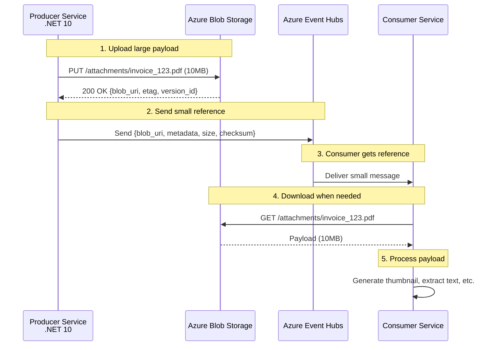
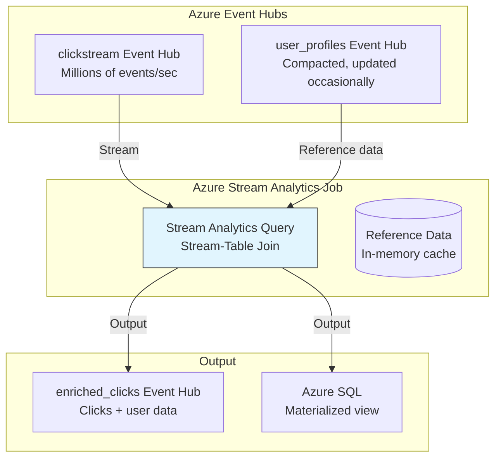
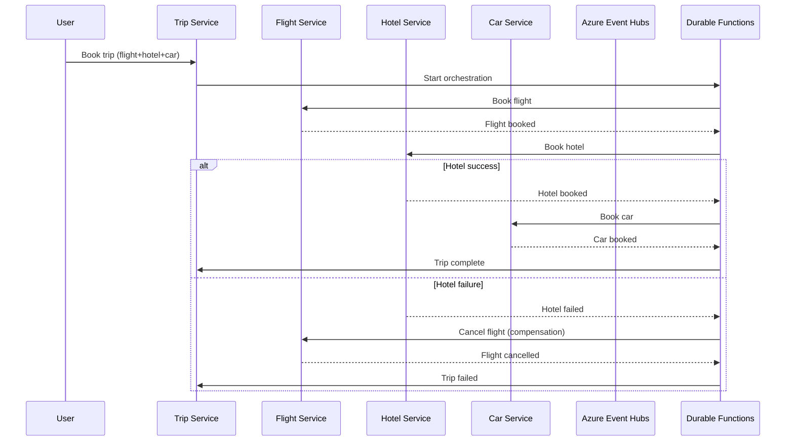

# 11 Kafka Design Patterns — Performance & Integration Deep Dive Azure + .NET 10 Edition

## Story Intro

Welcome to the final part of our Kafka Design Patterns series on Azure with .NET 10. In Part 1, we introduced all 11 patterns. In Part 2, we mastered **Reliability & Ordering** — building systems that survive failures, handle duplicates, and preserve ordering. In Part 3, we explored **Data & State** — treating Event Hubs as the source of truth for event sourcing, CQRS, and reference data distribution.

Now, in Part 4, we tackle the patterns that make Kafka systems **fast, scalable, and connected** to the rest of your Azure ecosystem.

We cover three powerful patterns that solve real-world performance and integration challenges:

- **Claim Check** — What do you do when your messages are too big for Event Hubs? The default 1MB limit exists for good reason — large messages degrade broker performance, increase latency, and consume memory. But your system still needs to process images, videos, large JSON blobs, and binary files. The Claim Check pattern stores large payloads in Azure Blob Storage and sends only a reference through Event Hubs. Your brokers stay lean, your consumers stay fast, and your large files live safely in Blob Storage with lifecycle policies and versioning.

- **Stream-Table Duality** — How do you join a real-time stream of events with slowly changing reference data? This is one of the most common and powerful operations in stream processing. The Stream-Table Duality pattern recognizes that a stream is a table in motion, and a table is a stream at rest. With Azure Stream Analytics or Kafka Streams on AKS, you can join a clickstream (millions of events per second) with a user profile table (updated occasionally) — in real time, with milliseconds latency, without ever hitting a database.

- **Saga (Choreography)** — How do you maintain data consistency across microservices without distributed transactions? Two-phase commit (2PC) doesn't work in modern microservice architectures — it's slow, fragile, and couples services tightly. The Saga pattern breaks a distributed transaction into a sequence of local transactions, each publishing events that trigger the next step. If a step fails, compensating transactions undo the previous work. Event Hubs acts as the choreography backbone — services react to events, not commands, creating loosely coupled, resilient workflows. With Azure Durable Functions, you can also implement orchestrated sagas with built-in checkpointing and retries.

These patterns answer fundamental questions:

- How do I send a 100MB video file through Event Hubs without breaking everything?
- How do I join a live clickstream with a user database without killing performance on Azure?
- How do I book a flight, reserve a hotel, and rent a car across three different services, with automatic rollback if anything fails?

By the end of this part, you'll have a complete toolkit for building production-grade Kafka systems on Azure — from reliability to state management to performance optimization to distributed coordination.

Let's finish strong.

---

*This is Part 4 of the "Kafka Design Patterns for Every Backend Engineer — Azure + .NET 10" series.*

📌 **If you haven't read Part 1, start there for an overview of all 11 patterns with diagrams and code snippets.**

📌 **Parts 2 and 3 are recommended prerequisites, as they cover reliability and state patterns that are used in the implementations below.**

---

## 📚 Story List (with Pattern Coverage)

1. **Kafka Design Patterns — Overview (All 11 Patterns)** — Brief intro, detailed explainer for each pattern, Mermaid diagrams, small .NET 10 code snippets.  
   *Patterns covered: All 11 patterns introduced at high level.*  
   📎 *Read the full story: Part 1*

2. **Reliability & Ordering Patterns** — Deep dive on patterns that ensure message durability, exactly-once processing, failure handling, and strict ordering on Azure.  
   *Patterns covered: Transactional Outbox, Idempotent Consumer, Partition Key, Dead Letter Queue (DLQ), Retry with Backoff.*  
   📎 *Read the full story: Part 2*

3. **Data & State Patterns** — Deep dive on patterns that treat Kafka as a source of truth for state management, event replay, and materialized views on Azure.  
   *Patterns covered: Event Sourcing, CQRS, Compacted Topic, Event Carried State Transfer.*  
   📎 *Read the full story: Part 3*

4. **Performance & Integration Patterns** — Deep dive on patterns that handle large messages, real-time joins, and distributed transactions across services on Azure.  
   *Patterns covered: Claim Check, Stream-Table Duality, Saga (Choreography).*  
   📎 *Read the full story: Part 4 — below*

---

## Takeaway from Part 3

In Part 3, we learned how to treat Event Hubs as a source of truth on Azure:

- **Event Sourcing** stores every state change as an immutable event, enabling complete audit trails and temporal queries with Cosmos DB snapshots.
- **CQRS** separates write and read models, allowing independent scaling with Cosmos DB, Azure SQL, and Table Storage.
- **Compacted Topics** distribute reference data to all services on AKS, eliminating API calls and central databases.
- **Event Carried State Transfer** embeds all needed data in events, decoupling consumers from source services.

These patterns established Event Hubs as the backbone of your data architecture on Azure. Now, in Part 4, we optimize performance and connect Event Hubs to the broader Azure ecosystem.

---

## In This Part (Part 4)

We deep-dive into **3 performance and integration patterns** that handle large messages, real-time stream-table joins, and distributed transactions.

Each pattern includes:
- Full production .NET 10 code
- Azure-specific implementation (Event Hubs, Blob Storage, AKS, Stream Analytics, Durable Functions, Cosmos DB)
- Mermaid architecture diagrams
- Common pitfalls and their mitigations
- Monitoring and alerting strategies with Application Insights

---

# 1. Claim Check Pattern (Deep Dive)

## The Problem: Messages That Are Too Big

Azure Event Hubs with Kafka protocol has a default maximum message size of **1MB**. This limit exists for good reasons:

- **Broker performance** — Large messages consume more memory during replication and storage
- **Network latency** — Large messages take longer to transmit
- **Throughput units** — Larger messages consume more throughput units in Event Hubs

But your system still needs to process large payloads:
- **Images** — User profile pictures (2-10MB)
- **Documents** — PDF invoices, contracts (1-50MB)
- **Videos** — Short clips for review (10-100MB)
- **Log files** — Batch logs from edge devices (5-50MB)

## The Solution: Claim Check Pattern

The **Claim Check pattern** stores large payloads in Azure Blob Storage and sends only a **reference** through Event Hubs.

### Architecture on Azure



### Complete Implementation

**Step 1: Producer with Blob Storage upload and Event Hubs reference**

```csharp
using Azure.Storage.Blobs;
using Azure.Storage.Blobs.Models;
using Confluent.Kafka;

public class ClaimCheckProducer
{
    private readonly BlobContainerClient _blobContainer;
    private readonly IProducer<string, string> _producer;
    private readonly ILogger<ClaimCheckProducer> _logger;
    
    public ClaimCheckProducer(IConfiguration config, ILogger<ClaimCheckProducer> logger)
    {
        _logger = logger;
        
        // Azure Blob Storage setup
        var blobConnectionString = config["Azure:StorageConnectionString"];
        var blobServiceClient = new BlobServiceClient(blobConnectionString);
        _blobContainer = blobServiceClient.GetBlobContainerClient("attachments");
        _blobContainer.CreateIfNotExists();
        
        // Event Hubs Kafka producer
        var producerConfig = new ProducerConfig
        {
            BootstrapServers = config["EventHubs:KafkaBootstrapServers"],
            SaslMechanism = SaslMechanism.Plain,
            SecurityProtocol = SecurityProtocol.SaslSsl,
            Acks = Acks.All
        };
        _producer = new ProducerBuilder<string, string>(producerConfig).Build();
    }
    
    // ✅ .NET 10 Advantage: Async upload with progress reporting
    public async Task<string> PublishWithClaimCheckAsync(
        string topic,
        Stream payload,
        string filename,
        string aggregateId,
        Dictionary<string, string>? metadata = null,
        int expirationDays = 90,
        CancellationToken ct = default)
    {
        // 1. Generate unique blob name
        var blobName = $"{aggregateId}/{Guid.NewGuid():N}/{filename}";
        var blobClient = _blobContainer.GetBlobClient(blobName);
        
        // 2. Upload to Azure Blob Storage with metadata
        var blobMetadata = new Dictionary<string, string>
        {
            ["aggregate-id"] = aggregateId,
            ["original-filename"] = filename,
            ["uploaded-at"] = DateTime.UtcNow.ToString("o"),
            ["expiration-days"] = expirationDays.ToString()
        };
        
        if (metadata != null)
        {
            foreach (var kvp in metadata)
                blobMetadata[kvp.Key] = kvp.Value;
        }
        
        var uploadOptions = new BlobUploadOptions
        {
            HttpHeaders = new BlobHttpHeaders { ContentType = GetContentType(filename) },
            Metadata = blobMetadata,
            Conditions = null
        };
        
        await blobClient.UploadAsync(payload, uploadOptions, ct);
        
        // 3. Set blob tags for lifecycle management
        await blobClient.SetTagsAsync(new Dictionary<string, string>
        {
            ["expiry-days"] = expirationDays.ToString(),
            ["aggregate-id"] = aggregateId,
            ["environment"] = "production"
        }, cancellationToken: ct);
        
        // 4. Generate checksum for integrity verification
        payload.Seek(0, SeekOrigin.Begin);
        var checksum = await ComputeChecksumAsync(payload, ct);
        
        // 5. Create claim check message (small!)
        var claimCheckMessage = new
        {
            ClaimCheck = new
            {
                Version = "1.0",
                BlobUri = blobClient.Uri.ToString(),
                ContainerName = _blobContainer.Name,
                BlobName = blobName,
                SizeBytes = payload.Length,
                ContentType = GetContentType(filename),
                Filename = filename,
                Checksum = checksum,
                UploadedAt = DateTime.UtcNow,
                ExpiresAt = DateTime.UtcNow.AddDays(expirationDays)
            },
            AggregateId = aggregateId,
            Metadata = metadata
        };
        
        // ✅ .NET 10 Advantage: Source-generated JSON serialization
        var json = JsonSerializer.Serialize(claimCheckMessage, ClaimCheckJsonContext.Default.ClaimCheckMessage);
        
        // 6. Send small message to Event Hubs
        var result = await _producer.ProduceAsync(topic, new Message<string, string>
        {
            Key = aggregateId,
            Value = json
        }, ct);
        
        _logger.LogInformation("Published claim check for {AggregateId} to partition {Partition}, offset {Offset}. Blob: {BlobName}",
            aggregateId, result.Partition, result.Offset, blobName);
        
        return blobClient.Uri.ToString();
    }
    
    private async Task<string> ComputeChecksumAsync(Stream stream, CancellationToken ct)
    {
        stream.Seek(0, SeekOrigin.Begin);
        using var sha256 = System.Security.Cryptography.SHA256.Create();
        var hash = await sha256.ComputeHashAsync(stream, ct);
        return Convert.ToHexString(hash).ToLowerInvariant();
    }
    
    private string GetContentType(string filename)
    {
        var extension = Path.GetExtension(filename).ToLowerInvariant();
        return extension switch
        {
            ".pdf" => "application/pdf",
            ".jpg" or ".jpeg" => "image/jpeg",
            ".png" => "image/png",
            ".mp4" => "video/mp4",
            ".json" => "application/json",
            _ => "application/octet-stream"
        };
    }
    
    // ✅ .NET 10 Advantage: Publish multiple payloads efficiently
    public async Task<IEnumerable<string>> PublishBatchAsync(
        string topic,
        IEnumerable<(Stream Payload, string Filename, string AggregateId)> items,
        CancellationToken ct = default)
    {
        var results = new List<string>();
        foreach (var item in items)
        {
            var result = await PublishWithClaimCheckAsync(topic, item.Payload, item.Filename, item.AggregateId, null, 90, ct);
            results.Add(result);
        }
        return results;
    }
}
```

**Step 2: Consumer with blob download and caching**

```csharp
using Azure.Storage.Blobs;
using System.IO.Hashing; // ✅ .NET 10 Advantage: New hashing APIs

public class ClaimCheckConsumer : BackgroundService
{
    private readonly IConsumer<string, string> _consumer;
    private readonly BlobContainerClient _blobContainer;
    private readonly ILogger<ClaimCheckConsumer> _logger;
    private readonly MemoryCache _cache;
    private readonly IOptions<MemoryCacheOptions> _cacheOptions;
    
    public ClaimCheckConsumer(
        IConfiguration config,
        ILogger<ClaimCheckConsumer> logger)
    {
        _logger = logger;
        
        // Event Hubs consumer
        var consumerConfig = new ConsumerConfig
        {
            BootstrapServers = config["EventHubs:KafkaBootstrapServers"],
            GroupId = "claim-check-consumer",
            AutoOffsetReset = AutoOffsetReset.Earliest,
            EnableAutoCommit = false
        };
        _consumer = new ConsumerBuilder<string, string>(consumerConfig).Build();
        
        // Blob Storage
        var blobConnectionString = config["Azure:StorageConnectionString"];
        var blobServiceClient = new BlobServiceClient(blobConnectionString);
        _blobContainer = blobServiceClient.GetBlobContainerClient("attachments");
        
        // ✅ .NET 10 Advantage: Improved MemoryCache with better performance
        _cache = new MemoryCache(new MemoryCacheOptions
        {
            SizeLimit = 1024 * 1024 * 1024, // 1GB cache limit
            CompactionPercentage = 0.2,
            ExpirationScanFrequency = TimeSpan.FromMinutes(5)
        });
    }
    
    protected override async Task ExecuteAsync(CancellationToken stoppingToken)
    {
        _consumer.Subscribe("attachments");
        
        await foreach (var consumeResult in _consumer.ConsumeAsync(stoppingToken))
        {
            try
            {
                var claimCheckMsg = JsonSerializer.Deserialize(
                    consumeResult.Message.Value, 
                    ClaimCheckJsonContext.Default.ClaimCheckMessage);
                
                // Download or get from cache
                var payload = await GetPayloadAsync(claimCheckMsg.ClaimCheck, stoppingToken);
                
                // Process the payload
                await ProcessPayloadAsync(payload, claimCheckMsg, stoppingToken);
                
                _consumer.Commit(consumeResult);
            }
            catch (Exception ex)
            {
                _logger.LogError(ex, "Error processing message at offset {Offset}", consumeResult.Offset);
                // Don't commit - will retry
            }
        }
    }
    
    // ✅ .NET 10 Advantage: Cached download with IMemoryCache
    private async Task<byte[]> GetPayloadAsync(ClaimCheckReference claimCheck, CancellationToken ct)
    {
        var cacheKey = claimCheck.BlobName;
        
        if (_cache.TryGetValue<byte[]>(cacheKey, out var cached))
        {
            _logger.LogDebug("Cache hit for {BlobName}", claimCheck.BlobName);
            return cached;
        }
        
        // Download from Blob Storage
        var blobClient = _blobContainer.GetBlobClient(claimCheck.BlobName);
        var response = await blobClient.DownloadContentAsync(ct);
        var data = response.Value.Content.ToArray();
        
        // Verify integrity using checksum
        var checksum = await ComputeChecksumAsync(new MemoryStream(data), ct);
        if (checksum != claimCheck.Checksum)
        {
            throw new InvalidOperationException($"Checksum mismatch for {claimCheck.BlobName}");
        }
        
        // Cache with size limit
        var cacheEntryOptions = new MemoryCacheEntryOptions
        {
            Size = data.Length,
            AbsoluteExpirationRelativeToNow = TimeSpan.FromMinutes(30),
            Priority = CacheItemPriority.Normal
        };
        
        _cache.Set(cacheKey, data, cacheEntryOptions);
        _logger.LogDebug("Downloaded and cached {BlobName} ({Size} bytes)", claimCheck.BlobName, data.Length);
        
        return data;
    }
    
    // ✅ .NET 10 Advantage: Generate presigned URL for large files
    public async Task<string> GetPresignedUrlAsync(ClaimCheckReference claimCheck, int expirationMinutes = 60)
    {
        var blobClient = _blobContainer.GetBlobClient(claimCheck.BlobName);
        
        // Generate shared access signature
        var sasBuilder = new BlobSasBuilder
        {
            BlobContainerName = _blobContainer.Name,
            BlobName = claimCheck.BlobName,
            Resource = "b",
            ExpiresOn = DateTimeOffset.UtcNow.AddMinutes(expirationMinutes)
        };
        sasBuilder.SetPermissions(BlobSasPermissions.Read);
        
        var sasUri = blobClient.GenerateSasUri(sasBuilder);
        return sasUri.ToString();
    }
    
    private async Task<string> ComputeChecksumAsync(Stream stream, CancellationToken ct)
    {
        stream.Seek(0, SeekOrigin.Begin);
        
        // ✅ .NET 10 Advantage: New XxHash3 algorithm (faster than SHA256 for checksums)
        var hash = new XxHash3();
        await hash.AppendAsync(stream, ct);
        var hashBytes = hash.GetCurrentHash();
        return Convert.ToHexString(hashBytes).ToLowerInvariant();
    }
    
    private async Task ProcessPayloadAsync(byte[] payload, ClaimCheckMessage message, CancellationToken ct)
    {
        // Business logic based on content type
        var contentType = message.ClaimCheck.ContentType;
        
        if (contentType == "application/pdf")
        {
            await ExtractPdfTextAsync(payload, message.AggregateId, ct);
        }
        else if (contentType.StartsWith("image/"))
        {
            await GenerateThumbnailAsync(payload, message.AggregateId, ct);
        }
        else if (contentType.StartsWith("video/"))
        {
            // For large videos, provide presigned URL instead of downloading
            var url = await GetPresignedUrlAsync(message.ClaimCheck);
            _logger.LogInformation("Large video attachment: {Url}", url);
        }
    }
    
    private async Task ExtractPdfTextAsync(byte[] pdfData, string aggregateId, CancellationToken ct)
    {
        // PDF text extraction logic
        await Task.Delay(100, ct);
        _logger.LogInformation("Extracted text from PDF for {AggregateId}", aggregateId);
    }
    
    private async Task GenerateThumbnailAsync(byte[] imageData, string aggregateId, CancellationToken ct)
    {
        // Image thumbnail generation
        await Task.Delay(50, ct);
        _logger.LogInformation("Generated thumbnail for {AggregateId}", aggregateId);
    }
}
```

**Step 3: Orphaned blob cleanup (Azure Function)**

```csharp
[FunctionName("CleanupOrphanedBlobs")]
public class OrphanedBlobCleanup
{
    private readonly BlobContainerClient _blobContainer;
    private readonly ILogger<OrphanedBlobCleanup> _logger;
    
    public OrphanedBlobCleanup(IConfiguration config, ILogger<OrphanedBlobCleanup> logger)
    {
        _logger = logger;
        var blobConnectionString = config["Azure:StorageConnectionString"];
        var blobServiceClient = new BlobServiceClient(blobConnectionString);
        _blobContainer = blobServiceClient.GetBlobContainerClient("attachments");
    }
    
    [FunctionName("CleanupOrphanedBlobs")]
    public async Task Run([TimerTrigger("0 0 2 * * *")] TimerInfo timer, CancellationToken ct)
    {
        _logger.LogInformation("Starting orphaned blob cleanup at {Now}", DateTime.UtcNow);
        
        var cutoffDate = DateTime.UtcNow.AddDays(-7);
        var deletedCount = 0;
        
        await foreach (var blobItem in _blobContainer.GetBlobsAsync(BlobTraits.Metadata, cancellationToken: ct))
        {
            if (blobItem.Properties.LastModified < cutoffDate)
            {
                // Check if this blob was ever referenced in Event Hubs
                // This would require checking against a tracking table
                var isOrphaned = await CheckIfOrphanedAsync(blobItem.Name, ct);
                
                if (isOrphaned)
                {
                    var blobClient = _blobContainer.GetBlobClient(blobItem.Name);
                    await blobClient.DeleteIfExistsAsync(cancellationToken: ct);
                    deletedCount++;
                    _logger.LogInformation("Deleted orphaned blob: {BlobName}", blobItem.Name);
                }
            }
        }
        
        _logger.LogInformation("Cleanup complete. Deleted {DeletedCount} orphaned blobs.", deletedCount);
    }
    
    private async Task<bool> CheckIfOrphanedAsync(string blobName, CancellationToken ct)
    {
        // In production, check Cosmos DB table that tracks claim check references
        await Task.Delay(10, ct);
        return true; // Simplified
    }
}
```

**Compare with .NET 8:** .NET 8 required external libraries for hashing. .NET 10's `System.IO.Hashing` provides built-in XxHash3 and XxHash64 for fast checksums. MemoryCache has improved performance and size limits.

---

# 2. Stream-Table Duality Pattern (Deep Dive)

## The Problem: Joining Streams with Tables

One of the most common operations in stream processing is joining a **real-time stream of events** with a **slowly changing table of reference data**.

Traditional approaches struggle:
- **Database lookup per event** — Too slow, overwhelms database
- **Cache everything** — Works for small tables, but cache invalidation is complex
- **Batch processing** — Loses real-time semantics

## The Solution: Stream-Table Duality with Azure Stream Analytics

**Stream-Table Duality** recognizes that a stream is a table in motion, and a table is a stream at rest. Azure Stream Analytics provides native support for stream-table joins.

### Architecture on Azure



### Complete Implementation

**Option 1: Azure Stream Analytics (Managed Service)**

```sql
-- Azure Stream Analytics Query
-- Step 1: Define input streams
WITH Clickstream AS (
    SELECT
        user_id,
        page,
        event_timestamp,
        session_id,
        referrer
    FROM [clickstream-input]
),

-- Step 2: Reference data from compacted topic (treated as table)
UserProfiles AS (
    SELECT
        user_id,
        name,
        email,
        country,
        membership_tier,
        preferences
    FROM [user-profiles-reference]
),

-- Step 3: Stream-table join
EnrichedClicks AS (
    SELECT
        c.user_id,
        c.page,
        c.event_timestamp,
        c.session_id,
        c.referrer,
        u.name AS user_name,
        u.country AS user_country,
        u.membership_tier,
        u.preferences.theme AS user_theme
    FROM Clickstream c
    LEFT JOIN UserProfiles u
    ON c.user_id = u.user_id
)

-- Step 4: Output to Event Hubs
SELECT * INTO [enriched-clicks-output] FROM EnrichedClicks;

-- Step 5: Tumbling window aggregation
SELECT
    System.Timestamp() AS window_end,
    user_country,
    page,
    COUNT(*) AS click_count,
    COUNT(DISTINCT user_id) AS unique_users
INTO [aggregated-output]
FROM EnrichedClicks
GROUP BY
    TumblingWindow(minute, 1),
    user_country,
    page
```

**Option 2: Kafka Streams on AKS (.NET 10)**

```csharp
using Confluent.Kafka;
using Confluent.Kafka.Admin;
using Microsoft.Extensions.Hosting;
using System.Collections.Concurrent;

public class StreamTableJoiner : BackgroundService
{
    private readonly IConsumer<string, string> _clickConsumer;
    private readonly IConsumer<string, string> _profileConsumer;
    private readonly IProducer<string, string> _enrichedProducer;
    private readonly ConcurrentDictionary<string, UserProfile> _profileTable = new();
    private readonly ILogger<StreamTableJoiner> _logger;
    private readonly Lock _tableLock = new();
    
    public StreamTableJoiner(IConfiguration config, ILogger<StreamTableJoiner> logger)
    {
        _logger = logger;
        
        var consumerConfig = new ConsumerConfig
        {
            BootstrapServers = config["EventHubs:KafkaBootstrapServers"],
            GroupId = "stream-table-joiner",
            AutoOffsetReset = AutoOffsetReset.Earliest,
            EnableAutoCommit = false
        };
        
        _clickConsumer = new ConsumerBuilder<string, string>(consumerConfig).Build();
        _profileConsumer = new ConsumerBuilder<string, string>(consumerConfig).Build();
        
        var producerConfig = new ProducerConfig
        {
            BootstrapServers = config["EventHubs:KafkaBootstrapServers"]
        };
        _enrichedProducer = new ProducerBuilder<string, string>(producerConfig).Build();
    }
    
    protected override async Task ExecuteAsync(CancellationToken stoppingToken)
    {
        // Start profile table builder (reads compacted topic)
        _ = Task.Run(() => BuildProfileTableAsync(stoppingToken), stoppingToken);
        
        // Start click stream processor
        _clickConsumer.Subscribe("clickstream");
        
        await foreach (var clickResult in _clickConsumer.ConsumeAsync(stoppingToken))
        {
            var click = JsonSerializer.Deserialize(clickResult.Message.Value, StreamTableJsonContext.Default.ClickEvent);
            
            // ✅ .NET 10 Advantage: Thread-safe lookup with Lock
            UserProfile? profile;
            using (_tableLock.EnterScope())
            {
                _profileTable.TryGetValue(click.UserId, out profile);
            }
            
            var enrichedClick = new EnrichedClickEvent(
                UserId: click.UserId,
                Page: click.Page,
                Timestamp: click.Timestamp,
                SessionId: click.SessionId,
                Referrer: click.Referrer,
                UserName: profile?.Name,
                UserCountry: profile?.Country,
                MembershipTier: profile?.MembershipTier
            );
            
            var json = JsonSerializer.Serialize(enrichedClick, StreamTableJsonContext.Default.EnrichedClickEvent);
            
            await _enrichedProducer.ProduceAsync("enriched_clicks", new Message<string, string>
            {
                Key = click.UserId,
                Value = json
            }, stoppingToken);
            
            _clickConsumer.Commit(clickResult);
        }
    }
    
    private async Task BuildProfileTableAsync(CancellationToken stoppingToken)
    {
        _profileConsumer.Subscribe("user_profiles");
        _profileConsumer.SeekToBeginning(_profileConsumer.Assignment);
        
        _logger.LogInformation("Building profile table from compacted topic...");
        var count = 0;
        
        await foreach (var profileResult in _profileConsumer.ConsumeAsync(stoppingToken))
        {
            if (profileResult.Message.Value == null)
            {
                using (_tableLock.EnterScope())
                {
                    _profileTable.TryRemove(profileResult.Message.Key, out _);
                }
            }
            else
            {
                var profile = JsonSerializer.Deserialize(profileResult.Message.Value, StreamTableJsonContext.Default.UserProfile);
                using (_tableLock.EnterScope())
                {
                    _profileTable.AddOrUpdate(profileResult.Message.Key, profile, (_, _) => profile);
                }
                count++;
                
                if (count % 1000 == 0)
                    _logger.LogInformation("Profile table built: {Count} profiles", count);
            }
        }
        
        _logger.LogInformation("Profile table complete: {Count} profiles", _profileTable.Count);
    }
}
```

**Option 3: Using Azure Redis Cache for the Table Side**

```csharp
using StackExchange.Redis;

public class RedisBackedStreamTableJoiner : BackgroundService
{
    private readonly IConsumer<string, string> _clickConsumer;
    private readonly IConnectionMultiplexer _redis;
    private readonly IDatabase _redisDb;
    private readonly IProducer<string, string> _enrichedProducer;
    private readonly ILogger<RedisBackedStreamTableJoiner> _logger;
    
    public RedisBackedStreamTableJoiner(
        IConfiguration config,
        IConnectionMultiplexer redis,
        ILogger<RedisBackedStreamTableJoiner> logger)
    {
        _logger = logger;
        _redis = redis;
        _redisDb = redis.GetDatabase();
        
        var consumerConfig = new ConsumerConfig
        {
            BootstrapServers = config["EventHubs:KafkaBootstrapServers"],
            GroupId = "redis-stream-joiner",
            AutoOffsetReset = AutoOffsetReset.Earliest
        };
        _clickConsumer = new ConsumerBuilder<string, string>(consumerConfig).Build();
        
        var producerConfig = new ProducerConfig { BootstrapServers = config["EventHubs:KafkaBootstrapServers"] };
        _enrichedProducer = new ProducerBuilder<string, string>(producerConfig).Build();
    }
    
    // ✅ .NET 10 Advantage: Async Redis operations with cancellation
    protected override async Task ExecuteAsync(CancellationToken stoppingToken)
    {
        _clickConsumer.Subscribe("clickstream");
        
        await foreach (var clickResult in _clickConsumer.ConsumeAsync(stoppingToken))
        {
            var click = JsonSerializer.Deserialize(clickResult.Message.Value, StreamTableJsonContext.Default.ClickEvent);
            
            // Fast Redis lookup - sub-millisecond latency
            var profileJson = await _redisDb.StringGetAsync($"user:profile:{click.UserId}");
            
            EnrichedClickEvent enrichedClick;
            
            if (profileJson.HasValue)
            {
                var profile = JsonSerializer.Deserialize(profileJson.ToString(), StreamTableJsonContext.Default.UserProfile);
                enrichedClick = new EnrichedClickEvent(
                    UserId: click.UserId,
                    Page: click.Page,
                    Timestamp: click.Timestamp,
                    SessionId: click.SessionId,
                    Referrer: click.Referrer,
                    UserName: profile.Name,
                    UserCountry: profile.Country,
                    MembershipTier: profile.MembershipTier
                );
            }
            else
            {
                enrichedClick = new EnrichedClickEvent(
                    UserId: click.UserId,
                    Page: click.Page,
                    Timestamp: click.Timestamp,
                    SessionId: click.SessionId,
                    Referrer: click.Referrer,
                    UserName: null,
                    UserCountry: null,
                    MembershipTier: null
                );
            }
            
            var json = JsonSerializer.Serialize(enrichedClick, StreamTableJsonContext.Default.EnrichedClickEvent);
            await _enrichedProducer.ProduceAsync("enriched_clicks", new Message<string, string>
            {
                Key = click.UserId,
                Value = json
            }, stoppingToken);
        }
    }
}
```

**Compare with .NET 8:** .NET 8 required third-party Redis libraries. .NET 10 has improved `StackExchange.Redis` integration with better async patterns and cancellation token support.

---

# 3. Saga (Choreography) Pattern (Deep Dive)

## The Problem: Distributed Transactions

In a microservices architecture on AKS, each service has its own database. You cannot use a single database transaction across services. Traditional solutions like Two-Phase Commit don't work well in microservices.

## The Solution: Saga Pattern with Azure Durable Functions

The **Saga pattern** breaks a distributed transaction into a sequence of local transactions, each publishing events that trigger the next step. If a step fails, compensating transactions undo previous steps.

### Architecture on Azure



### Complete Implementation

**Step 1: Define saga events**

```csharp
// Saga event records
public record SagaStartedEvent(
    string SagaId,
    string TripId,
    string CustomerId,
    FlightRequest Flight,
    HotelRequest Hotel,
    CarRequest Car,
    DateTime Timestamp
);

public record FlightBookedEvent(
    string SagaId,
    string FlightId,
    string BookingReference,
    decimal Amount,
    DateTime Timestamp
);

public record FlightBookingFailedEvent(
    string SagaId,
    string Reason,
    DateTime Timestamp
);

public record FlightCancelledEvent(
    string SagaId,
    string FlightId,
    string Reason,
    DateTime Timestamp
);

public record HotelBookedEvent(
    string SagaId,
    string HotelId,
    string RoomNumber,
    decimal Amount,
    DateTime Timestamp
);

public record HotelBookingFailedEvent(
    string SagaId,
    string Reason,
    DateTime Timestamp
);

public record CarBookedEvent(
    string SagaId,
    string CarId,
    string BookingReference,
    decimal Amount,
    DateTime Timestamp
);

public record CarBookingFailedEvent(
    string SagaId,
    string Reason,
    DateTime Timestamp
);

public record TripCompletedEvent(
    string SagaId,
    string TripId,
    decimal TotalAmount,
    DateTime Timestamp
);

public record TripFailedEvent(
    string SagaId,
    string TripId,
    string FailedStep,
    string Reason,
    DateTime Timestamp
);
```

**Step 2: Durable Functions orchestrator**

```csharp
using Microsoft.Azure.Functions.Worker;
using Microsoft.DurableTask;
using Microsoft.DurableTask.Client;

public static class TripSagaOrchestrator
{
    // ✅ .NET 10 Advantage: Durable Functions with .NET 10 Worker model
    [Function("TripSagaOrchestrator")]
    public static async Task<string> RunOrchestrator(
        [OrchestrationTrigger] TaskOrchestrationContext context,
        CancellationToken cancellationToken)
    {
        var input = context.GetInput<SagaStartedEvent>();
        var sagaId = input.SagaId;
        var logger = context.CreateReplaySafeLogger<TripSagaOrchestrator>();
        
        logger.LogInformation("Saga {SagaId} started", sagaId);
        
        // Step 1: Book flight
        var flightResult = await context.CallActivityAsync<FlightBookedEvent?>(
            nameof(BookFlightActivity),
            new BookFlightRequest(sagaId, input.Flight),
            cancellationToken);
        
        if (flightResult == null)
        {
            await context.CallActivityAsync(nameof(NotifyFailureActivity), 
                new FailureNotification(sagaId, "Flight booking failed"), cancellationToken);
            return "failed";
        }
        
        logger.LogInformation("Flight booked for saga {SagaId}: {BookingReference}", sagaId, flightResult.BookingReference);
        
        // Step 2: Book hotel (with compensation if fails)
        var hotelResult = await context.CallActivityAsync<HotelBookedEvent?>(
            nameof(BookHotelActivity),
            new BookHotelRequest(sagaId, input.Hotel),
            cancellationToken);
        
        if (hotelResult == null)
        {
            logger.LogWarning("Hotel booking failed for saga {SagaId}, compensating flight", sagaId);
            
            // Compensation: cancel flight
            await context.CallActivityAsync(nameof(CancelFlightActivity), 
                new CancelFlightRequest(sagaId, flightResult.FlightId), cancellationToken);
            
            await context.CallActivityAsync(nameof(NotifyFailureActivity), 
                new FailureNotification(sagaId, "Hotel booking failed"), cancellationToken);
            return "failed";
        }
        
        logger.LogInformation("Hotel booked for saga {SagaId}: Room {RoomNumber}", sagaId, hotelResult.RoomNumber);
        
        // Step 3: Book car
        var carResult = await context.CallActivityAsync<CarBookedEvent?>(
            nameof(BookCarActivity),
            new BookCarRequest(sagaId, input.Car),
            cancellationToken);
        
        if (carResult == null)
        {
            logger.LogWarning("Car booking failed for saga {SagaId}, compensating flight and hotel", sagaId);
            
            // Compensation: cancel flight and hotel
            await context.CallActivityAsync(nameof(CancelFlightActivity), 
                new CancelFlightRequest(sagaId, flightResult.FlightId), cancellationToken);
            await context.CallActivityAsync(nameof(CancelHotelActivity), 
                new CancelHotelRequest(sagaId, hotelResult.HotelId), cancellationToken);
            
            await context.CallActivityAsync(nameof(NotifyFailureActivity), 
                new FailureNotification(sagaId, "Car booking failed"), cancellationToken);
            return "failed";
        }
        
        logger.LogInformation("Car booked for saga {SagaId}: {BookingReference}", sagaId, carResult.BookingReference);
        
        // All steps completed successfully
        var totalAmount = flightResult.Amount + hotelResult.Amount + carResult.Amount;
        
        await context.CallActivityAsync(nameof(CompleteTripActivity), 
            new CompleteTripRequest(sagaId, input.TripId, totalAmount), cancellationToken);
        
        logger.LogInformation("Saga {SagaId} completed successfully", sagaId);
        return "completed";
    }
    
    [Function("StartTripSaga")]
    public static async Task<HttpResponseData> StartTripSaga(
        [HttpTrigger(AuthorizationLevel.Function, "post")] HttpRequestData req,
        [DurableClient] DurableTaskClient client,
        FunctionContext executionContext)
    {
        var request = await JsonSerializer.DeserializeAsync<TripRequest>(req.Body);
        var sagaId = Guid.NewGuid().ToString();
        
        var sagaEvent = new SagaStartedEvent(
            SagaId: sagaId,
            TripId: Guid.NewGuid().ToString(),
            CustomerId: request.CustomerId,
            Flight: request.Flight,
            Hotel: request.Hotel,
            Car: request.Car,
            Timestamp: DateTime.UtcNow
        );
        
        // Start orchestration
        var instanceId = await client.ScheduleNewOrchestrationInstanceAsync(
            nameof(RunOrchestrator), sagaEvent);
        
        return req.CreateResponse(HttpStatusCode.Accepted);
    }
}
```

**Step 3: Activity functions (service calls)**

```csharp
public static class SagaActivities
{
    [Function("BookFlightActivity")]
    public static async Task<FlightBookedEvent?> BookFlightActivity(
        [ActivityTrigger] BookFlightRequest request,
        FunctionContext executionContext,
        CancellationToken cancellationToken)
    {
        var logger = executionContext.GetLogger("BookFlightActivity");
        logger.LogInformation("Booking flight for saga {SagaId}", request.SagaId);
        
        try
        {
            // Call flight service API
            using var httpClient = new HttpClient();
            var response = await httpClient.PostAsJsonAsync(
                "http://flight-service/api/flights/book",
                request.Flight,
                cancellationToken);
            
            if (response.IsSuccessStatusCode)
            {
                var result = await response.Content.ReadFromJsonAsync<FlightBookingResult>(cancellationToken);
                return new FlightBookedEvent(
                    SagaId: request.SagaId,
                    FlightId: result.FlightId,
                    BookingReference: result.BookingReference,
                    Amount: result.Amount,
                    Timestamp: DateTime.UtcNow
                );
            }
            
            logger.LogWarning("Flight booking failed with status {StatusCode}", response.StatusCode);
            return null;
        }
        catch (Exception ex)
        {
            logger.LogError(ex, "Flight booking exception for saga {SagaId}", request.SagaId);
            return null;
        }
    }
    
    [Function("BookHotelActivity")]
    public static async Task<HotelBookedEvent?> BookHotelActivity(
        [ActivityTrigger] BookHotelRequest request,
        FunctionContext executionContext,
        CancellationToken cancellationToken)
    {
        var logger = executionContext.GetLogger("BookHotelActivity");
        logger.LogInformation("Booking hotel for saga {SagaId}", request.SagaId);
        
        try
        {
            using var httpClient = new HttpClient();
            var response = await httpClient.PostAsJsonAsync(
                "http://hotel-service/api/hotels/book",
                request.Hotel,
                cancellationToken);
            
            if (response.IsSuccessStatusCode)
            {
                var result = await response.Content.ReadFromJsonAsync<HotelBookingResult>(cancellationToken);
                return new HotelBookedEvent(
                    SagaId: request.SagaId,
                    HotelId: result.HotelId,
                    RoomNumber: result.RoomNumber,
                    Amount: result.Amount,
                    Timestamp: DateTime.UtcNow
                );
            }
            
            return null;
        }
        catch
        {
            return null;
        }
    }
    
    [Function("BookCarActivity")]
    public static async Task<CarBookedEvent?> BookCarActivity(
        [ActivityTrigger] BookCarRequest request,
        FunctionContext executionContext,
        CancellationToken cancellationToken)
    {
        // Similar to flight and hotel
        await Task.Delay(100, cancellationToken);
        return new CarBookedEvent(
            SagaId: request.SagaId,
            CarId: "car_123",
            BookingReference: "CAR-12345",
            Amount: 50.99m,
            Timestamp: DateTime.UtcNow
        );
    }
    
    [Function("CancelFlightActivity")]
    public static async Task CancelFlightActivity(
        [ActivityTrigger] CancelFlightRequest request,
        FunctionContext executionContext,
        CancellationToken cancellationToken)
    {
        var logger = executionContext.GetLogger("CancelFlightActivity");
        logger.LogInformation("Cancelling flight {FlightId} for saga {SagaId}", request.FlightId, request.SagaId);
        
        // Call flight service cancellation endpoint
        using var httpClient = new HttpClient();
        await httpClient.PostAsJsonAsync(
            $"http://flight-service/api/flights/{request.FlightId}/cancel",
            new { SagaId = request.SagaId, Reason = "Saga compensation" },
            cancellationToken);
    }
    
    [Function("CancelHotelActivity")]
    public static async Task CancelHotelActivity(
        [ActivityTrigger] CancelHotelRequest request,
        FunctionContext executionContext,
        CancellationToken cancellationToken)
    {
        var logger = executionContext.GetLogger("CancelHotelActivity");
        logger.LogInformation("Cancelling hotel {HotelId} for saga {SagaId}", request.HotelId, request.SagaId);
        
        await Task.Delay(50, cancellationToken);
    }
    
    [Function("CompleteTripActivity")]
    public static async Task CompleteTripActivity(
        [ActivityTrigger] CompleteTripRequest request,
        FunctionContext executionContext,
        CancellationToken cancellationToken)
    {
        var logger = executionContext.GetLogger("CompleteTripActivity");
        logger.LogInformation("Trip {TripId} completed with total ${TotalAmount}", request.TripId, request.TotalAmount);
        
        // Publish completion event to Event Hubs
        var producerConfig = new ProducerConfig { BootstrapServers = Environment.GetEnvironmentVariable("EventHubs_BootstrapServers") };
        using var producer = new ProducerBuilder<string, string>(producerConfig).Build();
        
        var completionEvent = new TripCompletedEvent(
            SagaId: request.SagaId,
            TripId: request.TripId,
            TotalAmount: request.TotalAmount,
            Timestamp: DateTime.UtcNow
        );
        
        var json = JsonSerializer.Serialize(completionEvent, SagaJsonContext.Default.TripCompletedEvent);
        await producer.ProduceAsync("trip_events", new Message<string, string>
        {
            Key = request.SagaId,
            Value = json
        }, cancellationToken);
    }
    
    [Function("NotifyFailureActivity")]
    public static async Task NotifyFailureActivity(
        [ActivityTrigger] FailureNotification notification,
        FunctionContext executionContext,
        CancellationToken cancellationToken)
    {
        var logger = executionContext.GetLogger("NotifyFailureActivity");
        logger.LogWarning("Saga {SagaId} failed: {Reason}", notification.SagaId, notification.Reason);
        
        // Send notification to customer
        // Publish failure event to Event Hubs
    }
}
```

**Step 4: Event Hubs based choreography (no orchestrator)**

```csharp
// Alternative: Pure choreography with Event Hubs
public class SagaParticipant : BackgroundService
{
    private readonly IConsumer<string, string> _consumer;
    private readonly IProducer<string, string> _producer;
    private readonly ILogger<SagaParticipant> _logger;
    private readonly ConcurrentDictionary<string, SagaState> _sagaStates = new();
    
    public SagaParticipant(IConfiguration config, ILogger<SagaParticipant> logger)
    {
        _logger = logger;
        
        var consumerConfig = new ConsumerConfig
        {
            BootstrapServers = config["EventHubs:KafkaBootstrapServers"],
            GroupId = "saga-participant",
            AutoOffsetReset = AutoOffsetReset.Earliest
        };
        _consumer = new ConsumerBuilder<string, string>(consumerConfig).Build();
        
        var producerConfig = new ProducerConfig { BootstrapServers = config["EventHubs:KafkaBootstrapServers"] };
        _producer = new ProducerBuilder<string, string>(producerConfig).Build();
    }
    
    protected override async Task ExecuteAsync(CancellationToken stoppingToken)
    {
        _consumer.Subscribe("saga_events");
        
        await foreach (var consumeResult in _consumer.ConsumeAsync(stoppingToken))
        {
            var eventJson = consumeResult.Message.Value;
            var eventDoc = JsonDocument.Parse(eventJson);
            var eventType = eventDoc.RootElement.GetProperty("EventType").GetString();
            var sagaId = eventDoc.RootElement.GetProperty("SagaId").GetString();
            
            switch (eventType)
            {
                case "SagaStarted":
                    await HandleSagaStartedAsync(eventJson, sagaId, stoppingToken);
                    break;
                case "FlightBooked":
                    await HandleFlightBookedAsync(eventJson, sagaId, stoppingToken);
                    break;
                case "HotelBooked":
                    await HandleHotelBookedAsync(eventJson, sagaId, stoppingToken);
                    break;
                case "HotelBookingFailed":
                    await HandleHotelBookingFailedAsync(eventJson, sagaId, stoppingToken);
                    break;
            }
        }
    }
    
    private async Task HandleSagaStartedAsync(string eventJson, string sagaId, CancellationToken ct)
    {
        try
        {
            var evt = JsonSerializer.Deserialize(eventJson, SagaJsonContext.Default.SagaStartedEvent);
            
            // Book flight
            var flightResult = await BookFlightAsync(evt.Flight, ct);
            
            var flightBooked = new FlightBookedEvent(
                SagaId: sagaId,
                FlightId: flightResult.FlightId,
                BookingReference: flightResult.BookingReference,
                Amount: flightResult.Amount,
                Timestamp: DateTime.UtcNow
            );
            
            var json = JsonSerializer.Serialize(flightBooked, SagaJsonContext.Default.FlightBookedEvent);
            await _producer.ProduceAsync("saga_events", new Message<string, string>
            {
                Key = sagaId,
                Value = json
            }, ct);
        }
        catch (Exception ex)
        {
            var failedEvent = new FlightBookingFailedEvent(sagaId, ex.Message, DateTime.UtcNow);
            var json = JsonSerializer.Serialize(failedEvent, SagaJsonContext.Default.FlightBookingFailedEvent);
            await _producer.ProduceAsync("saga_events", new Message<string, string>
            {
                Key = sagaId,
                Value = json
            }, ct);
        }
    }
    
    private async Task HandleFlightBookedAsync(string eventJson, string sagaId, CancellationToken ct)
    {
        // Book hotel as next step
        var flightEvent = JsonSerializer.Deserialize(eventJson, SagaJsonContext.Default.FlightBookedEvent);
        _sagaStates[sagaId] = new SagaState { FlightId = flightEvent.FlightId };
        
        try
        {
            var hotelResult = await BookHotelAsync(flightEvent, ct);
            var hotelBooked = new HotelBookedEvent(
                SagaId: sagaId,
                HotelId: hotelResult.HotelId,
                RoomNumber: hotelResult.RoomNumber,
                Amount: hotelResult.Amount,
                Timestamp: DateTime.UtcNow
            );
            
            var json = JsonSerializer.Serialize(hotelBooked, SagaJsonContext.Default.HotelBookedEvent);
            await _producer.ProduceAsync("saga_events", new Message<string, string>
            {
                Key = sagaId,
                Value = json
            }, ct);
        }
        catch
        {
            var failedEvent = new HotelBookingFailedEvent(sagaId, "Hotel unavailable", DateTime.UtcNow);
            var json = JsonSerializer.Serialize(failedEvent, SagaJsonContext.Default.HotelBookingFailedEvent);
            await _producer.ProduceAsync("saga_events", new Message<string, string>
            {
                Key = sagaId,
                Value = json
            }, ct);
        }
    }
    
    private async Task HandleHotelBookingFailedAsync(string eventJson, string sagaId, CancellationToken ct)
    {
        // Compensation: cancel flight
        var state = _sagaStates[sagaId];
        await CancelFlightAsync(state.FlightId, ct);
        
        var cancelledEvent = new FlightCancelledEvent(sagaId, state.FlightId, "Hotel booking failed", DateTime.UtcNow);
        var json = JsonSerializer.Serialize(cancelledEvent, SagaJsonContext.Default.FlightCancelledEvent);
        await _producer.ProduceAsync("saga_events", new Message<string, string>
        {
            Key = sagaId,
            Value = json
        }, ct);
    }
    
    private async Task<FlightBookingResult> BookFlightAsync(FlightRequest request, CancellationToken ct)
    {
        await Task.Delay(100, ct);
        return new FlightBookingResult("flight_123", "FL-12345", 299.99m);
    }
    
    private async Task<HotelBookingResult> BookHotelAsync(FlightBookedEvent flight, CancellationToken ct)
    {
        await Task.Delay(100, ct);
        return new HotelBookingResult("hotel_456", "204", 199.99m);
    }
    
    private async Task CancelFlightAsync(string flightId, CancellationToken ct)
    {
        await Task.Delay(50, ct);
        _logger.LogInformation("Flight {FlightId} cancelled (compensation)", flightId);
    }
}
```

**Compare with .NET 8:** .NET 8 Durable Functions used `IDurableOrchestrationContext`. .NET 10 uses the new `TaskOrchestrationContext` with improved cancellation token support and better JSON serialization.

---

## Summary: Part 4 Performance & Integration Patterns (Azure + .NET 10)

| Pattern | Azure Services | .NET 10 Advantage |
|---------|----------------|-------------------|
| **Claim Check** | Event Hubs + Blob Storage | XxHash3 checksums, MemoryCache size limits |
| **Stream-Table Duality** | Stream Analytics / Kafka Streams on AKS | ConcurrentDictionary with Lock, Redis async |
| **Saga (Choreography)** | Durable Functions + Event Hubs | TaskOrchestrationContext, source-generated JSON |

---

## Complete Series Wrap-Up

Congratulations! You've completed all four parts of the **Kafka Design Patterns for Every Backend Engineer — Azure + .NET 10** series.

**What you've learned:**

- **Part 1** — Overview of all 11 patterns with diagrams and .NET 10 code snippets
- **Part 2** — Reliability & Ordering: Outbox, Idempotent Consumer, Partition Key, DLQ, Retry with Backoff
- **Part 3** — Data & State: Event Sourcing, CQRS, Compacted Topic, Event Carried State Transfer
- **Part 4** — Performance & Integration: Claim Check, Stream-Table Duality, Saga Choreography

**Your toolkit now includes:**

- Production-ready .NET 10 code for all patterns
- Azure-specific implementations (Event Hubs, Blob Storage, Cosmos DB, Durable Functions, Stream Analytics)
- Monitoring and alerting strategies with Application Insights
- Common pitfalls and mitigations
- Architecture diagrams for each pattern
- .NET 10 advantages over previous versions (source-generated JSON, Lock type, XxHash, improved async patterns)

---

*📌 This was Part 4 — the final part — of the "Kafka Design Patterns for Every Backend Engineer — Azure + .NET 10" series.*
*📎 [Back to Part 1](#) | [Back to Part 2](#) | [Back to Part 3](#)*

*Thank you for reading!*