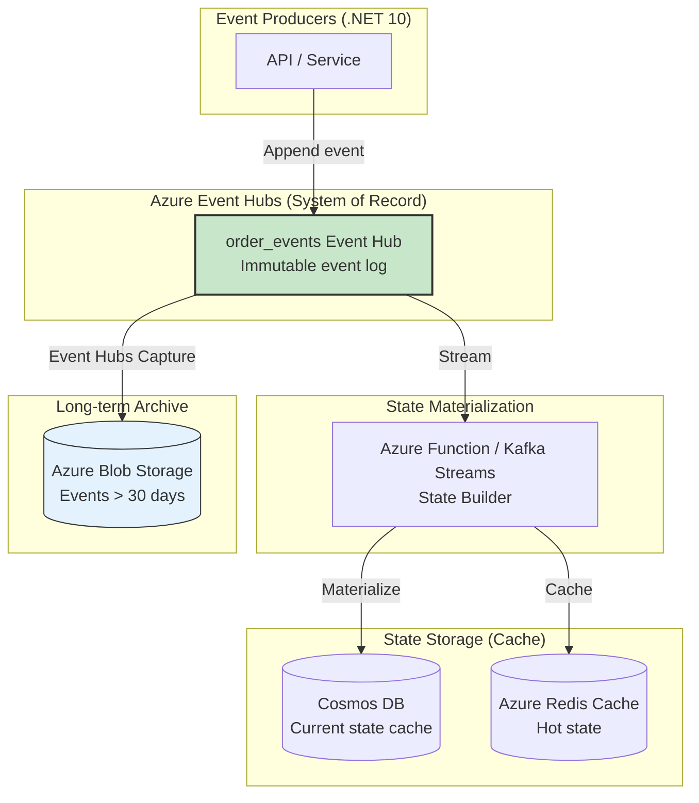
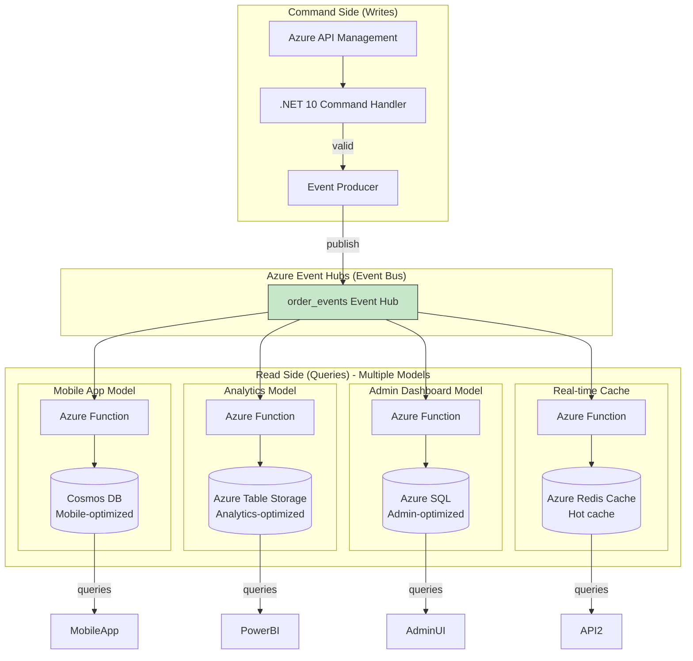
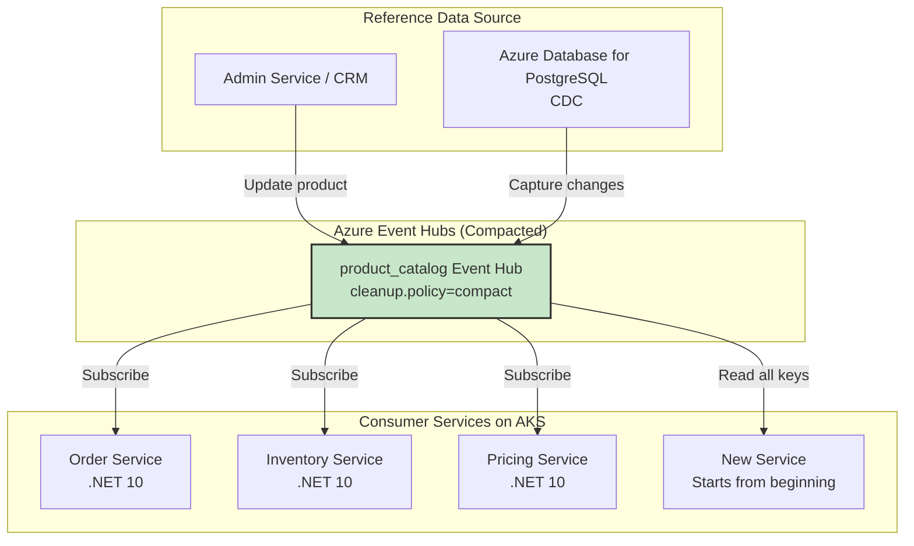

# 11 Kafka Design Patterns — Data & State Deep Dive (Azure + .NET 10 Edition)

## Story Intro

Welcome back to our Kafka Design Patterns series on Azure with .NET 10. In Part 1, we introduced all 11 patterns with diagrams and code snippets. In Part 2, we dove deep into **Reliability & Ordering Patterns** — Outbox, Idempotent Consumer, Partition Key, DLQ, and Retry with Backoff. You learned how to build systems on Azure that survive failures, handle duplicates, and preserve ordering.

Now it's time to shift focus from **how messages move** to **what messages mean**.

In Part 3, we explore four patterns that treat Kafka (via Azure Event Hubs) not just as a message bus, but as the **source of truth** for your domain. These patterns transform Event Hubs from a transport layer into the backbone of your data architecture:

- **Event Sourcing** — Store every state change as an immutable event. Your database becomes a cache; Event Hubs becomes the system of record. Need to know what your order looked like yesterday? Replay the events. Need to debug a production issue? The entire history is right there.

- **CQRS (Command Query Responsibility Segregation)** — Separate your writes (commands that change state) from your reads (queries that retrieve data). Use Event Hubs to asynchronously update read-optimized models. Your writes go fast because they just append to a log. Your reads go fast because they query purpose-built Cosmos DB containers. No more complex JOINs killing your performance.

- **Compacted Topic** — Turn an Event Hubs topic (with compacted policy) into a distributed, replicated, fault-tolerant key-value store. Need to distribute configuration to 100 microservices? Send it once to a compacted topic; every service running on AKS gets the latest version automatically.

- **Event Carried State Transfer** — Design events that carry all the data consumers need. No more fetching from the source service. No more cascading failures when that source service is down. Your consumers become decoupled, autonomous, and faster.

These patterns answer fundamental questions:

- How do I make my system auditable and replayable on Azure?
- How do I scale reads and writes independently using Cosmos DB?
- How do I distribute reference data without building a custom API?
- How do I evolve event schemas without breaking consumers using Azure Schema Registry?

By the end of this part, you'll be able to use Azure Event Hubs as a **durable source of truth** — not just a pipe between services. You'll build systems where the event log is the center of your universe, and databases are just materialized views.

Let's dive in.

---

*This is Part 3 of the "Kafka Design Patterns for Every Backend Engineer — Azure + .NET 10" series.*

📌 **If you haven't read Part 1, start there for an overview of all 11 patterns with diagrams and code snippets.**

📌 **If you haven't read Part 2, you can still follow this part, but Part 2 covers the reliability patterns that are prerequisites for production-ready implementations.**

---

## 📚 Story List (with Pattern Coverage)

1. **Kafka Design Patterns — Overview (All 11 Patterns)** — Brief intro, detailed explainer for each pattern, Mermaid diagrams, small .NET 10 code snippets.  
   *Patterns covered: All 11 patterns introduced at high level.*  
   📎 *Read the full story: Part 1*

2. **Reliability & Ordering Patterns** — Deep dive on patterns that ensure message durability, exactly-once processing, failure handling, and strict ordering on Azure.  
   *Patterns covered: Transactional Outbox, Idempotent Consumer, Partition Key, Dead Letter Queue (DLQ), Retry with Backoff.*  
   📎 *Read the full story: Part 2*

3. **Data & State Patterns** — Deep dive on patterns that treat Kafka as a source of truth for state management, event replay, and materialized views on Azure.  
   *Patterns covered: Event Sourcing, CQRS, Compacted Topic, Event Carried State Transfer.*  
   📎 *Read the full story: Part 3 — below*

4. **Performance & Integration Patterns** — Deep dive on patterns that handle large messages, real-time joins, and distributed transactions across services on Azure.  
   *Patterns covered: Claim Check, Stream-Table Duality, Saga (Choreography).*  
   📎 *Coming soon*

---

## Takeaway from Part 2

In Part 2, we learned how to make Kafka (Event Hubs) reliable on Azure:

- **Transactional Outbox** ensures you never lose events or create inconsistencies between your database and Event Hubs.
- **Idempotent Consumer** makes duplicates harmless — your business logic runs exactly once even if Event Hubs delivers messages multiple times.
- **Partition Key** preserves order per entity, enabling stateful processing.
- **Dead Letter Queue** quarantines poison messages so they don't block your pipeline.
- **Retry with Backoff** handles transient failures gracefully, giving your system time to recover.

These patterns are the foundation. Now, with reliability in place, we can trust Event Hubs as a durable store. That trust enables the Data & State patterns we cover in this part.

---

## In This Part (Part 3)

We deep-dive into **4 data and state patterns** that treat Event Hubs as the source of truth. These patterns transform Event Hubs from a message bus into the backbone of your data architecture.

Each pattern includes:
- Full production .NET 10 code
- Azure-specific implementation (Event Hubs, Cosmos DB, Azure SQL, Azure Schema Registry)
- Mermaid architecture diagrams
- Common pitfalls and their mitigations
- Monitoring and alerting strategies with Application Insights

---

# 1. Event Sourcing Pattern (Deep Dive)

## The Problem: Lost History and Auditability

Traditional applications store only the **current state** of an entity. When a user updates their profile, you overwrite the old values. When an order status changes, you update a single column. This approach is simple and efficient — but it throws away history.

What happens when you need to answer these questions?

- "What did this customer's profile look like last Tuesday before they reported the bug?"
- "How many times has this order changed status in the last 30 days?"
- "Can you prove that the compliance officer approved this transaction on March 15th at 2:34 PM?"
- "We found a bug in our payment calculation. Can you recalculate all orders from last week with the fix?"

With traditional stateful storage, these questions are difficult or impossible to answer.

## The Solution: Event Sourcing

**Event Sourcing** flips the traditional model on its head. Instead of storing the current state, you store every state-changing event as an immutable, append-only sequence. The current state is derived by replaying all events from the beginning. Your database becomes a **cache**; Event Hubs becomes the **system of record**.

### Architecture on Azure



### Complete Implementation

**Step 1: Define events with source-generated JSON (.NET 10)**

```csharp
using System.Text.Json.Serialization;

// ✅ .NET 10 Advantage: Source-generated JSON context for events
[JsonSourceGenerationOptions(PropertyNamingPolicy = JsonKnownNamingPolicy.CamelCase)]
[JsonSerializable(typeof(OrderCreatedEvent))]
[JsonSerializable(typeof(OrderStatusChangedEvent))]
[JsonSerializable(typeof(PaymentProcessedEvent))]
[JsonSerializable(typeof(OrderItemAddedEvent))]
[JsonSerializable(typeof(OrderItemRemovedEvent))]
[JsonSerializable(typeof(OrderSnapshot))]
internal partial class EventSourcingJsonContext : JsonSerializerContext { }

// Base event record
public abstract record Event(
    string EventId,
    string AggregateId,
    string AggregateType,
    string EventType,
    int EventVersion,
    DateTime Timestamp,
    string? UserId = null
);

// Order events
public record OrderCreatedEvent(
    string EventId,
    string AggregateId,
    string CustomerId,
    decimal Amount,
    List<OrderItem> Items,
    Address ShippingAddress,
    DateTime Timestamp
) : Event(EventId, AggregateId, "order", "OrderCreated", 1, Timestamp);

public record OrderStatusChangedEvent(
    string EventId,
    string AggregateId,
    string OldStatus,
    string NewStatus,
    string? Reason,
    DateTime Timestamp
) : Event(EventId, AggregateId, "order", "OrderStatusChanged", 1, Timestamp);

public record PaymentProcessedEvent(
    string EventId,
    string AggregateId,
    string PaymentId,
    decimal Amount,
    string Status,
    DateTime Timestamp
) : Event(EventId, AggregateId, "order", "PaymentProcessed", 1, Timestamp);

public record OrderItemAddedEvent(
    string EventId,
    string AggregateId,
    string ItemId,
    string ProductId,
    int Quantity,
    decimal UnitPrice,
    DateTime Timestamp
) : Event(EventId, AggregateId, "order", "OrderItemAdded", 1, Timestamp);

public record OrderItemRemovedEvent(
    string EventId,
    string AggregateId,
    string ItemId,
    string? Reason,
    DateTime Timestamp
) : Event(EventId, AggregateId, "order", "OrderItemRemoved", 1, Timestamp);

// State snapshot
public record OrderSnapshot(
    string AggregateId,
    string CustomerId,
    string Status,
    decimal TotalAmount,
    List<OrderItem> Items,
    Address ShippingAddress,
    string? PaymentId,
    string? PaymentStatus,
    DateTime LastUpdated,
    int EventsApplied,
    string LastEventId,
    DateTime LastEventTimestamp
);
```

**Step 2: Event producer (append-only to Event Hubs)**

```csharp
using Confluent.Kafka;
using Azure.Messaging.EventHubs.Producer;

public class EventSourcingProducer
{
    private readonly IProducer<string, string> _producer;
    private readonly ILogger<EventSourcingProducer> _logger;
    
    public EventSourcingProducer(IConfiguration config, ILogger<EventSourcingProducer> logger)
    {
        _logger = logger;
        var producerConfig = new ProducerConfig
        {
            BootstrapServers = config["EventHubs:KafkaBootstrapServers"],
            SaslMechanism = SaslMechanism.Plain,
            SecurityProtocol = SecurityProtocol.SaslSsl,
            Acks = Acks.All,  // Wait for all replicas
            EnableIdempotence = true
        };
        _producer = new ProducerBuilder<string, string>(producerConfig).Build();
    }
    
    // ✅ .NET 10 Advantage: Generic event publishing with source-generated JSON
    public async Task PublishEventAsync<T>(string topic, T eventData, CancellationToken ct) where T : Event
    {
        var json = JsonSerializer.Serialize(eventData, EventSourcingJsonContext.Default.Event);
        var message = new Message<string, string>
        {
            Key = eventData.AggregateId,
            Value = json
        };
        
        var result = await _producer.ProduceAsync(topic, message, ct);
        
        _logger.LogInformation("Published {EventType} for {AggregateId} to partition {Partition}, offset {Offset}",
            eventData.EventType, eventData.AggregateId, result.Partition, result.Offset);
    }
    
    public async Task<string> CreateOrderAsync(CreateOrderCommand command, CancellationToken ct)
    {
        var orderId = Guid.NewGuid().ToString();
        var eventId = Guid.NewGuid().ToString();
        
        var orderCreated = new OrderCreatedEvent(
            EventId: eventId,
            AggregateId: orderId,
            CustomerId: command.CustomerId,
            Amount: command.Items.Sum(i => i.Price * i.Quantity),
            Items: command.Items,
            ShippingAddress: command.ShippingAddress,
            Timestamp: DateTime.UtcNow
        );
        
        await PublishEventAsync("order_events", orderCreated, ct);
        return orderId;
    }
}
```

**Step 3: Event consumer with state rebuilding (Azure Function)**

```csharp
using Microsoft.Azure.Functions.Worker;
using Microsoft.Azure.Cosmos;

public class EventSourcingProcessor
{
    private readonly CosmosClient _cosmosClient;
    private readonly Container _snapshotContainer;
    private readonly ILogger<EventSourcingProcessor> _logger;
    
    public EventSourcingProcessor(CosmosClient cosmosClient, ILogger<EventSourcingProcessor> logger)
    {
        _cosmosClient = cosmosClient;
        _logger = logger;
        _snapshotContainer = _cosmosClient.GetContainer("EventSourcing", "OrderSnapshots");
    }
    
    // ✅ .NET 10 Advantage: Kafka trigger with native IAsyncEnumerable
    [Function("EventSourcingProcessor")]
    public async Task Run(
        [KafkaTrigger("broker:9092", "order_events", ConsumerGroup = "state-builder")] 
        KafkaEventData[] events,
        CancellationToken cancellationToken)
    {
        foreach (var eventData in events)
        {
            var eventJson = eventData.Value.ToString();
            var baseEvent = JsonSerializer.Deserialize(eventJson, EventSourcingJsonContext.Default.Event);
            
            // Apply event to state
            await ApplyEventToStateAsync(baseEvent, eventJson, cancellationToken);
        }
    }
    
    private async Task ApplyEventToStateAsync(Event baseEvent, string eventJson, CancellationToken ct)
    {
        var aggregateId = baseEvent.AggregateId;
        
        // Get current snapshot
        var snapshot = await GetLatestSnapshotAsync(aggregateId, ct);
        var state = snapshot?.State ?? new OrderState { OrderId = aggregateId };
        
        // Apply event based on type
        state = baseEvent.EventType switch
        {
            "OrderCreated" => ApplyOrderCreated(state, JsonSerializer.Deserialize(eventJson, EventSourcingJsonContext.Default.OrderCreatedEvent)),
            "OrderStatusChanged" => ApplyOrderStatusChanged(state, JsonSerializer.Deserialize(eventJson, EventSourcingJsonContext.Default.OrderStatusChangedEvent)),
            "PaymentProcessed" => ApplyPaymentProcessed(state, JsonSerializer.Deserialize(eventJson, EventSourcingJsonContext.Default.PaymentProcessedEvent)),
            "OrderItemAdded" => ApplyOrderItemAdded(state, JsonSerializer.Deserialize(eventJson, EventSourcingJsonContext.Default.OrderItemAddedEvent)),
            "OrderItemRemoved" => ApplyOrderItemRemoved(state, JsonSerializer.Deserialize(eventJson, EventSourcingJsonContext.Default.OrderItemRemovedEvent)),
            _ => state
        };
        
        state.EventsApplied++;
        state.LastEventId = baseEvent.EventId;
        state.LastEventTimestamp = baseEvent.Timestamp;
        state.LastUpdated = DateTime.UtcNow;
        
        // Save state to Cosmos DB
        await SaveStateAsync(aggregateId, state, ct);
        
        // Take snapshot every 100 events
        if (state.EventsApplied % 100 == 0)
        {
            await TakeSnapshotAsync(aggregateId, state, ct);
        }
    }
    
    private OrderState ApplyOrderCreated(OrderState state, OrderCreatedEvent? evt)
    {
        if (evt == null) return state;
        state.CustomerId = evt.CustomerId;
        state.TotalAmount = evt.Amount;
        state.Items = evt.Items;
        state.ShippingAddress = evt.ShippingAddress;
        state.Status = "created";
        return state;
    }
    
    private OrderState ApplyOrderStatusChanged(OrderState state, OrderStatusChangedEvent? evt)
    {
        if (evt == null) return state;
        state.Status = evt.NewStatus;
        if (evt.Reason != null)
            state.LastStatusReason = evt.Reason;
        return state;
    }
    
    private OrderState ApplyPaymentProcessed(OrderState state, PaymentProcessedEvent? evt)
    {
        if (evt == null) return state;
        state.PaymentId = evt.PaymentId;
        state.PaymentStatus = evt.Status;
        if (evt.Status == "succeeded")
            state.Status = "paid";
        return state;
    }
    
    private OrderState ApplyOrderItemAdded(OrderState state, OrderItemAddedEvent? evt)
    {
        if (evt == null) return state;
        state.Items.Add(new OrderItem
        {
            ItemId = evt.ItemId,
            ProductId = evt.ProductId,
            Quantity = evt.Quantity,
            Price = evt.UnitPrice
        });
        state.TotalAmount += evt.Quantity * evt.UnitPrice;
        return state;
    }
    
    private OrderState ApplyOrderItemRemoved(OrderState state, OrderItemRemovedEvent? evt)
    {
        if (evt == null) return state;
        var item = state.Items.FirstOrDefault(i => i.ItemId == evt.ItemId);
        if (item != null)
        {
            state.TotalAmount -= item.Quantity * item.Price;
            state.Items.Remove(item);
        }
        return state;
    }
    
    private async Task<OrderSnapshot?> GetLatestSnapshotAsync(string aggregateId, CancellationToken ct)
    {
        try
        {
            var response = await _snapshotContainer.ReadItemAsync<OrderSnapshot>(
                aggregateId, new PartitionKey(aggregateId), cancellationToken: ct);
            return response.Resource;
        }
        catch (CosmosException ex) when (ex.StatusCode == System.Net.HttpStatusCode.NotFound)
        {
            return null;
        }
    }
    
    private async Task SaveStateAsync(string aggregateId, OrderState state, CancellationToken ct)
    {
        var container = _cosmosClient.GetContainer("EventSourcing", "OrderStates");
        await container.UpsertItemAsync(state, new PartitionKey(aggregateId), cancellationToken: ct);
    }
    
    private async Task TakeSnapshotAsync(string aggregateId, OrderState state, CancellationToken ct)
    {
        var snapshot = new OrderSnapshot(
            AggregateId: aggregateId,
            CustomerId: state.CustomerId,
            Status: state.Status,
            TotalAmount: state.TotalAmount,
            Items: state.Items,
            ShippingAddress: state.ShippingAddress,
            PaymentId: state.PaymentId,
            PaymentStatus: state.PaymentStatus,
            LastUpdated: DateTime.UtcNow,
            EventsApplied: state.EventsApplied,
            LastEventId: state.LastEventId,
            LastEventTimestamp: state.LastEventTimestamp
        );
        
        await _snapshotContainer.UpsertItemAsync(snapshot, new PartitionKey(aggregateId), cancellationToken: ct);
        _logger.LogInformation("Snapshot taken for {AggregateId} at event {EventCount}", aggregateId, state.EventsApplied);
    }
}
```

**Step 4: Temporal query (rebuild state at a point in time)**

```csharp
public class TemporalQueryService
{
    private readonly IConsumer<string, string> _consumer;
    private readonly ILogger<TemporalQueryService> _logger;
    
    public TemporalQueryService(IConfiguration config, ILogger<TemporalQueryService> logger)
    {
        _logger = logger;
        var consumerConfig = new ConsumerConfig
        {
            BootstrapServers = config["EventHubs:KafkaBootstrapServers"],
            GroupId = "temporal-query",
            AutoOffsetReset = AutoOffsetReset.Earliest,
            EnableAutoCommit = false
        };
        _consumer = new ConsumerBuilder<string, string>(consumerConfig).Build();
    }
    
    // ✅ .NET 10 Advantage: Rebuild state up to a specific timestamp
    public async Task<OrderState> GetStateAtTimeAsync(string aggregateId, DateTime pointInTime, CancellationToken ct)
    {
        _consumer.Subscribe("order_events");
        _consumer.Assign(_consumer.Assignment);
        _consumer.SeekToBeginning(_consumer.Assignment);
        
        var state = new OrderState { OrderId = aggregateId };
        
        await foreach (var consumeResult in _consumer.ConsumeAsync(ct))
        {
            if (consumeResult.Message.Key != aggregateId)
                continue;
            
            var eventJson = consumeResult.Message.Value;
            var baseEvent = JsonSerializer.Deserialize(eventJson, EventSourcingJsonContext.Default.Event);
            
            // Stop when we pass the point in time
            if (baseEvent.Timestamp > pointInTime)
                break;
            
            // Apply event
            state = ApplyEvent(state, eventJson, baseEvent.EventType);
        }
        
        _logger.LogInformation("Rebuilt state for {AggregateId} at {PointInTime}", aggregateId, pointInTime);
        return state;
    }
    
    private OrderState ApplyEvent(OrderState state, string eventJson, string eventType)
    {
        // Event application logic (same as above)
        return state;
    }
}
```

**Compare with .NET 8:** .NET 8 required manual JSON serialization options and reflection-based event dispatching. .NET 10's source-generated JSON context provides compile-time validation and pattern matching for event types.

---

# 2. CQRS Pattern (Deep Dive)

## The Problem: One Model Doesn't Fit All

In traditional CRUD applications, you use the same data model for both reads and writes. As your system grows, this single model becomes a bottleneck:

- **Different access patterns** — Writes need validation; reads need filtering and aggregation.
- **Different scaling requirements** — Write workload vs read workload.
- **Different consistency requirements** — Writes need strong consistency; reads need eventual consistency.

## The Solution: CQRS

**CQRS** separates your system into two distinct models:

- **Command model (write side)** — Handles commands, validates, publishes events to Event Hubs.
- **Query model (read side)** — Handles queries from purpose-built read models updated asynchronously.

### Architecture on Azure



### Complete Implementation

**Step 1: Command side (write model)**

```csharp
// Command models
public record CreateOrderCommand(
    string CustomerId,
    List<OrderItem> Items,
    Address ShippingAddress,
    string PaymentMethod
);

public class OrderCommandHandler
{
    private readonly IProducer<string, string> _producer;
    private readonly IValidator<CreateOrderCommand> _validator;
    private readonly ILogger<OrderCommandHandler> _logger;
    
    public OrderCommandHandler(
        IProducer<string, string> producer,
        IValidator<CreateOrderCommand> validator,
        ILogger<OrderCommandHandler> logger)
    {
        _producer = producer;
        _validator = validator;
        _logger = logger;
    }
    
    // ✅ .NET 10 Advantage: FluentValidation with source-generated validation
    public async Task<string> HandleCreateOrderAsync(CreateOrderCommand command, CancellationToken ct)
    {
        // Validate command
        var validationResult = await _validator.ValidateAsync(command, ct);
        if (!validationResult.IsValid)
        {
            throw new ValidationException(validationResult.Errors);
        }
        
        // Business validation
        var totalAmount = command.Items.Sum(i => i.Price * i.Quantity);
        if (totalAmount <= 0)
            throw new InvalidOperationException("Order total must be positive");
        
        // Fraud detection
        var riskScore = await CalculateRiskScoreAsync(command, ct);
        if (riskScore > 0.8m)
        {
            _logger.LogWarning("High risk order detected for customer {CustomerId}", command.CustomerId);
            // Trigger fraud review workflow
        }
        
        // Create and publish event
        var orderId = Guid.NewGuid().ToString();
        var orderCreated = new OrderCreatedEvent(
            EventId: Guid.NewGuid().ToString(),
            AggregateId: orderId,
            CustomerId: command.CustomerId,
            Amount: totalAmount,
            Items: command.Items,
            ShippingAddress: command.ShippingAddress,
            Timestamp: DateTime.UtcNow
        );
        
        var json = JsonSerializer.Serialize(orderCreated, CqrsJsonContext.Default.OrderCreatedEvent);
        await _producer.ProduceAsync("order_events", new Message<string, string>
        {
            Key = orderId,
            Value = json
        }, ct);
        
        _logger.LogInformation("Order {OrderId} created for customer {CustomerId}", orderId, command.CustomerId);
        return orderId;
    }
    
    private async Task<decimal> CalculateRiskScoreAsync(CreateOrderCommand command, CancellationToken ct)
    {
        // Call fraud detection service
        await Task.Delay(10, ct);
        return 0.1m;
    }
}

// Validator with FluentValidation
public class CreateOrderCommandValidator : AbstractValidator<CreateOrderCommand>
{
    public CreateOrderCommandValidator()
    {
        RuleFor(x => x.CustomerId).NotEmpty().Matches("^cust_[a-zA-Z0-9]+$");
        RuleFor(x => x.Items).NotEmpty().WithMessage("Order must have at least one item");
        RuleForEach(x => x.Items).ChildRules(item =>
        {
            item.RuleFor(i => i.ProductId).NotEmpty();
            item.RuleFor(i => i.Quantity).GreaterThan(0);
            item.RuleFor(i => i.Price).GreaterThan(0);
        });
        RuleFor(x => x.ShippingAddress).NotNull();
        RuleFor(x => x.PaymentMethod).NotEmpty().Must(pm => new[] { "credit_card", "paypal", "apple_pay" }.Contains(pm));
    }
}
```

**Step 2: Read model updater for Cosmos DB (mobile app view)**

```csharp
public class CosmosDbReadModelUpdater
{
    private readonly CosmosClient _cosmosClient;
    private readonly Container _container;
    private readonly ILogger<CosmosDbReadModelUpdater> _logger;
    
    public CosmosDbReadModelUpdater(CosmosClient cosmosClient, ILogger<CosmosDbReadModelUpdater> logger)
    {
        _cosmosClient = cosmosClient;
        _logger = logger;
        _container = _cosmosClient.GetContainer("ReadModels", "MobileOrders");
    }
    
    [Function("UpdateMobileReadModel")]
    public async Task Run(
        [KafkaTrigger("broker:9092", "order_events", ConsumerGroup = "mobile-read-model")] 
        KafkaEventData[] events,
        CancellationToken cancellationToken)
    {
        foreach (var eventData in events)
        {
            var eventJson = eventData.Value.ToString();
            var baseEvent = JsonSerializer.Deserialize(eventJson, CqrsJsonContext.Default.Event);
            
            switch (baseEvent.EventType)
            {
                case "OrderCreated":
                    await HandleOrderCreatedAsync(eventJson, cancellationToken);
                    break;
                case "OrderStatusChanged":
                    await HandleOrderStatusChangedAsync(eventJson, cancellationToken);
                    break;
                case "PaymentProcessed":
                    await HandlePaymentProcessedAsync(eventJson, cancellationToken);
                    break;
            }
        }
    }
    
    private async Task HandleOrderCreatedAsync(string eventJson, CancellationToken ct)
    {
        var evt = JsonSerializer.Deserialize(eventJson, CqrsJsonContext.Default.OrderCreatedEvent);
        
        var mobileOrder = new
        {
            id = evt.AggregateId,
            customerId = evt.CustomerId,
            status = "created",
            amount = evt.Amount,
            itemsCount = evt.Items.Count,
            createdAt = evt.Timestamp,
            updatedAt = DateTime.UtcNow,
            // For GSI queries
            customerIdStatus = $"{evt.CustomerId}#created",
            ttl = 2592000 // 30 days
        };
        
        await _container.UpsertItemAsync(mobileOrder, new PartitionKey(evt.AggregateId), cancellationToken: ct);
        _logger.LogInformation("Updated mobile read model for order {OrderId}", evt.AggregateId);
    }
    
    private async Task HandleOrderStatusChangedAsync(string eventJson, CancellationToken ct)
    {
        var evt = JsonSerializer.Deserialize(eventJson, CqrsJsonContext.Default.OrderStatusChangedEvent);
        
        var patchOperations = new[]
        {
            PatchOperation.Set("/status", evt.NewStatus),
            PatchOperation.Set("/updatedAt", DateTime.UtcNow)
        };
        
        await _container.PatchItemAsync<object>(evt.AggregateId, new PartitionKey(evt.AggregateId), patchOperations, cancellationToken: ct);
    }
    
    private async Task HandlePaymentProcessedAsync(string eventJson, CancellationToken ct)
    {
        var evt = JsonSerializer.Deserialize(eventJson, CqrsJsonContext.Default.PaymentProcessedEvent);
        
        var patchOperations = new[]
        {
            PatchOperation.Set("/paymentStatus", evt.Status),
            PatchOperation.Set("/paidAt", evt.Timestamp),
            PatchOperation.Set("/updatedAt", DateTime.UtcNow)
        };
        
        await _container.PatchItemAsync<object>(evt.AggregateId, new PartitionKey(evt.AggregateId), patchOperations, cancellationToken: ct);
    }
}
```

**Step 3: Query side API**

```csharp
[ApiController]
[Route("api/[controller]")]
public class OrdersController : ControllerBase
{
    private readonly CosmosClient _cosmosClient;
    private readonly Container _mobileContainer;
    
    public OrdersController(CosmosClient cosmosClient)
    {
        _cosmosClient = cosmosClient;
        _mobileContainer = _cosmosClient.GetContainer("ReadModels", "MobileOrders");
    }
    
    // ✅ .NET 10 Advantage: Native async endpoints with CancellationToken
    [HttpGet("mobile/{orderId}")]
    public async Task<IActionResult> GetMobileOrder(string orderId, CancellationToken cancellationToken)
    {
        try
        {
            var response = await _mobileContainer.ReadItemAsync<object>(
                orderId, new PartitionKey(orderId), cancellationToken: cancellationToken);
            return Ok(response.Resource);
        }
        catch (CosmosException ex) when (ex.StatusCode == System.Net.HttpStatusCode.NotFound)
        {
            return NotFound();
        }
    }
    
    [HttpGet("mobile/customers/{customerId}/orders")]
    public async Task<IActionResult> GetCustomerOrders(
        string customerId, 
        [FromQuery] string? status, 
        [FromQuery] int limit = 20,
        CancellationToken cancellationToken = default)
    {
        var query = status != null
            ? new QueryDefinition("SELECT * FROM c WHERE c.customerId = @customerId AND c.status = @status")
                .WithParameter("@customerId", customerId)
                .WithParameter("@status", status)
            : new QueryDefinition("SELECT * FROM c WHERE c.customerId = @customerId")
                .WithParameter("@customerId", customerId);
        
        var iterator = _mobileContainer.GetItemQueryIterator<object>(query, requestOptions: new QueryRequestOptions
        {
            MaxItemCount = limit
        });
        
        var results = new List<object>();
        while (iterator.HasMoreResults && results.Count < limit)
        {
            var response = await iterator.ReadNextAsync(cancellationToken);
            results.AddRange(response.Resource);
        }
        
        return Ok(results.Take(limit));
    }
}
```

**Compare with .NET 8:** .NET 8 required manual JSON serialization for patch operations. .NET 10's Cosmos DB SDK has improved async APIs and better integration with `CancellationToken`.

---

# 3. Compacted Topic Pattern (Deep Dive)

## The Problem: Distributing Reference Data

In a microservices architecture on AKS, many services need access to the same reference data: product catalogs, user profiles, configuration settings, feature flags.

Traditional approaches have drawbacks:
- **Shared database** — Creates tight coupling between services
- **API calls** — Network latency and cascading failures
- **Caching** — Staleness and cache invalidation complexity

## The Solution: Compacted Topic

A **compacted topic** (Event Hubs with `cleanup.policy=compact`) retains only the latest message for each key. This turns the topic into a **distributed key-value store**.

### Architecture on Azure



### Complete Implementation

**Step 1: Create compacted topic in Event Hubs**

```bash
# Using Azure CLI to create Event Hub with compacted policy
az eventhubs eventhub create \
  --resource-group my-rg \
  --namespace my-namespace \
  --name product-catalog \
  --cleanup-policy compact \
  --retention-time 7
```

**Step 2: Producer for reference data**

```csharp
public class CompactedTopicProducer
{
    private readonly IProducer<string, string> _producer;
    private readonly ILogger<CompactedTopicProducer> _logger;
    
    public CompactedTopicProducer(IConfiguration config, ILogger<CompactedTopicProducer> logger)
    {
        _logger = logger;
        var producerConfig = new ProducerConfig
        {
            BootstrapServers = config["EventHubs:KafkaBootstrapServers"],
            SaslMechanism = SaslMechanism.Plain,
            SecurityProtocol = SecurityProtocol.SaslSsl,
            Acks = Acks.All,
            EnableIdempotence = true
        };
        _producer = new ProducerBuilder<string, string>(producerConfig).Build();
    }
    
    // ✅ .NET 10 Advantage: Publish product with version tracking
    public async Task PublishProductAsync(Product product, CancellationToken ct)
    {
        product.Version++;
        product.UpdatedAt = DateTime.UtcNow;
        
        var json = JsonSerializer.Serialize(product, CompactedJsonContext.Default.Product);
        
        await _producer.ProduceAsync("product_catalog", new Message<string, string>
        {
            Key = product.Id,
            Value = json
        }, ct);
        
        _logger.LogInformation("Published product {ProductId} version {Version}", product.Id, product.Version);
    }
    
    // ✅ .NET 10 Advantage: Publish tombstone to delete product
    public async Task DeleteProductAsync(string productId, CancellationToken ct)
    {
        await _producer.ProduceAsync("product_catalog", new Message<string, string>
        {
            Key = productId,
            Value = null  // Tombstone
        }, ct);
        
        _logger.LogInformation("Deleted product {ProductId} (tombstone published)", productId);
    }
    
    public async Task InitialLoadAsync(IEnumerable<Product> products, CancellationToken ct)
    {
        foreach (var product in products)
        {
            await PublishProductAsync(product, ct);
        }
        _logger.LogInformation("Initial load completed: {Count} products published", products.Count());
    }
}
```

**Step 3: Consumer with local cache**

```csharp
public class CompactedTopicConsumer : BackgroundService
{
    private readonly IConsumer<string, string> _consumer;
    private readonly ConcurrentDictionary<string, Product> _cache = new();
    private readonly ILogger<CompactedTopicConsumer> _logger;
    private readonly Lock _cacheLock = new();
    
    public CompactedTopicConsumer(IConfiguration config, ILogger<CompactedTopicConsumer> logger)
    {
        _logger = logger;
        var consumerConfig = new ConsumerConfig
        {
            BootstrapServers = config["EventHubs:KafkaBootstrapServers"],
            GroupId = "product-cache",
            AutoOffsetReset = AutoOffsetReset.Earliest,  // Read all from beginning
            EnableAutoCommit = true
        };
        _consumer = new ConsumerBuilder<string, string>(consumerConfig).Build();
    }
    
    // ✅ .NET 10 Advantage: Initialize cache from compacted topic
    public async Task InitializeCacheAsync(CancellationToken cancellationToken)
    {
        _consumer.Subscribe("product_catalog");
        _consumer.SeekToBeginning(_consumer.Assignment);
        
        _logger.LogInformation("Initializing cache from compacted topic...");
        var count = 0;
        
        await foreach (var consumeResult in _consumer.ConsumeAsync(cancellationToken))
        {
            if (consumeResult.Message.Value == null)
            {
                using (_cacheLock.EnterScope())
                {
                    _cache.TryRemove(consumeResult.Message.Key, out _);
                }
                _logger.LogDebug("Removed {Key} from cache (tombstone)", consumeResult.Message.Key);
            }
            else
            {
                var product = JsonSerializer.Deserialize(consumeResult.Message.Value, CompactedJsonContext.Default.Product);
                using (_cacheLock.EnterScope())
                {
                    _cache.AddOrUpdate(consumeResult.Message.Key, product, (_, _) => product);
                }
                count++;
                if (count % 1000 == 0)
                    _logger.LogInformation("Cached {Count} products so far...", count);
            }
        }
        
        _logger.LogInformation("Cache initialized with {Count} products", _cache.Count);
    }
    
    public Product? GetProduct(string productId)
    {
        using (_cacheLock.EnterScope())
        {
            _cache.TryGetValue(productId, out var product);
            return product;
        }
    }
    
    public IReadOnlyList<Product> GetAllProducts()
    {
        using (_cacheLock.EnterScope())
        {
            return _cache.Values.ToList().AsReadOnly();
        }
    }
    
    public IReadOnlyList<Product> SearchProducts(Func<Product, bool> predicate)
    {
        using (_cacheLock.EnterScope())
        {
            return _cache.Values.Where(predicate).ToList().AsReadOnly();
        }
    }
    
    protected override async Task ExecuteAsync(CancellationToken stoppingToken)
    {
        await InitializeCacheAsync(stoppingToken);
        
        // Continue listening for updates
        _consumer.Subscribe("product_catalog");
        
        await foreach (var consumeResult in _consumer.ConsumeAsync(stoppingToken))
        {
            if (consumeResult.Message.Value == null)
            {
                using (_cacheLock.EnterScope())
                {
                    _cache.TryRemove(consumeResult.Message.Key, out _);
                }
                _logger.LogDebug("Real-time: removed {Key}", consumeResult.Message.Key);
            }
            else
            {
                var product = JsonSerializer.Deserialize(consumeResult.Message.Value, CompactedJsonContext.Default.Product);
                using (_cacheLock.EnterScope())
                {
                    _cache.AddOrUpdate(consumeResult.Message.Key, product, (_, _) => product);
                }
                _logger.LogDebug("Real-time: updated {Key} to version {Version}",
                    consumeResult.Message.Key, product.Version);
            }
        }
    }
}

// Order service using the cache
public class OrderService
{
    private readonly CompactedTopicConsumer _productCache;
    
    public OrderService(CompactedTopicConsumer productCache)
    {
        _productCache = productCache;
    }
    
    public async Task<Order> CreateOrderAsync(CreateOrderCommand command, CancellationToken ct)
    {
        var total = 0m;
        var items = new List<OrderItem>();
        
        foreach (var item in command.Items)
        {
            // ✅ .NET 10 Advantage: No network call - data is in local cache
            var product = _productCache.GetProduct(item.ProductId);
            if (product == null)
                throw new InvalidOperationException($"Product {item.ProductId} not found");
            
            items.Add(new OrderItem
            {
                ProductId = item.ProductId,
                ProductName = product.Name,
                Quantity = item.Quantity,
                UnitPrice = product.Price,
                Subtotal = product.Price * item.Quantity
            });
            
            total += product.Price * item.Quantity;
        }
        
        // Create order...
        return new Order { Id = Guid.NewGuid().ToString(), Items = items, Total = total };
    }
}
```

**Compare with .NET 8:** .NET 8 required manual `ConcurrentDictionary` management. .NET 10's `Lock` type and improved `ConsumeAsync` provide better thread safety and performance.

---

# 4. Event Carried State Transfer Pattern (Deep Dive)

## The Problem: The Fetcher Pattern

In many event-driven architectures, events contain only identifiers, and consumers must fetch the rest of the data from the source service. This creates:
- **Temporal coupling** — Consumer can't process if source service is down
- **Network latency** — Extra round-trip per event
- **Load amplification** — One update triggers many fetches

## The Solution: Event Carried State Transfer

Events contain **all the data** that consumers might need. No fetching required.

### Architecture on Azure

```mermaid
graph TB
    subgraph "Producer Service (.NET 10)"
        UserSvc[User Service]
        Enricher[Event Enricher<br/>Adds full profile]
    end
    
    subgraph "Azure Event Hubs"
        Topic[user_events Event Hub<br/>Events carry full state]
    end
    
    subgraph "Consumers (No fetching!)"
        EmailSvc[Email Service]
        NotifSvc[Notification Service]
        AnalyticsSvc[Analytics Service]
        CacheSvc[Cache Service]
    end
    
    UserSvc -->|User changes| Enricher
    Enricher -->|Full user profile| Topic
    
    Topic --> EmailSvc
    Topic --> NotifSvc
    Topic --> AnalyticsSvc
    Topic --> CacheSvc
    
    Note over EmailSvc,NotifSvc: No calls back to User Service!
    
    style Topic fill:#c8e6c9,stroke:#333
```

### Complete Implementation

**Step 1: Define self-contained events**

```csharp
// ✅ .NET 10 Advantage: Records with all needed data
public record UserUpdatedEvent(
    string EventId,
    string UserId,
    string Name,
    string Email,
    string? Phone,
    UserPreferences Preferences,
    Dictionary<string, string> Metadata,
    List<string> ChangedFields,
    int UserVersion,
    DateTime Timestamp
) : IEvent;

public record UserPreferences(
    bool NotificationsEnabled,
    string TimeZone,
    string Theme,
    bool EmailDigest
);

public record OrderCreatedEvent(
    string EventId,
    string OrderId,
    string CustomerId,
    decimal Amount,
    string Status,
    string CustomerEmail,      // Carried state
    string CustomerName,       // Carried state
    string? CustomerPhone,     // Carried state
    List<EnrichedOrderItem> Items,  // Carried state with product details
    Address ShippingAddress,   // Carried state
    decimal? RiskScore         // Carried state from fraud detection
) : IEvent;

public record EnrichedOrderItem(
    string ProductId,
    string Name,      // Carried from product catalog
    decimal Price,    // Carried from product catalog
    int Quantity,
    decimal Subtotal
);
```

**Step 2: Producer enriches events before publishing**

```csharp
public class EnrichedEventProducer
{
    private readonly IProducer<string, string> _producer;
    private readonly IUserRepository _userRepository;
    private readonly IProductRepository _productRepository;
    private readonly IFraudDetectionService _fraudService;
    private readonly ILogger<EnrichedEventProducer> _logger;
    
    public EnrichedEventProducer(
        IProducer<string, string> producer,
        IUserRepository userRepository,
        IProductRepository productRepository,
        IFraudDetectionService fraudService,
        ILogger<EnrichedEventProducer> logger)
    {
        _producer = producer;
        _userRepository = userRepository;
        _productRepository = productRepository;
        _fraudService = fraudService;
        _logger = logger;
    }
    
    // ✅ .NET 10 Advantage: Enrich at publish time, not consume time
    public async Task PublishUserUpdatedAsync(string userId, List<string> changedFields, CancellationToken ct)
    {
        // Fetch full user state ONCE at publish time
        var user = await _userRepository.GetUserAsync(userId, ct);
        
        var userEvent = new UserUpdatedEvent(
            EventId: Guid.NewGuid().ToString(),
            UserId: userId,
            Name: user.Name,
            Email: user.Email,
            Phone: user.Phone,
            Preferences: user.Preferences,
            Metadata: user.Metadata,
            ChangedFields: changedFields,
            UserVersion: user.Version,
            Timestamp: DateTime.UtcNow
        );
        
        var json = JsonSerializer.Serialize(userEvent, EcstJsonContext.Default.UserUpdatedEvent);
        
        await _producer.ProduceAsync("user_events", new Message<string, string>
        {
            Key = userId,
            Value = json
        }, ct);
        
        _logger.LogInformation("Published enriched UserUpdated event for {UserId} with {ChangedFields} changes",
            userId, changedFields.Count);
    }
    
    public async Task PublishOrderCreatedAsync(Order order, CancellationToken ct)
    {
        // Fetch customer data ONCE
        var customer = await _userRepository.GetCustomerAsync(order.CustomerId, ct);
        
        // Fetch product details for each item
        var enrichedItems = new List<EnrichedOrderItem>();
        foreach (var item in order.Items)
        {
            var product = await _productRepository.GetProductAsync(item.ProductId, ct);
            enrichedItems.Add(new EnrichedOrderItem(
                ProductId: item.ProductId,
                Name: product.Name,
                Price: product.Price,
                Quantity: item.Quantity,
                Subtotal: product.Price * item.Quantity
            ));
        }
        
        // Calculate risk score
        var riskScore = await _fraudService.CalculateRiskScoreAsync(order, customer, ct);
        
        var orderEvent = new OrderCreatedEvent(
            EventId: Guid.NewGuid().ToString(),
            OrderId: order.Id,
            CustomerId: order.CustomerId,
            Amount: enrichedItems.Sum(i => i.Subtotal),
            Status: "created",
            CustomerEmail: customer.Email,
            CustomerName: customer.Name,
            CustomerPhone: customer.Phone,
            Items: enrichedItems,
            ShippingAddress: order.ShippingAddress,
            RiskScore: riskScore
        );
        
        var json = JsonSerializer.Serialize(orderEvent, EcstJsonContext.Default.OrderCreatedEvent);
        
        await _producer.ProduceAsync("order_events", new Message<string, string>
        {
            Key = order.Id,
            Value = json
        }, ct);
        
        _logger.LogInformation("Published enriched OrderCreated event for {OrderId} with {ItemCount} items",
            order.Id, enrichedItems.Count);
    }
}
```

**Step 3: Consumers with no external fetches**

```csharp
public class EmailNotificationConsumer : BackgroundService
{
    private readonly IConsumer<string, string> _consumer;
    private readonly IEmailService _emailService;
    private readonly ILogger<EmailNotificationConsumer> _logger;
    
    public EmailNotificationConsumer(
        IConsumer<string, string> consumer,
        IEmailService emailService,
        ILogger<EmailNotificationConsumer> logger)
    {
        _consumer = consumer;
        _emailService = emailService;
        _logger = logger;
    }
    
    protected override async Task ExecuteAsync(CancellationToken stoppingToken)
    {
        _consumer.Subscribe("user_events", "order_events");
        
        await foreach (var consumeResult in _consumer.ConsumeAsync(stoppingToken))
        {
            var eventJson = consumeResult.Message.Value;
            var topic = consumeResult.Topic;
            
            if (topic == "user_events")
            {
                // ✅ .NET 10 Advantage: All data in event - no fetch needed!
                var userEvent = JsonSerializer.Deserialize(eventJson, EcstJsonContext.Default.UserUpdatedEvent);
                
                if (userEvent.ChangedFields.Contains("email") && userEvent.Preferences.NotificationsEnabled)
                {
                    await _emailService.SendAsync(
                        to: userEvent.Email,
                        subject: "Your email was updated",
                        body: $"Hi {userEvent.Name}, your email has been changed to {userEvent.Email}.",
                        cancellationToken: stoppingToken
                    );
                    _logger.LogInformation("Sent email change notification to {Email}", userEvent.Email);
                }
            }
            else if (topic == "order_events")
            {
                var orderEvent = JsonSerializer.Deserialize(eventJson, EcstJsonContext.Default.OrderCreatedEvent);
                
                // Build email content from event data - no fetches!
                var emailBody = $@"
Hi {orderEvent.CustomerName},

Thank you for your order #{orderEvent.OrderId}!

Items:
{string.Join("\n", orderEvent.Items.Select(i => $"  - {i.Quantity}x {i.Name} @ ${i.Price:F2}"))}

Total: ${orderEvent.Amount:F2}

Shipping to: {orderEvent.ShippingAddress.Street}, {orderEvent.ShippingAddress.City}
";
                
                await _emailService.SendAsync(
                    to: orderEvent.CustomerEmail,
                    subject: $"Order Confirmation #{orderEvent.OrderId}",
                    body: emailBody,
                    cancellationToken: stoppingToken
                );
                _logger.LogInformation("Sent order confirmation to {Email}", orderEvent.CustomerEmail);
            }
        }
    }
}

public class FraudDetectionConsumer : BackgroundService
{
    private readonly IConsumer<string, string> _consumer;
    private readonly IFraudAlertService _alertService;
    private readonly ILogger<FraudDetectionConsumer> _logger;
    
    public FraudDetectionConsumer(
        IConsumer<string, string> consumer,
        IFraudAlertService alertService,
        ILogger<FraudDetectionConsumer> logger)
    {
        _consumer = consumer;
        _alertService = alertService;
        _logger = logger;
    }
    
    protected override async Task ExecuteAsync(CancellationToken stoppingToken)
    {
        _consumer.Subscribe("order_events");
        
        await foreach (var consumeResult in _consumer.ConsumeAsync(stoppingToken))
        {
            var orderEvent = JsonSerializer.Deserialize(consumeResult.Message.Value, EcstJsonContext.Default.OrderCreatedEvent);
            
            // ✅ .NET 10 Advantage: Risk score is already in the event!
            if (orderEvent.RiskScore > 0.7m)
            {
                await _alertService.SendFraudAlertAsync(new FraudAlert
                {
                    OrderId = orderEvent.OrderId,
                    CustomerId = orderEvent.CustomerId,
                    CustomerName = orderEvent.CustomerName,
                    CustomerEmail = orderEvent.CustomerEmail,
                    Amount = orderEvent.Amount,
                    RiskScore = orderEvent.RiskScore.Value,
                    Items = orderEvent.Items.Select(i => i.Name).ToList(),
                    ShippingAddress = orderEvent.ShippingAddress
                }, stoppingToken);
                
                _logger.LogWarning("High risk order {OrderId} detected with score {RiskScore}",
                    orderEvent.OrderId, orderEvent.RiskScore);
            }
        }
    }
}
```

**Compare with .NET 8:** .NET 8 required manual deserialization for each event type. .NET 10's source-generated JSON contexts and pattern matching provide type-safe, high-performance deserialization.

---

## Summary: Part 3 Data & State Patterns (Azure + .NET 10)

| Pattern | Azure Services | .NET 10 Advantage |
|---------|----------------|-------------------|
| **Event Sourcing** | Event Hubs + Cosmos DB + Blob Storage | Source-generated JSON, pattern matching, async streams |
| **CQRS** | Event Hubs + Cosmos DB + Azure SQL + Redis | FluentValidation, patch operations, async endpoints |
| **Compacted Topic** | Event Hubs (compacted) + AKS | ConcurrentDictionary with Lock, ConsumeAsync |
| **Event Carried State Transfer** | Event Hubs + Azure Schema Registry | Rich record types, source-generated JSON |

---

## What's Coming in Part 4

📎 **Kafka Design Patterns 4 — Performance & Integration Deep Dive (Azure + .NET 10)** — Coming soon

**Patterns covered:** Claim Check, Stream-Table Duality, Saga (Choreography)

✨ **What you learn:** By the end of Part 4, you'll be able to handle large messages with Azure Blob Storage, build real-time materialized views with Kafka Streams on AKS, and coordinate distributed transactions across microservices with Azure Durable Functions.

**Real Azure examples:**
- Claim Check with Azure Blob Storage and Event Hubs
- Stream-Table Duality with Azure Stream Analytics or Kafka Streams on AKS
- Saga Choreography with Azure Durable Functions and Event Hubs

---

*📌 This was Part 3 of the "Kafka Design Patterns for Every Backend Engineer — Azure + .NET 10" series.*
*📎 [Back to Part 1](#) | [Back to Part 2](#) | Part 4 — Coming Soon*