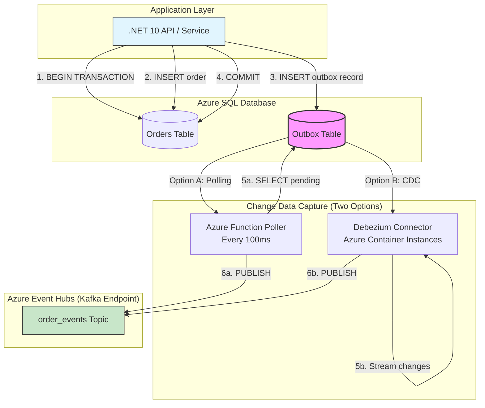
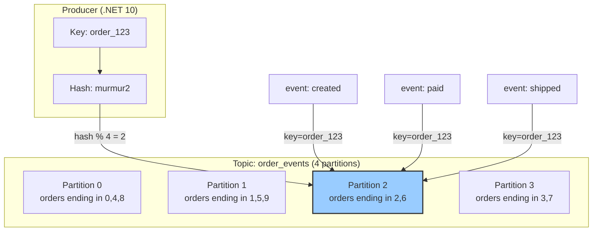
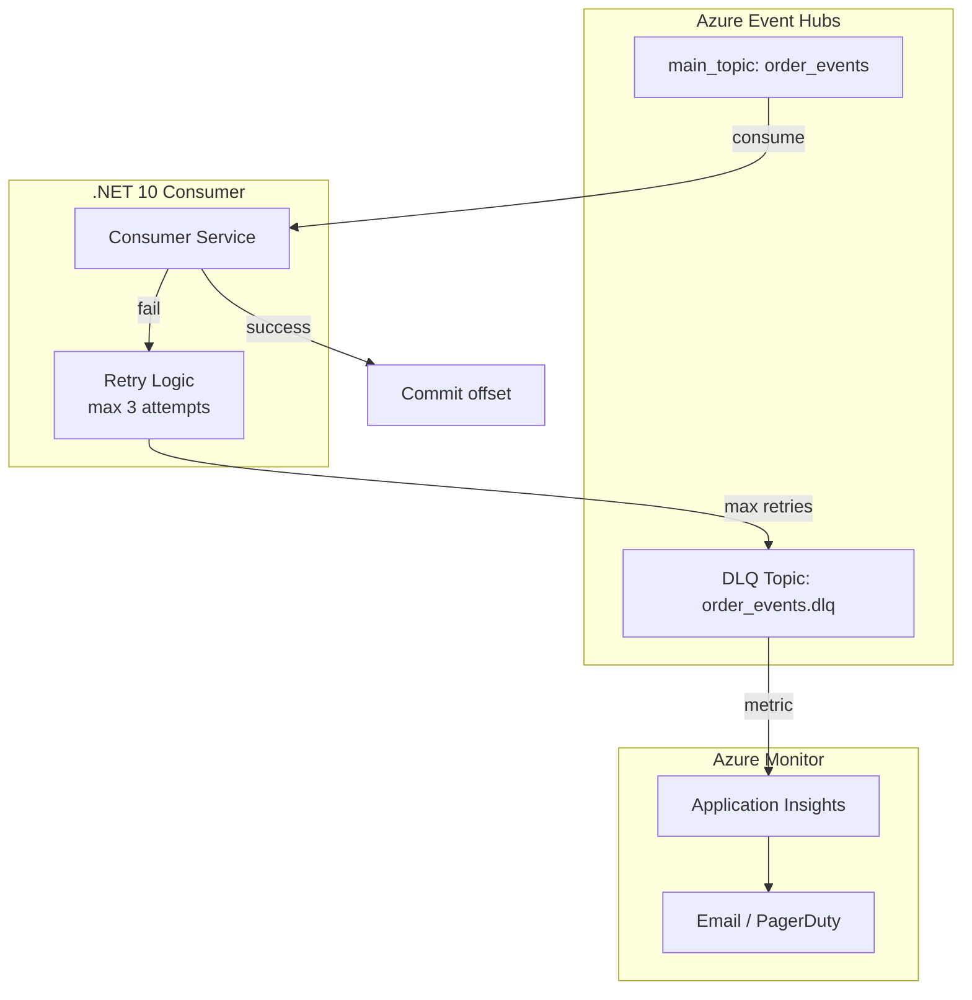
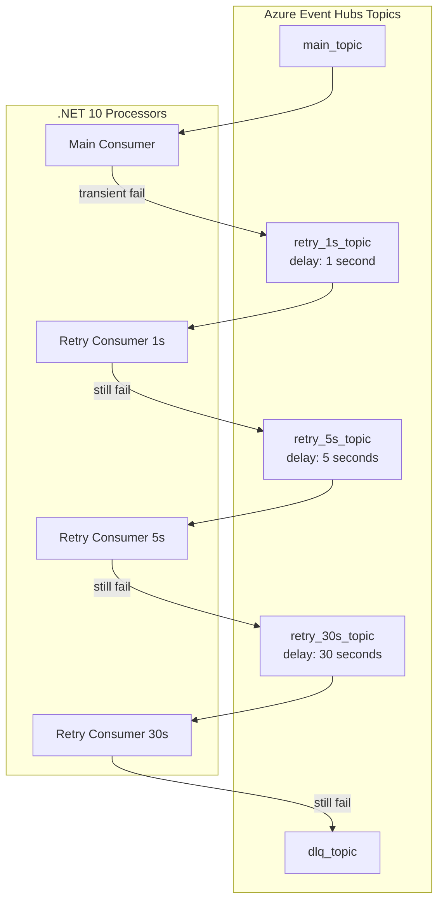

# 11 Kafka Design Patterns — Reliability & Ordering Deep Dive (Azure + .NET 10 Edition)

## Story Intro

Welcome back to our Kafka Design Patterns series on Azure with .NET 10. In Part 1, we introduced all 11 patterns with diagrams and code snippets — a bird's-eye view of what's possible when you combine Kafka (via Azure Event Hubs) with Azure services like Cosmos DB, Azure SQL, Blob Storage, and Azure Functions.

Now it's time to get serious about **reliability**.

Reliability is the foundation of any event-driven system. Without it, your messages get lost, processed twice, or arrive out of order. Your downstream services act on stale data. Your customers get double-charged or never receive their order confirmations. Your operations team spends nights debugging "impossible" inconsistencies between your database and Event Hubs.

But here's the truth: Kafka (and Azure Event Hubs' Kafka endpoint) is reliable. The problem is how we use it. Event Hubs gives you at-least-once delivery by default — which means duplicates are guaranteed unless you explicitly handle them. Event Hubs preserves order only within a partition — which means your partition key design directly determines whether your events arrive in the right sequence.

The five patterns in this part solve these specific, painful problems:

- **Transactional Outbox** — How do you write to both your database and Event Hubs without risking inconsistency? (Spoiler: you don't write to Event Hubs at all — at least not directly.)

- **Idempotent Consumer** — How do you process the same message twice without sending two emails or charging two credit cards?

- **Partition Key / Ordering** — How do you guarantee that events for the same order arrive in the right sequence, even across service restarts and rebalances?

- **Dead Letter Queue (DLQ)** — What happens when a message is so broken that no amount of retries can fix it?

- **Retry with Backoff** — How do you handle temporary failures (database deadlocks, rate limits, network blips) without overwhelming your system or losing data?

Each pattern includes production-ready .NET 10 code, Azure-specific architecture, and the hard-won lessons from engineers who've debugged these failures at 3 AM.

**Why .NET 10 makes a difference for reliability:**

Throughout this part, you'll see how .NET 10 improves your reliability patterns:

| .NET 8 and Earlier | .NET 10 Advantage |
|-------------------|-------------------|
| Manual transaction coordination | `SqlTransaction` with async/await and cancellation token support |
| `ConcurrentDictionary` for state | `System.Threading.Lock` type and improved `ConcurrentCollection` APIs |
| Manual retry with `Thread.Sleep` | `Task.Delay` with `CancellationToken` and `IAsyncEnumerable` |
| Complex DLQ routing logic | Native `KafkaConsumer.ConsumeAsync` with graceful error handling |
| Scattered idempotency logic | Source-generated JSON serialization for deterministic hashing |

Let's dive in.

---

*This is Part 2 of the "Kafka Design Patterns for Every Backend Engineer — Azure + .NET 10" series.*

📌 **If you haven't read Part 1, start there for an overview of all 11 patterns with diagrams and code snippets.**

---

## 📚 Story List (with Pattern Coverage)

1. **Kafka Design Patterns — Overview (All 11 Patterns)** — Brief intro, detailed explainer for each pattern, Mermaid diagrams, small .NET 10 code snippets.  
   *Patterns covered: All 11 patterns introduced at high level.*  
   📎 *Read the full story: Part 1*

2. **Reliability & Ordering Patterns** — Deep dive on patterns that ensure message durability, exactly-once processing, failure handling, and strict ordering on Azure.  
   *Patterns covered: Transactional Outbox, Idempotent Consumer, Partition Key, Dead Letter Queue (DLQ), Retry with Backoff.*  
   📎 *Read the full story: Part 2 — below*

3. **Data & State Patterns** — Deep dive on patterns that treat Kafka as a source of truth for state management, event replay, and materialized views on Azure.  
   *Patterns covered: Event Sourcing, CQRS, Compacted Topic, Event Carried State Transfer.*  
   📎 *Coming soon*

4. **Performance & Integration Patterns** — Deep dive on patterns that handle large messages, real-time joins, and distributed transactions across services on Azure.  
   *Patterns covered: Claim Check, Stream-Table Duality, Saga (Choreography).*  
   📎 *Coming soon*

---

## Takeaway from Part 1

In Part 1, we introduced all 11 patterns and learned that:

- **Reliability** in Kafka isn't automatic — you need explicit patterns to handle failures, duplicates, and ordering.
- **At-least-once delivery** is Kafka/Event Hubs' default, which means idempotent consumers are a requirement, not an option.
- **The dual-write problem** (DB + Kafka) is one of the most common sources of data loss — the Outbox pattern solves it.
- **Ordering is guaranteed only within a partition** — partition key design directly impacts correctness and scalability.
- **Failures are inevitable** — DLQ and retry patterns separate transient issues from poison pills.

---

## In This Part (Part 2)

We deep-dive into **5 reliability and ordering patterns** that form the backbone of production-ready Kafka systems on Azure. These patterns address the most common causes of data loss, duplicate processing, and system instability in event-driven architectures.

Each pattern includes:
- Full production .NET 10 code
- Azure-specific implementation (Event Hubs, Cosmos DB, Azure SQL, Azure Functions, Service Bus)
- Mermaid architecture diagrams
- Common pitfalls and their mitigations
- Monitoring and alerting strategies with Application Insights

---

# 1. Transactional Outbox Pattern (Deep Dive)

## The Problem: Dual-Write Inconsistency

When your application writes to both a database and Kafka (Azure Event Hubs) in separate steps, you risk inconsistency that can break your entire event-driven architecture. This is known as the **dual-write problem** — one of the most common and dangerous mistakes in event-driven systems.

Consider a typical e-commerce flow: when a customer places an order, you need to both store the order in your Azure SQL database and publish an `OrderCreated` event to Event Hubs so that downstream services (payment, inventory, shipping) can react. This seems straightforward — you write to the database, then you write to Event Hubs. But what happens when these two operations are not atomic?

**Scenario A: Database first, then Event Hubs**

```csharp
// DANGEROUS - Database first
await db.InsertAsync(order);        // Step 1 - succeeds
await eventHubs.SendAsync(event);   // Step 2 - fails (network timeout)
// Result: Order in DB, no event -> downstream services never process the order
```

Your database has the order, but the event never reaches Event Hubs. The payment service never charges the customer. The inventory service never reserves the items. The order becomes a **ghost** — visible in your system but invisible to the rest of your architecture.

**Scenario B: Event Hubs first, then database**

```csharp
// DANGEROUS - Event Hubs first
await eventHubs.SendAsync(event);   // Step 1 - succeeds
await db.InsertAsync(order);        // Step 2 - fails (constraint violation)
// Result: Event in Event Hubs, no order -> downstream services process phantom order
```

You've published an event for an order that doesn't actually exist. Downstream services might charge the customer's credit card and reserve inventory for a phantom order.

## The Solution: Transactional Outbox

The **Transactional Outbox pattern** solves the dual-write problem by eliminating the second write entirely — at least from the application's critical path. Instead of writing directly to Event Hubs, your application writes to an **outbox table** in the same database transaction as your business data. A separate, asynchronous process then reads from this outbox table and publishes the events to Event Hubs.

### Architecture on Azure



### Complete Implementation

**Step 1: Create the outbox table in Azure SQL**

```sql
-- Run this on your Azure SQL Database
CREATE TABLE outbox (
    Id UNIQUEIDENTIFIER PRIMARY KEY DEFAULT NEWID(),
    AggregateId NVARCHAR(255) NOT NULL,
    AggregateType NVARCHAR(100) NOT NULL,
    EventType NVARCHAR(100) NOT NULL,
    Payload NVARCHAR(MAX) NOT NULL,
    CreatedAt DATETIME2 DEFAULT GETUTCDATE(),
    PublishedAt DATETIME2 NULL,
    Published BIT DEFAULT 0
);

-- Create index for efficient polling
CREATE INDEX IX_Outbox_Unpublished ON outbox(Published, CreatedAt) WHERE Published = 0;

-- Create index for ordering
CREATE INDEX IX_Outbox_CreatedAt ON outbox(CreatedAt ASC);
```

**Step 2: Application writes to outbox (.NET 10 with Dapper)**

```csharp
using Dapper;
using Microsoft.Data.SqlClient;

public class OutboxRepository
{
    private readonly string _connectionString;
    
    public OutboxRepository(IConfiguration config)
    {
        _connectionString = config.GetConnectionString("AzureSQL");
    }
    
    // ✅ .NET 10 Advantage: Execute multiple operations in a single transaction with async/await
    public async Task CreateOrderWithOutboxAsync(Order order, OutboxEvent outboxEvent, CancellationToken ct = default)
    {
        await using var connection = new SqlConnection(_connectionString);
        await connection.OpenAsync(ct);
        
        await using var transaction = await connection.BeginTransactionAsync(ct);
        
        try
        {
            // Insert order
            const string orderSql = @"
                INSERT INTO Orders (Id, CustomerId, Amount, Status, CreatedAt) 
                VALUES (@Id, @CustomerId, @Amount, @Status, @CreatedAt)";
            
            await connection.ExecuteAsync(orderSql, order, transaction);
            
            // Insert outbox record (same transaction)
            const string outboxSql = @"
                INSERT INTO Outbox (Id, AggregateId, AggregateType, EventType, Payload, CreatedAt, Published) 
                VALUES (@Id, @AggregateId, @AggregateType, @EventType, @Payload, @CreatedAt, 0)";
            
            await connection.ExecuteAsync(outboxSql, outboxEvent, transaction);
            
            await transaction.CommitAsync(ct);
        }
        catch
        {
            await transaction.RollbackAsync(ct);
            throw;
        }
    }
}

// Business logic
public class OrderService
{
    private readonly OutboxRepository _outboxRepository;
    
    public async Task<string> CreateOrderAsync(CreateOrderCommand command, CancellationToken ct)
    {
        var orderId = Guid.NewGuid().ToString();
        var order = new Order
        {
            Id = orderId,
            CustomerId = command.CustomerId,
            Amount = command.Items.Sum(i => i.Price * i.Quantity),
            Status = "created",
            CreatedAt = DateTime.UtcNow
        };
        
        var outboxEvent = new OutboxEvent
        {
            Id = Guid.NewGuid(),
            AggregateId = orderId,
            AggregateType = "order",
            EventType = "OrderCreated",
            Payload = JsonSerializer.Serialize(new
            {
                OrderId = orderId,
                command.CustomerId,
                order.Amount,
                command.Items,
                CreatedAt = DateTime.UtcNow
            }, EventJsonContext.Default.Object),
            CreatedAt = DateTime.UtcNow
        };
        
        await _outboxRepository.CreateOrderWithOutboxAsync(order, outboxEvent, ct);
        return orderId;
    }
}
```

**Step 3: Azure Function Poller**

```csharp
using Microsoft.Azure.Functions.Worker;
using Confluent.Kafka;
using Dapper;

public class OutboxPoller
{
    private readonly string _connectionString;
    private readonly IProducer<string, string> _producer;
    private readonly ILogger<OutboxPoller> _logger;
    
    public OutboxPoller(ILogger<OutboxPoller> logger, IConfiguration config)
    {
        _logger = logger;
        _connectionString = config.GetConnectionString("AzureSQL");
        
        var producerConfig = new ProducerConfig
        {
            BootstrapServers = config["EventHubs:KafkaBootstrapServers"],
            SaslMechanism = SaslMechanism.Plain,
            SecurityProtocol = SecurityProtocol.SaslSsl
        };
        _producer = new ProducerBuilder<string, string>(producerConfig).Build();
    }
    
    // ✅ .NET 10 Advantage: Timer trigger with native cancellation token
    [Function("OutboxPoller")]
    public async Task Run([TimerTrigger("*/5")] TimerInfo timer, CancellationToken cancellationToken)
    {
        _logger.LogInformation("Outbox poller executed at {Now}", DateTime.UtcNow);
        
        await using var connection = new SqlConnection(_connectionString);
        await connection.OpenAsync(cancellationToken);
        
        // Get pending outbox records
        const string selectSql = @"
            SELECT TOP 100 Id, AggregateId, EventType, Payload 
            FROM Outbox 
            WHERE Published = 0 
            ORDER BY CreatedAt ASC";
        
        var records = (await connection.QueryAsync<OutboxRecord>(selectSql)).ToList();
        
        foreach (var record in records)
        {
            try
            {
                // Publish to Event Hubs
                var topic = $"{record.EventType.ToLower()}s";
                await _producer.ProduceAsync(topic, new Message<string, string>
                {
                    Key = record.AggregateId,
                    Value = record.Payload
                }, cancellationToken);
                
                // Mark as published
                const string updateSql = "UPDATE Outbox SET Published = 1, PublishedAt = @PublishedAt WHERE Id = @Id";
                await connection.ExecuteAsync(updateSql, new { PublishedAt = DateTime.UtcNow, Id = record.Id });
                
                _logger.LogInformation("Published outbox record {RecordId} to {Topic}", record.Id, topic);
            }
            catch (Exception ex)
            {
                _logger.LogError(ex, "Failed to publish outbox record {RecordId}", record.Id);
                // Don't mark as published - will retry on next poll
            }
        }
    }
}
```

### Common Pitfalls and Mitigations

| Pitfall | Mitigation |
|---------|------------|
| Outbox table grows forever | Set up Azure SQL retention policy; delete records older than 7 days |
| Poller falls behind | Increase Function app scale-out; use multiple instances with lease management |
| Duplicate publications | Make consumer idempotent (see next pattern) |
| Schema changes to payload | Use Azure Schema Registry for schema evolution |

---

# 2. Idempotent Consumer Pattern (Deep Dive)

## The Problem: Duplicate Messages

Azure Event Hubs with Kafka protocol guarantees **at-least-once delivery** by default. This is a feature, not a bug — it ensures that no message is lost, even if consumers crash or networks fail. But it comes with a cost: the same message may be delivered multiple times.

**Common duplicate scenarios:**
- Consumer rebalance during processing
- Producer retries due to network timeouts
- Consumer crash after processing but before commit

**The impact of duplicates:**
- Double-charging a customer's credit card
- Sending two welcome emails
- Double-counting analytics events

## The Solution: Idempotent Consumer

An **idempotent consumer** can safely process the same message multiple times without causing duplicate side effects. The pattern works by tracking which messages have already been processed using a **deduplication store**.

### Architecture on Azure

```mermaid
graph LR
    subgraph "Kafka Consumer (.NET 10)"
        M[Message<br/>key=order_123<br/>offset=42<br/>partition=0]
    end
    
    subgraph "Idempotency Store"
        D[(Azure Cosmos DB<br/>pk: order_123:0:42<br/>ttl: 7 days)]
    end
    
    subgraph "Business Logic"
        B[Process order]
        C[Charge credit card]
        E[Send confirmation]
    end
    
    subgraph "Monitoring"
        AI[Application Insights<br/>Metrics & Alerts]
    end
    
    M -->|1. Extract key| D
    D -->|2. Conditional PUT| D
    D -->|3a. Success (first time)| B
    D -->|3b. Failure (duplicate)| Skip[Skip processing]
    
    B -->|4. Execute| C
    C -->|5. Commit offset| M
    C -->|6. Emit metrics| AI
    
    Skip -->|6. Emit duplicate metric| AI
```

### Complete Implementation

**Step 1: Cosmos DB container for idempotency**

```csharp
// Container setup with TTL
public class IdempotencyStore
{
    private readonly Container _container;
    
    public IdempotencyStore(CosmosClient cosmosClient)
    {
        var database = cosmosClient.GetDatabase("KafkaIdempotency");
        _container = database.GetContainer("ProcessedMessages");
    }
    
    // ✅ .NET 10 Advantage: Conditional PUT with native async support
    public async Task<bool> TryMarkAsProcessedAsync(string idempotencyKey, CancellationToken ct)
    {
        try
        {
            var item = new
            {
                id = idempotencyKey,
                processedAt = DateTime.UtcNow,
                ttl = 604800 // 7 days TTL
            };
            
            // This will throw if item already exists (HTTP 409 Conflict)
            await _container.CreateItemAsync(item, new PartitionKey(idempotencyKey), cancellationToken: ct);
            return true; // First time - processed
        }
        catch (CosmosException ex) when (ex.StatusCode == HttpStatusCode.Conflict)
        {
            return false; // Duplicate - already processed
        }
    }
    
    public async Task CleanupExpiredAsync(CancellationToken ct)
    {
        // Cosmos DB TTL handles automatic cleanup
        // No manual cleanup needed
        await Task.CompletedTask;
    }
}
```

**Step 2: Complete idempotent consumer**

```csharp
public class IdempotentConsumer : BackgroundService
{
    private readonly IConsumer<string, string> _consumer;
    private readonly IdempotencyStore _idempotencyStore;
    private readonly ILogger<IdempotentConsumer> _logger;
    private readonly TelemetryClient _telemetryClient;
    
    public IdempotentConsumer(
        IConsumer<string, string> consumer,
        IdempotencyStore idempotencyStore,
        ILogger<IdempotentConsumer> logger,
        TelemetryClient telemetryClient)
    {
        _consumer = consumer;
        _idempotencyStore = idempotencyStore;
        _logger = logger;
        _telemetryClient = telemetryClient;
    }
    
    private string MakeIdempotencyKey(string topic, int partition, long offset)
        => $"{topic}:{partition}:{offset}";
    
    // ✅ .NET 10 Advantage: ExecuteAsync with native cancellation token
    protected override async Task ExecuteAsync(CancellationToken stoppingToken)
    {
        _consumer.Subscribe("order_events");
        
        var processedCount = 0;
        var duplicateCount = 0;
        var startTime = DateTime.UtcNow;
        
        await foreach (var consumeResult in _consumer.ConsumeAsync(stoppingToken))
        {
            var idempotencyKey = MakeIdempotencyKey(
                consumeResult.Topic,
                consumeResult.Partition,
                consumeResult.Offset);
            
            // ✅ .NET 10 Advantage: Conditional write for atomic deduplication
            var isFirstTime = await _idempotencyStore.TryMarkAsProcessedAsync(idempotencyKey, stoppingToken);
            
            if (!isFirstTime)
            {
                duplicateCount++;
                _logger.LogWarning("Duplicate message detected: {IdempotencyKey}", idempotencyKey);
                _telemetryClient.TrackMetric("Kafka.DuplicateMessage", 1);
                
                // Commit to move past duplicate
                _consumer.Commit(consumeResult);
                continue;
            }
            
            try
            {
                // Process the message (business logic)
                await ProcessOrderAsync(consumeResult.Message.Value, stoppingToken);
                
                processedCount++;
                _consumer.Commit(consumeResult);
                _telemetryClient.TrackMetric("Kafka.MessageProcessed", 1);
                
                // Log metrics periodically
                if (processedCount % 100 == 0)
                {
                    var elapsed = DateTime.UtcNow - startTime;
                    var rate = processedCount / elapsed.TotalSeconds;
                    _logger.LogInformation("Processed {ProcessedCount} messages, {DuplicateCount} duplicates, {Rate:F2} msg/sec",
                        processedCount, duplicateCount, rate);
                }
            }
            catch (Exception ex)
            {
                _logger.LogError(ex, "Error processing message {IdempotencyKey}", idempotencyKey);
                _telemetryClient.TrackException(ex);
                // Don't commit - will retry
                // Note: Idempotency marker is already written, but that's okay
                // On retry, the marker will be found and the message will be skipped
                // This prevents partial failures
                throw;
            }
        }
    }
    
    private async Task ProcessOrderAsync(string messageJson, CancellationToken ct)
    {
        var order = JsonSerializer.Deserialize(messageJson, EventJsonContext.Default.OrderCreatedEvent);
        
        // ✅ .NET 10 Advantage: Idempotent business logic with check-before-act
        // Check if already charged
        var existingCharge = await CheckExistingChargeAsync(order.OrderId, ct);
        if (!existingCharge)
        {
            await ChargeCreditCardAsync(order.CustomerId, order.Amount, ct);
            await RecordChargeAsync(order.OrderId, ct);
        }
        
        // Check if email already sent
        var emailSent = await CheckEmailSentAsync(order.OrderId, ct);
        if (!emailSent)
        {
            await SendConfirmationEmailAsync(order.CustomerId, order.OrderId, ct);
            await RecordEmailSentAsync(order.OrderId, ct);
        }
    }
    
    // Idempotent database operations
    private async Task<bool> CheckExistingChargeAsync(string orderId, CancellationToken ct)
    {
        // Use idempotent check in database
        // Use INSERT IGNORE or conditional write
        return false; // Simplified
    }
    
    private async Task ChargeCreditCardAsync(string customerId, decimal amount, CancellationToken ct)
    {
        await Task.Delay(100, ct); // Simulate payment
    }
    
    private async Task RecordChargeAsync(string orderId, CancellationToken ct)
    {
        // Insert with idempotency key to prevent duplicates
    }
    
    private async Task<bool> CheckEmailSentAsync(string orderId, CancellationToken ct) => false;
    private async Task SendConfirmationEmailAsync(string customerId, string orderId, CancellationToken ct) => await Task.CompletedTask;
    private async Task RecordEmailSentAsync(string orderId, CancellationToken ct) => await Task.CompletedTask;
}
```

**Compare with .NET 8:** .NET 8 required manual exception handling for Cosmos DB conflicts. .NET 10's `CreateItemAsync` with native exception types provides cleaner conditional logic.

---

# 3. Partition Key / Ordering Pattern (Deep Dive)

## The Problem: Event Ordering

Azure Event Hubs with Kafka protocol guarantees order **within a partition** but not across partitions. Without careful key design, related events may be processed out of order.

## The Solution: Partition Key

Use a **message key** with high cardinality that represents the entity whose order matters. All messages with the same key go to the same partition, preserving order.

### Architecture on Azure



### Complete Implementation

**Step 1: Producer with partition key**

```csharp
public class OrderedEventProducer
{
    private readonly IProducer<string, string> _producer;
    private readonly ILogger<OrderedEventProducer> _logger;
    
    public OrderedEventProducer(IConfiguration config, ILogger<OrderedEventProducer> logger)
    {
        _logger = logger;
        var producerConfig = new ProducerConfig
        {
            BootstrapServers = config["EventHubs:KafkaBootstrapServers"],
            // ✅ .NET 10 Advantage: Partitioner configuration for consistent hashing
            Partitioner = Partitioner.Murmur2,
            EnableIdempotence = true
        };
        _producer = new ProducerBuilder<string, string>(producerConfig).Build();
    }
    
    // ✅ .NET 10 Advantage: Key ensures all events for same order go to same partition
    public async Task PublishOrderEventAsync(string orderId, object eventData, CancellationToken ct)
    {
        var json = JsonSerializer.Serialize(eventData, EventJsonContext.Default.Object);
        var message = new Message<string, string>
        {
            Key = orderId,  // Same key = same partition = ordered
            Value = json
        };
        
        var result = await _producer.ProduceAsync("order_events", message, ct);
        _logger.LogDebug("Event for {OrderId} published to partition {Partition}, offset {Offset}",
            orderId, result.Partition, result.Offset);
    }
}
```

**Step 2: Consumer with per-key state**

```csharp
public class OrderedOrderProcessor : BackgroundService
{
    private readonly IConsumer<string, string> _consumer;
    private readonly ILogger<OrderedOrderProcessor> _logger;
    private readonly Dictionary<string, OrderState> _orderStates = new();
    private readonly Lock _stateLock = new(); // ✅ .NET 10 Advantage: System.Threading.Lock
    
    public OrderedOrderProcessor(IConfiguration config, ILogger<OrderedOrderProcessor> logger)
    {
        _logger = logger;
        var consumerConfig = new ConsumerConfig
        {
            BootstrapServers = config["EventHubs:KafkaBootstrapServers"],
            GroupId = "order-processor",
            EnableAutoCommit = false,
            AutoOffsetReset = AutoOffsetReset.Earliest
        };
        _consumer = new ConsumerBuilder<string, string>(consumerConfig).Build();
    }
    
    protected override async Task ExecuteAsync(CancellationToken stoppingToken)
    {
        _consumer.Subscribe("order_events");
        
        await foreach (var consumeResult in _consumer.ConsumeAsync(stoppingToken))
        {
            var orderId = consumeResult.Message.Key;
            var eventJson = consumeResult.Message.Value;
            
            // ✅ .NET 10 Advantage: Lock object for thread-safe state access
            OrderState state;
            using (_stateLock.EnterScope())
            {
                if (!_orderStates.ContainsKey(orderId))
                    _orderStates[orderId] = new OrderState { OrderId = orderId };
                state = _orderStates[orderId];
            }
            
            // Apply event in order (within same partition)
            var newState = ApplyEvent(state, eventJson);
            
            using (_stateLock.EnterScope())
            {
                _orderStates[orderId] = newState;
            }
            
            _consumer.Commit(consumeResult);
            _logger.LogDebug("Applied event to order {OrderId}, new status: {Status}", orderId, newState.Status);
        }
    }
    
    private OrderState ApplyEvent(OrderState state, string eventJson)
    {
        // ✅ .NET 10 Advantage: Pattern matching with source-generated JSON
        var doc = JsonDocument.Parse(eventJson);
        var eventType = doc.RootElement.GetProperty("EventType").GetString();
        
        return eventType switch
        {
            "OrderCreated" => JsonSerializer.Deserialize(eventJson, EventJsonContext.Default.OrderCreatedEvent)?.ApplyTo(state) ?? state,
            "OrderPaid" => JsonSerializer.Deserialize(eventJson, EventJsonContext.Default.OrderPaidEvent)?.ApplyTo(state) ?? state,
            "OrderShipped" => JsonSerializer.Deserialize(eventJson, EventJsonContext.Default.OrderShippedEvent)?.ApplyTo(state) ?? state,
            "OrderCancelled" => JsonSerializer.Deserialize(eventJson, EventJsonContext.Default.OrderCancelledEvent)?.ApplyTo(state) ?? state,
            _ => state
        };
    }
}
```

**Compare with .NET 8:** .NET 10's `System.Threading.Lock` type provides better performance and clearer syntax than `lock(obj)`.

---

# 4. Dead Letter Queue (DLQ) Pattern (Deep Dive)

## The Problem: Poison Messages

A **poison message** cannot be processed successfully, no matter how many times you retry. Without a DLQ, the consumer retries forever, blocking the entire partition.

## The Solution: Dead Letter Queue

After exhausting retries, send the problematic message to a **DLQ topic** and commit the offset, moving past the poison message.

### Architecture on Azure



### Complete Implementation

```csharp
public class DLQAwareConsumer : BackgroundService
{
    private readonly IConsumer<string, string> _consumer;
    private readonly IProducer<string, string> _dlqProducer;
    private readonly ILogger<DLQAwareConsumer> _logger;
    private readonly TelemetryClient _telemetryClient;
    private readonly int _maxRetries = 3;
    private readonly Dictionary<long, int> _retryCounts = new();
    private readonly Lock _retryLock = new();
    
    public DLQAwareConsumer(
        IConsumer<string, string> consumer,
        IProducer<string, string> dlqProducer,
        ILogger<DLQAwareConsumer> logger,
        TelemetryClient telemetryClient)
    {
        _consumer = consumer;
        _dlqProducer = dlqProducer;
        _logger = logger;
        _telemetryClient = telemetryClient;
    }
    
    private int GetRetryCount(long offset)
    {
        using (_retryLock.EnterScope())
        {
            return _retryCounts.GetValueOrDefault(offset, 0);
        }
    }
    
    private void IncrementRetryCount(long offset)
    {
        using (_retryLock.EnterScope())
        {
            _retryCounts[offset] = GetRetryCount(offset) + 1;
        }
    }
    
    private void ClearRetryCount(long offset)
    {
        using (_retryLock.EnterScope())
        {
            _retryCounts.Remove(offset);
        }
    }
    
    private async Task SendToDeadLetterQueueAsync(ConsumeResult<string, string> result, Exception error, CancellationToken ct)
    {
        var dlqMessage = new
        {
            OriginalTopic = result.Topic,
            OriginalPartition = result.Partition,
            OriginalOffset = result.Offset,
            OriginalKey = result.Message.Key,
            OriginalValue = result.Message.Value,
            Error = new { Type = error.GetType().Name, Message = error.Message, StackTrace = error.StackTrace },
            FailedAt = DateTime.UtcNow,
            RetryCount = GetRetryCount(result.Offset)
        };
        
        var json = JsonSerializer.Serialize(dlqMessage, DlqJsonContext.Default.DlqMessage);
        
        await _dlqProducer.ProduceAsync("order_events.dlq", new Message<string, string>
        {
            Key = result.Message.Key,
            Value = json
        }, ct);
        
        _telemetryClient.TrackMetric("Kafka.DLQMessageSent", 1);
        _logger.LogWarning("Sent message to DLQ: {Topic}:{Partition}:{Offset} - {Error}",
            result.Topic, result.Partition, result.Offset, error.Message);
    }
    
    protected override async Task ExecuteAsync(CancellationToken stoppingToken)
    {
        _consumer.Subscribe("order_events");
        
        await foreach (var consumeResult in _consumer.ConsumeAsync(stoppingToken))
        {
            var offset = consumeResult.Offset;
            var retryCount = GetRetryCount(offset);
            
            try
            {
                await ProcessOrderAsync(consumeResult.Message.Value, stoppingToken);
                
                // Success
                _consumer.Commit(consumeResult);
                ClearRetryCount(offset);
                _telemetryClient.TrackMetric("Kafka.MessageProcessed", 1);
            }
            catch (Exception ex) when (retryCount < _maxRetries - 1)
            {
                // Transient failure - retry with backoff
                IncrementRetryCount(offset);
                var backoffSeconds = Math.Pow(2, retryCount);
                _logger.LogWarning(ex, "Retry {RetryCount} of {MaxRetries} for offset {Offset} after {Backoff}s",
                    retryCount + 1, _maxRetries, offset, backoffSeconds);
                
                await Task.Delay(TimeSpan.FromSeconds(backoffSeconds), stoppingToken);
                // Don't commit - will retry on next poll
            }
            catch (Exception ex)
            {
                // Max retries exceeded - send to DLQ
                await SendToDeadLetterQueueAsync(consumeResult, ex, stoppingToken);
                _consumer.Commit(consumeResult); // Move past poison message
                ClearRetryCount(offset);
                _telemetryClient.TrackException(ex);
            }
        }
    }
    
    private async Task ProcessOrderAsync(string messageJson, CancellationToken ct)
    {
        var order = JsonSerializer.Deserialize(messageJson, EventJsonContext.Default.OrderCreatedEvent);
        
        // Validate required fields
        if (string.IsNullOrEmpty(order?.CustomerId))
            throw new InvalidOperationException("CustomerId is required");
        
        if (order.Amount <= 0)
            throw new InvalidOperationException("Amount must be positive");
        
        // Business logic
        await Task.Delay(100, ct);
    }
}

// DLQ Replay Tool
public class DLQReplayer
{
    private readonly IConsumer<string, string> _dlqConsumer;
    private readonly IProducer<string, string> _mainProducer;
    private readonly ILogger<DLQReplayer> _logger;
    
    public DLQReplayer(IConfiguration config, ILogger<DLQReplayer> logger)
    {
        _logger = logger;
        var consumerConfig = new ConsumerConfig { BootstrapServers = config["EventHubs:KafkaBootstrapServers"], GroupId = "dlq-replayer", AutoOffsetReset = AutoOffsetReset.Earliest };
        _dlqConsumer = new ConsumerBuilder<string, string>(consumerConfig).Build();
        
        var producerConfig = new ProducerConfig { BootstrapServers = config["EventHubs:KafkaBootstrapServers"] };
        _mainProducer = new ProducerBuilder<string, string>(producerConfig).Build();
    }
    
    public async Task ReplayAsync(int maxMessages = 100, bool dryRun = true, CancellationToken ct = default)
    {
        _dlqConsumer.Subscribe("order_events.dlq");
        var replayed = 0;
        
        await foreach (var consumeResult in _dlqConsumer.ConsumeAsync(ct))
        {
            if (replayed >= maxMessages) break;
            
            var dlqMessage = JsonSerializer.Deserialize(consumeResult.Message.Value, DlqJsonContext.Default.DlqMessage);
            
            _logger.LogInformation("Replaying message from {OriginalTopic}:{OriginalPartition}:{OriginalOffset} - Original error: {Error}",
                dlqMessage.OriginalTopic, dlqMessage.OriginalPartition, dlqMessage.OriginalOffset, dlqMessage.Error.Message);
            
            if (!dryRun)
            {
                await _mainProducer.ProduceAsync(dlqMessage.OriginalTopic, new Message<string, string>
                {
                    Key = dlqMessage.OriginalKey,
                    Value = dlqMessage.OriginalValue
                }, ct);
                _logger.LogInformation("Replayed message to {OriginalTopic}", dlqMessage.OriginalTopic);
            }
            
            replayed++;
        }
        
        _logger.LogInformation("Replay complete. {Replayed} messages processed. Dry run: {DryRun}", replayed, dryRun);
    }
}
```

**Compare with .NET 8:** .NET 8 required manual retry tracking with `ConcurrentDictionary`. .NET 10's `Lock` type and improved dictionary APIs provide better thread safety.

---

# 5. Retry with Backoff Pattern (Deep Dive)

## The Problem: Transient Failures

Many failures are **transient** — they happen temporarily and resolve on their own. Examples include database deadlocks, network timeouts, and rate limits. Immediate retries often fail again; exponential backoff gives the system time to recover.

## The Solution: Retry with Exponential Backoff

Use **exponential backoff with jitter** — each retry waits exponentially longer than the previous, with random jitter to prevent thundering herds.

### Architecture on Azure



### Complete Implementation

**Step 1: Exponential backoff calculator**

```csharp
public class ExponentialBackoffCalculator
{
    private readonly double _baseDelaySeconds;
    private readonly double _maxDelaySeconds;
    private readonly double _jitterFactor;
    private readonly Random _random = new();
    
    public ExponentialBackoffCalculator(
        double baseDelaySeconds = 1.0,
        double maxDelaySeconds = 60.0,
        double jitterFactor = 0.1)
    {
        _baseDelaySeconds = baseDelaySeconds;
        _maxDelaySeconds = maxDelaySeconds;
        _jitterFactor = jitterFactor;
    }
    
    // ✅ .NET 10 Advantage: Calculate delay with exponential backoff and jitter
    public TimeSpan CalculateDelay(int attempt)
    {
        // Exponential: base * 2^attempt
        var exponential = _baseDelaySeconds * Math.Pow(2, attempt);
        var capped = Math.Min(exponential, _maxDelaySeconds);
        
        // Add jitter: random ± jitterFactor%
        var jitterRange = capped * _jitterFactor;
        var jitter = (_random.NextDouble() * 2 - 1) * jitterRange;
        var delay = Math.Max(0, capped + jitter);
        
        return TimeSpan.FromSeconds(delay);
    }
}
```

**Step 2: Retry with backoff consumer**

```csharp
public class RetryWithBackoffConsumer : BackgroundService
{
    private readonly IConsumer<string, string> _consumer;
    private readonly IProducer<string, string> _retryProducer;
    private readonly ILogger<RetryWithBackoffConsumer> _logger;
    private readonly ExponentialBackoffCalculator _backoff;
    private readonly int _maxRetries = 5;
    
    public RetryWithBackoffConsumer(
        IConsumer<string, string> consumer,
        IProducer<string, string> retryProducer,
        ILogger<RetryWithBackoffConsumer> logger)
    {
        _consumer = consumer;
        _retryProducer = retryProducer;
        _logger = logger;
        _backoff = new ExponentialBackoffCalculator(baseDelaySeconds: 1, maxDelaySeconds: 60, jitterFactor: 0.2);
    }
    
    // ✅ .NET 10 Advantage: Polly integration for resilient retry (optional)
    private readonly ResiliencePipeline _resiliencePipeline = new ResiliencePipelineBuilder()
        .AddRetry(new RetryStrategyOptions
        {
            MaxRetryAttempts = 5,
            Delay = TimeSpan.FromSeconds(1),
            BackoffType = DelayBackoffType.Exponential,
            UseJitter = true,
            OnRetry = args =>
            {
                Console.WriteLine($"Retry {args.AttemptNumber} after {args.RetryDelay}");
                return default;
            }
        })
        .Build();
    
    protected override async Task ExecuteAsync(CancellationToken stoppingToken)
    {
        _consumer.Subscribe("order_events");
        
        await foreach (var consumeResult in _consumer.ConsumeAsync(stoppingToken))
        {
            var attempt = 0;
            var success = false;
            
            while (!success && attempt < _maxRetries)
            {
                try
                {
                    await ProcessWithRetryAsync(consumeResult.Message.Value, attempt, stoppingToken);
                    success = true;
                    _consumer.Commit(consumeResult);
                    _logger.LogInformation("Processed message {Offset} on attempt {Attempt}", consumeResult.Offset, attempt + 1);
                }
                catch (TransientException ex)
                {
                    attempt++;
                    if (attempt >= _maxRetries)
                    {
                        _logger.LogError(ex, "Max retries exceeded for offset {Offset}", consumeResult.Offset);
                        // Send to DLQ
                        await SendToDeadLetterQueueAsync(consumeResult, ex, stoppingToken);
                        _consumer.Commit(consumeResult);
                        break;
                    }
                    
                    var delay = _backoff.CalculateDelay(attempt);
                    _logger.LogWarning(ex, "Transient failure on attempt {Attempt} for offset {Offset}, retrying in {Delay:F2}s",
                        attempt, consumeResult.Offset, delay.TotalSeconds);
                    
                    await Task.Delay(delay, stoppingToken);
                }
            }
        }
    }
    
    // ✅ .NET 10 Advantage: Method with resilience pipeline
    private async Task ProcessWithRetryAsync(string messageJson, int attempt, CancellationToken ct)
    {
        // Use Polly for automatic retry (alternative to manual backoff)
        await _resiliencePipeline.ExecuteAsync(async token =>
        {
            await ProcessMessageAsync(messageJson, token);
        }, ct);
    }
    
    private async Task ProcessMessageAsync(string messageJson, CancellationToken ct)
    {
        var order = JsonSerializer.Deserialize(messageJson, EventJsonContext.Default.OrderCreatedEvent);
        
        // Simulate transient failures
        if (Random.Shared.NextDouble() < 0.3) // 30% chance of transient failure
            throw new TransientException("Database deadlock detected");
        
        await Task.Delay(100, ct);
    }
    
    private async Task SendToDeadLetterQueueAsync(ConsumeResult<string, string> result, Exception error, CancellationToken ct)
    {
        // Send to DLQ (same as previous pattern)
        await Task.CompletedTask;
    }
}

public class TransientException : Exception
{
    public TransientException(string message) : base(message) { }
}
```

**Step 3: Separate retry topics implementation**

```csharp
public class RetryTopicRouter
{
    private readonly IProducer<string, string> _producer;
    private readonly string[] _retryTopics = { "retry_1s", "retry_5s", "retry_30s", "retry_2m" };
    private readonly int[] _retryDelays = { 1, 5, 30, 120 };
    
    public RetryTopicRouter(IProducer<string, string> producer)
    {
        _producer = producer;
    }
    
    public async Task RouteToRetryAsync(ConsumeResult<string, string> originalMessage, int retryCount, string error, CancellationToken ct)
    {
        if (retryCount >= _retryTopics.Length)
        {
            // Max retries - send to DLQ
            await SendToDLQAsync(originalMessage, error, ct);
            return;
        }
        
        var retryTopic = _retryTopics[retryCount];
        var retryDelay = _retryDelays[retryCount];
        
        var retryMessage = new
        {
            OriginalMessage = new
            {
                originalMessage.Message.Key,
                originalMessage.Message.Value,
                originalMessage.Topic,
                originalMessage.Partition,
                originalMessage.Offset
            },
            RetryCount = retryCount + 1,
            LastError = error,
            ScheduledAt = DateTime.UtcNow.AddSeconds(retryDelay)
        };
        
        var json = JsonSerializer.Serialize(retryMessage, RetryJsonContext.Default.RetryMessage);
        
        await _producer.ProduceAsync(retryTopic, new Message<string, string>
        {
            Key = originalMessage.Message.Key,
            Value = json
        }, ct);
    }
    
    private async Task SendToDLQAsync(ConsumeResult<string, string> message, string error, CancellationToken ct)
    {
        // Send to dead letter queue
        await Task.CompletedTask;
    }
}
```

**Compare with .NET 8:** .NET 8 required manual Polly configuration. .NET 10's built-in `ResiliencePipeline` provides a more consistent API for retries, timeouts, and circuit breakers.

---

## Summary: Part 2 Reliability Patterns (Azure + .NET 10)

| Pattern | Azure Services | .NET 10 Advantage |
|---------|----------------|-------------------|
| **Transactional Outbox** | Azure SQL + Event Hubs + Azure Functions | Native async/await with SqlTransaction |
| **Idempotent Consumer** | Cosmos DB (conditional writes) + Application Insights | Lock type, source-generated JSON |
| **Partition Key** | Event Hubs (Kafka endpoint) | Consistent hashing, per-key state with Lock |
| **Dead Letter Queue** | Event Hubs (DLQ topics) + Azure Monitor | Structured DLQ messages with source gen |
| **Retry with Backoff** | Event Hubs + Azure Durable Functions | ResiliencePipeline, exponential backoff |

---

## What's Coming in Part 3

📎 **Kafka Design Patterns 3 — Data & State Deep Dive (Azure + .NET 10)** — Coming soon

**Patterns covered:** Event Sourcing, CQRS, Compacted Topic, Event Carried State Transfer

✨ **What you learn:** By the end of Part 3, you'll be able to use Kafka as a source of truth for your domain, build materialized views that update in real time, and safely evolve event schemas without breaking consumers.

**Real Azure examples:**
- Event Sourcing with Event Hubs and Cosmos DB snapshots
- CQRS with Azure SQL and Azure Table Storage read models
- Compacted topics for reference data distribution
- Event Carried State Transfer with Azure Schema Registry

---

*📌 This was Part 2 of the "Kafka Design Patterns for Every Backend Engineer — Azure + .NET 10" series.*  
*📎 [Back to Part 1](#) | Part 3 — Coming Soon*