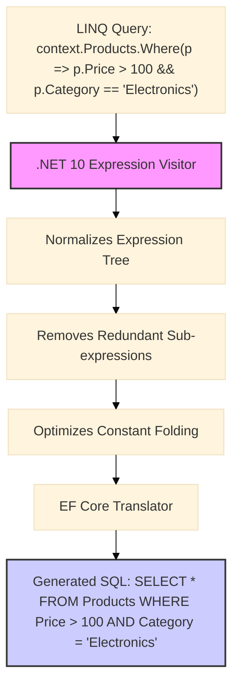

# diagram_01_what-changes-in-net-10-in-net-10-where-6fc2

```mermaid
---
config:
  theme: base
  layout: elk
---
graph TD
    A["LINQ Query: context.Products.Where(p => p.Price > 100 && p.Category == 'Electronics')"]
    B[".NET 10 Expression Visitor"]
    C["Normalizes Expression Tree"]
    D["Removes Redundant Sub-expressions"]
    E["Optimizes Constant Folding"]
    F["EF Core Translator"]
    G["Generated SQL: SELECT * FROM Products WHERE Price > 100 AND Category = 'Electronics'"]
    
    A --> B
    B --> C
    C --> D
    D --> E
    E --> F
    F --> G
    
    style B fill:#f9f,stroke:#333,stroke-width:2px
    style G fill:#ccf,stroke:#333,stroke-width:2px
```
