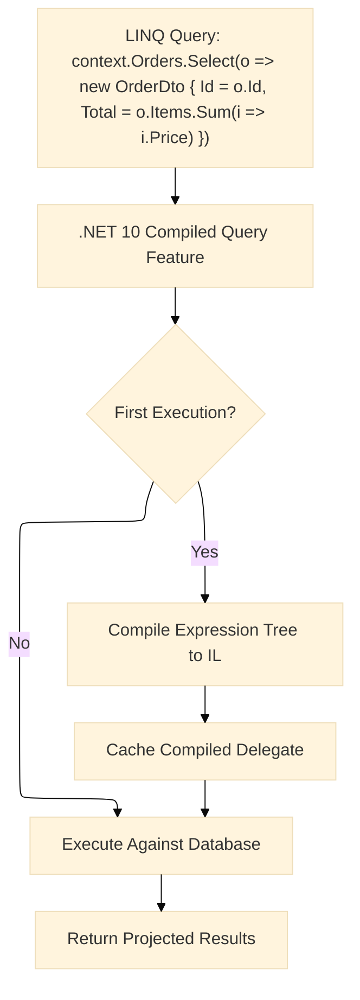

# diagram_02_what-changes-in-net-10-the-biggest-change-37dc

```mermaid
---
config:
  theme: base
  layout: elk
---
graph TD
    A["LINQ Query: context.Orders.Select(o => new OrderDto { Id = o.Id, Total = o.Items.Sum(i => i.Price) })"]
    B[".NET 10 Compiled Query Feature"]
    C{"First Execution?"}
    D["Compile Expression Tree to IL"]
    E["Cache Compiled Delegate"]
    F["Execute Against Database"]
    G["Return Projected Results"]
    
    A --> B
    B --> C
    C -->|Yes| D
    D --> E
    E --> F
    C -->|No| F
    F --> G
```
