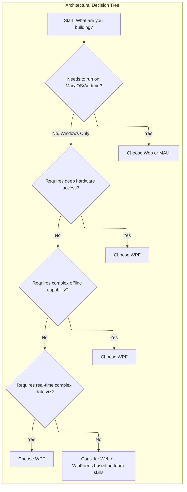
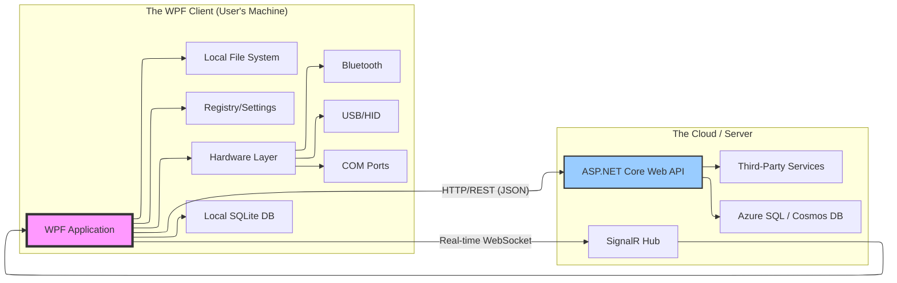

# The Desktop Phoenix: An Architect's Guide to WPF in a Multi-Platform World


#### Prologue: The Architect's Dilemma

You are the chief architect for a large retail conglomerate. Your CEO has just approved a massive digital transformation initiative. The core requirement: build a new "Omni-Sales Command Center"—a desktop application for store managers that provides real-time sales analytics, inventory management, discount approval workflows, and IoT integration with smart shelves and cameras.

The room is divided. Your lead web developer argues for a progressive web app (PWA) or Electron.js—"It's cross-platform! We can use our existing React skills!" Your mobile lead champions .NET MAUI or Flutter—"We need mobile for the floor staff!"

You sit back and look at the requirements document. It reads like a love letter to the Windows desktop:

- **Requirement 3.4:** "Application must function flawlessly during internet outages, syncing data when connectivity is restored."
- **Requirement 5.1:** "System must interface directly with serial-connected barcode scanners and Bluetooth thermal label printers."
- **Requirement 7.2:** "Real-time 3D heatmap of store traffic, updated at 30 frames per second."
- **Requirement 9.0:** "Must support complex, multi-monitor setups with draggable, dockable tool windows."

You close the document, look at your team, and smile. "Gentlemen," you say, "let me tell you a story about a technology that's been doing all of this since 2006. A technology that doesn't compromise. We're building this in **Windows Presentation Foundation**."

This is the story you tell them—the architect's guide to WPF.

---

## Part I: The Genesis – What and Why is WPF?

#### The Flash Legacy and the Windows Void

To understand WPF, we must first understand what it replaced. In the early 2000s, if you wanted to build a truly interactive, vector-based, multimedia-rich experience, you used **Adobe Flash**. It was beautiful, but it was a security nightmare, a performance hog, and fundamentally a browser plugin—a visitor in the operating system, not a citizen.

When Flash died, a void appeared. How do we build rich, powerful, visually stunning **desktop applications** that don't look like they belong in Windows 95?

Microsoft's answer was **WPF**, released with .NET Framework 3.0 in 2006. But WPF wasn't just "the next Windows Forms." It was a philosophical revolution.

#### The Three Pillars of WPF Philosophy

**Pillar 1: Vector-Based Rendering (The DirectX Revolution)**
Older frameworks like Windows Forms used **GDI/GDI+** to draw pixels. Each button was a bitmap, each control a pre-rendered artifact of the operating system. Zoom in, and it pixelated.

WPF is different. Everything—absolutely everything—is rendered through **DirectX**. Buttons, charts, text boxes, images—they are all maintained in a retained-mode graphics system as vectors. This has profound implications:

- **Resolution Independence:** Your UI looks crisp on a 96 DPI monitor from 2005 and on a 300 DPI 4K screen today. WPF simply scales the vectors.
- **GPU Acceleration:** Complex animations, transformations, and visual effects are offloaded to the graphics card, freeing the CPU for your business logic.
- **The "Wow" Factor:** You can rotate a button, apply a drop shadow, or animate its color without writing a single line of imperative drawing code.

**Pillar 2: XAML – The Declarative UI**
**XAML (eXtensible Application Markup Language)** is WPF's declarative markup language. It looks like XML, feels like HTML, but its power lies in its deep integration with the .NET type system.

```xml
<Button Content="Click Me" Width="100" Height="30">
    <Button.Background>
        <LinearGradientBrush StartPoint="0,0" EndPoint="0,1">
            <GradientStop Color="Blue" Offset="0.0"/>
            <GradientStop Color="DarkBlue" Offset="1.0"/>
        </LinearGradientBrush>
    </Button.Background>
</Button>
```

This code defines a button with a gradient background. Notice what's missing: a single line of C#. We are *declaring* what the UI looks like, not *instructing* the computer on how to draw it step-by-step.

**Pillar 3: Separation of Concerns**
XAML handles the *look and feel*. C# handles the *logic*. This separation was revolutionary. It meant that for the first time, a professional designer could work in tools like Microsoft Expression Blend, crafting sophisticated animations and templates, while a developer worked in Visual Studio on the business logic, and their work could be merged seamlessly.

#### How It Differs: The Landscape of Choices

As an architect, you need to understand where WPF sits in the ecosystem.

| Technology | Paradigm | Rendering | Deployment | Best For |
| :--- | :--- | :--- | :--- | :--- |
| **WPF** | Desktop Client | DirectX (Vector) | Installed (ClickOnce/MSIX) | Rich, data-intensive Windows apps |
| **WinForms** | Desktop Client | GDI (Raster) | Installed | Simple, quick-and-dirty internal tools |
| **ASP.NET/Razor** | Server-Side Web | HTML/CSS | Server-Hosted | Public-facing web apps, maximum reach |
| **Electron.js** | Web in a Desktop Shell | Chromium (HTML/CSS) | Installed | Cross-platform desktop apps (Slack, VS Code) |
| **MAUI** | Cross-Platform Client | Native APIs | Installed | Cross-platform mobile/desktop from one codebase |

The key takeaway: **WPF is the only framework in this list that combines DirectX-level performance, deep Windows integration, and a mature, powerful data binding system.**

---

## Part II: The Evolutionary Timeline

As an architect, you care about longevity and support. WPF has a history that should give you confidence.

- **2003 (Avalon):** The project begins as part of the "Longhorn" vision. It's ambitious, aiming to redefine the Windows presentation layer.
- **2006 (WPF 3.0):** Released with .NET Framework 3.0. Tooling is immature, the learning curve is vertical, and early adopters struggle.
- **2007-2010 (The MVVM Enlightenment):** .NET 3.5 and 4.0 bring maturity. The **Model-View-ViewModel (MVVM)** pattern, popularized by thought leaders like Josh Smith, emerges. It leverages WPF's powerful data binding to create a pattern that is testable, maintainable, and beautiful. This becomes the "golden era" of WPF.
- **2014-2018 (The "Is WPF Dead?" Era):** Microsoft pivots to web and mobile. Xamarin.Forms rises. The community whispers: "Is WPF dead?" But enterprises double down. The millions of lines of code in critical systems ensure its survival.
- **2018-Present (The Resurrection):** Microsoft open-sources WPF on GitHub. It's ported to .NET Core 3.0 and now .NET 5/6/7/8. Performance improvements, bug fixes, and modern tooling support arrive. WPF is not dead; it's **modernized, open, and supported for the long haul.**

---

## Part III: The Great Architectural Trade-Off – WPF vs. The World

Let's address the elephant in the room. Your web developers are passionate about ASP.NET Core with Razor. They talk about "reach," "deployment simplicity," and "cross-platform." They are right about the benefits, but they are wrong about the context.

#### When WPF Wins: The Case for the "Thick Client"

**1. Resource Utilization and Performance**
Consider a scenario: Sarah, the store manager, needs to run a complex sales analysis on 50,000 transactions to spot a trend.
- **Web App:** The browser sends a request to the server. The server queries the database, processes the data in memory, serializes the result to JSON, sends it over the network, and the browser renders it. That's a lot of round trips.
- **WPF App:** The app loads the raw data locally (from a cached SQLite database), processes it using the full power of the client's multi-core CPU and RAM, and updates the UI instantly. There's no network latency, no server cost, no bandwidth bottleneck.

**2. Offline First**
The store's internet goes down.
- **Web App:** "No internet connection. Please try again later." Work stops.
- **WPF App:** Sarah keeps approving discounts, processing sales, and checking inventory. All operations are queued locally. When the internet returns, the app syncs silently in the background.

**3. Hardware Integration**
Sarah picks up a Bluetooth barcode scanner.
- **Web App:** Accessing Bluetooth from a browser requires Web Bluetooth API, which has limited support, a complex security model, and cannot talk to many legacy serial devices.
- **WPF App:** The app opens a `System.IO.Ports.SerialPort` connection, listens for data, and processes the barcode instantly. It can also send raw print commands to a label printer via TCP/IP.

**4. State Management**
State in a web app is a constant battle. You have sessions, cookies, local storage, and a dozen other patterns to maintain state across stateless HTTP requests.
In a WPF app, state is trivial. The object is alive. Variables hold their values.

#### When the Web Wins: The Honest Trade-Off

- **Deployment:** Web wins, hands down. Update the server, and all users are instantly on the latest version. WPF requires an update mechanism (ClickOnce, MSIX) that runs on each client machine.
- **Cross-Platform:** Web runs everywhere. WPF runs only on Windows.
- **Discoverability:** Web apps can be found via search engines. Desktop apps cannot.

**The Architect's Verdict:** For public-facing, content-delivery applications—choose the web. For internal, mission-critical, data-crunching, hardware-talking Windows line-of-business applications—**choose WPF.**



---

## Part IV: The Ecosystem – Inputs and Outputs

A modern WPF application is not an island. It sits at the center of a complex ecosystem.



#### Inputs: The Sources of Truth
- **User Input:** Keyboard, mouse, touch, pen. WPF handles them natively.
- **Hardware:** Barcode scanners, magnetic stripe readers, fingerprint scanners, webcams, serial devices. Accessed via the full breadth of .NET libraries.
- **Local Data:** SQLite, local SQL Server Express, XML files, JSON files. The app reads and writes locally for instant performance.
- **Remote APIs:** The primary source of "truth." The WPF app calls RESTful APIs to fetch and mutate data. This is where the **"Smart Client"** pattern shines: the client is smart enough to cache, validate, and process, while the server remains the source of record.
- **Real-time Events:** Via SignalR or WebSockets, the server can push live updates (e.g., "A new sale just happened!") to the WPF client.

#### Outputs: The Destinations
- **The Display:** The beautiful, responsive UI.
- **Printing:** WPF's printing pipeline is vector-based and incredibly precise, perfect for generating invoices, labels, and reports.
- **Local Storage:** Cached data, user preferences, offline transaction queues.
- **The API:** The client sends data back to the server for processing and persistence.

#### The Mobile and Browser Question
- **Mobile:** WPF does **not** run on mobile. However, the skills are transferable. If you master WPF and MVVM, learning .NET MAUI (the evolution of Xamarin.Forms) is a straightforward transition. You can even share ViewModels between a WPF desktop app and a MAUI mobile app using .NET Standard libraries.
- **Browser:** WPF does **not** run in the browser. Silverlight (WPF/E) was the attempt to make that happen, and it failed. If you need a browser-based companion app, build an ASP.NET Core Blazor application that shares your API and business logic.

---

## Part V: The Architect's Toolchain – Prerequisites for the Journey

To build this system, you need the right tools. Here's the modern architect's stack:

1.  **Visual Studio 2022:** The Professional or Enterprise edition. The Community edition is free and capable, but for large teams, the higher editions offer architectural tools, code maps, and advanced debugging.
2.  **.NET 8 SDK:** The latest LTS release. It's fast, cross-platform, and the future.
3.  **NuGet Packages:**
    - **CommunityToolkit.Mvvm:** The modern, official MVVM framework. Reduces boilerplate by 80%.
    - **Microsoft.EntityFrameworkCore.Sqlite:** For local offline storage with a powerful ORM.
    - **Microsoft.Datasync.Client:** For offline sync with Azure backends.
    - **Refit:** A type-safe REST library that turns your REST API into a live interface.
    - **Serilog:** For structured logging, both locally and to the cloud.
4.  **Blend for Visual Studio:** Still available, though the Visual Studio XAML designer has improved. For complex animations and styles, Blend remains a powerful tool.
5.  **GitHub Copilot:** In 2024, this is non-negotiable. It accelerates XAML and C# writing, especially for repetitive MVVM patterns.

---

## Part VI: The Foundation – Hello World and MVVM Basics

Let's build the smallest possible application that demonstrates the architectural principles. This isn't just a "Hello World"; it's a "Hello MVVM World."

**The Project Structure (Architectural Gold Standard):**

```
OmniSales.sln
├── OmniSales.Core (NET Standard / .NET Class Library)
│   ├── Models
│   │   └── Product.cs
│   ├── ViewModels
│   │   └── MainViewModel.cs
│   └── Services
│       └── IDataService.cs
├── OmniSales.WPF (NET8 WPF App)
│   ├── Views
│   │   └── MainWindow.xaml
│   └── App.xaml
└── OmniSales.API (ASP.NET Core Web API) - Optional, for backend
```

**Step 1: The Model (Core/Models/Product.cs)**
```csharp
namespace OmniSales.Core.Models;

public class Product
{
    public int Id { get; set; }
    public string Name { get; set; }
    public decimal Price { get; set; }
    public int StockLevel { get; set; }
}
```

**Step 2: The ViewModel (Core/ViewModels/MainViewModel.cs)**
Notice the use of `CommunityToolkit.Mvvm`.

```csharp
using CommunityToolkit.Mvvm.ComponentModel;
using CommunityToolkit.Mvvm.Input;
using OmniSales.Core.Models;
using OmniSales.Core.Services;
using System.Collections.ObjectModel;
using System.Threading.Tasks;

namespace OmniSales.Core.ViewModels;

// The [ObservableObject] attribute enables source generation for MVVM
public partial class MainViewModel : ObservableObject
{
    private readonly IDataService _dataService;

    // [ObservableProperty] generates the property and OnPropertyChanged
    [ObservableProperty]
    private ObservableCollection<Product> _products;

    [ObservableProperty]
    private Product _selectedProduct;

    [ObservableProperty]
    private bool _isLoading;

    // Commands are generated from these methods due to [RelayCommand]
    [RelayCommand]
    private async Task LoadProductsAsync()
    {
        IsLoading = true;
        var loadedProducts = await _dataService.GetProductsAsync();
        Products = new ObservableCollection<Product>(loadedProducts);
        IsLoading = false;
    }

    [RelayCommand]
    private void UpdateStock(Product product)
    {
        if (product != null)
        {
            // Logic to update stock
            product.StockLevel--;
            // The UI updates automatically because Product implements INotifyPropertyChanged
            // Or we can manually raise property changed if needed
        }
    }

    public MainViewModel(IDataService dataService)
    {
        _dataService = dataService;
        Products = new ObservableCollection<Product>();
    }
}
```

**Step 3: The View (WPF/Views/MainWindow.xaml)**

```xml
<Window x:Class="OmniSales.WPF.Views.MainWindow"
        xmlns="http://schemas.microsoft.com/winfx/2006/xaml/presentation"
        xmlns:x="http://schemas.microsoft.com/winfx/2006/xaml"
        xmlns:viewModels="clr-namespace:OmniSales.Core.ViewModels;assembly=OmniSales.Core"
        Title="OmniSales Commander" Height="450" Width="800">
    
    <Window.DataContext>
        <!-- In production, this would come from a DI container or ViewModel locator -->
        <viewModels:MainViewModel />
    </Window.DataContext>

    <Grid Margin="10">
        <Grid.RowDefinitions>
            <RowDefinition Height="Auto"/>
            <RowDefinition Height="*"/>
        </Grid.RowDefinitions>

        <StackPanel Orientation="Horizontal" Grid.Row="0">
            <Button Content="Load Products" 
                    Command="{Binding LoadProductsCommand}"
                    Padding="10,5" Margin="5"/>
            <TextBlock Text="{Binding IsLoading, Converter={StaticResource BoolToVisibilityConverter}}" 
                       VerticalAlignment="Center"/>
        </StackPanel>

        <ListBox Grid.Row="1" 
                 ItemsSource="{Binding Products}" 
                 SelectedItem="{Binding SelectedProduct}"
                 DisplayMemberPath="Name"/>
    </Grid>
</Window>
```

This small example demonstrates the core architectural principle: **the View knows about the ViewModel, but the ViewModel knows nothing about the View.** This separation is what makes WPF applications maintainable and testable.

---

## Part VII: The Magnum Opus – The Omni-Sales Command Center

Now, let's build the real application. This section is the architectural blueprint for Sarah's dashboard.

### 7.1 The MVVM Deep Dive: Discount Approval Workflow

The store manager needs to approve high-value discounts. This is a perfect example of WPF's commanding and data binding in action.

**The ViewModel (Core/ViewModels/ApprovalViewModel.cs)**

```csharp
using CommunityToolkit.Mvvm.ComponentModel;
using CommunityToolkit.Mvvm.Input;
using OmniSales.Core.Models;
using OmniSales.Core.Services;
using System.Collections.ObjectModel;
using System.Threading.Tasks;
using System.Windows.Input;

namespace OmniSales.Core.ViewModels;

public partial class ApprovalViewModel : ObservableObject
{
    private readonly IApprovalService _approvalService;

    [ObservableProperty]
    private ObservableCollection<DiscountRequest> _pendingRequests;

    [ObservableProperty]
    private DiscountRequest _selectedRequest;

    [ObservableProperty]
    private string _searchText;

    // Partial methods are generated by [ObservableProperty]
    // This is called whenever SearchText changes
    partial void OnSearchTextChanged(string value)
    {
        FilterRequests();
    }

    private void FilterRequests()
    {
        // Implement filtering logic here
        // The UI will update because PendingRequests is an ObservableCollection
    }

    [RelayCommand]
    private async Task ApproveAsync(DiscountRequest request)
    {
        await _approvalService.ApproveRequestAsync(request.Id);
        PendingRequests.Remove(request);
        
        // Log the approval
        Serilog.Log.Information("Request {RequestId} approved by {User}", 
            request.Id, Environment.UserName);
    }

    [RelayCommand]
    private async Task RejectAsync(DiscountRequest request, string reason)
    {
        await _approvalService.RejectRequestAsync(request.Id, reason);
        PendingRequests.Remove(request);
    }

    public ApprovalViewModel(IApprovalService approvalService)
    {
        _approvalService = approvalService;
        PendingRequests = new ObservableCollection<DiscountRequest>();
    }
}
```

**The View (WPF/Views/ApprovalView.xaml)**

```xml
<UserControl x:Class="OmniSales.WPF.Views.ApprovalView"
             xmlns="http://schemas.microsoft.com/winfx/2006/xaml/presentation"
             xmlns:x="http://schemas.microsoft.com/winfx/2006/xaml"
             xmlns:local="clr-namespace:OmniSales.WPF.Views">
    
    <UserControl.Resources>
        <!-- Style for approvable items -->
        <Style x:Key="ApprovalItemStyle" TargetType="ListBoxItem">
            <Setter Property="Template">
                <Setter.Value>
                    <ControlTemplate TargetType="ListBoxItem">
                        <Border BorderBrush="LightGray" 
                                BorderThickness="0,0,0,1" 
                                Padding="10" 
                                Background="{TemplateBinding Background}">
                            <ContentPresenter />
                        </Border>
                    </ControlTemplate>
                </Setter.Value>
            </Setter>
        </Style>
    </UserControl.Resources>

    <Grid>
        <Grid.RowDefinitions>
            <RowDefinition Height="Auto"/>
            <RowDefinition Height="*"/>
        </Grid.RowDefinitions>

        <!-- Search Box -->
        <TextBox Grid.Row="0" 
                 Text="{Binding SearchText, UpdateSourceTrigger=PropertyChanged}"
                 Margin="10" 
                 Padding="5" 
                 Watermark="Search requests..."/>

        <!-- List of Requests -->
        <ListBox Grid.Row="1" 
                 ItemsSource="{Binding PendingRequests}"
                 SelectedItem="{Binding SelectedRequest}"
                 ItemContainerStyle="{StaticResource ApprovalItemStyle}">
            <ListBox.ItemTemplate>
                <DataTemplate>
                    <Grid>
                        <Grid.ColumnDefinitions>
                            <ColumnDefinition Width="*"/>
                            <ColumnDefinition Width="Auto"/>
                            <ColumnDefinition Width="Auto"/>
                        </Grid.ColumnDefinitions>

                        <StackPanel Grid.Column="0">
                            <TextBlock Text="{Binding CustomerName}" FontWeight="Bold"/>
                            <TextBlock Text="{Binding ProductName}" Foreground="Gray"/>
                            <TextBlock Text="{Binding RequestDate, StringFormat='dd MMM yyyy HH:mm'}" 
                                       FontSize="10" Foreground="LightGray"/>
                        </StackPanel>

                        <TextBlock Grid.Column="1" 
                                   Text="{Binding DiscountAmount, StringFormat=C}" 
                                   FontWeight="Bold" 
                                   Foreground="Green"
                                   VerticalAlignment="Center"
                                   Margin="10,0"/>

                        <StackPanel Grid.Column="2" Orientation="Horizontal">
                            <Button Content="Approve" 
                                    Command="{Binding DataContext.ApproveCommand, 
                                        RelativeSource={RelativeSource AncestorType=ListBox}}"
                                    CommandParameter="{Binding}"
                                    Background="Green" 
                                    Foreground="White"
                                    Padding="10,5"
                                    Margin="5"/>
                            
                            <Button Content="Reject" 
                                    Command="{Binding DataContext.RejectCommand, 
                                        RelativeSource={RelativeSource AncestorType=ListBox}}"
                                    CommandParameter="{Binding}"
                                    Background="Red" 
                                    Foreground="White"
                                    Padding="10,5"
                                    Margin="5"/>
                        </StackPanel>
                    </Grid>
                </DataTemplate>
            </ListBox.ItemTemplate>
        </ListBox>
    </Grid>
</UserControl>
```

This is WPF's power on full display. The UI is rich, interactive, and completely separated from the logic. The `CommandParameter="{Binding}"` passes the entire data item to the command, allowing the ViewModel to act on the specific request.

#### 7.2 The Offline Sync Architecture: Always Available

The store's internet is unreliable. We cannot afford downtime. Here's the architectural pattern for offline-first data synchronization.

**The Core Principle:** The application always reads from and writes to a local database. A background service synchronizes with the cloud when connectivity is available.

**The Service Interface (Core/Services/ISyncService.cs)**

```csharp
namespace OmniSales.Core.Services;

public interface ISyncService<T> where T : class
{
    Task<IEnumerable<T>> GetItemsAsync();
    Task<T> GetItemAsync(string id);
    Task SaveItemAsync(T item);
    Task DeleteItemAsync(string id);
    Task SyncAsync();
}
```

**The Offline Implementation (Core/Services/OfflineSyncService.cs)**

```csharp
using Microsoft.EntityFrameworkCore;
using Microsoft.Datasync.Client;
using OmniSales.Core.Models;
using Serilog;

namespace OmniSales.Core.Services;

public class OfflineSyncService<T> : ISyncService<T> where T : class, ITableData
{
    private readonly DatasyncClient _client;
    private readonly IOfflineTable<T> _table;
    private readonly DbContext _localDbContext;
    private readonly IConnectivityService _connectivity;

    public OfflineSyncService(
        string apiEndpoint, 
        string localDbPath, 
        DbContext dbContext,
        IConnectivityService connectivity)
    {
        _localDbContext = dbContext;
        _connectivity = connectivity;

        // Configure the offline store
        var store = new OfflineSQLiteStore(new Uri($"file://{localDbPath}"));
        store.DefineTable<T>();

        var options = new DatasyncClientOptions
        {
            OfflineStore = store,
            HttpPipeline = new[] { new LoggingHandler() } // Custom handler for logging
        };

        _client = new DatasyncClient(new Uri(apiEndpoint), options);
        _table = _client.GetOfflineTable<T>();
        
        // Initialize the store
        _client.InitializeOfflineStoreAsync().Wait();
    }

    public async Task<IEnumerable<T>> GetItemsAsync()
    {
        // This query runs against the local SQLite store
        return await _table.ToListAsync();
    }

    public async Task<T> GetItemAsync(string id)
    {
        return await _table.Where(x => x.Id == id).FirstOrDefaultAsync();
    }

    public async Task SaveItemAsync(T item)
    {
        if (string.IsNullOrEmpty(item.Id))
        {
            item.Id = Guid.NewGuid().ToString();
            item.CreatedAt = DateTimeOffset.UtcNow;
            await _table.InsertAsync(item);
        }
        else
        {
            item.UpdatedAt = DateTimeOffset.UtcNow;
            await _table.UpdateAsync(item);
        }

        // Trigger a background sync if we're online
        if (_connectivity.IsConnected)
        {
            // Fire and forget - don't block the UI
            _ = Task.Run(() => SyncAsync());
        }
    }

    public async Task DeleteItemAsync(string id)
    {
        await _table.DeleteAsync(id);
        
        if (_connectivity.IsConnected)
        {
            _ = Task.Run(() => SyncAsync());
        }
    }

    public async Task SyncAsync()
    {
        try
        {
            if (!_connectivity.IsConnected)
            {
                Log.Information("Skipping sync - device is offline");
                return;
            }

            Log.Information("Starting sync for {EntityType}", typeof(T).Name);
            
            // Push local changes to the server
            await _table.PushItemsAsync();
            
            // Pull latest changes from the server
            await _table.PullItemsAsync();
            
            Log.Information("Sync completed successfully for {EntityType}", typeof(T).Name);
        }
        catch (Exception ex)
        {
            Log.Error(ex, "Sync failed for {EntityType}", typeof(T).Name);
            
            // Store the failed sync operation for retry
            await StoreFailedSyncOperation(ex);
        }
    }

    private async Task StoreFailedSyncOperation(Exception ex)
    {
        // Implementation to store failed operations for retry
        // This could be a simple queue table in SQLite
        await Task.CompletedTask;
    }
}

// Interface for tracking syncable entities
public interface ITableData
{
    string Id { get; set; }
    DateTimeOffset? CreatedAt { get; set; }
    DateTimeOffset? UpdatedAt { get; set; }
    byte[] Version { get; set; }
    bool Deleted { get; set; }
}
```

**The ViewModel Integration:**

```csharp
public partial class InventoryViewModel : ObservableObject
{
    private readonly ISyncService<Product> _productSyncService;

    [ObservableProperty]
    private ObservableCollection<Product> _products;

    [RelayCommand]
    private async Task LoadInventoryAsync()
    {
        var items = await _productSyncService.GetItemsAsync();
        Products = new ObservableCollection<Product>(items);
    }

    [RelayCommand]
    private async Task AddProductAsync(Product newProduct)
    {
        await _productSyncService.SaveItemAsync(newProduct);
        // Immediately update the UI - the save was local
        Products.Add(newProduct);
    }

    [RelayCommand]
    private async Task ForceSyncAsync()
    {
        await _productSyncService.SyncAsync();
        // Refresh the UI after sync
        await LoadInventoryAsync();
    }
}
```

This architecture ensures that Sarah's team can work indefinitely without an internet connection. Every transaction is saved locally and synchronized when connectivity returns, with full conflict resolution handled by the Datasync framework .

#### 7.3 API Integration: The Backbone

The WPF client is the "front line," but the backend is the "source of truth." We'll use **Refit** to create a type-safe REST API client .

**Install:** `dotnet add package Refit.HttpClientFactory`

**Define the API Interface (Core/Api/IOmniSalesApi.cs)**

```csharp
using Refit;
using OmniSales.Core.Models;

namespace OmniSales.Core.Api;

public interface IOmniSalesApi
{
    [Get("/api/products")]
    Task<List<Product>> GetProductsAsync([Header("Authorization")] string token);

    [Get("/api/products/{id}")]
    Task<Product> GetProductAsync(int id, [Header("Authorization")] string token);

    [Post("/api/products")]
    Task<Product> CreateProductAsync([Body] Product product, [Header("Authorization")] string token);

    [Put("/api/products/{id}")]
    Task UpdateProductAsync(int id, [Body] Product product, [Header("Authorization")] string token);

    [Delete("/api/products/{id}")]
    Task DeleteProductAsync(int id, [Header("Authorization")] string token);

    [Get("/api/sales/analytics/daily")]
    Task<DailyAnalytics> GetDailyAnalyticsAsync(
        [Query] DateTime date, 
        [Header("Authorization")] string token);
}
```

**Register in the WPF App (App.xaml.cs with Dependency Injection)**

```csharp
using Microsoft.Extensions.DependencyInjection;
using Microsoft.Extensions.Hosting;
using Refit;
using OmniSales.Core.Api;
using OmniSales.Core.Services;
using OmniSales.Core.ViewModels;

public partial class App : Application
{
    private readonly IHost _host;

    public App()
    {
        _host = Host.CreateDefaultBuilder()
            .ConfigureServices((context, services) =>
            {
                // Register HTTP clients with Refit
                services.AddRefitClient<IOmniSalesApi>()
                    .ConfigureHttpClient(c =>
                    {
                        c.BaseAddress = new Uri("https://api.omnisales.com");
                        c.DefaultRequestHeaders.Add("User-Agent", "OmniSales-WPF");
                    })
                    .AddHttpMessageHandler<AuthHandler>(); // Custom handler for auth tokens

                // Register services
                services.AddSingleton<IAuthService, AuthService>();
                services.AddSingleton<IConnectivityService, ConnectivityService>();
                
                // Register offline sync services
                services.AddSingleton<ISyncService<Product>>(sp =>
                {
                    var dbPath = Path.Combine(
                        Environment.GetFolderPath(Environment.SpecialFolder.LocalApplicationData),
                        "omnisales.db");
                    var dbContext = new LocalDbContext(dbPath);
                    var connectivity = sp.GetRequiredService<IConnectivityService>();
                    
                    return new OfflineSyncService<Product>(
                        "https://api.omnisales.com",
                        dbPath,
                        dbContext,
                        connectivity);
                });

                // Register ViewModels
                services.AddTransient<MainViewModel>();
                services.AddTransient<ApprovalViewModel>();
                services.AddTransient<InventoryViewModel>();

                // Register Main Window
                services.AddTransient<MainWindow>();
            })
            .Build();
    }

    protected override async void OnStartup(StartupEventArgs e)
    {
        await _host.StartAsync();
        
        // Get the main window from DI and show it
        var mainWindow = _host.Services.GetRequiredService<MainWindow>();
        mainWindow.Show();
        
        base.OnStartup(e);
    }

    protected override async void OnExit(ExitEventArgs e)
    {
        await _host.StopAsync();
        _host.Dispose();
        base.OnExit(e);
    }
}
```

#### 7.4 OTA Updates: The MSIX Architecture

Deploying updates to hundreds of stores requires a robust over-the-air (OTA) update strategy. We'll use **MSIX** with a private distribution server.

**The MSIX Packaging Project**

In Visual Studio, we add an **MSIX Packaging Project** to our solution. This project references the WPF application and packages it with all its dependencies.

**The Update Configuration**

In the MSIX project's `Package.appxmanifest`, we configure automatic updates:

```xml
<Package xmlns="http://schemas.microsoft.com/appx/manifest/foundation/windows10"
         xmlns:uap="http://schemas.microsoft.com/appx/manifest/uap/windows10"
         xmlns:rescap="http://schemas.microsoft.com/appx/manifest/foundation/windows10/restrictedcapabilities">
  
  <Identity Name="OmniSales.StoreApp" ... />
  
  <Properties>
    <DisplayName>OmniSales Command Center</DisplayName>
    <PublisherDisplayName>Retail Corp</PublisherDisplayName>
    <Logo>Images\StoreLogo.png</Logo>
  </Properties>
  
  <Applications>
    <Application Id="App" Executable="$targetentrypoint$">
      <uap:VisualElements ... />
    </Application>
  </Applications>
  
  <Capabilities>
    <rescap:Capability Name="packageManagement" />
    <rescap:Capability Name="packageQuery" />
  </Capabilities>
</Package>
```

**The Update Service (Core/Services/UpdateService.cs)**

```csharp
using Windows.ApplicationModel;
using Windows.ApplicationModel.Store.Preview.InstallControl;
using Serilog;

namespace OmniSales.Core.Services;

public class UpdateService
{
    private readonly string _updateServerUrl;
    private readonly TimeSpan _checkInterval;

    public UpdateService(string updateServerUrl, TimeSpan checkInterval)
    {
        _updateServerUrl = updateServerUrl;
        _checkInterval = checkInterval;
    }

    public async Task CheckForUpdatesAsync()
    {
        try
        {
            Log.Information("Checking for application updates...");

            // For MSIX packaged apps, we can use the Store APIs
            if (Package.Current.IsDevelopmentMode)
            {
                Log.Information("Running in development mode - skipping update check");
                return;
            }

            var storeContext = StoreContext.GetDefault();
            var updates = await storeContext.GetAppAndOptionalStorePackageUpdatesAsync();

            if (updates.Count > 0)
            {
                Log.Information("Found {UpdateCount} updates available", updates.Count);
                
                // Notify the user
                var result = await ShowUpdateDialogAsync(updates.Count);
                
                if (result == UpdateDialogResult.InstallNow)
                {
                    await InstallUpdatesAsync(updates);
                }
                else if (result == UpdateDialogResult.InstallLater)
                {
                    // Schedule a reminder
                    ScheduleUpdateReminder();
                }
            }
            else
            {
                Log.Information("Application is up to date");
            }
        }
        catch (Exception ex)
        {
            Log.Error(ex, "Failed to check for updates");
        }
    }

    private async Task InstallUpdatesAsync(IList<AppInstallItem> updates)
    {
        var progressDialog = new ProgressDialog();
        progressDialog.Show();

        try
        {
            var storeContext = StoreContext.GetDefault();
            
            foreach (var update in updates)
            {
                update.InstallInProgress += (sender, e) =>
                {
                    progressDialog.UpdateProgress(e.PercentageComplete);
                };
            }

            await storeContext.RequestDownloadAndInstallStorePackagesAsync(
                updates.Select(u => u.PackageId.FullName).ToList());

            Log.Information("Updates installed successfully");
            
            // Prompt to restart
            await ShowRestartDialogAsync();
        }
        catch (Exception ex)
        {
            Log.Error(ex, "Failed to install updates");
            await ShowErrorDialogAsync("Update installation failed. Please try again later.");
        }
        finally
        {
            progressDialog.Close();
        }
    }

    public void StartBackgroundUpdateChecker()
    {
        var timer = new System.Timers.Timer(_checkInterval.TotalMilliseconds);
        timer.Elapsed += async (s, e) => await CheckForUpdatesAsync();
        timer.Start();
        
        Log.Information("Background update checker started (interval: {Interval})", _checkInterval);
    }
}
```

This architecture ensures that all store installations stay up-to-date without any IT intervention. The application checks for updates silently in the background and prompts the user to install them at a convenient time.

#### 7.5 The IoT Significance: WPF as the Industrial HMI

The Omni-Sales dashboard connects to IoT devices throughout the store: smart shelves, security cameras, and environmental sensors. This is where WPF's hardware access capabilities are irreplaceable.

**Connecting to a Serial Barcode Scanner (Core/Services/ScannerService.cs)**

```csharp
using System.IO.Ports;
using System.Text;
using Serilog;

namespace OmniSales.Core.Services;

public class ScannerService : IDisposable
{
    private SerialPort _serialPort;
    private readonly object _lock = new object();

    public event EventHandler<string> BarcodeScanned;

    public bool Connect(string portName, int baudRate = 9600)
    {
        try
        {
            lock (_lock)
            {
                _serialPort = new SerialPort(portName, baudRate, Parity.None, 8, StopBits.One);
                _serialPort.DataReceived += SerialPort_DataReceived;
                _serialPort.Open();
                
                Log.Information("Connected to scanner on {PortName}", portName);
                return true;
            }
        }
        catch (Exception ex)
        {
            Log.Error(ex, "Failed to connect to scanner on {PortName}", portName);
            return false;
        }
    }

    private void SerialPort_DataReceived(object sender, SerialDataReceivedEventArgs e)
    {
        try
        {
            lock (_lock)
            {
                if (_serialPort?.IsOpen == true)
                {
                    // Read the data
                    string data = _serialPort.ReadExisting();
                    
                    // Barcode scanners typically send a carriage return at the end
                    string barcode = data.TrimEnd('\r', '\n');
                    
                    // Raise event on UI thread
                    System.Windows.Application.Current.Dispatcher.Invoke(() =>
                    {
                        BarcodeScanned?.Invoke(this, barcode);
                    });
                    
                    Log.Information("Scanned: {Barcode}", barcode);
                }
            }
        }
        catch (Exception ex)
        {
            Log.Error(ex, "Error reading from scanner");
        }
    }

    public void Disconnect()
    {
        lock (_lock)
        {
            if (_serialPort?.IsOpen == true)
            {
                _serialPort.DataReceived -= SerialPort_DataReceived;
                _serialPort.Close();
                _serialPort.Dispose();
                _serialPort = null;
                
                Log.Information("Disconnected from scanner");
            }
        }
    }

    public void Dispose()
    {
        Disconnect();
    }
}
```

**Connecting to an IoT Temperature Sensor via USB HID**

```csharp
using HidLibrary;
using System.Linq;

public class TemperatureSensorService : IDisposable
{
    private readonly int _vendorId = 0x1234; // Example vendor ID
    private readonly int _productId = 0x5678; // Example product ID
    private IHidDevice _device;
    private Timer _pollingTimer;

    public event EventHandler<double> TemperatureUpdated;

    public bool Connect()
    {
        _device = HidDevices.Enumerate(_vendorId, _productId).FirstOrDefault();
        
        if (_device != null)
        {
            _device.OpenDevice();
            _device.MonitorDeviceEvents = true;
            _device.ReadReport(OnReportReceived);
            
            // Start polling every 5 seconds
            _pollingTimer = new Timer(PollTemperature, null, TimeSpan.Zero, TimeSpan.FromSeconds(5));
            
            return true;
        }
        
        return false;
    }

    private void OnReportReceived(HidReport report)
    {
        if (report.Data.Length >= 4)
        {
            // Parse temperature from HID report (implementation depends on device)
            var rawTemp = BitConverter.ToInt32(report.Data, 0);
            var temperature = rawTemp / 100.0;
            
            System.Windows.Application.Current.Dispatcher.Invoke(() =>
            {
                TemperatureUpdated?.Invoke(this, temperature);
            });
        }
        
        // Continue listening
        _device.ReadReport(OnReportReceived);
    }

    private void PollTemperature(object state)
    {
        // Send a request for current temperature
        var report = _device.CreateReport();
        report.ReportId = 0x01;
        report.Data = new byte[] { 0x01, 0x00 }; // Example command
        
        _device.WriteReport(report);
    }

    public void Dispose()
    {
        _pollingTimer?.Dispose();
        _device?.CloseDevice();
        _device?.Dispose();
    }
}
```

**The ViewModel Integration**

```csharp
public partial class IoTViewModel : ObservableObject
{
    private readonly ScannerService _scannerService;
    private readonly TemperatureSensorService _tempService;

    [ObservableProperty]
    private double _currentTemperature;

    [ObservableProperty]
    private string _lastScannedBarcode;

    [ObservableProperty]
    private bool _isScannerConnected;

    public IoTViewModel()
    {
        _scannerService = new ScannerService();
        _tempService = new TemperatureSensorService();
        
        InitializeHardware();
    }

    private void InitializeHardware()
    {
        // Connect to scanner
        IsScannerConnected = _scannerService.Connect("COM3", 9600);
        _scannerService.BarcodeScanned += (s, barcode) =>
        {
            LastScannedBarcode = barcode;
            // Here you would look up the product, add to cart, etc.
        };

        // Connect to temperature sensor
        _tempService.TemperatureUpdated += (s, temp) =>
        {
            CurrentTemperature = temp;
            
            if (temp > 25.0)
            {
                // Trigger alert for high temperature
                AlertService.ShowWarning("Temperature exceeds recommended range!");
            }
        };
        _tempService.Connect();
    }

    [RelayCommand]
    private void ReconnectScanner()
    {
        _scannerService.Disconnect();
        IsScannerConnected = _scannerService.Connect("COM3", 9600);
    }
}
```

This level of hardware integration is simply not possible with web technologies. A browser-based application would struggle to communicate with serial devices, and Electron.js, while capable, adds significant overhead and complexity. WPF, running directly on the .NET runtime, provides seamless, low-latency access to the hardware layer.

---

## Part VIII: The Architect's Summary – Why WPF Endures

As we conclude this architectural deep dive, let's revisit the core thesis.

Your team asked: "Why WPF in 2024?"

Your answer, armed with this blueprint, is clear:

**WPF is not a legacy technology. It is a mature, powerful, and actively maintained framework for building the most demanding Windows applications.**

- It offers **DirectX-powered vector rendering** for beautiful, resolution-independent UIs.
- Its **XAML and MVVM pattern** enable a clean separation of concerns that leads to maintainable, testable codebases that can scale to millions of lines.
- The **offline-sync architecture** ensures business continuity in the face of unreliable networks.
- Its **deep hardware access** makes it the only viable choice for IoT-enabled industrial and retail applications.
- Modern **MSIX packaging** provides enterprise-grade OTA updates.
- Being **open-sourced and ported to .NET Core/.NET 5+** guarantees its relevance for the next decade.

The Omni-Sales Command Center you are about to build will be fast, reliable, beautiful, and deeply integrated with the physical store. It will work offline, sync when online, and update itself seamlessly.

**That is the promise of WPF. That is the power of the desktop phoenix.**

Now, go build it.

---
*Questions? Feedback? Comment? leave a response below. If you're implementing something similar and want to discuss architectural tradeoffs, I'm always happy to connect with fellow engineers tackling these challenges.*
