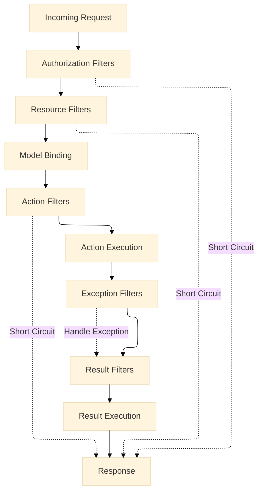

# diagram_01_before-diving-into-code-lets-visualize-the-order-63b7

```mermaid
---
config:
  theme: base
  layout: elk
---
graph TD
    A[Incoming Request] --> B[Authorization Filters]
    B --> C[Resource Filters]
    C --> D[Model Binding]
    D --> E[Action Filters]
    E --> F[Action Execution]
    F --> G[Exception Filters]
    G --> H[Result Filters]
    H --> I[Result Execution]
    I --> J[Response]
    
    B -.->|Short Circuit| J
    C -.->|Short Circuit| J
    E -.->|Short Circuit| J
    G -.->|Handle Exception| H
```
