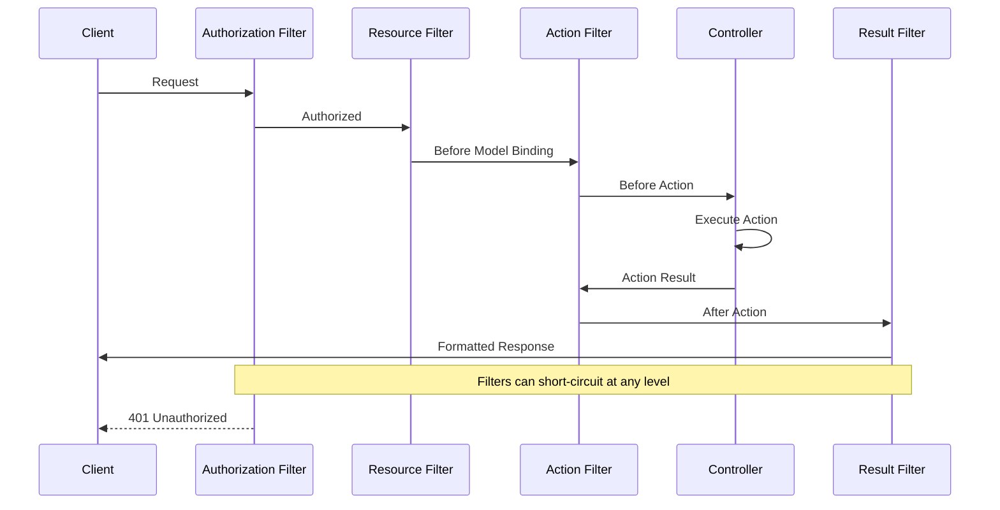

# diagram_02_filter-execution-order-with-multiple-filters-6709

```mermaid
sequenceDiagram
    participant Client
    participant Auth as Authorization Filter
    participant Resource as Resource Filter
    participant Action as Action Filter
    participant Controller
    participant Result as Result Filter
    
    Client->>Auth: Request
    Auth->>Resource: Authorized
    Resource->>Action: Before Model Binding
    Action->>Controller: Before Action
    Controller->>Controller: Execute Action
    Controller->>Action: Action Result
    Action->>Result: After Action
    Result->>Client: Formatted Response
    
    Note over Auth,Result: Filters can short-circuit at any level
    Auth-->>Client: 401 Unauthorized
```
