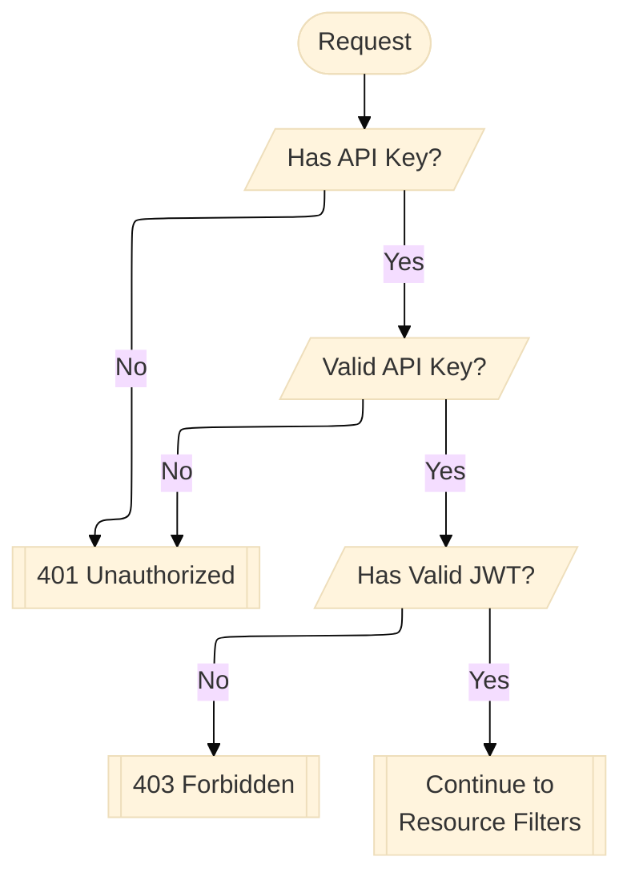

# diagram_03_authorization-flow

```mermaid
---
---
config:
  theme: base
  layout: elk
---
flowchart TD
    A([Request]) --> B[/Has API Key?/]
    B -- No --> C[[401 Unauthorized]]
    B -- Yes --> D[/Valid API Key?/]
    D -- No --> C
    D -- Yes --> E[/Has Valid JWT?/]
    E -- No --> F[[403 Forbidden]]
    E -- Yes --> G[[Continue to<br>Resource Filters]]
```
