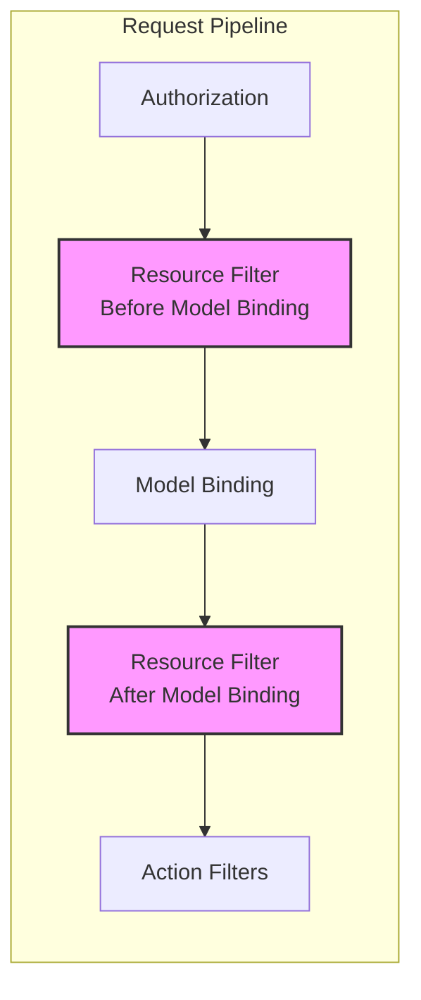

# diagram_04_resource-filter-pipeline-position-69f7

```mermaid
graph LR
    subgraph "Request Pipeline"
        A[Authorization] --> B[Resource Filter<br/>Before Model Binding]
        B --> C[Model Binding]
        C --> D[Resource Filter<br/>After Model Binding]
        D --> E[Action Filters]
    end
    
    style B fill:#f9f,stroke:#333,stroke-width:2px
    style D fill:#f9f,stroke:#333,stroke-width:2px
```
